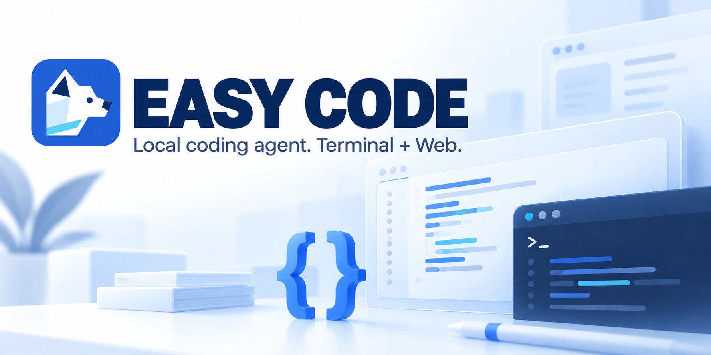

# EASY CODE



English | [简体中文](./README_zh.md)

EASY CODE is a local AI coding assistant for the terminal and browser. Give it a task in plain language: understand a project, implement a feature, investigate a failure or run checks. Bring your own model-provider API key.

## What you can do

- **Work in CLI or Web:** saved conversations, image attachments, live progress and adjustments while a task runs.
- **Read documents and the Web on demand:** Web document attachments become private, read-only conversation resources; the agent can search public pages and save selected pages for bounded reading.
- **Organize real projects:** attach one or several local folders to a project and keep separate conversations for different tasks.
- **Choose your models:** bundled provider entries for Qwen, DeepSeek, Kimi, GLM and GLM Coding Plan; configurable models, endpoints and capabilities.
- **Control execution:** Auto, Plan and Code workflows; manual approval, an independent approval agent or explicit Full access; native command sandboxing.
- **Continue longer tasks:** resume conversations, recall earlier evidence and use global/project memory with automatic context management.
- **Delegate when useful:** optional dependency-based task graphs and child agents, plus independent investigation of repeated verification failures.
- **Extend your workflow:** reusable Skills, MCP tools, VS Code terminal integration, English and Simplified Chinese interfaces.

The application and its history run locally. Relevant task context is still sent to your selected model provider; “local” does not mean offline inference.

## Install

Requirements: **Node.js 20.11+**, **Python 3.10+**, npm, Git for the source installation below, and a supported provider account. Python creates the private Microsoft MarkItDown document-conversion runtime. Native sandbox availability depends on your operating system and architecture.

```sh
git clone https://github.com/dd1000001000/EASY_CODE.git
cd EASY_CODE
npm ci --ignore-scripts
npm run build
npm install --global --allow-scripts=easy-code-agent . --foreground-scripts
```

Run each step only after the previous one succeeds. Global installation prepares local retrieval resources, editor integration and the native sandbox. Downloads and Windows administrator confirmation may be required. Normal use does not require Docker, Podman or a separately installed Codex application.

## Start in three steps

### 1. Add your API key

For example, to use GLM Coding Plan:

```sh
easy-code config set glm-coding-plan.api-key
```

Enter the key when prompted; input is hidden and the key is stored in the OS credential store. Other bundled key names are `qwen.api-key`, `deepseek.api-key`, `kimi.api-key` and `glm.api-key`. Configure the provider you will actually select; do not put keys in project files.

### 2. Open an interface

```sh
easy-code --web
```

In Web, create a project, attach a local folder, then use the project's **＋** to start a conversation. Choose your model below the input. The attachment button accepts images and common PDF, Word, PowerPoint, spreadsheet and text formats. Documents stay with that conversation as read-only resources; only their names and resource paths enter the prompt until the agent reads a relevant range. Keep the launching terminal open; the Web service is local to this computer.

Or start the interactive terminal in a project folder:

```sh
easy-code --workspace "/path/to/project"
```

Replace the path with your own folder and quote paths containing spaces. Enter `/model` to select a model.

### 3. Describe the result you want

> Find why login fails, fix the problem and run the relevant tests. Summarize what changed and what remains unverified.

Start with Plan if you want a proposal first; choose Code to implement, or Auto to let EASY CODE route the request. **Plan is a workflow preference, not an enforced read-only sandbox.**

## Everyday controls

| Action | CLI | Web |
| --- | --- | --- |
| Choose model and thinking effort | `/model` | Model control below the input |
| Choose approval mode | `/approval` | Approval control below the input |
| Enable child agents | `/orchestration on` | DAG/agents control |
| Inspect task, context and usage | `/status`, `/context`, `/usage` | Same commands or their panels |
| Inspect memory | `/memory long project` | Same command or memory panel |
| Continue a saved task | `/sessions`, `/resume <thread-id>` | Open its conversation in the sidebar |
| Discover more commands | `/help` | Type `/` or open help |

Manual approval asks you about commands unless a saved grant applies. The approval agent evaluates requests independently but may still ask you. **Full access runs host commands without their normal sandbox or individual approvals.** Use it only when you accept that risk. Child-agent orchestration requires a non-manual approval mode.

For a single terminal task:

```sh
easy-code --workspace "/path/to/project" --mode code -y run --max-model-requests 40 "Fix the login failure and run the relevant tests"
```

`-y` selects the approval agent, **not** Full access. The optional request cap includes auxiliary agents and compaction; interactive CLI/Web tasks have no fixed model-request count cap.

## Help, settings and removal

- [Architecture and detailed user guide](./docs/TECHNICAL_DESIGN.md): projects, approvals, memory, Skills, MCP, examples and troubleshooting.
- [Configuration reference](./docs/config.example.toml): runtime settings. Models and endpoints live in `~/.easy_code/models.toml`; restart after editing it.
- [SWE-bench guide](./benchmarks/swebench_verified/README.md): separate Docker-based evaluation setup and credentials.

```sh
easy-code install doctor
easy-code sandbox doctor
easy-code sandbox setup
```

Use the checks to diagnose installation or sandbox problems; run setup when preparation is needed. An unavailable sandbox does not silently enable host execution.

```sh
easy-code uninstall --dry-run
easy-code uninstall
```

Uninstall removes owned configuration, credentials, history, memory and other application resources after confirmation. Back up what you need first. User project folders, linked source checkouts and shared system software are preserved.

[MIT License](./LICENSE) · [Third-party notices](./THIRD_PARTY_NOTICES.md)
