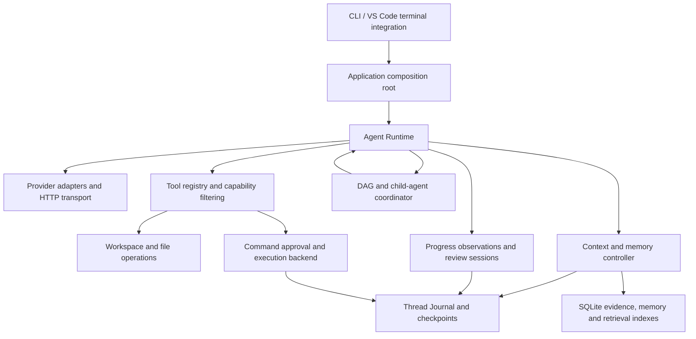

# EASY CODE — Technical Design

[简体中文](TECHNICAL_DESIGN_ZH.md) · [Quick start](../README.md) · [Configuration example](config.example.toml)

This document describes the implementation in this repository, not a proposed roadmap. Defaults are defined in [runtime-defaults.json](../src/config/runtime-defaults.json), validated by [runtime-limits.ts](../src/config/runtime-limits.ts), and may be overridden in configuration. Source links below identify the authoritative implementation.

## 1. Architecture and responsibility boundaries

EASY CODE is a local TypeScript/Node.js coding-agent application. It sends model requests to supported providers, executes tools on the user's computer or in an explicitly selected execution environment, and persists enough state to resume interrupted work.

The central distinction is between **model suggestions** and **Runtime authority**. The model proposes tool calls, summaries, plans, and review conclusions. Runtime validates arguments, applies permissions, owns command lifecycles and budgets, records evidence, and decides whether a task may finish.



| Layer | Main source | Responsibility |
| --- | --- | --- |
| Entry and assembly | [index.ts](../src/index.ts), [app.ts](../src/app.ts) | CLI parsing; construct services; connect UI, state, permissions and review callbacks |
| Agent execution | [runtime/](../src/runtime) | Model/tool loop, routing, budgets, failure classification and completion gates |
| Tools and workspaces | [tools/](../src/tools), [workspace/](../src/workspace) | Validated capabilities, file versions, Git changes and workspace isolation |
| Command control | [command/](../src/command), [sandbox/](../src/sandbox), [downloads/](../src/downloads) | Approval, process supervision, network mediation, execution backends and artifact downloads |
| Durable state | [threads/](../src/threads), [storage/](../src/storage) | Append-only events, recovery, SQLite repositories and checkpoints |
| Memory and capacity | [context/](../src/context), [memory/](../src/memory) | Active context, evidence references, summaries, project memory and hybrid retrieval |
| Collaboration | [plans/](../src/plans), [tasks/](../src/tasks), [subagents/](../src/subagents) | User-facing plans, task DAGs, child threads and result handoff |
| Reliability and review | [progress/](../src/progress), [review/](../src/review) | Evidence-based progress detection, isolated discussion and delivery checks |
| Presentation | [cli/](../src/cli), [ui/](../src/ui), [images/](../src/images) | Terminal interaction, rendering, image handling and editor bridge |
| Evaluation | [src/benchmarks/](../src/benchmarks), [benchmark adapter](../benchmarks/swebench_verified) | SWE-bench/Harbor orchestration and isolated worker execution |

`app.ts` is the composition root; `runtime/agent.ts` is the main execution coordinator. These remain substantial modules: this is a modular application, not a collection of independently deployed services.

## 2. Technology stack

| Technology | Use in this project |
| --- | --- |
| TypeScript, Node.js ≥ 20.11, ESM | Strictly typed application, NodeNext module resolution, compiled CLI in `dist/` |
| Commander, TOML, Zod | CLI commands, configuration parsing, runtime schemas and tool-argument validation |
| Node HTTP/HTTPS | Provider transport, cancellation, time/size bounds and controlled proxy connections |
| execa, lockfile-pinned `@openai/codex` native runtime | Host process control plus Windows elevated sandbox, macOS Seatbelt and Linux bubblewrap/seccomp enforcement |
| node-sqlite3-wasm, SQLite FTS5 | Durable repositories, lexical search and one strict current-schema baseline without a Node SQLite ABI build |
| ONNX Runtime, Hugging Face tokenizers | Local text embeddings for semantic retrieval |
| Orama | Derived vector-search cache, not the authoritative memory store |
| env-paths, OS keyring | Platform-specific storage directories and provider credentials |
| Node TTY/readline, chalk, diff | Custom terminal UI, styling and file-diff presentation |
| VS Code Extension API | Terminal menus, image attachment and Thinking-link integration |
| Python, Harbor, Docker | Benchmark adapter, controller/worker separation and official verification |

Exact dependency versions and build commands are in [package.json](../package.json). The agent loop is implemented locally; it does not depend on LangChain or LangGraph. The terminal renderer is not React/Ink. The SQLite binding uses WebAssembly, but other dependencies such as ONNX Runtime and the keyring still use platform components.

## 3. Request lifecycle and work modes

A normal turn follows these stages:

1. Load configuration, resolve credentials and model metadata, and open or recover a thread.
2. Persist the user's input, attachments and relevant state changes.
3. In Auto mode, run a constrained router that selects direct response, Plan or Code.
4. Build the model request from a stable system prefix, active history and current Runtime/retrieval material.
5. Check shared budget and context capacity, then call the provider.
6. Validate the response and complete tool arguments; run only the capabilities available to that actor and mode.
7. Persist results, capture evidence, update workspace/progress state, and continue the loop.
8. Before completion, enforce pending-command cleanup, DAG/child work and submission contracts; attach any advisory review findings and unresolved verification evidence.

Source: [agent.ts](../src/runtime/agent.ts), [auto-router.ts](../src/runtime/auto-router.ts), [core contracts](../src/core/types.ts).

Work mode, approval mode and execution environment are separate axes:

- **Auto** is a restricted routing stage, not a keyword-only classifier.
- **Plan** emphasizes analysis and a structured `propose_plan` proposal. In the current implementation it still exposes file-edit and command tools. Its instruction to avoid direct edits is therefore **not an enforced read-only security boundary**. Commands obey the selected approval policy. DAG/child creation is not exposed in this mode.
- **Code** performs implementation and verification, with orchestration tools available only when enabled.
- A child has its own restricted tool set and submits a structured result; it does not recursively create children or manage project memory.

A successful HTTP response, a command exit code of zero, and a completed user task are three different outcomes. Thinking-only output, an incomplete response with `finishReason = length`, or invalid tool arguments cannot be treated as successful delivery.

## 4. Configuration, prompts and credentials

[loader.ts](../src/config/loader.ts) combines defaults, user configuration, safe project configuration, non-secret environment settings, and endpoint-bound OS credentials. User configuration lives under the OS-specific EASY CODE config directory; project overrides use `.easycode/config.toml`. CLI and environment settings can override non-secret values, but cannot supply an API key.

Project configuration is restricted: it cannot silently supply credentials or redirect private Runtime storage and other protected settings. Operational limits are grouped under `[limits]`, including nested effort-based step, concurrency and timeout settings. Unknown or obsolete limit fields are rejected rather than silently ignored.

Selected operational defaults (other module-specific budgets are explained below):

| Configuration key | Default | Meaning |
| --- | --- | --- |
| `steps` | none/low/medium: 40; high: 80 | Logical agent-step budget |
| `maxModelRequests` | 120 | Shared model-request ceiling |
| `maxTaskTokens` | 0 | No separate aggregate Token ceiling; other limits still apply |
| `provider_stream_idle_timeout_ms` | 60,000 for every effort | Renewable semantic-idle deadline for streamed model requests |
| `provider_buffered_timeout_ms` | 300,000 / 300,000 / 450,000 / 600,000 | Fixed total deadline for buffered none/low/medium/high requests |
| `providerResponseMaxBytes` | 16 MiB | Local HTTP response-size guard |
| `commandTimeoutMs` | 120,000 | Default command timeout |
| `maxManagedWorktrees` | 15 | Managed worktree limit |

Use `easy-code config defaults` for the complete TOML representation. Character, Token, byte, time and count budgets are deliberately distinct units.

Provider API keys are managed only through the [credential layer](../src/config/credentials.ts) and hidden terminal input. Ordinary EASY CODE and Benchmark use separate OS credential-store service names, each with provider-specific entries bound to an HTTPS endpoint. A changed endpoint does not silently inherit its previous key. On Linux, the native binding is pinned to Secret Service rather than its nonpersistent kernel-keyring fallback; an unavailable store fails closed. No API-key environment or TOML fallback is used. Harbor receives a protected, one-shot temporary copy for a trial, not another persistent configuration source.

The [prompt bundle](../resources/prompt-bundle) separates system instructions, mode prompts and tool descriptions from executable logic. The build produces versioned resources; installation validates manifests, hashes and compatibility before activation. A prompt or tool-description JSON file cannot grant a capability that Runtime has not exposed. Model/provider configuration is intentionally separate and is described below.

Project `EASYCODE.md` instructions are loaded by [instructions.ts](../src/prompts/instructions.ts). They supply project guidance, not permission to override Runtime security controls.

## 5. Providers, model requests and accounting

### 5.1 User-maintained model registry

The authoritative runtime registry is the fixed user file `~/.easy_code/models.toml`. [models.default.toml](../resources/models.default.toml) is only the installation seed: postinstall creates the user file atomically when absent and never overwrites it. Startup parses the active file with a strict schema before CLI choices or credentials are resolved. The model-controlled tool layer cannot read or modify this protected file.

| TOML field | Meaning |
| --- | --- |
| `default_model` | Alias of the initial model. |
| `providers.<id>.base_url` / `wire_api` | HTTPS base endpoint and `chat_completions` or `responses` protocol. |
| `providers.<id>.supports_streaming` | Whether this endpoint is requested and parsed as an SSE stream. Missing values fail safely to `false`. |
| `providers.<id>.supports_stream_usage` | Whether Chat Completions streaming requests send `stream_options.include_usage`. Defaults to `false`; enabled for packaged Qwen and DeepSeek endpoints. Responses uses terminal-event usage instead. |
| `providers.<id>.tool_stream` | Whether streamed Chat Completions requests containing tools send the non-standard `tool_stream = true` wire flag. Missing values fail safely to `false`; packaged Qwen and GLM endpoints enable it. |
| `supports_temperature` / `supports_strict_tools` | Wire capabilities used by the generic drivers. |
| `models.<alias>.provider` / `model` | Provider reference and exact model identifier sent to the API. |
| `context_window`, `input_modalities` | Documented capacity and text/image support. |
| `tool_calling`, `reasoning` | Declared model capabilities. |
| `profiles.swe_bench_verified_50` | Model alias, mode and effort used by the benchmark launcher. |

Provider and model identifiers are data, not TypeScript unions. A new provider that implements one of the supported wire protocols is therefore added by editing TOML, not by adding a subclass or factory branch. Unknown fields, unknown provider references, duplicate wire model IDs and non-HTTPS registry endpoints fail validation. Runtime configuration accepts only the current `[providers.<id>]` shape; project configuration cannot redirect model traffic or supply credentials.

New threads bind the active registry hash. Resume requires the exact stored binding and refuses a missing or different registry rather than silently sending a task to a changed endpoint or protocol. The SWE-bench launcher uses the selected profile, stages the exact registry into the isolated controller and derives its network allowlist from the selected provider endpoint.

### 5.2 Protocol drivers and reasoning

[providers/](../src/providers) has two generic protocol drivers. The Chat Completions driver posts to `/chat/completions`; the Responses driver posts to `/responses` and normalizes Responses input items, function calls, reasoning summaries and usage into the common Runtime contracts. Both receive capability flags from the registry rather than provider-name checks.

There is deliberately no Qwen/DeepSeek/Kimi/GLM-specific thinking map. Chat Completions dialects do not share a portable reasoning parameter, so EASY CODE sends no invented thinking field and lets the service use its configured default. For a registry model with `reasoning = true`, the Responses driver may send the standardized `reasoning.effort` selected by the user. Effort still controls local Runtime budgets and timeouts independently of wire support.

When `supports_streaming = true`, the selected protocol driver requests SSE and emits provider-neutral transient events with a unique physical-request ID and ordered sequence numbers. For Chat Completions endpoints that explicitly declare `tool_stream = true`, the driver also requests incremental function-name/argument deltas whenever tools are present; the flag is omitted for unsupported endpoints and requests without tools. UTF-8, LF/CRLF/CR and SSE records are decoded incrementally. Chat Completions accepts null usage and usage-only chunks, and requires both the selected choice's finish reason and `[DONE]`; Responses requires a validated completed/incomplete terminal event. HTTP EOF alone never completes a model response, and stream error events cannot be ignored. Tools run only after a complete response is accepted and their original arguments pass validation. A successful JSON response is still parsed atomically without a second request.

All Runtime model calls—including the main agent, child agents, reviewers, approval, routing and compaction—prefer the same streaming provider transport. They use a renewable semantic-idle deadline selected from `limits.provider_stream_idle_timeout_ms` (60 seconds for every effort by default). Only non-empty reasoning/text deltas, growing tool-call fields, usage/finish transitions and terminal protocol events restart that deadline; HTTP headers, SSE comments, heartbeats, blank events and incomplete framing do not. This lets a genuinely progressing long response exceed one minute without allowing a heartbeat-only connection to wait forever. A separate header deadline covers the period before response headers. If a requested stream returns buffered JSON, transport switches to the fixed total deadline in `limits.provider_buffered_timeout_ms` (5/5/7.5/10 minutes), measured from request dispatch. Only main-agent deltas are presented in the shared CLI; private auxiliary streams are assembled internally. Cancellation and shared task/request budgets still apply to both transports, and partial tool arguments are never executed.

Network failures and missing stream terminators use the existing shared API retry allowance (five retries by default); each attempt has fresh buffers and a new ID. No partial response is added to model history or executed. Cancellation, authentication and malformed protocol data do not gain automatic retries. Length/incomplete model outcomes use the existing content-correction allowance instead. Actual usage is settled once; absent usage keeps the existing estimation fallback. Standalone adapter calls retain their explicit retry cap, while Runtime requests set that cap to zero and own all retries.

The CLI buffers deltas and refreshes at `limits.streamFlushIntervalMs` (50 ms by default), using the existing layout cache for unchanged nodes. `limits.streamPreviewMaxChars` (16,000 by default) bounds in-progress previews only; the unfinished lexical token is held for safe filtering, and accepted final text/thinking is retained in full. Tool-call deltas show only the tool name and accumulated argument size, never raw argument text. Completion/interruption flushes immediately; retries mark old previews interrupted. Clear, thread reset and close cancel pending flushes, and duplicate/late deltas cannot update a new attempt. Existing user `models.toml` files are not overwritten: enable `supports_stream_usage = true` and `tool_stream = true` there only for endpoints supporting those options.

The terminal replaces stable virtual transcript nodes as deltas arrive, preserving the actual reasoning/text/tool order. Only the final assembled assistant message is journaled; individual deltas are not durable events. The completed result reconciles the live node instead of printing a second answer, while non-interactive and small-terminal paths retain atomic output. `limits.max_response_tokens` is a local reservation selected by effort (32K/32K/64K/128K for none/low/medium/high by default), including reasoning, answer text and tool arguments. It is **never** serialized as `max_tokens`, `max_completion_tokens` or `max_output_tokens`; the HTTP response-size bound protects the local process without changing generation semantics.

[model-retry.ts](../src/runtime/model-retry.ts) owns retry behavior; adapters do not add an independent nested retry loop. [task-budget.ts](../src/runtime/task-budget.ts) reserves and settles shared request/Token budgets across main agents, children, review and auxiliary requests. Resume does not replenish consumed budget.

[usage/](../src/usage) records request purpose, actor, provider/model, latency and available Token/cache counters. Missing provider usage is not equivalent to zero usage. Cached-input and reasoning counters must not be double-counted as additional total Tokens.

## 6. File tools, workspace state and Git

### 6.1 Source-aware tool boundary

The tool layer now separates four concerns that were previously coupled to built-in names:

1. A `ToolSource` owns discovery and lifecycle. `ToolCatalog` combines sources in deterministic order and publishes an immutable snapshot for a Runtime run.
2. Runtime-owned metadata binds every tool to a stable source-qualified identity, effects, allowed roles/modes, orchestration or vision requirements, idempotency and result class. A remote declaration cannot grant itself authority.
3. The execution gateway resolves the snapshot binding, validates arguments, crosses the authorization boundary where required, invokes the implementation and normalizes bounded provider-neutral result content.
4. A `tool.catalog.bound` event records the exact exposure hash and a bounded binding inventory before execution. Journaled tool results also include the selected tool/source identity, schema and capability-metadata hashes, catalog revision and catalog hash, so later recovery and audit do not depend on whichever catalog happens to be active then.

`BuiltinToolSource` is now the only composition path for trusted in-process tools. The application keeps a catalog for each main Thread; child runs and isolated review participants receive their own catalogs. `/tools`, normal turns and child execution therefore inspect the same source model instead of rebuilding separate arrays. `AgentRuntime` accepts only a catalog snapshot—there is no parallel raw-tool input—and applies role, mode, orchestration and vision policy to that captured snapshot.

Built-in availability is defined in one declarative policy table. Every dynamic external tool must provide host-owned metadata; an unknown tool without metadata is rejected during catalog binding. External tools cannot claim Agent, context or memory-write control-plane authority. External write, process, network-write and destructive effects fail closed unless an explicit Runtime authorization bridge is installed. Duplicate model-facing names or stable identities are rejected before a request is built. Source startup happens once per catalog, shutdown is owned by the application or child lifecycle, and partial catalog-load failures close already-created sources before returning an error.

The MCP client uses the same tool-source and execution-gateway seam for local and remote servers. `/mcp` reads the fixed user configuration at `~/.easy_code/mcp.toml`; the agent may inspect or edit it through separate built-in tools, but an edit cannot launch or connect a server. Local stdio servers use the native workspace sandbox's persistent stdin/stdout command channel. Remote servers use Streamable HTTP or legacy SSE after explicit URL approval; the URL must be HTTPS except for loopback HTTP. Bearer credentials are resolved from environment variables at connection time, while OAuth uses a loopback callback and the OS credential store. The authorization URL is opened through a fixed platform handler without a shell; the pending flow has an absolute timeout and a raw-mode Ctrl+C cancellation path. Canceled or failed reauthorization does not replace a previously valid credential. A successful protocol handshake and bounded tool listing publish namespaced tools into future catalog snapshots. All MCP tools receive conservative external-effect metadata and per-call approval; server-provided annotations do not grant permissions. MCP resources and prompts are not yet exposed. Runtime-owned built-in tools remain in-process because they control task state and approvals, but they share the same catalog and execution gateway as MCP tools.

Skills are separate local resources, not MCP tools or Thread memory. The [Skill store](../src/skills/store.ts) resolves the user's home directory and the canonical Git project root (or workspace root without Git) to two `.easy_code_skills` directories. Each Skill has a `SKILL.md` with YAML `name` and `description` plus instructions; supporting `references/`, `assets/` and `scripts/` stay in the same directory. Only the name and description enter the initial prompt; the agent reads detailed content on demand. Five [built-in tools](../src/tools/skill-tools.ts) list, read, create, modify and archive Skills, while `/skills` displays both scopes. Mutations use tool approval tied to the exact scope and Skill, a whole-directory content version to detect concurrent edits, canonical-path/link checks and staged replacement. Interrupted replacements can be restored from their backup, and deletion moves a Skill to the user data archive instead of permanently erasing it. User and project Skill directories remain user-owned on uninstall.

### 6.2 Built-in file safety

The [built-in source](../src/tools/builtin-source.ts) assembles trusted tools and the [catalog](../src/tools/catalog.ts) publishes their immutable request view; no second registry constructs a parallel built-in set. Tools combine explicit model-facing JSON schemas, local Zod validation and structured result/error contracts. Rich results use a bounded neutral content union for text, structured values, attachment references, resource references and durable artifacts; executable arguments and authoritative evidence remain separate from presentation content.

File operations use canonical-path checks, protected-path rules and source hashes. Search results identify locations; they are not proof that the model has read a file or authorization to replace it.

- `read_file` defaults to 100 lines, allows up to 1,000 lines, and also applies a 24,000-Token result budget.
- `search_files` bounds traversal, bytes and matches, and excludes common dependency/cache paths where applicable. It searches local files, not the web.
- `update_file` requires a previously read version and expected SHA-256. Literal old/new-text replacement distinguishes ambiguous matches and explicit replace-all operations.
- Create/update/delete paths check preconditions before mutation; a version mismatch is an error, not permission to overwrite concurrent changes.
- Presentation clipping never turns an incomplete mutation argument into an executable one.

Source: [tools/](../src/tools), [workspace/](../src/workspace).

Git-aware change tracking records relevant tracked, staged, unstaged and untracked changes; non-Git workspaces have a snapshot fallback. Managed child worktrees can start from the current snapshot, including local changes. Result handoff checks the base and conflicts before applying changes. Current worktrees use hashed short directory components while durable records retain the full environment identity; retired full-ID layouts are rejected and can only be handled by explicit development cleanup. On Windows, Runtime-owned Git calls explicitly enable long-path support and a preflight checks tracked, snapshot and configured include paths before checkout. Provisioning failures clean only the validated managed path and retain cleanup evidence instead of silently weakening isolation.

Worktrees provide change isolation, **not OS sandboxing**. Default file access is workspace-scoped; explicit host/full-access capabilities are separate and must not be confused with ordinary workspace permissions.

## 7. Commands: approval, execution and network boundaries

### 7.1 Approval decisions

[command/approval.ts](../src/command/approval.ts) and application callbacks separate user approval from the independent command-approval agent.

| Permission mode | Behavior |
| --- | --- |
| Request approval | Each new command requires user approval unless an applicable thread-scoped prefix grant already exists |
| Help me approve | A separate tool-free model call returns allow-once, allow-prefix or reject; rejection/failure falls back to user approval when interaction is available |
| Full access | No command approval and no host OS sandbox; commands run with the current user's privileges |

`-y` selects automatic approval; it is not blanket Full access. CLI `--approval safe|ask|never` also controls prompting behavior and must not be equated with the three permission modes.

Prefix grants are validated, scoped to the thread and descendants, and tied to command identity/scope. Shell/interpreter payloads require more care than matching only an executable name. A grant is not global permission for every future command with vaguely similar text.

Switching an idle thread to manual approval disables DAG/child orchestration. Switching is refused while DAG/child work is outstanding. Review sessions use their own approval flow rather than inheriting main-thread Full access.

### 7.2 Lifecycle and outputs

The command path is normalization → executable/shell resolution → policy and approval → supervised launch → terminal result and cleanup. Structured `program`, `args` and `cwd` support relative or workspace-absolute directories and valid multi-line interpreter arguments. Incomplete arguments are rejected; they are not guessed or truncated.

`run_command` is synchronous from the agent's perspective. `start_command`, `poll_command` and `cancel_command` manage longer-lived work by command ID. Timeout, cancellation, process-tree cleanup and uncertain execution state belong to Runtime. Full access does not disable these correctness checks.

There are separate output representations:

- A bounded verification collector observes execution output independently of the model-visible excerpt.
- A head/tail collector bounds live output memory.
- A disk archive preserves captured output up to per-command and per-thread quotas.
- A compact projection is returned to the model, with diagnostic excerpts and recall references where available.

Defaults include 256,000 captured characters per stream, a 32 MiB command archive and a 256 MiB thread archive; success/failure model excerpts are normally 2,000/16,000 characters. These are different budgets, not one universal truncation limit. Archive exhaustion or partial capture is reported explicitly.

An outer pipeline exit status of zero is **not** sufficient evidence that tests passed. [verification.ts](../src/command/verification.ts) and progress observations interpret recognized terminal test results separately. Output overflow and cleanup failure are also separate outcomes; only unresolved cleanup/safety state should quarantine execution.

### 7.3 Platform-native sandbox and command lifecycle

[NativeSandboxBackend](../src/sandbox/native-backend.ts) is the normal CLI execution backend. EASY CODE depends on one reviewed, exact `@openai/codex` version and uses that single installed Runtime for setup and execution; there is no secondary bootstrap binary or version fallback. EASY CODE talks to the model-free app-server `command/exec` API through [app-server-client.ts](../src/sandbox/app-server-client.ts). It does not read the user's Codex configuration, start a Codex thread or make a model request. The matching platform package supplies the executable for the current architecture: Windows elevated sandbox, macOS Seatbelt, and Linux bubblewrap/seccomp.

The Runtime passes a structured argv vector and a private child environment. Provider credentials and controller-only capability tokens are omitted. The `:workspace` permission profile permits writes in the command workspace and sandbox temporary area, rejects writes outside it, and blocks direct external sockets. Approved HTTP(S) activity remains a separate [network gate](../src/command/network-gate.ts) decision. On Windows, each EASY CODE process leases one loopback port from the configurable `limits.nativeSandboxProxyPortStart` / `nativeSandboxProxyPortSlots` range. The listener is bound at process startup and shared by that process's main agent, child agents and reviewers. A locked Runtime registry distinguishes allocated ports from ports already committed to Codex's durable WFP policy; a new concurrent process adds its port under a serialized setup transaction and therefore requests elevation at most once, while later processes reuse inactive authorized slots. The full authorized port union is supplied to every sandbox invocation, including offline commands, so policy does not oscillate. Per-command unguessable proxy credentials and approval sessions remain isolated; sharing or preauthorizing a port grants no destination access by itself. Full access is explicit and uses [UnrestrictedHostBackend](../src/sandbox/unrestricted-host-backend.ts); it never results from native-sandbox failure.

[native-worker.ts](../src/sandbox/native-worker.ts) separates target stdout/stderr from authenticated fd 3 lifecycle controls. On Windows, buffered output is used because the elevated sandbox does not support the experimental streaming command path. The app-server owns the sandboxed target timeout; the Runtime retains a harder watchdog. Windows cancellation and failure cleanup are additionally bounded by the existing process-tree supervisor. A terminal sandbox response, worker exit and scratch cleanup remain separate facts.

The app-server client preserves structured JSON-RPC errors. An explicit sandbox denial is converted into a trusted `sandbox_boundary_violation` control followed by a known nonzero terminal exit; it is never rewritten as uncertain execution and does not quarantine a clean environment. Common package-manager caches (`npm`, `pip`, Yarn and XDG cache) are redirected to the per-command sandbox temporary root to avoid accidental profile writes. The infrastructure app-server does not inherit the target's HTTP proxy URL, so only target traffic participates in per-command network authorization.

[sandbox-boundary.ts](../src/command/sandbox-boundary.ts) keeps a bounded durable incident counter by user turn/child task, cwd and denied access class. Changing argv or wrapping the same operation does not reset that counter. The first denial returns one model correction opportunity. A second denial in the same incident bypasses the independent approval agent and requires the user's allow-once / allow-prefix / reject choice. Approval occurs only after execution and cleanup are durably finalized; Runtime never replays the stopped command. An allow-once result creates a ten-minute, exact-command host capability which is consumed before the next dispatch. Benchmark applies its configured deterministic decision at the same threshold, but any retry remains inside the offline task container and never becomes a host grant.

The [execution journal](../src/command/execution-journal.ts) records preparation, dispatch, terminal outcome and cleanup. A nonzero exit, timeout, cancellation or uncertain dispatch is never automatically replayed. [SandboxRecovery](../src/sandbox/recovery.ts) can remove an inactive lease only when durable events already prove both a final outcome and cleanup; it cannot infer an outcome from a dead PID. Runtime-owned scratch lives under the workspace's protected `.easy-code-runtime` directory and is removed after the worker exits, with a bounded same-identity fallback for Windows ACL inheritance.

[NativeSandboxStartupService](../src/sandbox/native-startup.ts) checks the exact executable resolved by this installation and runs a real enforced command probe. Windows additionally uses `windowsSandbox/readiness` and the one-time elevated setup API; macOS and Linux require no EASY CODE-owned VM. Setup/startup never changes Docker, Podman or WSL configuration. The Windows offline identities are upstream shared OS infrastructure, not EASY CODE-owned uninstall resources.

Benchmark is deliberately separate: its trusted adapter selects [BenchmarkContainerBackend](../src/sandbox/benchmark-backend.ts), so commands remain fully capable only inside the offline Harbor/Docker worker. It does not nest the native CLI sandbox and cannot silently select unrestricted host execution.

### 7.4 Validation and isolated review workspaces

Test-runner discovery reads manifests through the backend's workspace mapping and the ordinary path guard. Unattributed npm/yarn/pnpm scripts produce unknown validation, not success inferred solely from exit zero. Pipeline output is interpreted independently from the outer process status.

[review/workspace.ts](../src/review/workspace.ts) creates one private reviewer copy of the current source snapshot. The reviewer receives a bounded, fallible main-agent handoff rather than source text, a diff, or a changed-file list, and reads the project independently. It cannot write the main checkout. Native reviews expose existing `node_modules`, `.venv` or `venv` directories through recorded, verified links to avoid reinstalling dependencies; the native path policy denies writes that traverse those links outside the private copy. Benchmark reviews use an offline reviewer worker copy. Snapshot hashes and independently investigated counterexamples remain part of the review material.

`npm run test:native-sandbox` builds the project and runs [smoke-native-sandbox.mjs](../scripts/smoke-native-sandbox.mjs). It checks the active native identity, workspace writing, rejection of an outside write, direct-network denial, timeout cleanup and a successful follow-up command. Windows is validated on a real elevated sandbox; macOS and Linux still require their own hardware/OS CI before release certification.

### 7.5 Current-user full uninstall

[uninstall/](../src/uninstall) builds a read-only plan before changing anything. The maintenance route bypasses model-registry initialization, so a broken model configuration cannot recreate files or prevent inspection. The CLI asks once for `y`; `--yes` carries the same consent and `--dry-run` never executes removal. User projects, source checkouts and shared software remain outside deletion scope.

[install/ownership.ts](../src/install/ownership.ts) atomically writes a versioned `installation-manifest.json` for current-user data, configuration, cache, credentials and extensions. Resource creation uses explicit `creating → ready` states and records filesystem identity before a path can authorize deletion. Credential receipts name the exact OS service and account without secret values. Uninstall targets ordinary and Benchmark services for packaged and current custom providers, plus recorded retired-provider accounts. Unknown custom-provider slots absent from both registry and manifest cannot be discovered. A failed credential deletion blocks data and CLI removal; unsupported manifest versions also block normal uninstall without mutation.

Confirmation obtains a maintenance lock, prevents new sessions and waits for existing task/command/snapshot owners. It never kills arbitrary recorded PIDs. Independent resource/integration cleanup steps may continue after a sandbox failure, but data, configuration, ownership records and CLI removal are withheld while any cleanup remains unresolved. The per-user `.easy-code-uninstall-state.json`, outside deletion targets, records completed and failed steps. Reinvocation performs a fresh inventory and checks postconditions rather than blindly trusting an old completed list.

[process-owner.ts](../src/core/process-owner.ts) identifies owner processes by host, PID and OS process-birth identity (plus executable metadata when available), not PID existence alone. Runtime sessions, thread leases, command/snapshot leases and setup use this shared check. A PID reused by a different process does not keep a current lease active. Records pointing to another Node process, inaccessible metadata or a foreign host remain unknown/blocked; inspection never kills the process or deletes the records.

Verified current-layout Worktrees are removed through Git; user branches and primary checkouts are preserved. Extension and credential removal stay scoped to EASY CODE. Ancestor symlinks/junctions are rejected; a leaf link is removed without traversing its destination. The global npm junction is uninstalled through its verified npm prefix, never recursively through the source checkout. Development data from unsupported protocol versions is left untouched and must be removed manually; normal runtime and uninstall paths do not discover or interpret retired layouts.

Uninstall does not enumerate or mutate container engines, WSL distributions, Docker contexts or Podman connections. It removes EASY CODE's private native-runtime data but preserves the upstream Windows sandbox accounts and all shared system software. Native sandbox acceptance and uninstall unit tests are separate: a successful command probe is not authority to delete OS infrastructure.

## 8. Durable state, recovery and sources of truth

[threads/](../src/threads) stores append-only JSONL events with sequence/identity information and durable append behavior. Event folding reconstructs conversation and control state; leases and turn ownership prevent competing writers. Recovery handles a damaged trailing record conservatively rather than ignoring arbitrary interior corruption.

[storage/database.ts](../src/storage/database.ts) uses SQLite with foreign keys, a strict schema, a busy timeout and application locking. The current journal mode is **DELETE, not WAL**. A narrow V3-to-V4 upgrade removes retired memory evidence-grade fields while preserving existing sessions and memories; older unsupported database identities are rejected. Repositories cover thread indexes/checkpoints, global and project memory, provenance, evidence, summary snapshots and retrieval state.

The current development protocol set is declared centrally in [protocol/versions.ts](../src/protocol/versions.ts): Journal Event V2, Session State V2, Checkpoint Delta V2, semantic summary V3, compaction metadata V2, Worktree Descriptor V2, VS Code Bridge V2 and installation manifest V2. Runtime paths parse only these current formats. Missing or mismatched versions preserve the source files and reject recovery explicitly; the agent loop does not migrate, infer or patch unsupported development state. There is no compatibility or retired-path discovery module in the normal CLI.

The storage layers do not all have the same recoverability:

| Data | Role |
| --- | --- |
| Thread event Journal | Authoritative event history for conversation/control replay |
| Global/project-memory records, raw captured evidence | Durable primary data in SQLite; not all reproducible from a shortened conversation Journal |
| Checkpoints and event-query indexes | Recovery/query accelerators; must agree with authoritative events |
| FTS/embedding/Orama indexes | Derived retrieval structures that can be rebuilt from retained source data |
| Workspace files, image artifacts, command archives | Separate durable artifacts with their own lifetime and quota constraints |

Clearing active context does not delete these stores. `/clear` affects terminal presentation; `/new` starts private thread history while project memory remains available; `/resume` restores thread state. Deleting a benchmark job directory alone is not a universal purge of EASY CODE data.

## 9. Unified memory and retrieval

### 9.1 Short-term context and actor isolation

[ContextManager](../src/context/manager.ts) and [memory-controller.ts](../src/context/memory-controller.ts) distinguish active model context from canonical events and retained evidence. Main agents, children and review participants reuse the context/retrieval mechanisms but have separate private histories.

| Actor | Private short-term history | Global and current-project long-term memory |
| --- | --- | --- |
| Main agent | Own thread | Read; staged, validated writes |
| Child agent | Own assignment, tools and results | Read only |
| Reviewer | Private review thread and bounded main-agent handoff | Read only |
| Command-approval agent | Bounded one-shot approval packet | No normal memory-management tools |

Children cannot implicitly search the parent's private conversation. Assignments, submitted results and review packets are explicit handoff boundaries.

The request builder keeps a stable system prefix, then active history, then new material. Optional retrieval is not repeatedly inserted ahead of an unchanged history prefix. This can improve prefix reuse, but provider caching and total cost are not guaranteed.

Recent native reasoning remains part of the active exchange where required. Older exchanges can leave active context as units; the normal policy does not repeatedly rewrite individual thinking fragments. Retrieval indexes exclude private thinking, while explicitly authorized historical recall can still access retained original records.

### 9.2 Evidence references and recall

[EvidenceStore](../src/context/evidence-store.ts) captures tool evidence before model-facing projection. Under pressure, older large results can become a description plus a stable evidence reference. The reference identifies retained historical content; it is not a substitute for validating the current file or rerunning a changed test.

`search_context` locates relevant retained records; `recall_context` reads evidence, indexed artifacts, Journal messages/summaries, review material or command-archive pages. References validate identity/scope and support bounded paging. Missing, truncated or stale material must be identified as such, not reconstructed as fact.

Recent recalled evidence is temporarily protected against immediate re-folding. Journal capture, evidence storage and command archives have different bounds; “retained” does not mean unlimited or always byte-complete.

### 9.3 Global/project memory and RAG

[memory/](../src/memory) provides global and current-project scopes. The current Git checkout root (or non-Git workspace root) identifies the project independently of Thread IDs; a different physical Worktree has a different project scope. The model decides whether to call `write_memory` and selects its scope; project is the default. `read_memory` searches both scopes, while `/memory long [global|project]`, `/memory move` and `/memory forget` expose them to the user. Runtime validates ownership, source references, size and secrets without assigning evidence grades or confidence scores. Stale source-backed project memories can be withheld pending verification.

Memory retrieval uses a quadratic freshness multiplier, `1 - min(days_since_recall / expiry_days, 1)^2`: newer evidence loses rank slowly, then faster near expiry. Project and global memories default to 90 and 180 days respectively, configurable only in the user-level `[limits]` table. Search candidates do not renew their clock; only actual model-context selection or a successful `read_memory` result counts, once per turn. At the threshold a record becomes `expired` without deleting its provenance or audit history; raising the setting does not silently revive it.

When an interactive session is idle, [memory maintenance](../src/memory/maintenance.ts) examines records already committed through `write_memory`. It does not create memories from conversation text. A bounded model pass compares new records against same-scope hybrid-search candidates and may merge compatible records. Background requests consume provider tokens and their usage is recorded with the job. A merge creates a revised record and retires the older and redundant new records through the normal memory transaction; global and project records never merge. This work does not block the main task and is disabled inside benchmark tasks.

The `[limits]` settings `memory_vector_min_similarity` (default `0.1`) and `memory_consolidation_match_limit` (default `6`) control the vector candidate floor and the number of hybrid-search results considered per new memory. Neither value is an automatic merge threshold; the model still decides whether candidate statements are compatible.

The local retrieval pipeline is:

1. Index eligible messages/tool material and accepted summaries with source IDs, offsets and hashes.
2. Chunk the source in bounded batches; preserve coverage instead of indexing only a large document's beginning/end.
3. Run SQLite FTS5 lexical retrieval, with multilingual/CJK handling.
4. Optionally generate local 384-dimensional MiniLM embeddings using Hugging Face tokenizers and ONNX Runtime; pool/normalize model output.
5. Search current-project and global memory separately, merge bounded results with source labels, and inject them within one shared memory budget. A small global preference subset can remain available even when it lacks query terms.

The pinned `Xenova/paraphrase-multilingual-MiniLM-L12-v2` model has a short per-window input limit; longer text is handled through windows/chunks, not by sending an entire agent transcript into one embedding. Orama accelerates derived vector lookup. Missing or failed embeddings degrade to lexical retrieval, not task failure.

Defaults: automatic memory injection 2,000 Tokens, expanded recall 12,000 Tokens, at most six selected items; durable facts are bounded by 1,200 characters and 400 estimated Tokens. RAG retrieves background, not authoritative counts of repeated failures.

## 10. Context capacity, compaction and fallback

### 10.1 Capacity model

The configured default window is 1,000,000 Tokens, capped by model metadata. The effective input allowance also reserves space for response, tool results and safety. With current default reserves, a 1M window gives approximately **851,696 input Tokens**, not a full million Tokens of history.

Token accounting uses conservative local estimates, image accounting and provider-usage calibration. It is not an exact tokenizer for every provider. The configured character limits are used only when Token capacity is unavailable; they are not a second character ceiling when Token mode is active.

Pressure ratios operate on the effective capacity:

| Pressure | Action |
| --- | --- |
| 80% | Remove optional memory/RAG injection; replace eligible older large tool results with recall references; target 60% |
| 90% | Consider semantic compaction after reference folding, subject to cooldown and budget |
| 95% | Force pressure state; bypass applicable cooldown/growth checks, not evidence integrity or total budget |
| 100% | Recover capacity before another ordinary request; pause recoverably only if bounded recovery cannot fit required input |

Source: [token-budget.ts](../src/context/token-budget.ts), [compaction-policy.ts](../src/context/compaction-policy.ts), [pressure-recovery.ts](../src/context/pressure-recovery.ts).

### 10.2 Scratchpad and summary transaction

Compaction requests use an optional temporary `<analysis>` block followed by an outer `<summary>` block. On successful extraction, the scratchpad is discarded and only the formal summary enters active context. Provider-native reasoning is not concatenated into the summary body.

The extractor validates complete, unambiguous summary boundaries. Format/content failures receive at most two corrections by default, then a nonempty body can be used as an explicitly unverified fallback. This fallback may retain XML scratch text; it is not equivalent to a clean formal summary. A valid structured `compact_context` submission remains supported.

Length alone triggers local clipping, not another model request. Current defaults are 8,192 summary Tokens, a 64,000-character guard and 4,000-character semantic fields. These are storage/projection budgets; executable tool parameters are still strict.

The compaction transaction binds its source snapshot and complete tool-call/result boundaries. It protects five recent effective exchanges and avoids treating neutral polling as five new reasoning turns. Prepared/applied events support idempotent recovery without granting fresh retry allowances.

### 10.3 Last-resort recovery

Recovery progressively uses references, bounded summaries, deterministic history eviction/rebase and a requirements-only reset. A server capacity rejection requires a genuinely smaller request, not merely a successful local estimate.

The final reset removes historical model context while retaining real user requirements and the system/tool/permission foundation. It does **not** erase files, event history, live command handles, child state or spent budget. Reconciliation is limited to real operations that may still be running: supervised commands and child agents. Task-DAG status and workspace interpretation remain visible state, but are not treated as correctness gates. If even required input cannot fit, Runtime returns a recoverable failure rather than looping or inventing completion.

## 11. Plans, DAGs, child agents and review

[plans/](../src/plans) manages user-facing proposals and revisions. A complete plain-text Plan response is preserved locally rather than forcing a formatting-only model retry. [tasks/](../src/tasks) manages a separate acyclic dependency graph with node ownership, ready/claim rules and recorded completion evidence. Runtime validates graph shape and lifecycle, not whether the evidence proves semantic correctness. A plan is not automatically a running DAG.

[subagents/coordinator.ts](../src/subagents/coordinator.ts) creates child threads with structured assignments and results. Defaults allow concurrent children of 2/2/4/8 for none/low/medium/high effort, at most eight creations per turn and 16 DAG nodes. Orchestration is off by default and requires at least automatic approval. Child failure is reported to the parent, not automatically retried or marked complete.

### 11.1 Progress evidence

[observation.ts](../src/progress/observation.ts) derives bounded observations from original tool results and persists them before updating [guard.ts](../src/progress/guard.ts). It does not infer failure counts from compressed summaries or RAG.

Repeated high-confidence failures across distinct validation cycles can trigger intervention. Target/outcome signatures distinguish validation intent and failure cases from volatile output. New evidence differs from verified improvement. An opaque successful command is not proof of passing tests.

Investigation detection also considers repeated reads/searches over observation windows; elapsed time without an edit alone is insufficient. Weak read/search hints are emitted at most once per task scope and then remain telemetry. Sessions do not scan the whole repository for a test baseline before tools or validation. Actual terminal checks are recorded; recorded file changes and command deltas identify modified existing tests/configuration without scanning unrelated files. An added test is supplementary evidence, not an original oracle. The retired global validation-baseline event and archive formats are not replayed or migrated.

### 11.2 One-way independent review

The normal application wires [runWorkspaceReview](../src/review/application.ts) into Runtime only for a repeated, high-confidence failure on the same verification target. Read/search repetition produces at most one weak hint and never schedules review. Changed files, changed tests, an unfinished DAG, or an ordinary final answer do not independently trigger review. This reviewer is separate from the command-approval agent.

Main-thread mutation is suspended while preparing/reviewing a stable workspace snapshot. Runtime creates one private reviewer thread and a bounded main-agent handoff. The handoff contains request context and observed verification failures, not the source, full diff, or changed-file inventory; the reviewer reads and searches its private copy and may run approved commands. Ordinary file-edit, DAG, child-management and long-term-memory-write tools are unavailable. Commands may alter the disposable review copy, not the live main workspace.

The one reviewer report binds to the requirement revision and workspace fingerprint. Review assignments for the same material share a cache key; repeated identical commands do not invalidate it merely by obtaining a new command ID. The report carries a conclusion, next action, captured evidence references and uncertainties. It is injected as attributed advice for the main Agent's next response; there is no author vote, consensus round, delivery approval, or Runtime correctness certificate. An unavailable or inconclusive reviewer is recorded but does not veto delivery. Only concrete safety and lifecycle state—sandbox/approval boundaries, uncertain command cleanup, live commands, and uncollected children—can block completion. Local tests, reviewer opinions and official benchmark scores are reported separately.

There are no review-specific round, model-request or tool-call ceilings. Every reviewer model request still debits the shared task budget, and commands retain sandbox, approval, timeout and output limits. The CLI shows either `Main agent preparing review handoff` or `Reviewer independently investigating`, with elapsed time and no review progress bar. Assignment state persists through preparing, reviewing, reported/unavailable and applied phases so Resume does not silently rerun or reapply a charged review. Legacy discussion records are not migrated.

## 12. Retry and truncation rules

| Failure class | Default automatic behavior |
| --- | --- |
| Retryable model API/network/rate-limit failure | Five retries, six attempts total, bounded backoff |
| Invalid or missing model content | Two corrections, three attempts total, then protocol-specific fallback/failure |
| Explicit context-capacity rejection | One smaller-context retry after recovery |
| Nonzero command exit, timeout, cancellation or uncertain execution | No automatic command replay |
| Temporary sandbox initialization failure | One model-visible retry opportunity; a second failure reports the unavailable environment |
| Known sandbox boundary violation | One model adjustment; the next denial in the same incident requires user approval; never auto-replay |
| Child failure | Notify parent; no automatic child restart |
| Disallowed premature task completion | Return the reason; no automatic finish retry |
| Presentation/storage length overflow | Clip locally within the relevant budget; no format retry solely for length |

Authentication failures and cancellation are not generic transient API failures. A content correction is a new model request; all actual requests consume shared budget. Model-request retry, content correction and a model choosing a new diagnostic command are different counters.

Display summaries and retained text may be clipped. Commands, mutations, approvals, task-completion contracts and other executable/authoritative structures must validate completely; half a command must never run.

## 13. Terminal, images and editor integration

[ui/](../src/ui) implements transcript/state handling, layout, viewport virtualization and differential terminal writes. Immutable transcript entries and layout caches reduce repeated rendering work. Wide characters, ANSI sequences and non-interactive output have distinct handling. Thinking expansion is presentation state, not deletion of model history.

[cli/](../src/cli) handles input, menus, approvals and queued user steering. The application coordinates safe interruption points with in-flight model requests and supervised commands.

[images/](../src/images) validates image bytes/dimensions and request bounds, stores content-addressed artifacts and records attachment provenance. Images are sent only to compatible models. Image labels or paths do not themselves authorize arbitrary file access.

The [VS Code extension](../vscode-extension) uses an authenticated local loopback bridge with bounded messages and terminal ownership checks for menus, attachments and Thinking links. This is an editor/UI integration channel, not an alternate unrestricted command-execution API.

## 14. Benchmark isolation

The [SWE-bench guide](../benchmarks/swebench_verified/README.md) covers setup and invocation. The TypeScript CLI selects tasks and launches the Python Harbor adapter.

The current split environment separates:

- **Controller:** provider/API access, Runtime state and host-owned bridge orchestration.
- **Worker:** model-requested commands with Full access only inside the task container, offline network, private IPC and bounded shared memory.
- **Official verifier:** Harbor evaluation after agent handoff, distinct from local tests and model conclusions.

The worker does not receive provider keys, a Docker socket or the host bridge. Shared task files and protected controller Git metadata are separated. Review uses isolated copies/offline workers. Dependency preparation and installation happen outside the model's offline command phase.

[split_environment.py](../benchmarks/swebench_verified/split_environment.py) owns Docker supervision and restoration; [benchmark-worker.ts](../src/sandbox/benchmark-worker.ts) maps command events into Runtime. Execution failure, output overflow and cleanup failure remain separate. The design does not require privileged Docker to create a nested OS sandbox.

Offline execution reduces external lookup channels; it does not prove patch correctness or eliminate knowledge already present in the model. Local test success, reviewer advice and official benchmark score must remain separately reported.

## 15. Build, verification and extension points

```bash
npm ci --ignore-scripts
npm run build
npm run typecheck
npm test
npm pack
```

Repository dependency installation deliberately skips lifecycle initialization until the source has been built, preventing a stale ignored `dist` tree from validating a newer Prompt Bundle. Packaged and global installs do not receive this exception: they verify the manifest and compatibility fail-closed and may prepare/download the pinned embedding model and editor integration. npm script permission must be granted by the caller; the package cannot bypass a blocked lifecycle. `easy-code install doctor` performs read-only PATH inspection for multiple npm installations or conflicting global launchers. `build` validates/builds the Prompt Bundle and compiles TypeScript. Tests use the repository harness plus VS Code extension tests; live provider/benchmark runs are separate integration evaluations. `prepack` builds and verifies the bundled VSIX before producing the npm artifact.

When extending the project:

- Add tools through implementation, schema, prompt metadata, registration, role filtering and validation/security tests.
- Add models/providers in `~/.easy_code/models.toml`; extend code only for a genuinely new wire protocol, and keep shared memory/retry policy outside protocol drivers.
- Add durable transitions with event validation, folding, checkpoint/replay and interruption tests together.
- Add configurable operational budgets in defaults, schema, example configuration and tests; do not silently turn a security invariant into a soft budget.
- Test command failures without automatic replay, clipped versus executable data, stale review snapshots, budget recovery and requirements-only reset.

A larger context window is not a guarantee of better accuracy, lower cost or cache hits. Evaluation should compare official task success, actual/cached input Tokens, wall time, intervention quality and false pauses. Local evidence and project memory also consume disk and can contain sensitive source material; they are durable data, not merely disposable caches.
