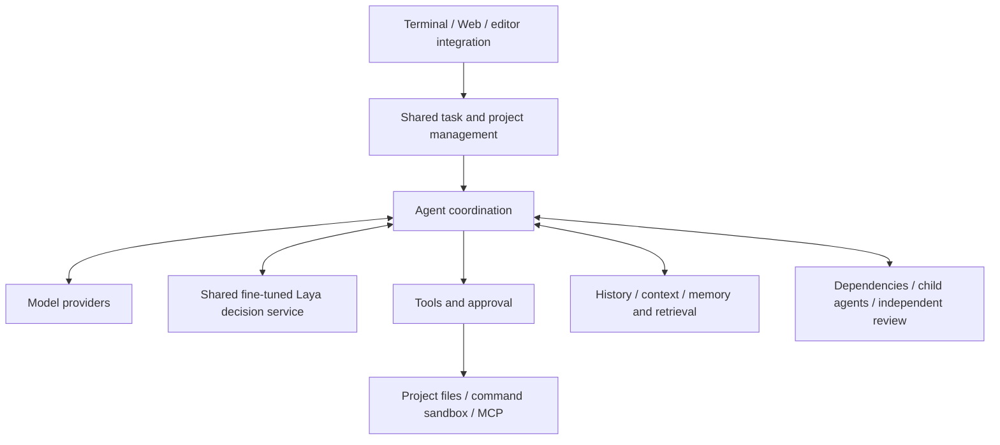

# EASY CODE: Architecture and User Guide

English | [简体中文](./TECHNICAL_DESIGN_ZH.md) · [Quick start](../README.md)

This guide explains how the system fits together, how to complete common workflows and how to handle interruptions. It is for users and readers interested in the architecture, not a source-code walkthrough. Commands are operational examples; replace sample paths and task IDs with your own values.

## 1. Purpose and overall architecture

EASY CODE combines a local agent runtime, a cloud coding model and an experimental local decision model. The cloud model analyzes tasks and proposes actions; fine-tuned Laya classifies workflow and delivery choices. The runtime assembles context, checks permissions, executes tools, retains evidence and recovers work.



| Part | Responsibility | Technology or mechanism |
| --- | --- | --- |
| Local application | Coordinate models, tools, tasks and cancellation | Node.js, TypeScript |
| Interfaces | Terminal interaction, browser projects, live progress and approvals | CLI; Vue 3, Element Plus; VS Code terminal integration |
| Model access | Provider selection, capabilities, streaming and usage accounting | Configurable model registry; compatible Chat Completions/Responses protocols |
| Local decisions | Auto routing and a one-time delivery check | Multilingual encoder and choice head; joint SFT; Python/PyTorch; shared local IPC service |
| Execution control | Authorization, command lifecycle, cancellation and cleanup | Structured tools, independent approval agent, native OS sandbox |
| Persistence | Conversations, projects, events, memory and recovery snapshots | SQLite, JSONL event journals, checkpoints, attachment/evidence files |
| Retrieval | Find relevant history and memory | SQLite FTS5 text search, local vector search, ONNX embedding model, Orama |
| Collaboration and extensions | Delegation, independent review, reusable workflows and external tools | DAGs, Git worktrees, Skills, MCP |

CLI and Web share task, permission and storage rules, but not every input method. For example, CLI uses `/model`; Web uses a model control. The browser is not a separate agent or a second conversation database.

## 2. Installation, startup and first checks

### 2.1 Prepare the installation

Follow the [README installation steps](../README.md#install) with Node.js 20.11+, Python 3.10–3.14, npm and Git for a source installation. Child-agent worktree isolation also requires Git.

Installation prepares the Prompt Bundle, local retrieval resources, SQLite runtime resources, private MarkItDown and Laya Python environments, available VS Code integration and a matching native sandbox runtime. It verifies a real decision using the bundled fine-tuned weights. The converter is refreshed to the latest stable MarkItDown package on install or reinstall. Initial dependency downloads can be substantial. Windows sandbox initialization may request administrator confirmation. Installation cannot automatically resolve every OS dependency, permission restriction or organizational policy.

Check the result:

```sh
easy-code install doctor
easy-code sandbox doctor
```

If the check requests sandbox preparation:

```sh
easy-code sandbox setup
```

Normal startup and command execution should not repeatedly initiate Windows UAC setup. When the sandbox is unavailable, restricted commands stay blocked rather than falling back to host execution. Everyday operation does not require Docker, Podman or a WSL container environment; Benchmark has a separate setup path.

### 2.2 Configure a model account

```sh
easy-code config set glm-coding-plan.api-key
```

The command hides input and stores the key in the OS credential store. Standard GLM API and GLM Coding Plan are separate provider entries: configure the key corresponding to the selected entry. Run the same provider's `config set` command again to replace its key.

Providers, model IDs, endpoints, image support and streaming capabilities are described in `~/.easy_code/models.toml`. Once created, the file is not overwritten on every launch; restart after editing it. Registering a model does not grant service access or guarantee arbitrary protocol compatibility.

### 2.3 Choose an entry point

| Mode | Command | Use it for |
| --- | --- | --- |
| Interactive terminal | `easy-code --workspace "/path/to/project"` | Ongoing work in a local project |
| Web | `easy-code --web` | Project navigation, history and visual progress |
| Resume | `easy-code --resume <thread-id>` | Continue a task with its retained history and state |
| One-shot task | `easy-code --workspace "/path/to/project" --mode code -y run "Investigate and fix the failing tests"` | Start a specific task from the terminal |

Without `--workspace`, CLI uses the current directory. Web opens an authenticated local address on an automatically chosen port. Do not share it as a public service. Closing its launching terminal affects the server; closing a browser tab is not a task cancellation.

For a one-shot `run`, add `--max-model-requests 40` to cap the aggregate model requests from the main agent, children, approvals, reviewer and compaction. Interactive CLI/Web tasks have no fixed request-count cap, but context, concurrency, timeouts and recovery rules still apply.

## 3. Projects, folders and conversations

### 3.1 How they relate

A **project** is a logical owner of folders, conversations, project memory and project Skills. A **folder** is a real directory on disk. A **conversation** retains a continuing task's history and execution state.

A fresh Web installation has no default project:

1. Create a project in the Projects area.
2. Edit it and attach one or more existing local folders.
3. Choose a primary folder.
4. Use the project's **＋** to create a conversation.
5. Select a model and send a task.

A project may exist without folders but cannot execute work until a folder is attached. Changing its display name does not rename directories. A project cannot contain duplicate folder roots or both a parent directory and its descendant.

CLI manages the current project's folders with:

```text
/workspace list
/workspace add <absolute-path>
/workspace primary <folder-id>
/workspace remove <folder-id>
/workspace refresh
```

Use `list` to obtain folder IDs before changing the primary folder or removing an attachment. `/workspace` is CLI-only; use the project's edit interface in Web. Folder changes are blocked while relevant project work or delegated tasks remain active.

### 3.2 A multi-folder example

Attach separate frontend and backend directories to one project, then ask:

> Check whether the frontend and backend agree on the login API. List discrepancies first and wait for confirmation before fixing them. Do not change the database schema.

The agent distinguishes roots through namespaced paths such as `api/...` and `web/...`; `.` in commands means the primary folder. Project memory belongs to the logical project, not separately to each attached directory.

Conversations can run in parallel but still share project folders. Coordinated writes do not create an independent checkout for each conversation. Avoid assigning concurrent edits to the same files.

### 3.3 Naming and deletion

- A user or the main agent can set a conversation's title once. Repeated renaming is not supported in the current version.
- Deleting a conversation removes its history, associated child conversations and memory contributions; shared memories may return to an earlier revision.
- Deleting a project also removes project memory, project Skills and project-owned runtime data.
- **Deleting a project or conversation, or detaching a folder, neither reverts existing file changes nor deletes the actual project directory.**

Stop active work before deletion and back up any history you need.

## 4. How a task progresses

A typical task follows: receive requirements → choose a workflow → gather relevant information → request a model response → authorize and execute tools → retain results → verify → report the outcome or remaining work.

Work modes describe the intended approach:

| Mode | Purpose | Example request |
| --- | --- | --- |
| Auto | Choose between answering, planning and implementation | “How do I start this project?” |
| Plan | Focus on investigation, proposals and decisions needing confirmation | “Investigate the login flow and propose a fix; do not implement it yet.” |
| Code | Implement and verify directly | “Apply the agreed fix and run the relevant tests.” |

In Auto, fine-tuned Laya selects `DIRECT`, `PLAN` or `CODE`. A direct answer still comes from the cloud model and leaves Auto selected; Plan or Code takes effect immediately and persists until you switch back. Image requests or local inference failures use the cloud router.

Before Code delivery, Runtime checks pending commands, child agents and DAG state, then asks fine-tuned Laya to compare requirements with the main agent's proposed final answer. A `CHALLENGE`, or a `RELEASE` below the default 0.9 score threshold, requests one recheck. That allowance survives Resume; the next delivery skips Laya but not the original completion checks or reviewer. Local inference failure reports and skips this reminder. See [local decisions and training](#61-experimental-local-decision-model) for the model, input limits, configuration and results.

Use `/mode plan`, `/mode code` or `/mode auto` in CLI. **Plan is not enforced read-only.** If modifications are out of scope, say so explicitly and keep appropriate command approval controls.

A plan-then-implement workflow:

1. Choose Plan and ask: “Investigate why exports lose non-ASCII filenames. Explain the cause, proposed fix and validation; do not modify anything yet.”
2. Review the findings and add: “Preserve existing filename rules and do not introduce an online service.”
3. Switch to Code and ask: “Implement that plan and report changes and test results.”
4. Check which conclusions were verified and which remain hypotheses.

A successful tool call, passing tests and satisfying the full requirement are different outcomes. In particular, tests modified by the agent should not be the sole evidence that its own implementation is correct.

### Adjust, stop and resume

In Web, an empty draft provides the stop action. Entering text lets you send an adjustment, which takes effect at a safe execution boundary. Navigating to another conversation does not automatically stop the current task.

Resume an existing task with:

```text
/sessions
/resume <thread-id>
```

Or restart with `easy-code --resume <thread-id>`. If another process owns the task, inspect that process before trying to take over; do not control the same conversation concurrently.

`/clear` clears terminal display, not history. `/new` creates another conversation rather than resuming the original one. Stopping does not automatically roll back completed file changes.

## 5. Approvals, sandboxing and commands

### 5.1 Approval modes

Approval decides **whether an action is authorized**; sandboxing decides **where it may operate**. Neither replaces the other.

| Mode | Command approval | Execution boundary |
| --- | --- | --- |
| Manual: `manual` | Ask the user unless a matching grant exists | Normal sandbox remains in place |
| Approval agent: `auto_approve` | Independent evaluation, escalating to the user when necessary | Normal sandbox remains in place |
| Full access: `unrestricted` | Ordinary commands do not require individual prompts | Ordinary host commands run without the normal sandbox, with the user's account privileges |

Enter `/approval` for the CLI selector or `/approval auto_approve` to select explicitly. Web has a control below the input. `-y` selects the approval agent; it does not pre-authorize every possible action.

The startup option `--approval safe|ask|never` controls availability of human prompts; it is **not** an alternative spelling of these three execution modes. In particular, `--approval never` does not mean Full access.

“Allow the same prefix” creates a reusable matching grant within the task and its child-agent scope. Matching considers the structured command and execution context, not just the executable's first word. Allowing one Python or shell invocation is not blanket permission for every script.

```text
/permissions
/permissions revoke <index>
```

Inspect the grant index first, then revoke authorization that is no longer needed.

### 5.2 Native sandbox

| Platform | Isolation mechanism |
| --- | --- |
| Windows | Elevated native sandbox with a restricted execution identity, filesystem permissions and network policy |
| macOS | Seatbelt policies |
| Linux | bubblewrap/seccomp |

The normal sandbox grants workspace writes to the project's active folder set and handles networking separately. Command approval does not authorize crossing that boundary; network operations must follow the relevant approval path. Linux supports a supervised per-task service session so local services and later commands can share localhost.

Choose Full access only when you understand its consequences, not as a default workaround for unexplained failures. A Git worktree isolates changes, not OS privileges. Benchmark's unrestricted execution remains inside its task container and does not grant host access.

### 5.3 Long commands, failures and recovery

Commands have startup, execution, exit and cleanup states. Long-running work can use background execution and polling. A tool-argument preparation indicator means the model is constructing a request, not that the command has already started.

Nonzero exit, timeout, cancellation or an unknown execution outcome does not cause Runtime to replay the command automatically. A new verification request proposed by the model after analysis is a separate action.

If cleanup cannot be confirmed, subsequent mutations may be restricted while task state is retained. Inspect first:

```sh
easy-code sandbox recover --workspace "/path/to/project"
```

This is inspection-only by default. When the result supports a safe recovery, use:

```sh
easy-code sandbox recover --workspace "/path/to/project" --apply
```

`--apply` handles verifiable recovery cases; it does not declare all unknown operations safe. Do not delete quarantine records to bypass unfinished cleanup.

## 6. Models, streaming and waiting

Use `/model` in CLI to choose the model and thinking effort, or `/model <provider-id> <model-id> high`. Web provides equivalent controls. You can change model within a conversation; new conversations normally reuse the last selection.

Effort `none/low/medium/high` affects local budgets and provider reasoning parameters where supported. “Saved, not applied” means the local selection is retained but no corresponding provider parameter is applied; it does not prove the model stopped reasoning.

Streaming distinguishes answer text, thinking and tool preparation. **Tools execute only after their full arguments have been received and validated**, never from a partial file body or half a command. A preview limit affects display, not whether the request is finished. Image attachments likewise require a model with the corresponding capability.

Current default request deadlines:

| Request type | Default | Meaning |
| --- | --- | --- |
| Streaming | 60 seconds without meaningful progress at every effort | New parsed answer, thinking or tool-argument content renews the timer; heartbeats alone do not |
| Buffered/non-streaming | none/low: 5 minutes; medium: 7.5 minutes; high: 10 minutes | Total time allowed to receive the response |

All cloud model roles use the same timing policy, although streaming availability still depends on model capability and the particular request. Retryable API failures default to at most 5 retries; model-content errors default to 2 correction attempts. Cancellation, non-retryable errors and command failure are not the same retry category. The local Laya service has separate startup and inference deadlines, described below.

Use `/usage` for provider-reported usage and `/context` for local capacity estimates. They measure different things. Auxiliary approvals, review, compaction and background memory consolidation can also consume tokens.

### 6.1 Experimental local decision model

The bundled **fine-tuned Laya (joint-v2)** model is trained from **convaiinnovations/laya-multilingual**, an existing decision model built on **mmBERT-base**. It is not a new language model trained from scratch. A shared multilingual encoder and choice head score candidate answers; softmax converts those scores into a distribution, and the highest-scoring option is selected. It does not generate explanations or code.

| Decision | Input | Options | Runtime action |
| --- | --- | --- | --- |
| Auto routing | Current request and bounded conversation context | `DIRECT`, `PLAN`, `CODE` | Answer through the cloud model, propose a plan, or inspect/implement with tools |
| Code delivery | User requirements and the main agent's proposed final answer as its completion summary | `RELEASE`, `CHALLENGE` | Deliver, or ask the main agent to recheck once |

Decision criteria are in English; requests may be Chinese or English, and labels are fixed English identifiers. For example, “Explain the supplied error message” can be `DIRECT`; “Inspect this project's failing tests and fix them” requires `CODE`. A completion summary that leaves a requested test unfinished should be `CHALLENGE`.

Runtime currently selects routing by highest score, **without a confidence-based cloud handoff**. Delivery is different: only a highest-scoring `RELEASE` meeting the configured threshold is accepted. Otherwise, Runtime issues one generic recheck request. Local scores are not a guarantee of correctness, and the classifier cannot provide a specific bug diagnosis. Command approval remains the responsibility of the existing approval system.

### 6.2 Teacher data and joint supervised fine-tuning

All examples originate from the **GPT-6 Luna teacher model**, then are curated into EASY CODE-style user requests and completion summaries. Training uses **SFT (supervised fine-tuning)**, not “SFR”: both the encoder and choice head are trained with cross-entropy against the correct option. This retained model uses neither LoRA nor DPO and introduces no deliberate preference toward Code or Release.

| Dataset | Routing | Delivery | Total |
| --- | ---: | ---: | ---: |
| Development: fit + validation, then final refit | 420 | 685 | 1,105 |
| Held-out test | 105 | 171 | 276 |
| Total | 525 | 856 | 1,381 |

Related requests are grouped in the approximately **4:1 development/test split**. Internal selection uses 995 fit and 110 validation cases; the held-out test is not used for checkpoint selection.

The training process is:

1. Start from the recorded upstream multilingual checkpoint and validate dataset hashes.
2. Train both tasks together, giving routing and delivery equal aggregate loss weight despite their different example counts.
3. Shuffle examples **and candidate-answer order every epoch**. The objective is to learn the option's meaning rather than its position.
4. Select the epoch count using validation performance across answer permutations, prioritizing correct answers in every order. The recorded run selected **5 epochs**.
5. Restart from the original checkpoint, refit on all 1,105 development cases for those 5 epochs, then evaluate the frozen test set.

| Training parameter | Recorded value |
| --- | --- |
| Encoder / choice-head learning rate | `2e-6` / `1e-5` |
| Optimizer / weight decay | AdamW / `0.01` |
| Effective / micro batch size | 16 / 4 |
| Precision and memory management | BF16; gradient checkpointing |
| Selection limit / early-stopping patience | 8 epochs / 3 |
| Seed | `20260925` |

Original weights are not distributed with the project. The [training guide](../finetuning/laya-joint-v2/README.md) provides upstream GitHub/Hugging Face links, the pinned download revision and training/evaluation commands. The bundled final model lives in `model-weights/laya-multilingual/joint-v2/model/`; its saved report and training metadata accompany it. End users need only the installed final model, not the training environment or original checkpoint.

### 6.3 Input budget, local service and decision traces

The model's **1,024-token window covers the complete serialized decision**, including criteria and options. Runtime first removes recognized sensitive values, reserves room for those fixed instructions, and truncates oversized input in the **middle**, retaining its beginning and end with an omission marker. It checks the resulting token count again. This is separate from the cloud model's much larger context window.

Installation creates an owned Python environment at `Data/runtimes/laya-decision`, with pinned `laya==0.3.20` and PyTorch 2.8.0 (2.9.0 for Python 3.14). The worker validates the model hash and uses CUDA when available, otherwise CPU. Full uninstall removes the owned runtime. A custom environment can be selected with `EASY_CODE_LAYA_PYTHON`.

Concurrent EASY CODE processes with the same user, runtime and worker version share one service over a Windows named pipe or private Unix socket. One model instance handles requests serially; closing or canceling one client does not kill another client's work. The service unloads after inactivity or when its last client leaves, and can restart on demand.

Configure the following keys under `[limits]` in the runtime TOML configuration:

| Setting | Default | Purpose |
| --- | ---: | --- |
| `laya_startup_timeout_ms` | `60000` | Time allowed to start and load the service |
| `laya_decision_timeout_ms` | `30000` | Time allowed for a decision request |
| `laya_idle_timeout_ms` | `120000` | Idle service lifetime |
| `laya_delivery_release_threshold` | `0.9` | Minimum score for a delivery `RELEASE`; not a routing threshold |

Decision traces live in the project's `.easycode/decision-traces/<thread-id>.jsonl`. They retain the sanitized/truncated input actually used, option order and scores, raw and applied choices, model identity and fallback/challenge state. Files rotate at 8 MiB with four old rotations and are excluded from Git locally. Trace-write failure is reported without failing the coding task. The task Journal retains decision references and challenge state, not a second copy of the full input.

The once-per-task delivery challenge survives pause/resume. After a challenge, the next delivery skips Laya but still faces the original completion checks. If local inference fails, routing falls back to the cloud router; delivery reports and skips the local reminder rather than asking GLM to replace it.

### 6.4 Measured results


| Held-out evaluation | Laya before EASY CODE fine-tuning | Fine-tuned Laya (joint SFT) |
| --- | ---: | ---: |
| Routing accuracy | 50.2% | **95.1%** |
| Delivery accuracy | 57.3% | **69.3%** |

The baseline and fine-tuned Laya results use highest-score predictions **without the runtime 0.9 delivery threshold**: 105 routing cases in all six option orders and 171 delivery cases in both orders. Matrix counts therefore represent 630 and 342 order-specific evaluations, not distinct cases. Fine-tuned Laya was correct in every routing order for 95/105 cases; delivery for 110/171.

A separate [200-case fine-tuned Laya + GLM experiment](<../laya-bench mark/README.md>) sends either task to GLM when fine-tuned Laya's top score is below 0.9. It achieved **88.5% overall accuracy**, versus **91.5% for GLM alone**, using **84.6% fewer cloud tokens** (11,716 versus 76,006). It reuses recorded GLM answers and usage for the fallback cases. This is an experimental cascade, **not the current product routing/delivery policy**, and its token savings should not be presented as measured production savings.

## 7. History, context and long-term memory

### 7.1 Different stores, different jobs

| Information | Purpose | Sent in full on every request? |
| --- | --- | --- |
| Conversation history | Retain requirements, responses and execution history | No |
| Active context/short-term working memory | Supply relevant recent exchanges, summaries and evidence to the next request | Only the currently assembled subset |
| Tool evidence and attachments | Retain reads, command output and other material for inspection | Usually recalled on demand |
| Project long-term memory | Keep project conventions, environment knowledge and decisions across conversations | Selected by relevance |
| Global long-term memory | Carry common preferences across projects | Selected by relevance |
| Retrieval indexes | Help locate the above material | Not a complete source of truth |

JSONL journals append task events. SQLite manages structured project, conversation, memory and retrieval records. Checkpoints snapshot recoverable execution state. They are different views of related work: no single file represents all history, and deleting one independently can break recovery.

Web document attachments, supported workspace documents, and fetched pages are immutable resources owned by one conversation. Uploaded and workspace documents share the same local conversion and storage service; unchanged source bytes reuse the existing conversation snapshot. The model receives a stable `thread-resource://…/content.md` path and reads only useful line ranges. File tools cannot edit resources, another conversation cannot open them, and child agents do not receive them implicitly. Deleting the conversation, its project or the full EASY CODE installation removes them. The source-size ceiling defaults to 50 MiB and is configured once through `limits.thread_resource_max_bytes`, so Web upload, workspace conversion and resource storage enforce the same value. Web search returns bounded previews; fetching a selected page saves its readable content as the same kind of resource. The CLI keeps its existing text and image paste behavior and does not add document paste, while its agent can still read a supported document already present in the workspace.

Retrieval combines keyword search with local semantic vectors, falling back to text search when vector retrieval is unavailable. Older large tool results can become descriptive references; the agent can recall their retained evidence in bounded pages. A reference is not the original content, and a historical file read may no longer match the current file.

### 7.2 Context capacity management

The default configured token window is 1,000,000. Usable input space also depends on model capability, output reservation, tool-result allowance and safety margins. It does not mean every request can contain a million tokens of history. The pressure ratios below use the effective capacity, so they should not be converted directly into fixed token counts from an advertised model window.

| Default pressure point | Action |
| --- | --- |
| 80% | Reduce optional memory/retrieval injection and replace older large tool results with recall references, targeting 60% |
| 90% | Start eligible summary compaction, subject to recent-interaction protection, cooldown and budget |
| 95% | Mark high pressure and advance the same recovery process |
| 100% | Capacity must be recovered; progressively degrade and pause with retained state if it still cannot fit |

Normally the latest 5 complete exchanges are protected. Older material is summarized into intent, constraints, evidence, verified conclusions, hypotheses and next steps. Summary generation can use a temporary scratchpad; normal extraction retains only the formal summary. Format errors get bounded correction, then explicitly unverified fallback material or deterministic recovery is used.

The default local summary budget is 8,192 tokens. Display/storage text can be clipped; **executable arguments and approval decisions cannot be truncated and then acted on**. These local budgets are not provider-side output `max_tokens` ceilings.

The recovery sequence is: reduce optional injection → reference results → summarize → deterministically evict older history → rebuild context from genuine user requirements. The final rebuild does not delete project files or reset command state, permissions, consumed budgets or unfinished work. Compaction is not lossless; state essential acceptance conditions clearly in the task.

### 7.3 Using long-term memory

Inspect memory with:

```text
/memory short 10
/memory long project
/memory long global
/memory long project <memory-id>
```

These are inspection commands, not direct editing controls. Ask the main agent to save or adjust memory:

> Remember this project's convention: API errors need human-readable explanations. Save it as project memory, not as a rule for other projects.

> Across all my projects, I prefer a short conclusion followed by verification results. Save this as a global preference.

> The deployment environment memory is outdated. Update it and stop relying on the old address.

Memory mutations are staged and committed after the current turn succeeds. Only the main agent can propose long-term mutations. Children and reviewers can read long-term memory within their allowed scope but maintain private short-term histories; they cannot freely read the main agent's entire conversation.

Memories should be short, stable, reusable facts or preferences, not full logs or secret backups. Oversized content may be retained only as explicitly lossy historical material rather than committed as a long-term fact. Background consolidation processes already-saved memories and may consume additional model tokens. Project/global memory default to 90/180-day freshness and expiry management, not permanent authority.

## 8. DAGs, child agents and independent review

Keep these roles distinct:

| Mechanism | Question it addresses | What it does not mean |
| --- | --- | --- |
| Approval agent | Should this command be authorized? | The code is correct |
| Child agent | How can an independently scoped assignment be completed? | More authority or unlimited budget |
| Reviewer | Does the current repeated-failure diagnosis or direction need another experiment? | Mandatory approval of every delivery |

A DAG records dependencies and ownership; an ordinary plan explains an approach to the user. DAG/child-agent orchestration is off by default. Enable it with `/orchestration on` or the Web control. It requires at least approval-agent mode. Switching to Manual disables orchestration when a switch is safe; active DAG/child work prevents an immediate switch.

Default child concurrency is 2 at none/low, 4 at medium and 8 at high, additionally constrained by available work and shared budgets. Enabling orchestration does not guarantee delegation. Children cannot recursively create children or select a higher effort than their parent.

Example:

> Split frontend interaction review and backend API checks into independent assignments. Investigate them in parallel without editing the same files. The main task should reconcile the API and verification results.

Single-folder Git projects can isolate child changes in worktrees; multi-folder projects use shared workspace isolation. Conflicts and unintegrated changes need explicit resolution. A completed child assignment is not proof that integration succeeded.

The current reviewer investigates risks such as repeated high-confidence verification failures using independent material and restricted capabilities. It does not directly modify the main workspace. Its report provides advice, evidence and uncertainty for the main agent's next decision. **It is not a multi-round author/reviewer debate requiring agreement, nor an automatic review of every answer.**

## 9. Skills: reusable workflows

A Skill retains a way of working and supporting material; long-term memory retains facts and preferences. A release-check Skill can define a sequence, but cannot grant itself command or network permission.

Workflow:

1. Use `/skills` to inspect available Skills, scopes and locations.
2. Tell the agent which workflow to follow, or ask it to create one.
3. Review and approve any required maintenance action.
4. Refer to the workflow in later tasks.

Examples:

> Create a project-level release-check Skill covering tests, configuration differences and release notes. Report failures and never publish automatically.

> Apply the release-check Skill to these changes. Do not deploy yet.

A Skill uses a `SKILL.md` with a name, description and instructions, optionally with reference material. Global Skills apply across projects; project Skills belong to their logical project. They live in application-managed storage, not automatically in source folders. Normal deletion archives managed Skills; project deletion removes that project's Skills.

## 10. MCP: connecting external tools

MCP connects local tool services or remote systems. Configuration lives in `~/.easy_code/mcp.toml`. Local servers use stdio; remote servers support HTTP/SSE with configured Bearer or OAuth authentication. Remote URLs require HTTPS except for loopback HTTP.

Configuration, authentication, connection and tool execution are separate steps:

1. Obtain a trusted server address or local launch instructions.
2. Ask the agent to add its configuration and review the change. Configuration alone does not start the service.
3. Use `/mcp` to inspect servers and available actions.
4. Complete required authentication and connection approval.
5. Use `/tools` after connecting, then describe the task.

For a server you named `docs`:

```text
/mcp docs details
/mcp docs authenticate
/mcp docs connect
/tools
```

Use `authenticate` only when required and available for that server. Then ask: “Use the connected documentation service to find deployment requirements. Summarize them without modifying the project.” Finish with `/mcp docs disconnect`; use the menu to disable or remove configuration when appropriate.

Local MCP services remain subject to execution boundaries; remote services may receive submitted data. A successful connection does not permanently authorize every tool, and server descriptions cannot grant privileges. Do not copy model-provider keys into MCP configuration; use the service's supported secure authentication mechanism.

## 11. Command reference and Web interaction

### Typed commands shared by CLI and Web

| Command | Purpose |
| --- | --- |
| `/mode plan\|auto\|code` | Change work mode |
| `/status` | Inspect task and runtime state |
| `/tools` | Inspect available tools |
| `/skills` | Inspect global/project Skills |
| `/mcp [server-id action]` | Manage MCP connections and authentication |
| `/permissions [revoke <index>]` | Inspect permissions or revoke a grant |
| `/context`, `/usage` | Inspect capacity and token usage |
| `/memory short [limit]` | Inspect recent history previews |
| `/memory long [global\|project] [id]` | Inspect long-term memory |
| `/help` | Show command help |
| `/language [en_us\|zh_cn]` | Inspect/change interface language; Web also has a language selector |

### CLI-only inputs and Web equivalents

| CLI command | Web equivalent |
| --- | --- |
| `/model`, `/provider <provider-id>` | Model selection below the input |
| `/approval`, `/orchestration` | Approval and DAG/agents controls |
| `/workspace` | Project edit interface |
| `/image <path\|clipboard\|clear>` | Paste, upload or remove an image |
| `/sessions`, `/resume [id]`, `/new` | Project/conversation sidebar |
| `/clear` | No direct equivalent; clears terminal display only |
| `/exit` | Stop the Web service from its launching terminal instead |

There are no command aliases. Unknown slash-prefixed text may be sent as ordinary task input; do not assume an unlisted name is a feature. Web rejects recognized CLI-only commands.

In Web, Enter sends and Shift+Enter inserts a newline; active IME composition is not submitted. Images have removable previews. Long pasted text becomes a preview card while retaining its submitted content. Thinking and tool entries expand for detail; shorter previews do not mean the underlying model request was truncated.

## 12. Configuration and project instructions

| Location/entry | Purpose |
| --- | --- |
| `~/.easy_code/models.toml` | Providers, models, endpoints and capabilities |
| `~/.easy_code/mcp.toml` | MCP server configuration |
| `config.toml` in EASY CODE's user configuration directory | User runtime settings; separate from the model registry in `~/.easy_code` |
| Primary folder's `.easycode/config.toml` | Allowed project-level runtime overrides |
| Primary folder's `EASYCODE.md` | Project conventions, validation methods, restrictions and delivery requirements |
| `easy-code config defaults` | Print current runtime defaults |
| `easy-code config set <provider>.api-key` | Set credentials securely |

Default user configuration paths are `%APPDATA%/easy-code/Config/config.toml` on Windows, `~/Library/Preferences/easy-code/config.toml` on macOS, and `~/.config/easy-code/config.toml` on Linux (following `XDG_CONFIG_HOME` when set). For custom locations, use the path reported by the application. See the [configuration reference](./config.example.toml) for fields. Change only settings you understand, restart, and inspect the effective task/capacity state with `/status` and `/context`.

Useful `EASYCODE.md` guidance might say: “Use the project's existing test entry point; perform offline verification without real credentials; never publish automatically.” These instructions guide the task without overriding approvals or sandbox controls.

To reduce consumption, narrow task scope, choose appropriate effort, cap one-shot requests and avoid unnecessary delegation. Larger context and more concurrency do not guarantee better results or lower token cost.

## 13. Troubleshooting, privacy and removal

| Symptom | First action |
| --- | --- |
| `easy-code` not found | Confirm global installation succeeded and npm's executable directory is on PATH; reopen the terminal. Building alone does not install the global command. |
| Missing dependencies after installation failure | Fix the first failed step before building/installing again. On Windows, active processes can hold native dependency files open. |
| Long API wait | Check meaningful stream progress and distinguish thinking, tool preparation and actual execution; then inspect provider and timeout messages. |
| Missing model or authentication failure | Check the registry, selected provider, corresponding key and account access. |
| Sandbox unavailable or repeated setup requests | Run `sandbox doctor`, address its findings and explicitly run `sandbox setup`; do not conceal the cause by choosing Full access. |
| Quarantined command environment | Inspect execution/cleanup evidence with `sandbox recover` before considering `--apply`. |
| Resume reports another owner | Check the original process; do not control one task from two processes. |
| Detail lost after compaction | Ask the agent to recall evidence or reread current files; restate essential acceptance conditions. |
| Local tests pass but evaluation fails | Compare acceptance criteria and unchanged tests. Local verification, reviewer advice and official scores are different evidence. |

Local storage can contain source excerpts, attachments, command output and memory; treat it as sensitive data. Selected context goes to the model provider and MCP can transmit data too. Credential-store protection does not imply automatic redaction of every attachment or task input.

Stop active work before backing up. Include configuration, application data and an appropriate credential-migration plan; a single checkpoint is not a complete backup. Development versions do not promise recovery of arbitrary old internal formats.

Preview removal first:

```sh
easy-code uninstall --dry-run
easy-code uninstall
```

One confirmation removes verified EASY CODE resources, including history, memory, settings, credentials, caches, managed worktrees and integrations. Without a backup there is no undo. Source folders and shared system software are preserved. Active or uncertain resources can block removal until resolved; `--yes` skips confirmation, not safety checks.

## 14. Benchmark entry point

SWE-bench uses a separate Docker/Harbor environment rather than the everyday native command sandbox. The controller handles model access, the worker operates in an offline task environment and the verifier grades results. Unrestricted commands within that task do not authorize host or external-network access.

Configure evaluation credentials separately:

```sh
easy-code benchmark credential set glm-coding-plan
easy-code benchmark swe-bench setup
easy-code benchmark swe-bench doctor
```

With the environment ready and an existing package, start with one case:

```sh
easy-code benchmark swe-bench run --offset 0 --limit 1 --concurrency 1 --run-id smoke-1 --package "/path/to/easy-code-agent-0.1.0.tgz"
```

`offset` starts at zero; `limit` is the case count. Use a new `run-id` for a new experiment. The model registry's evaluation profile selects the actual model. See the [Benchmark guide](../benchmarks/swebench_verified/README.md) for environment requirements, data locations and result inspection. The current 50-case set is SWE-bench Verified Mini, the HAL community subset; its score must not be presented as a full Verified leaderboard result.
