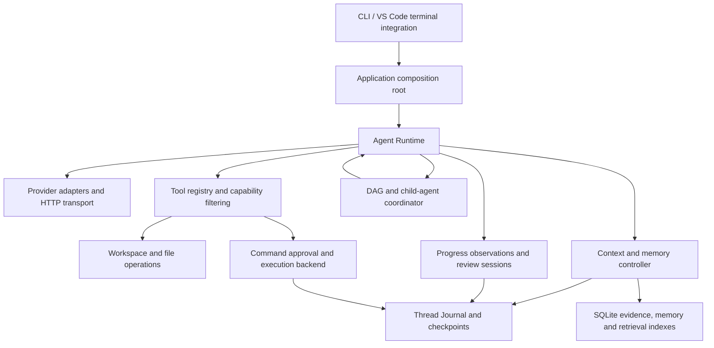

# EASY CODE — Technical Design

[简体中文](TECHNICAL_DESIGN_ZH.md) · [Quick start](../README.md) · [Configuration example](config.example.toml)

This document describes the implementation in this repository, not a proposed roadmap. Defaults are defined in [runtime-defaults.json](../src/config/runtime-defaults.json), validated by [runtime-limits.ts](../src/config/runtime-limits.ts), and may be overridden in configuration. Source links below identify the authoritative implementation.

## 1. Architecture and responsibility boundaries

EASY CODE is a local TypeScript/Node.js coding-agent application. It sends model requests to supported providers, executes tools on the user's computer or in an explicitly selected execution environment, and persists enough state to resume interrupted work.

The central distinction is between **model suggestions** and **Runtime authority**. The model proposes tool calls, summaries, plans, and review conclusions. Runtime validates arguments, applies permissions, owns command lifecycles and budgets, records evidence, and decides whether a task may finish.



| Layer | Main source | Responsibility |
| --- | --- | --- |
| Entry and assembly | [index.ts](../src/index.ts), [app.ts](../src/app.ts) | CLI parsing; construct services; connect UI, state, permissions and review callbacks |
| Agent execution | [runtime/](../src/runtime) | Model/tool loop, routing, budgets, failure classification and completion gates |
| Tools and workspaces | [tools/](../src/tools), [workspace/](../src/workspace) | Validated capabilities, file versions, Git changes and workspace isolation |
| Command control | [command/](../src/command), [sandbox/](../src/sandbox), [downloads/](../src/downloads) | Approval, process supervision, network mediation, execution backends and artifact downloads |
| Durable state | [threads/](../src/threads), [storage/](../src/storage) | Append-only events, recovery, SQLite repositories and checkpoints |
| Memory and capacity | [context/](../src/context), [memory/](../src/memory) | Active context, evidence references, summaries, project memory and hybrid retrieval |
| Collaboration | [plans/](../src/plans), [tasks/](../src/tasks), [subagents/](../src/subagents) | User-facing plans, task DAGs, child threads and result handoff |
| Reliability and review | [progress/](../src/progress), [review/](../src/review) | Evidence-based progress detection, isolated discussion and delivery checks |
| Presentation | [cli/](../src/cli), [ui/](../src/ui), [images/](../src/images) | Terminal interaction, rendering, image handling and editor bridge |
| Evaluation | [src/benchmarks/](../src/benchmarks), [benchmark adapter](../benchmarks/swebench_verified) | SWE-bench/Harbor orchestration and isolated worker execution |

`app.ts` is the composition root; `runtime/agent.ts` is the main execution coordinator. These remain substantial modules: this is a modular application, not a collection of independently deployed services.

## 2. Technology stack

| Technology | Use in this project |
| --- | --- |
| TypeScript, Node.js ≥ 20.11, ESM | Strictly typed application, NodeNext module resolution, compiled CLI in `dist/` |
| Commander, TOML, Zod | CLI commands, configuration parsing, runtime schemas and tool-argument validation |
| Node HTTP/HTTPS | Provider transport, cancellation, time/size bounds and controlled proxy connections |
| execa, Podman CLI | Host process control and rootless Linux task containers; EASY CODE owns approval, network brokering and lifecycle management |
| node-sqlite3-wasm, SQLite FTS5 | Durable repositories, lexical search and schema migrations without a Node SQLite ABI build |
| ONNX Runtime, Hugging Face tokenizers | Local text embeddings for semantic retrieval |
| Orama | Derived vector-search cache, not the authoritative memory store |
| env-paths, OS keyring | Platform-specific storage directories and provider credentials |
| Node TTY/readline, chalk, diff | Custom terminal UI, styling and file-diff presentation |
| VS Code Extension API | Terminal menus, image attachment and Thinking-link integration |
| Python, Harbor, Docker | Benchmark adapter, controller/worker separation and official verification |

Exact dependency versions and build commands are in [package.json](../package.json). The agent loop is implemented locally; it does not depend on LangChain or LangGraph. The terminal renderer is not React/Ink. The SQLite binding uses WebAssembly, but other dependencies such as ONNX Runtime and the keyring still use platform components.

## 3. Request lifecycle and work modes

A normal turn follows these stages:

1. Load configuration, resolve credentials and model metadata, and open or recover a thread.
2. Persist the user's input, attachments and relevant state changes.
3. In Auto mode, run a constrained router that selects direct response, Plan or Code.
4. Build the model request from a stable system prefix, active history and current Runtime/retrieval material.
5. Check shared budget and context capacity, then call the provider.
6. Validate the response and complete tool arguments; run only the capabilities available to that actor and mode.
7. Persist results, capture evidence, update workspace/progress state, and continue the loop.
8. Before completion, check pending commands, DAG/child work, submission contracts and applicable delivery review.

Source: [agent.ts](../src/runtime/agent.ts), [auto-router.ts](../src/runtime/auto-router.ts), [core contracts](../src/core/types.ts).

Work mode, approval mode and execution environment are separate axes:

- **Auto** is a restricted routing stage, not a keyword-only classifier.
- **Plan** emphasizes analysis and a structured `propose_plan` proposal. In the current implementation it still exposes file-edit and command tools. Its instruction to avoid direct edits is therefore **not an enforced read-only security boundary**. Commands obey the selected approval policy. DAG/child creation is not exposed in this mode.
- **Code** performs implementation and verification, with orchestration tools available only when enabled.
- A child has its own restricted tool set and submits a structured result; it does not recursively create children or manage project memory.

A successful HTTP response, a command exit code of zero, and a completed user task are three different outcomes. Thinking-only output, an incomplete response with `finishReason = length`, or invalid tool arguments cannot be treated as successful delivery.

## 4. Configuration, prompts and credentials

[loader.ts](../src/config/loader.ts) combines defaults, user configuration, safe project configuration, credentials/environment and CLI overrides. User configuration lives under the OS-specific EASY CODE config directory; project overrides use `.easycode/config.toml`. CLI and environment settings can override stored values.

Project configuration is restricted: it cannot silently supply credentials or redirect private Runtime storage and other protected settings. Operational limits are grouped under `[limits]`, including nested effort-based step, concurrency and timeout settings. Unknown or obsolete limit fields are rejected rather than silently ignored.

Selected operational defaults (other module-specific budgets are explained below):

| Configuration key | Default | Meaning |
| --- | --- | --- |
| `steps` | none/low/medium: 40; high: 80 | Logical agent-step budget |
| `maxModelRequests` | 120 | Shared model-request ceiling |
| `maxTaskTokens` | 0 | No separate aggregate Token ceiling; other limits still apply |
| `providerTimeoutMs` | 300,000 / 300,000 / 450,000 / 600,000 | Request timeout for none/low/medium/high |
| `providerResponseMaxBytes` | 16 MiB | Local HTTP response-size guard |
| `commandTimeoutMs` | 120,000 | Default command timeout |
| `maxManagedWorktrees` | 15 | Managed worktree limit |

Use `easy-code config defaults` for the complete TOML representation. Character, Token, byte, time and count budgets are deliberately distinct units.

Provider API keys are managed through the [credential layer](../src/config/credentials.ts), normally using the OS keyring and hidden terminal input. They do not belong in project TOML, prompts, thread logs or benchmark task volumes.

The [prompt bundle](../resources/prompt-bundle) separates system instructions, mode prompts and tool descriptions from executable logic. The build produces versioned resources; installation validates manifests, hashes and compatibility before activation. A prompt or tool-description JSON file cannot grant a capability that Runtime has not exposed. Model/provider configuration is intentionally separate and is described below.

Project `EASYCODE.md` instructions are loaded by [instructions.ts](../src/prompts/instructions.ts). They supply project guidance, not permission to override Runtime security controls.

## 5. Providers, model requests and accounting

### 5.1 User-maintained model registry

The authoritative runtime registry is the fixed user file `~/.easy_code/models.toml`. [models.default.toml](../resources/models.default.toml) is only the installation seed: postinstall creates the user file atomically when absent and never overwrites it. Startup parses the active file with a strict schema before CLI choices or credentials are resolved. The model-controlled tool layer cannot read or modify this protected file.

| TOML field | Meaning |
| --- | --- |
| `default_model` | Alias of the initial model. |
| `providers.<id>.base_url` / `wire_api` | HTTPS base endpoint and `chat_completions` or `responses` protocol. |
| `providers.<id>.env_key` | Name of the environment variable that may contain this provider's key; the key itself is never stored here. |
| `providers.<id>.supports_streaming` | Whether this endpoint is requested and parsed as an SSE stream. Missing values fail safely to `false`. |
| `providers.<id>.supports_stream_usage` | Whether Chat Completions streaming requests send `stream_options.include_usage`. Defaults to `false`; enabled for packaged Qwen and DeepSeek endpoints. Responses uses terminal-event usage instead. |
| `supports_temperature` / `supports_strict_tools` | Wire capabilities used by the generic drivers. |
| `models.<alias>.provider` / `model` | Provider reference and exact model identifier sent to the API. |
| `context_window`, `input_modalities` | Documented capacity and text/image support. |
| `tool_calling`, `reasoning` | Declared model capabilities. |
| `profiles.swe_bench_verified_50` | Model alias, mode and effort used by the benchmark launcher. |

Provider and model identifiers are data, not TypeScript unions. A new provider that implements one of the supported wire protocols is therefore added by editing TOML, not by adding a subclass or factory branch. Unknown fields, unknown provider references, duplicate wire model IDs and non-HTTPS registry endpoints fail validation. Existing user configuration/environment endpoint overrides remain as a compatibility layer, but project configuration cannot redirect model traffic or supply credentials.

New threads bind the active registry hash. Resume refuses a different binding rather than silently sending an old session to a changed endpoint or protocol; legacy threads receive a one-time binding checkpoint. The SWE-bench launcher uses the selected profile, stages the exact registry into the isolated controller and derives its network allowlist from the selected provider endpoint.

### 5.2 Protocol drivers and reasoning

[providers/](../src/providers) has two generic protocol drivers. The Chat Completions driver posts to `/chat/completions`; the Responses driver posts to `/responses` and normalizes Responses input items, function calls, reasoning summaries and usage into the common Runtime contracts. Both receive capability flags from the registry rather than provider-name checks.

There is deliberately no Qwen/DeepSeek/Kimi/GLM-specific thinking map. Chat Completions dialects do not share a portable reasoning parameter, so EASY CODE sends no invented thinking field and lets the service use its configured default. For a registry model with `reasoning = true`, the Responses driver may send the standardized `reasoning.effort` selected by the user. Effort still controls local Runtime budgets and timeouts independently of wire support.

When `supports_streaming = true`, the selected protocol driver requests SSE and emits provider-neutral transient events with a unique physical-request ID and ordered sequence numbers. UTF-8, LF/CRLF/CR and SSE records are decoded incrementally. Chat Completions accepts null usage and usage-only chunks, and requires both the selected choice's finish reason and `[DONE]`; Responses requires a validated completed/incomplete terminal event. HTTP EOF alone never completes a model response, and stream error events cannot be ignored. Tools run only after a complete response is accepted and their original arguments pass validation. A successful JSON response is still parsed atomically without a second request.

Network failures and missing stream terminators use the existing shared API retry allowance (five retries by default); each attempt has fresh buffers and a new ID. No partial response is added to model history or executed. Cancellation, authentication and malformed protocol data do not gain automatic retries. Length/incomplete model outcomes use the existing content-correction allowance instead. Actual usage is settled once; absent usage keeps the existing estimation fallback. Standalone adapter calls retain their explicit retry cap, while Runtime requests set that cap to zero and own all retries.

The CLI buffers deltas and refreshes at `limits.streamFlushIntervalMs` (50 ms by default), using the existing layout cache for unchanged nodes. `limits.streamPreviewMaxChars` (16,000 by default) bounds in-progress previews only; the unfinished lexical token is held for safe filtering, and accepted final text/thinking is retained in full. Completion/interruption flushes immediately; retries mark old previews interrupted. Clear, thread reset and close cancel pending flushes, and duplicate/late deltas cannot update a new attempt. Existing user `models.toml` files are not overwritten: enable `supports_stream_usage = true` there for endpoints supporting that option.

The terminal replaces stable virtual transcript nodes as deltas arrive, preserving the actual reasoning/text/tool order. Only the final assembled assistant message is journaled; individual deltas are not durable events. The completed result reconciles the live node instead of printing a second answer, while non-interactive and small-terminal paths retain atomic output. Local output/context reservations are **never** serialized as `max_tokens`, `max_completion_tokens` or `max_output_tokens`; the HTTP response-size bound protects the local process without changing generation semantics.

[model-retry.ts](../src/runtime/model-retry.ts) owns retry behavior; adapters do not add an independent nested retry loop. [task-budget.ts](../src/runtime/task-budget.ts) reserves and settles shared request/Token budgets across main agents, children, review and auxiliary requests. Resume does not replenish consumed budget.

[usage/](../src/usage) records request purpose, actor, provider/model, latency and available Token/cache counters. Missing provider usage is not equivalent to zero usage. Cached-input and reasoning counters must not be double-counted as additional total Tokens.

## 6. File tools, workspace state and Git

### 6.1 Source-aware tool boundary

The tool layer now separates four concerns that were previously coupled to built-in names:

1. A `ToolSource` owns discovery and lifecycle. `ToolCatalog` combines sources in deterministic order and publishes an immutable snapshot for a Runtime run.
2. Runtime-owned metadata binds every tool to a stable source-qualified identity, effects, allowed roles/modes, orchestration or vision requirements, idempotency and result class. A remote declaration cannot grant itself authority.
3. The execution gateway resolves the snapshot binding, validates arguments, crosses the authorization boundary where required, invokes the implementation and normalizes bounded provider-neutral result content.
4. A `tool.catalog.bound` event records the exact exposure hash and a bounded binding inventory before execution. Journaled tool results also include the selected tool/source identity, schema and capability-metadata hashes, catalog revision and catalog hash, so later recovery and audit do not depend on whichever catalog happens to be active then.

`BuiltinToolSource` is now the only composition path for trusted in-process tools. The application keeps a catalog for each main Thread; child runs and isolated review participants receive their own catalogs. `/tools`, normal turns and child execution therefore inspect the same source model instead of rebuilding separate arrays. `AgentRuntime` accepts only a catalog snapshot—there is no parallel raw-tool input—and applies role, mode, orchestration and vision policy to that captured snapshot.

Built-in availability is defined in one declarative policy table. Unknown legacy tools retain a conservative main-Agent compatibility profile. A dynamic external tool must provide host-owned metadata; it cannot claim Agent, context or memory-write control-plane authority. External write, process, network-write and destructive effects fail closed unless an explicit Runtime authorization bridge is installed. Duplicate model-facing names or stable identities are rejected before a request is built. Source startup happens once per catalog, shutdown is owned by the application or child lifecycle, and partial catalog-load failures close already-created sources before returning an error.

This is an **extension seam, not an MCP integration**. The repository does not include an MCP SDK, MCP transport, server discovery, MCP configuration, credential exchange or resource/prompt adapter. The application exposes an internal source-factory composition seam with a role/Thread/workspace context. A future MCP client can implement `ToolSource` and the authorization bridge without adding provider-specific branches to the agent loop, while connection supervision, server trust, naming and credential configuration remain application responsibilities.

### 6.2 Built-in file safety

The [built-in source](../src/tools/builtin-source.ts) assembles trusted tools and the [catalog](../src/tools/catalog.ts) publishes their immutable request view; no second registry constructs a parallel built-in set. Tools combine explicit model-facing JSON schemas, local Zod validation and structured result/error contracts. Rich results use a bounded neutral content union for text, structured values, attachment references, resource references and durable artifacts; executable arguments and authoritative evidence remain separate from presentation content.

File operations use canonical-path checks, protected-path rules and source hashes. Search results identify locations; they are not proof that the model has read a file or authorization to replace it.

- `read_file` defaults to 100 lines, allows up to 1,000 lines, and also applies a 24,000-Token result budget.
- `search_files` bounds traversal, bytes and matches, and excludes common dependency/cache paths where applicable. It searches local files, not the web.
- `update_file` requires a previously read version and expected SHA-256. Literal old/new-text replacement distinguishes ambiguous matches and explicit replace-all operations.
- Create/update/delete paths check preconditions before mutation; a version mismatch is an error, not permission to overwrite concurrent changes.
- Presentation clipping never turns an incomplete mutation argument into an executable one.

Source: [tools/](../src/tools), [workspace/](../src/workspace).

Git-aware change tracking records relevant tracked, staged, unstaged and untracked changes; non-Git workspaces have a snapshot fallback. Managed child worktrees can start from the current snapshot, including local changes. Result handoff checks the base and conflicts before applying changes. New worktrees use hashed short directory components while durable records retain the full environment identity; legacy full-ID paths remain restorable. On Windows, Runtime-owned Git calls explicitly enable long-path support and a preflight checks tracked, snapshot and configured include paths before checkout. Provisioning failures clean only the validated managed path and retain cleanup evidence instead of silently weakening isolation.

Worktrees provide change isolation, **not OS sandboxing**. Default file access is workspace-scoped; explicit host/full-access capabilities are separate and must not be confused with ordinary workspace permissions.

## 7. Commands: approval, execution and network boundaries

### 7.1 Approval decisions

[command/approval.ts](../src/command/approval.ts) and application callbacks separate user approval from the independent command-approval agent.

| Permission mode | Behavior |
| --- | --- |
| Request approval | Each new command requires user approval unless an applicable thread-scoped prefix grant already exists |
| Help me approve | A separate tool-free model call returns allow-once, allow-prefix or reject; rejection/failure falls back to user approval when interaction is available |
| Full access | No command approval and no host OS sandbox; commands run with the current user's privileges |

`-y` selects automatic approval; it is not blanket Full access. CLI `--approval safe|ask|never` also controls prompting behavior and must not be equated with the three permission modes.

Prefix grants are validated, scoped to the thread and descendants, and tied to command identity/scope. Shell/interpreter payloads require more care than matching only an executable name. A grant is not global permission for every future command with vaguely similar text.

Switching an idle thread to manual approval disables DAG/child orchestration. Switching is refused while DAG/child work is outstanding. Review sessions use their own approval flow rather than inheriting main-thread Full access.

### 7.2 Lifecycle and outputs

The command path is normalization → executable/shell resolution → policy and approval → supervised launch → terminal result and cleanup. Structured `program`, `args` and `cwd` support relative or workspace-absolute directories and valid multi-line interpreter arguments. Incomplete arguments are rejected; they are not guessed or truncated.

`run_command` is synchronous from the agent's perspective. `start_command`, `poll_command` and `cancel_command` manage longer-lived work by command ID. Timeout, cancellation, process-tree cleanup and uncertain execution state belong to Runtime. Full access does not disable these correctness checks.

There are separate output representations:

- A bounded verification collector observes execution output independently of the model-visible excerpt.
- A head/tail collector bounds live output memory.
- A disk archive preserves captured output up to per-command and per-thread quotas.
- A compact projection is returned to the model, with diagnostic excerpts and recall references where available.

Defaults include 256,000 captured characters per stream, a 32 MiB command archive and a 256 MiB thread archive; success/failure model excerpts are normally 2,000/16,000 characters. These are different budgets, not one universal truncation limit. Archive exhaustion or partial capture is reported explicitly.

An outer pipeline exit status of zero is **not** sufficient evidence that tests passed. [verification.ts](../src/command/verification.ts) and progress observations interpret recognized terminal test results separately. Output overflow and cleanup failure are also separate outcomes; only unresolved cleanup/safety state should quarantine execution.

### 7.3 Podman execution backend and network access

Normal CLI workspace commands now use [PodmanSandboxBackend](../src/sandbox/podman-backend.ts). Linux uses rootless Podman; Windows uses a rootless WSL-backed Podman machine and macOS uses a rootless Linux VM. This is deliberately a Linux execution environment, not native Windows/macOS emulation. Model/provider calls, secrets, approval, Journal, memory and the container control plane stay on the host.

Each workspace/thread receives a labeled persistent container. Commands within it are serialized. The root filesystem and installed dependencies survive stop/start; temporary files and processes do not. A background service and its client must run under the same supervised command. Other threads and writable child worktrees use distinct containers. Rootless engine status is required; containers never use privileged mode, host networking, host PID namespaces or a container-engine socket mount. Root inside this rootless container permits ordinary dependency installation without host administrator privileges.

The checkout is bind-mounted at `/workspace`, so file tools and commands use the same bytes without copy-back overwrites. Windows sources map to WSL `/mnt/<drive>`; a host-created random nonce verifies the engine-side mount at every dispatch. Missing VM sharing fails explicitly, never switches to an empty remote directory. Mount-option injection and protected Runtime overlaps are rejected. Protected directories inside the checkout are hidden, protected files are replaced by an empty read-only mount, and host `.git` is read-only. A private Git metadata copy supports container Git operations and Windows/worktree pointers; container commits do not update host Git refs. Host Worktree finalization remains authoritative.

Approval is separate from isolation. Manual/independent-agent approval is retained. Podman permission prefixes have their own namespace, bind the configured image and container cwd, and cannot authorize native host commands. They authorize a command recipe, not attested immutable executable bytes; the UI discloses that scripts and container executables can change. Grants remain scoped/inherited through the existing thread approval store. Full access still explicitly selects the unsandboxed host; `executionScope=host` needs a separately applicable approval. No missing engine, image or capability silently escalates to host execution.

Task containers always use `--network=none`. Local Linux IPC (loopback, socketpair, shared memory) remains available. Ordinary HTTP(S) dependency downloads use a container-local proxy relayed through Podman exec stdio to a fixed, host-created [network gate](../src/command/network-gate.ts). Only the host gate resolves and connects to destinations after approval; private/reserved destinations are rejected. Untrusted relay frames have size, connection, queue and total-transfer bounds and cannot choose a host control-plane address. The gate is closed on completion/cancel; no network change persists into a subsequent command. Direct sockets, SSH and UDP egress are not provided. HTTPS CONNECT is opaque: approval authorizes the invocation, not a claim that arbitrary encrypted traffic is semantically read-only.

[Podman worker](../src/sandbox/podman-worker.ts) forwards stdout/stderr separately from host-owned lifecycle events on private fd 3. Runtime retains separate preparation, initialization, execution and cleanup timing. Timeout/cancel stops the container, not merely its local Podman client. Backend cleanup runs even after the local worker is killed or loses its response, and independently inspects the engine state. Confirmed container stop can recover cleanup certainty but cannot fabricate an exit result. Ambiguous dispatch, command nonzero exit, timeout and cancellation never trigger automatic command replay.

A durable task lease stores container name, owner, command and thread IDs. Running/unowned/mismatched containers and unfinished leases cannot be silently reused. Actual cleanup uncertainty retains the lease and normal Runtime quarantine. An engine connection error is not interpreted as a missing container. Upgrading does not delete old command leases or SRT cleanup records.

Review takes a stopped parent-container image snapshot excluding bind mounts. Each actor receives that dependency image plus its own existing review checkout and private Git metadata; it does not share the main writable tree. The snapshot ID and command history invalidate cached environment approvals. Reviewer preflight selects Linux interpreters, including relocatable Linux virtual environments, instead of Windows host executables.

Interactive startup automatically attempts the same setup once for installable `dependencies_missing` / `setup_required` states, reporting progress and opening the recovery menu only on failure. Rechecking does not retry installation; users may explicitly select setup again. `probe_failed` / `unsupported` never auto-install, and a successful setup status must also carry `ready` readiness. The host control environment remains allowlisted, including `ProgramData` required by Windows OpenSSH machine-key generation, rather than inheriting the full host environment or provider credentials. It is never passed to model commands.

`npm postinstall` automatically prepares the sandbox using [podman-install.ts](../src/sandbox/podman-install.ts): reuse Podman or install via Windows WinGet, macOS Homebrew / a checksummed Red Hat-signed official package, or fixed Linux package-manager recipes. Windows prepares WSL when needed; Windows/macOS create/start the configured rootless `easy-code` machine without switching an existing default connection, resizing other machines or stopping their workloads. System authorization remains with the OS; no passwords are collected and no reboot is forced. Unsupported installers, denied privileges or required reboots report incomplete installation. Linux package installation uses non-interactive sudo when necessary; rootless preparation must run as the ordinary user. Source-only dependency installation before build defers setup, and `--ignore-scripts` explicitly bypasses postinstall (including in Benchmark).

`easy-code sandbox setup` resumes the same installation and builds the missing packaged [Containerfile](../resources/podman/Containerfile), or pulls a configured external image. Existing images are reused. Readiness is reported only after `sandbox doctor`'s disposable asyncio/socketpair/semaphore/tempfile/offline probe; this is not an exhaustive per-language compatibility certificate. Engine control and workers explicitly select the dedicated desktop connection. Workspace visibility in the VM is verified before every command; non-shared host paths fail with no host fallback. See [config.example.toml](config.example.toml) for machine name/creation RAM/CPU/disk and per-container RAM/CPU/PID/shared-memory/temp/proxy/control budgets. Changing creation limits does not resize an existing VM. Images and task containers are retained, never globally pruned. Engine-side container lifetime bounds orphan processes even if the CLI dies; uncertain leases remain available for diagnosis. Reviewers use a stopped parent dependency snapshot with a read-only rootfs and a private writable workspace.

Benchmark deliberately retains the trusted offline Harbor/Docker controller-worker bridge; no nested Podman daemon is installed. Its resource bounds remain in [sandbox-resources.json](../benchmarks/swebench_verified/sandbox-resources.json). Benchmark command execution never receives the ordinary CLI network relay. Provider access remains controller-only.

Podman is the only ordinary CLI sandbox. The former native sandbox implementation, dependency (including development), ACL repair tools, probes and obsolete nested Harbor helper have been removed. Native full-access execution retains Windows Job/POSIX process-group supervision; it is not a sandbox. Benchmark retains only its independent Docker controller/worker bridge. Container acceptance lives in [smoke-podman.mjs](../scripts/smoke-podman.mjs). Rebuild/reinstall and restart the CLI after upgrading; historical logs and unfinished command records are not deleted by this source cleanup.

### 7.4 Container-aware validation, review and resource maintenance

Test-runner discovery reads `package.json` through the backend's shared-workspace mapping, never by interpreting container `/workspace` as a host path. Manifests must pass workspace path protection and a 1 MiB read bound. Unattributed npm/yarn/pnpm scripts produce unknown validation, not success inferred solely from exit zero.

Host review copies contain source and original test baselines only. The offline Linux [dependency helper](../resources/podman/review-dependencies.py) inventories/hashes and copies `.venv`, `venv`, `node_modules`, `dist` and `build`, preserving Linux links and executable modes without host junctions or host Python resolution. Runtime-owned named volumes are mounted read-only at the same `/workspace` paths in both private participant containers; their source copies remain available for experiments. The rootfs is also read-only. Venv preflight runs inside the container.

[podman-review.ts](../src/sandbox/podman-review.ts) caches immutable images, volumes and review identity by durable command-environment generation and dependency-content digest. Resume and freshness checks do not unconditionally commit again. New commands or changed dependency content invalidate the revision. Snapshot transactions share the task's exclusive command lease. A bad snapshot with confirmed helper cleanup does not quarantine the task; uncertain helper cleanup retains the lease. Helper lifetime/file/byte bounds use the existing `reviewPreparationTimeoutMs`, `reviewDependencyMaxFiles` and `reviewDependencyMaxBytes` configuration.

`easy-code sandbox resources` lists EASY CODE-owned containers, review volumes and images. `easy-code sandbox remove <container|volume|image> <full-name> --yes` permanently removes one explicitly selected resource after checking its name, engine labels, control directory and lease. Running/unknown resources, outstanding leases and container references prevent forced deletion. There is no global prune or automatic deletion of machines, base images, project files or historical logs. CLI uninstall preserves environments and reminds users to clean selected resources first. Ordinary stop retains task dependencies for resume.

[smoke-podman.mjs](../scripts/smoke-podman.mjs) is the consolidated acceptance entry point for Plan command approvals, masked failures, npm metadata mapping, lifecycle and independent review dependencies. Retired native-platform smoke scripts have been removed. Run `python3 tests/podman-review-dependencies.test.py` in Linux/WSL to test the dependency copier separately; it is not a substitute for real container acceptance.

## 8. Durable state, recovery and sources of truth

[threads/](../src/threads) stores append-only JSONL events with sequence/identity information and durable append behavior. Event folding reconstructs conversation and control state; leases and turn ownership prevent competing writers. Recovery handles a damaged trailing record conservatively rather than ignoring arbitrary interior corruption.

[storage/database.ts](../src/storage/database.ts) uses SQLite with foreign keys, migrations, a busy timeout and application locking. The current journal mode is **DELETE, not WAL**. Repositories cover thread indexes/checkpoints, project memory, provenance, evidence, summary snapshots and retrieval state.

The storage layers do not all have the same recoverability:

| Data | Role |
| --- | --- |
| Thread event Journal | Authoritative event history for conversation/control replay |
| Project-memory records, raw captured evidence | Durable primary data in SQLite; not all reproducible from a shortened conversation Journal |
| Checkpoints and event-query indexes | Recovery/query accelerators; must agree with authoritative events |
| FTS/embedding/Orama indexes | Derived retrieval structures that can be rebuilt from retained source data |
| Workspace files, image artifacts, command archives | Separate durable artifacts with their own lifetime and quota constraints |

Clearing active context does not delete these stores. `/clear` affects terminal presentation; `/new` starts private thread history while project memory remains available; `/resume` restores thread state. Deleting a benchmark job directory alone is not a universal purge of EASY CODE data.

## 9. Unified memory and retrieval

### 9.1 Short-term context and actor isolation

[ContextManager](../src/context/manager.ts) and [memory-controller.ts](../src/context/memory-controller.ts) distinguish active model context from canonical events and retained evidence. Main agents, children and review participants reuse the context/retrieval mechanisms but have separate private histories.

| Actor | Private short-term history | Project long-term memory |
| --- | --- | --- |
| Main agent | Own thread | Read; staged, validated writes |
| Child agent | Own assignment, tools and results | Read only |
| Review author / reviewer | Own review thread plus explicitly shared material | Read only |
| Command-approval agent | Bounded one-shot approval packet | No normal memory-management tools |

Children cannot implicitly search the parent's private conversation. Assignments, submitted results and review packets are explicit handoff boundaries.

The request builder keeps a stable system prefix, then active history, then new material. Optional retrieval is not repeatedly inserted ahead of an unchanged history prefix. This can improve prefix reuse, but provider caching and total cost are not guaranteed.

Recent native reasoning remains part of the active exchange where required. Older exchanges can leave active context as units; the normal policy does not repeatedly rewrite individual thinking fragments. Retrieval indexes exclude private thinking, while explicitly authorized historical recall can still access retained original records.

### 9.2 Evidence references and recall

[EvidenceStore](../src/context/evidence-store.ts) captures tool evidence before model-facing projection. Under pressure, older large results can become a description plus a stable evidence reference. The reference identifies retained historical content; it is not a substitute for validating the current file or rerunning a changed test.

`search_context` locates relevant retained records; `recall_context` reads evidence, indexed artifacts, Journal messages/summaries, review material or command-archive pages. References validate identity/scope and support bounded paging. Missing, truncated or stale material must be identified as such, not reconstructed as fact.

Recent recalled evidence is temporarily protected against immediate re-folding. Journal capture, evidence storage and command archives have different bounds; “retained” does not mean unlimited or always byte-complete.

### 9.3 Project memory and RAG

[memory/](../src/memory) stores small project-scoped facts in preference, convention, architecture, decision and environment categories. Main-agent writes are staged and provenance-checked; user requests or versioned source evidence support durable updates. Stale source-backed memories can be withheld pending verification. Summaries and reviewer guesses do not automatically become verified long-term facts.

The local retrieval pipeline is:

1. Index eligible messages/tool material and accepted summaries with source IDs, offsets and hashes.
2. Chunk the source in bounded batches; preserve coverage instead of indexing only a large document's beginning/end.
3. Run SQLite FTS5 lexical retrieval, with multilingual/CJK handling.
4. Optionally generate local 384-dimensional MiniLM embeddings using Hugging Face tokenizers and ONNX Runtime; pool/normalize model output.
5. Fuse lexical/semantic results, deduplicate, check relevance and inject within the shared memory budget.

The pinned `Xenova/paraphrase-multilingual-MiniLM-L12-v2` model has a short per-window input limit; longer text is handled through windows/chunks, not by sending an entire agent transcript into one embedding. Orama accelerates derived vector lookup. Missing or failed embeddings degrade to lexical retrieval, not task failure.

Defaults: automatic memory injection 2,000 Tokens, expanded recall 12,000 Tokens, at most six selected items; durable facts are bounded by 1,200 characters and 400 estimated Tokens. RAG retrieves background, not authoritative counts of repeated failures.

## 10. Context capacity, compaction and fallback

### 10.1 Capacity model

The configured default window is 1,000,000 Tokens, capped by model metadata. The effective input allowance also reserves space for response, tool results and safety. With current default reserves, a 1M window gives approximately **851,696 input Tokens**, not a full million Tokens of history.

Token accounting uses conservative local estimates, image accounting and provider-usage calibration. It is not an exact tokenizer for every provider. The legacy 250,000-character settings remain for character-mode fallback; they are not a second 250k-character ceiling when Token mode is active.

Pressure ratios operate on the effective capacity:

| Pressure | Action |
| --- | --- |
| 80% | Remove optional memory/RAG injection; replace eligible older large tool results with recall references; target 60% |
| 90% | Consider semantic compaction after reference folding, subject to cooldown and budget |
| 95% | Force pressure state; bypass applicable cooldown/growth checks, not evidence integrity or total budget |
| 100% | Recover capacity before another ordinary request; pause recoverably only if bounded recovery cannot fit required input |

Source: [token-budget.ts](../src/context/token-budget.ts), [compaction-policy.ts](../src/context/compaction-policy.ts), [pressure-recovery.ts](../src/context/pressure-recovery.ts).

### 10.2 Scratchpad and summary transaction

Compaction requests use an optional temporary `<analysis>` block followed by an outer `<summary>` block. On successful extraction, the scratchpad is discarded and only the formal summary enters active context. Provider-native reasoning is not concatenated into the summary body.

The extractor validates complete, unambiguous summary boundaries. Format/content failures receive at most two corrections by default, then a nonempty body can be used as an explicitly unverified fallback. This fallback may retain XML scratch text; it is not equivalent to a clean formal summary. A valid structured `compact_context` submission remains supported.

Length alone triggers local clipping, not another model request. Current defaults are 8,192 summary Tokens, a 64,000-character guard and 4,000-character semantic fields. These are storage/projection budgets; executable tool parameters are still strict.

The compaction transaction binds its source snapshot and complete tool-call/result boundaries. It protects five recent effective exchanges and avoids treating neutral polling as five new reasoning turns. Prepared/applied events support idempotent recovery without granting fresh retry allowances.

### 10.3 Last-resort recovery

Recovery progressively uses references, bounded summaries, deterministic history eviction/rebase and a requirements-only reset. A server capacity rejection requires a genuinely smaller request, not merely a successful local estimate.

The final reset removes historical model context while retaining real user requirements and the system/tool/permission foundation. It does **not** erase files, event history, command handles, child/DAG state, spent budget or delivery obligations. Reconciliation must occur before continuing mutations. If even required input cannot fit, Runtime returns a recoverable failure rather than looping or inventing completion.

## 11. Plans, DAGs, child agents and review

[plans/](../src/plans) manages user-facing proposals and revisions. [tasks/](../src/tasks) manages a separate acyclic dependency graph with node ownership, ready/claim rules and validated completion. A plan is not automatically a running DAG.

[subagents/coordinator.ts](../src/subagents/coordinator.ts) creates child threads with structured assignments and results. Defaults allow concurrent children of 2/2/4/8 for none/low/medium/high effort, at most eight creations per turn and 16 DAG nodes. Orchestration is off by default and requires at least automatic approval. Child failure is reported to the parent, not automatically retried or marked complete.

### 11.1 Progress evidence

[observation.ts](../src/progress/observation.ts) derives bounded observations from original tool results and persists them before updating [guard.ts](../src/progress/guard.ts). It does not infer failure counts from compressed summaries or RAG.

Repeated high-confidence failures across distinct validation cycles can trigger intervention. Target/outcome signatures distinguish validation intent and failure cases from volatile output. New evidence differs from verified improvement. An opaque successful command is not proof of passing tests.

Investigation detection also considers repeated reads/searches over observation windows; elapsed time without an edit alone is insufficient. Test-baseline changes are tracked separately: an agent-modified test can supplement evidence but cannot be the sole independent proof that its own patch is correct.

### 11.2 Isolated review discussions

The normal application wires [runWorkspaceReview](../src/review/application.ts) into Runtime for stagnation and delivery review. The progress module also retains a bounded structured-review path for Runtime configurations without that callback; these are not the command-approval agent.

Main-thread mutation is suspended while preparing/reviewing a stable workspace snapshot. Independent author/reviewer participants receive explicit briefing and evidence, their own private histories and separate working copies. They can read/search and run approved commands, but are not given ordinary file-edit, DAG, child-management or long-term-memory-write tools. Commands may alter a disposable review copy; this does not authorize editing the live main workspace.

Proposals and votes bind to the requirement revision and workspace fingerprint. Agreement is not automatically proof: Runtime checks evidence, unresolved obligations, independent experiments and delivery requirements. Changed snapshots invalidate stale conclusions.

The default discussion lasts at most five rounds, with additional limits of 32 model requests, 20 tool calls and ten minutes. If no valid agreement is reached, each participant supplies an independent summary; a bounded combined handoff returns disagreement and uncertainty to the main agent. The full discussion is retained for recall, not copied wholesale into main context.

Briefing/participant-summary/handoff budgets are 6,144/4,096/12,288 Tokens. Closing requests use reserved shared budget, not a separate unlimited allowance. Review state persists through discussing, closing, decided and applied phases so Resume does not silently rerun or reapply a review.

## 12. Retry and truncation rules

| Failure class | Default automatic behavior |
| --- | --- |
| Retryable model API/network/rate-limit failure | Five retries, six attempts total, bounded backoff |
| Invalid or missing model content | Two corrections, three attempts total, then protocol-specific fallback/failure |
| Explicit context-capacity rejection | One smaller-context retry after recovery |
| Nonzero command exit, timeout, cancellation or uncertain execution | No automatic command replay |
| Temporary sandbox initialization failure | One model-visible retry opportunity; a second failure reports the unavailable environment |
| Child failure | Notify parent; no automatic child restart |
| Disallowed premature task completion | Return the reason; no automatic finish retry |
| Presentation/storage length overflow | Clip locally within the relevant budget; no format retry solely for length |

Authentication failures and cancellation are not generic transient API failures. A content correction is a new model request; all actual requests consume shared budget. Model-request retry, content correction and a model choosing a new diagnostic command are different counters.

Display summaries and retained text may be clipped. Commands, mutations, approvals, task-completion contracts and other executable/authoritative structures must validate completely; half a command must never run.

## 13. Terminal, images and editor integration

[ui/](../src/ui) implements transcript/state handling, layout, viewport virtualization and differential terminal writes. Immutable transcript entries and layout caches reduce repeated rendering work. Wide characters, ANSI sequences and non-interactive output have distinct handling. Thinking expansion is presentation state, not deletion of model history.

[cli/](../src/cli) handles input, menus, approvals and queued user steering. The application coordinates safe interruption points with in-flight model requests and supervised commands.

[images/](../src/images) validates image bytes/dimensions and request bounds, stores content-addressed artifacts and records attachment provenance. Images are sent only to compatible models. Image labels or paths do not themselves authorize arbitrary file access.

The [VS Code extension](../vscode-extension) uses an authenticated local loopback bridge with bounded messages and terminal ownership checks for menus, attachments and Thinking links. This is an editor/UI integration channel, not an alternate unrestricted command-execution API.

## 14. Benchmark isolation

The [SWE-bench guide](../benchmarks/swebench_verified/README.md) covers setup and invocation. The TypeScript CLI selects tasks and launches the Python Harbor adapter.

The current split environment separates:

- **Controller:** provider/API access, Runtime state and host-owned bridge orchestration.
- **Worker:** model-requested commands with Full access only inside the task container, offline network, private IPC and bounded shared memory.
- **Official verifier:** Harbor evaluation after agent handoff, distinct from local tests and model conclusions.

The worker does not receive provider keys, a Docker socket or the host bridge. Shared task files and protected controller Git metadata are separated. Review uses isolated copies/offline workers. Dependency preparation and installation happen outside the model's offline command phase.

[split_environment.py](../benchmarks/swebench_verified/split_environment.py) owns Docker supervision and restoration; [benchmark-worker.ts](../src/sandbox/benchmark-worker.ts) maps command events into Runtime. Execution failure, output overflow and cleanup failure remain separate. The design does not require privileged Docker to create a nested OS sandbox.

Offline execution reduces external lookup channels; it does not prove patch correctness or eliminate knowledge already present in the model. Local test success, reviewer agreement and official benchmark score must remain separately reported.

## 15. Build, verification and extension points

```bash
npm ci --ignore-scripts
npm run build
npm run typecheck
npm test
npm pack
```

Repository dependency installation deliberately skips lifecycle initialization until the source has been built, preventing a stale ignored `dist` tree from validating a newer Prompt Bundle. Packaged and global installs do not receive this exception: they verify the manifest and compatibility fail-closed and may prepare/download the pinned embedding model and editor integration. npm script permission must be granted by the caller; the package cannot bypass a blocked lifecycle. `easy-code install doctor` performs read-only PATH inspection for multiple npm installations or conflicting global launchers. `build` validates/builds the Prompt Bundle and compiles TypeScript. Tests use the repository harness plus VS Code extension tests; live provider/benchmark runs are separate integration evaluations. `prepack` builds and verifies the bundled VSIX before producing the npm artifact.

When extending the project:

- Add tools through implementation, schema, prompt metadata, registration, role filtering and validation/security tests.
- Add models/providers in `~/.easy_code/models.toml`; extend code only for a genuinely new wire protocol, and keep shared memory/retry policy outside protocol drivers.
- Add durable transitions with event validation, folding, checkpoint/replay and interruption tests together.
- Add configurable operational budgets in defaults, schema, example configuration and tests; do not silently turn a security invariant into a soft budget.
- Test command failures without automatic replay, clipped versus executable data, stale review snapshots, budget recovery and requirements-only reset.

A larger context window is not a guarantee of better accuracy, lower cost or cache hits. Evaluation should compare official task success, actual/cached input Tokens, wall time, intervention quality and false pauses. Local evidence and project memory also consume disk and can contain sensitive source material; they are durable data, not merely disposable caches.
