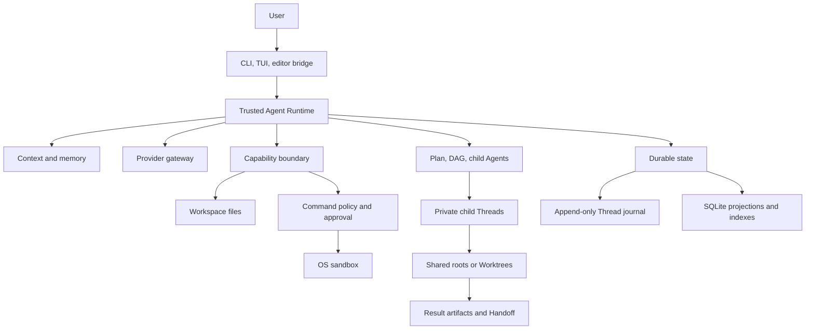

# EASY CODE Technical Design

English | [简体中文](./TECHNICAL_DESIGN_ZH.md) | [Back to README](../README.md)

This document describes EASY CODE's current architecture and stable engineering contracts. It intentionally avoids function-level implementation detail. Installation and command usage belong in the [README](../README.md).

The current cross-agent memory, five-round review and independent dual-summary
contracts are specified in [Unified memory and bounded review](./UNIFIED_MEMORY.md).

The current validation identity, test/configuration baseline, bound reviewer experiment,
investigation-stagnation windows and length-only compaction repair contracts are documented
in [Progress and context reliability](./PROGRESS_RELIABILITY.md). These Runtime mechanisms
are provider-neutral and do not change command authorization or Benchmark network policy.

EASY CODE's original source is [MIT licensed](../LICENSE). Third-party components retain their own licenses; see [Third-Party Notices](../THIRD_PARTY_NOTICES.md).

## 1. Goals and design principles

EASY CODE treats the language model as a planner and code producer, never as the security or persistence boundary. The local Runtime remains authoritative for permissions, state transitions, recovery, and completion.

The design follows six invariants:

1. **Authority and data are separate.** Files, model output, memory, images, command output, retrieved evidence, task text, and artifacts are untrusted data.
2. **Validation precedes effect.** Every structured request is checked against mode, role, workspace, policy, approval, and durable state before a local effect.
3. **Important transitions are durable before activation.** UI state or another Agent cannot make an unrecorded transition authoritative.
4. **Isolation layers have distinct jobs.** Private Threads isolate context, Git Worktrees isolate source state, and the OS sandbox isolates processes.
5. **Recovery never guesses.** Interrupted external work is not successful without durable evidence.
6. **Derived acceleration never outranks primary state.** Projections, checkpoints, indexes, embeddings, and vector caches remain rebuildable.

The practical goals are fail-closed security, conflict-safe mutation, reviewable evidence, restartable long work, bounded context, provider-independent local policy, and graceful degradation of optional retrieval or terminal features.

## 2. Architecture and technology stack



| Layer | Technology and responsibility |
| --- | --- |
| Runtime | TypeScript on Node.js 20+; orchestration, state, and local capability enforcement. |
| CLI/TUI | Commander, Chalk, and terminal APIs; interactive UI plus non-TTY fallback. |
| Contracts | TypeScript, JSON Schema, and Zod; model, configuration, persistence, and extension validation. |
| Providers | OpenAI-compatible adapters; normalized messages, actions, reasoning, images, retry, timeout, cancellation, and usage. |
| Storage | Append-only JSONL plus SQLite WASM; authoritative events and portable projections without a native compiler. |
| Retrieval | SQLite FTS5, local ONNX embeddings, Hugging Face tokenization, and a bounded Orama cache. |
| Execution | Structured process launch, Anthropic Sandbox Runtime, Git Worktrees, snapshots, and result artifacts. |
| Packaging | npm, a versioned Prompt Bundle, and a bundled VS Code extension. |

Model output cannot directly access files, processes, Git, the database, or credentials. It can only request a currently exposed capability, which the Runtime validates again at execution.

Configuration is layered from defaults, trusted user settings, safe project settings, environment variables, and CLI options. Project configuration cannot redirect credential storage, trusted provider endpoints, application data, or managed Worktrees. Project guidance such as `EASYCODE.md` is useful but lower-trust than the Runtime contract and current user request.

The versioned Prompt Bundle contains verified system guidance, control text, tool documentation, and the model catalog. Startup repairs missing or modified resources from the installed package and loads an immutable view. Executable schemas and permissions remain code-owned. Bundle activation is atomic, and Threads record a compatible bundle identity for Resume.

## 3. Request lifecycle and modes

A normal turn:

1. Loads trusted configuration, credentials, the Prompt Bundle, and lower-trust project guidance.
2. Acquires the Thread lease and durably appends the user message and image references.
3. Runs restricted Auto routing when selected.
4. Builds layered context from the Working Checkpoint, accepted summary, recent projection, older evidence, instructions, and memory.
5. Sends only the capabilities allowed for that exact model step.
6. Validates structured output before executing tools or changing control state.
7. Persists usage, results, task transitions, child state, and other evidence.
8. Stops only at an accepted final response, Plan review, real blocker, cancellation, or enforced limit.

| Agent mode | Contract |
| --- | --- |
| Plan | Read-only investigation and a persisted proposal; no project mutation, side-effect commands, DAG, or children. |
| Auto | A tool-less structured controller chooses direct response, Plan, or Code; routing is not keyword-based. |
| Code | Direct answers, implementation, and verification under normal capability and security gates. |

Agent mode, approval authority and execution environment are independent. Manual asks for every new command; Approve for me uses an independent tool-free approval agent with user fallback; Full access executes on the host without a sandbox. Scoped prefix grants survive Resume and extend only to children of the same thread. Plan discourages direct editing but permits approved command writes. Benchmark uses a fixed offline worker container. See [command permissions](COMMAND_SECURITY.md).

The composer remains active during work. Mid-turn adjustments are journaled in FIFO order and delivered at safe model-step boundaries. Steering can redirect work but cannot silently change mode, security posture, task owner, or child identity. Unstarted calls from a superseded provider response are discarded.

The Runtime, not the model, decides finalization. A running command, incomplete DAG, or running/unobserved child blocks ordinary completion. Context pressure goes through Runtime-owned maintenance; if required input still cannot fit, the turn returns a recoverable capacity limit rather than requiring the model to repair a compaction schema indefinitely.

## 4. Trust, security, and sandbox

Runtime policy and the base security contract outrank user requests; user requests outrank project guidance. Comments, dependencies, command output, memory, images, task text, and artifacts never grant permission.

Capabilities are rebuilt for every model step from Agent mode, role, Plan/DAG state, child state, context pressure, provider/model features, command posture, approvals, and sandbox readiness. An invented or currently hidden tool remains unavailable. Provider-facing schemas favor strict objects, enums, and flat action tags; separate synchronous/start/poll/cancel command contracts avoid depending on inconsistent `oneOf`, `anyOf`, or `allOf` support. The Runtime still enforces cross-field union semantics.

### Files and workspace accounting

Protected paths are workspace-relative and canonicalized; traversal, symlink, and junction escapes are rejected. New files use exclusive creation. Updating or deleting an existing file requires a prior complete read and expected SHA-256, a fresh pre-effect hash check, conflict detection, atomic replacement where applicable, and post-write verification.

Read-before-write hashing applies only to files actually updated or deleted. Creation checks absence, and merely mentioning a file in a plan does not create a read obligation.

File tools update the verified manifest only for the target actually changed. In a valid Git repository, command auditing derives tracked, staged, unstaged, newly committed, untracked, and meaningful ignored candidates, then hashes only those paths; large dependency, cache, environment, and build trees are pruned unless tracked. At a durable Checkpoint or final delivery, a complete relevant Git snapshot reconciles anything missed.

Non-Git workspaces retain complete filesystem snapshots. If Git becomes unavailable, damaged, or detached from the workspace, the Runtime safely falls back to that complete path instead of trusting a partial Git view.

### Commands and sandboxing

Commands are a resolved executable, argument vector, working directory, intent, and timeout; task text is not implicitly evaluated as a shell. Three gates apply: current capability, command policy/approval, then OS sandbox startup. Approval grants bind to canonical executable identity, structured prefix, scope and the Thread; children share the parent approval queue and existing grants.

Long-running commands return a Thread/Agent-scoped handle and require terminal polling or cancellation evidence before completion. Failures are classified as parameter, policy, approval, sandbox, exit, timeout, or Runtime lifecycle failures. One explicitly retryable, proven-not-started sandbox failure permits one model-authored resubmission of the exact command. A repeat blocks that command, not unrelated command capabilities; Runtime never automatically replays command effects.

Manual/agent-approved commands default to Anthropic Sandbox Runtime. Explicit host escalation is reviewed per command; Full access bypasses the command sandbox. File tools stay workspace scoped. Benchmark runs commands in a separate offline Docker worker. Unknown execution or cleanup never implies safe automatic retry.

| Platform | Protected boundary |
| --- | --- |
| Windows | Restricted identity, Windows Filtering Platform fence, ACL preflight/stamp/reset, and a machine-wide ACL lease. |
| Linux | Bubblewrap isolation with trusted system dependencies and controlled network mediation. |
| macOS | Strict commands currently fail closed pending kernel-backed descendant supervision; file tools remain available. |

Windows serializes the shared sandbox identity's ACL lifetime across processes. Effective-access preflight verifies the exact required ACL mutations. The repair workflow is dry-run first, changes only ownership left by the managed identity, preserves DACL/inheritance, and refuses broad, redirected, network, profile-root, or protected-system targets.

Shared Windows and Program Files executables rely on existing ordinary-user read/execute permissions and are not added as broad dynamic read grants. A private executable receives only the narrow grant it needs.

Readiness is established before work. Windows verifies sandbox identity and network fencing, then uses a bounded out-of-process probe to exercise real initialization, wrapping, execution, cleanup, and reset. The probe uses the canonical System32 command shell, no explicit read allowlist, and an isolated scratch ACL transition. On timeout, the parent terminates the process tree and waits for confirmed closure before the ACL lease can be released.

Private worker control records preserve dispatch, launcher exit and cleanup independently of display truncation. Windows Job Objects quiesce descendants before ACL reset; Linux uses PID namespaces. Durable unfinished leases/quarantine block further mutations across Resume. See [command permissions](COMMAND_SECURITY.md) for artifact authorization, limits, compatibility changes, and operator recovery.

Command requests use one Runtime metadata normalizer: missing verification categories do not block execution. Paths use canonical workspace boundaries and argv stays literal; shell syntax is not a security boundary. Every new command goes through the chosen authority; static risk labels no longer auto-allow it. Streaming framework evidence is recorded before display clipping as a separate `validation` verdict. A pipeline exit of zero is not a test pass; ambiguous results remain unknown, and ProgressGuard only clears stagnation with high-confidence pass evidence. See [command usability and validation](COMMAND_SECURITY.md#evidence-and-failures) for the detailed contract and read-only benchmark request replay.

Credentials live in the OS credential store or provider-specific environment variables, never workspace configuration. Standard GLM and GLM Coding Plan have separate key identities with no cross-channel fallback. Persisted/model-facing text is secret- and terminal-control-filtered.

## 5. Durable state, Checkpoints, and Resume

Each Thread has an append-only JSONL journal with schema version, unique event ID, strict sequence, timestamp, and turn/step identity. Appends are flushed before activation. Loading validates identity, order, duplicates, and stable file identity; committed-history corruption fails closed, while an incomplete final record can be treated as never committed.

SQLite WASM stores session/usage projections, Working Checkpoints, retrieval artifacts, and long-term memory. Thread execution state is journal-authoritative; long-term memory records, provenance, and revision rows are primary SQLite data, not merely a disposable vector cache. A failed Thread projection cannot undo a durable journal append; replay repairs stale projections. Thread leases bind process, host, and random token, and ambiguous liveness is never permission to steal ownership.

Thread Checkpoints are bounded deltas against an exact journal sequence. They may append settings, messages, file observations, changes, commands, and a forward-only compaction update. Turn, Plan, DAG, approval, steering, and child transitions remain event-authoritative and cannot be forged or erased by a Checkpoint. Divergent or oversized deltas are rejected; legacy full-state Checkpoints remain readable.

The Working Checkpoint used in model context is different: it is a rebuildable SQLite projection, not the journal checkpoint or source of authority.

Resume replays events in order, applies compatible Checkpoints, validates workspace and Prompt Bundle identities, and repairs projections. It preserves later approvals, FIFO steering and watermarks, compaction, Plan/DAG state, child environments, result references, images, and provider usage. File-read authority is restored only while the file still matches its hash.

Interrupted provider calls and commands are not replayed. A Plan interrupted before durable execution ownership returns to review. Uncertain child claims are reconciled from durable outcomes or released to pending work. Child histories remain private; the parent receives only bounded assignment and result records.

## 6. Unified memory management and context recovery

This section describes the current provider-independent implementation, including short-term context, thinking, summaries, long-term memory, historical retrieval, and capacity degradation. Historical Summary V2 readers and MicroCompaction helpers are not the current per-request policy. Detailed recovery invariants are in [Runtime-owned context maintenance](semantic-compaction-v3.md) and [Context reliability](CONTEXT_RELIABILITY.md).

### 6.1 Layers, ownership, and scope

These are logical roles, not six independent databases:

| Layer | Contents and authority | Scope / model visibility |
| --- | --- | --- |
| Active conversation | Durable `messages`, projected after `compactedMessageCount`; current user text, assistant text/thinking, tool calls and results. | Private Thread; the active projection is sent, not the entire stored history. |
| Working summary | `workingSummary`: accepted semantic handoff or a deterministic incomplete/unverified recovery notice. | Private Thread; historical interpretation, not proof or permission. |
| Runtime continuity | User instructions, constraints, intent ledger, Plan/DAG, changes, pending work, failures, reviewer/experiment state. | Rebuilt from authoritative state and pinned independently of summary quality. |
| Historical evidence / RAG | Sanitized message artifacts, tool evidence, accepted summary snapshots, lexical indexes and optional vectors. | Exact workspace + Thread; retrieve a bounded subset on demand. |
| Long-term memory | Atomic preferences, conventions, architecture, decisions, and environment facts, with provenance and revisions in SQLite. | Shared across Threads in the same logical workspace; not an archive of every conversation. |
| Journal / recovery storage | Append-only Thread events, compatible recovery Checkpoints, private evidence and attachments. | Local persistence and replay; storage does not imply automatic prompt injection. |

Workspace identity is derived from the normalized resolved workspace root, case-normalized on Windows. Parent and child Threads have separate conversations and historical retrieval; children receive bounded assignments and return bounded reports, not their full thinking. They may receive selected memories for the logical workspace, but do not have the main Agent's long-term memory mutation capability.

### 6.2 One ordinary request: short-term context and thinking

The normal message order is:

```text
Stable system instructions                         (tool schemas supplied separately)
→ workingSummary, when present
→ active messages after compactedMessageCount      (including unchanged recent thinking)
→ RUNTIME_CONTINUITY_STATE                         (required control facts)
→ RUNTIME_CONTEXT_DATA                             (workspace supplement + selected memory/evidence)
```

Dynamic retrieval stays out of the stable system prefix to improve prefix reuse; this is not a guarantee of provider cache hits. The builder does not silently mutate durable messages or truncate thinking to make a request fit. The current general message/thinking projection is non-destructive; large tool bodies have a separate bounded projection described below.

Thinking is stored as `reasoning_content`. It is not rewritten piece by piece or removed immediately after the next model response. Older complete exchanges can leave active context as a whole. Emergency minimal rebase can also retire the newest **closed** exchange, including its thinking, as a whole. Ordinary RAG excludes thinking; exact historical message recall can recover the serialized message when necessary. UI folding or expanding thinking has no effect on this policy.

`RUNTIME_CONTINUITY_STATE` preserves full retired ordinary user instructions after secret redaction, not only intent-ledger excerpts. It also carries goals/constraints, Plan/DAG ownership and requirements, latest file changes, pending steering, command and child handles, unresolved command outcomes, stagnation incidents, review budgets, and unverified review/experiment state. A successful unrelated command cannot erase an earlier failure. A summary cannot complete a task, resolve a failure, or reset an execution/reviewer budget.

The Working Checkpoint in the workspace supplement is a deterministic, bounded recovery map of recent files/changes/commands and task state. It costs no summary-model call and avoids duplicating already injected continuity data. It is neither the Thread recovery Checkpoint nor a substitute for authoritative Runtime facts.

### 6.3 Long-term memory lifecycle

`manage_memory` exposes `search`, `recall`, `remember`, `revise`, and `forget`, subject to the current capability profile. Historical recall and long-term storage are different actions; summarization and RAG hits never automatically become durable project facts.

1. Propose one atomic fact, up to the configured 1,200-character limit (still a single atomic fact, also capped at 400 estimated tokens), in one of the five categories. Runtime rejects secrets, tentative statements and obvious task diaries; these checks are not a general truth classifier.
2. For `remember`/`revise`, the application Runtime requires `sourceRefs`. `user` must point to an explicit durable user preference/convention or decision; project/environment facts currently require successful, non-truncated, versioned `read_file` evidence in the same workspace and Thread. Evidence identity checks provenance, not whether arbitrary prose logically follows from it.
3. Validate and stage the mutation. A staged success response is not a database commit. `revise`/`forget` must identify a memory returned by a search in the same turn; `forget` does not require new factual source evidence.
4. Commit the validated batch only after an allowed `turn.completed` outcome: `success`, or `planned` with an explicit durable user cue and only preference/convention writes. Failed, interrupted, and limit-reached turns do not commit proposals. There are at most eight mutations per turn.
5. SQLite commits memory data and revision history transactionally; vector work is derived and may fail without undoing a valid memory commit. An exact normalized duplicate `remember` in the same category is a no-op, not a timestamp/confidence refresh.
6. Automatic retrieval rechecks provenance file paths and hashes. Changed, missing, or unsafe sources, and unsupported legacy project facts, become `needs_verification` and are withheld from automatic injection. Explicit audit/search can still inspect records that are not automatically usable.

Memory state and revisions survive new Threads in the same workspace. Long-term memory still represents supported claims, not permission to skip current file reads, version checks, or task verification.

### 6.4 Historical RAG and one shared recall budget

Thread indexing incrementally reads newly persisted user text, assistant public text/tool names, useful tool results, and accepted semantic summary snapshots. It excludes system instructions and thinking. An emergency fallback notice without semantic snapshot metadata is not automatically a semantic-summary index entry; its prior text remains accessible through Journal references.

Captured sources are processed in configurable 96,000-character batches; indexing no longer discards the middle before chunking. Capture truncation remains explicit and cannot be undone by indexing. Budget-key changes rebuild derived chunks. Chunks retain source offsets, hashes, and available file path/version/line metadata. The pinned local `paraphrase-multilingual-MiniLM-L12-v2` embedding model uses 384-dimensional vectors and tokenizer windows of at most 128 tokens including special tokens. Without that tokenizer, chunking falls back to 1,400-character windows with 160-character overlap. Long embedding inputs aggregate windows instead of silently dropping the tail. Embedding token units are distinct from chat-context estimates.

SQLite supplies lexical search, including CJK-friendly fallback; optional local vectors and a disposable Orama cache supply semantic candidates. Thread lexical/vector ranks are fused and deduplicated. Background vector backfill keeps lexical retrieval available; vector failure degrades to lexical search. Query embedding still has local compute cost. Retrieval uses local data and local inference, not external web search or the chat-model API; preparing missing model assets may separately require downloads.

Before each ordinary request, the memory controller:

1. Builds at most three bounded queries from the current task/user request, command outcomes and relevant paths; cached candidates are refreshed when the query/state signature changes.
2. Searches workspace memories and private Thread history. Normal automatic history recall is restricted to before `compactedMessageCount`; an explicit historical search can inspect existing messages in the current Thread beyond that automatic boundary.
3. Filters inactive/transient memories, irrelevant hits, exact duplicates, already visible/covered evidence, and known obsolete file versions. Similarity alone does not make a hit relevant or current.
4. Selects both sources under **one shared** allowance: normally 2,000 estimated tokens, expanded up to 12,000 after a compaction-boundary/DAG-node change or when the latest command is not an observed zero-exit result, with at most six items total. The latter condition also includes a running command. Token mode additionally caps this allowance at 8% of the model window; only legacy character mode uses `floor(maxContextChars / 24)`.
5. Removes optional recall under request pressure before retiring active history. Retrieval is supplementary; the Runtime does not sacrifice required task state merely to fit more RAG hits.

### 6.5 Tool output, evidence capture, and exact recall

Runtime stores sanitized structured tool data in immutable, workspace/Thread-scoped evidence before model-facing projection. It preserves the complete **captured** result, not unlimited process output. Commands additionally spool sanitized stdout/stderr before in-memory head/tail loss: `commandArchiveMaxBytes=33554432` (32 MiB per command, both streams combined) and `commandThreadArchiveMaxBytes=268435456` (256 MiB per Thread). UTF-16LE storage permits bounded character-page reads. Quota exhaustion or archive I/O failure marks missing suffixes and incomplete capture; it neither retries nor fails an otherwise completed command. Archives are not automatically pruned. The command collector retains up to `maxOutputChars=256000` characters per stream.

| Model-facing content | Configurable default |
| --- | --- |
| Command inspection / success / failure | `commandQueryChars=24000` / `commandSuccessChars=2000` / `commandFailureChars=16000`; `commandMaxDiagnostics=16` |
| File location / explicit read | `defaultReadLines=100` / `maxReadLines=1000`; `maxReadResultTokens=24000` |
| File search | `searchMaxResultTokens=6000` |
| Generic tool envelope / aggregate tool bodies | `maxToolResultChars=64000` / `contextToolBatchTokens=65536` |
| Evidence page | `evidenceRecallDefaultChars=8000`, `evidenceRecallMaxChars=32000` |

Projection retains useful diagnostics, whole search records and whole file lines before falling back to an evidence ID. It measures the serialized JSON envelope, including escaping; executable arguments and verification evidence are never silently truncated into validity. Repeated polls still return deltas or changed terminal state.

`recall_context` and permitted memory recall can recover exact scoped IDs: `evidence_…` (captured structured tool data), `context_…` (historical indexed chunk), `command_output_…` (captured process text), `ev_…` (Runtime catalogue), `journal_message_<index>` (stored message), and `journal_summary_<sha256>` (archived summary). `artifact:<hash-prefix>` requires an unambiguous match. `review:<id>:author|reviewer|briefing|evidence` addresses explicitly shared review materials. Historical reads do not authorize arbitrary peer-thread access or prove the current checkout passes.

### 6.6 Capacity accounting and configuration

All operational capacity/content budgets above and below load from `src/config/runtime-defaults.json`, validated by `src/config/runtime-limits.ts`; `docs/config.example.toml` documents `[limits]` overrides. Invalid relationships (target/trigger ordering, page maxima, disk quotas, review handoff room) fail configuration validation. Protocol identities, schema types, permissions and finite safety bounds remain strict.

The default `maxContextTokens=1000000` is the configured **model window**, not usable input or an exact tokenizer count. Known model metadata caps it at the documented window; a smaller user override is respected. Provider-neutral estimates include system text, normal tool schemas, thinking, tool arguments/results and images. Main Runtime calibration uses observed provider prompt usage; cached per-message estimates avoid repeatedly scanning unchanged large strings and invalidate when content, thinking, nested arguments or images change.

For a window W:

```text
inputCapacity = W
 - min(maxResponseTokens, floor(W × contextOutputReserveRatio))
 - min(contextToolReserveTokens, floor(W × contextToolReserveRatio))
 - max(contextSafetyReserveTokens, ceil(W × contextSafetyReserveRatio))

Defaults at W=1,000,000:
1,000,000 - 32,768 - 65,536 - 50,000 = 851,696 usable input tokens
```

Reserves are local accounting, **not** a server `max_tokens` parameter. Pressure is measured against usable input, not the raw 1M window. `maxContextTokens=0` explicitly selects the legacy character mode (`maxContextChars=maxActiveContextChars=250000`); character caps do not impose a second 250k ceiling in token mode, including tool-result room.

| Stage / content | Configurable default |
| --- | --- |
| Pressure / reference trigger and target | `contextReferenceTriggerRatio=0.8`, `contextReferenceTargetRatio=0.6` |
| Summary trigger and target | `contextCompactionTriggerRatio=0.9`, `contextCompactionTargetRatio=0.6` |
| Force / optional-memory resumption | `contextForceRatio=0.95`, `contextMemoryResumeRatio=0.6` |
| Recent exchanges / recalled-evidence protection | `compactionRetainRecentExchanges=5`, `contextRecallProtectionExchanges=2` |
| Summary growth cooldown | `contextCompactionMinGrowthRatio=0.1`, capped by `contextCompactionMaxGrowthTokens=32768` |
| Voluntary minimum new/saved content / savings | `contextCompactionMinNewTokens=8192`, `contextCompactionMinSavedTokens=8192`, `contextCompactionMinSavingsRatio=0.1` |
| Compaction summary / character guard / semantic field | `contextSummaryMaxTokens=8192`, `contextSummaryMaxChars=64000`, `contextSemanticFieldMaxChars=4000` |
| Review opening / each final summary / merged handoff | `reviewBriefingMaxTokens=6144`, `reviewSummaryMaxTokens=4096`, `reviewHandoffMaxTokens=12288` |
| Closing input reservation (each participant) | `reviewClosingInputReserveTokens=100000`, plus output reserve; actual requests are fully charged, not capped by this hold |
| Child instructions / follow-up / result summary | `subagentInstructionsMaxChars=12000`, `subagentFollowUpMaxChars=8000`, `subagentSummaryMaxChars=12000` |
| Automatic / expanded shared recall | `memoryAutoTokens=2000`, `memoryRecallTokens=12000`; six items, three queries |
| Durable atomic fact | `memoryContentMaxChars=1200` and `maxDurableMemoryTokens=400` |
| Source indexing batch / fallback chunk / overlap | `artifactIndexBatchChars=96000`, `artifactChunkChars=1400`, `artifactChunkOverlapChars=160` |

Only selected content budgets increase; short success results, automatic memory injection, read-line ceilings, review rounds (five), concurrency (none/low two, medium four, high eight), approvals, network isolation and retry counts do not increase. Child and review histories remain private; only the main agent can manage project long-term memory. Review handoffs preserve Runtime decision flags and exact proposals before prose, and retain pageable full evidence when qualifications do not fit. Neither clipped prose nor consensus grants delivery approval.

### 6.7 Graded recovery: preserve work, reduce active history

1. At 80% remove optional memory/RAG and reference old large tool results toward 60%. Protect the recent five effective exchanges and recently recalled evidence; neutral polls do not consume the protected exchange count. Commit references as a derived projection, never overwrite canonical evidence. Reassess the actual next request afterward: a stale pre-reclamation reading cannot buy an unnecessary summary.
2. At 90%, when still necessary and budgets/cooldown permit, summarize only the smallest sufficient **old contiguous prefix**, retaining recent complete exchanges. Successful tests or model-declared semantic phases are not prerequisites. Preserve unfinished investigation and unverified hypotheses. At 95%, force bypasses growth cooldown, not evidence integrity, complete call/result boundaries or shared request budgets.
3. Use optional `<analysis>` scratch followed by a unique complete outer `<summary>`. Discard scratch after successful extraction and never use native thinking as the summary. Valid legacy structured `compact_context` submissions remain supported. Content/format errors use `modelContentRetries=2` (three total attempts); overlength text is clipped locally to the configured field/summary budget without retry. Executable tool arguments, required types and evidence identities remain strict.
4. Accept only unchanged source/fact snapshots, a forward complete-exchange boundary, real size reduction and a fitting **next ordinary request**. The 60% target is preferred headroom rather than a reason to reject a useful safe summary. At force pressure, cooldown cannot block recovery.
5. Missing/malformed summaries or insufficient room proceed to deterministic whole-exchange/history-summary retirement and the existing bounded minimal rebase. After format corrections, the last nonempty non-thinking body may be retained as explicitly unverified material. Native thinking is never rewritten fragment by fragment.
6. At 100% of usable input no ordinary request is sent until capacity recovers. Final requirements-only reconstruction retains user instructions while preserving files, Journal, command/child/DAG state, permissions and spent budgets outside the model history. A classified remote capacity rejection uses the same bounded reset, not another summarizer or blind command replay.
7. If even mandatory rules, schemas and user requirements cannot fit after graded recovery, return recoverable `context_capacity_exhausted`; never falsely complete work. API retries remain five, model-content corrections two, capacity resend one, command replay zero; child failure only notifies its parent. Cancellation, credentials, persistence corruption and real cleanup failure remain separate errors.

Stable system instructions and ordinary history precede the newest Runtime data. Pressure transitions, projection boundaries and accepted summaries legitimately change the prefix, so larger windows may reduce cache-invalidating compactions but do **not** guarantee higher cache hit rates, quality or lower cost. Controlled long-task comparisons must measure those outcomes.

### 6.8 Replay, user commands, and verification limits

`context.compaction.*` and `context.compacted` record summary attempts/commits. `context.history.evicted` records tool references, whole-history eviction or minimal rebase with source/fact identities and exact recovery references. `context.maintenance.checked` records evaluated history, request identity, size and any capacity pause. Event replay restores boundaries and spent summary/rebase budgets; a stale Checkpoint cannot advance the boundary or reset them. Pending command/child IDs and reviewer experiments remain actionable after recovery.

`/memory short [limit]` inspects short-term state; `/memory long [id]` inspects workspace memory, including audit state. Both are read-only. `/clear` clears the terminal display, not model context or persistent memory. `/new` creates a fresh Thread while retaining workspace long-term memory; `/resume` restores an existing Thread rather than starting empty. Clearing a separate benchmark job directory should not be assumed to erase independent EASY CODE data roots or recovery storage.

Local tests cover request capacity, malformed summaries, exchange boundaries, lossless storage of retired messages, bounded lossy rebase, pending work, memory selection and replay. They do not establish a benchmark accuracy or token-saving improvement. Preserved thinking, local embedding, exact recall and larger pinned facts all have costs; lossy retirement can require re-reading. Evaluate total/cached input tokens, tokens per successful task, repeated validations, latency, capacity-pause rate and Resume behavior on controlled long-task runs.

Implementation entry points:

| Responsibility | Source |
| --- | --- |
| Request projection and required state | [manager.ts](../src/context/manager.ts), [context-request.ts](../src/context/context-request.ts), [runtime-state.ts](../src/context/runtime-state.ts) |
| Selection, historical indexing, exact capture | [memory-controller.ts](../src/context/memory-controller.ts), [artifact-index.ts](../src/context/artifact-index.ts), [evidence-store.ts](../src/context/evidence-store.ts) |
| Durable facts and tool interface | [memory-manager.ts](../src/memory/memory-manager.ts), [manage-memory.ts](../src/tools/manage-memory.ts) |
| Capacity and calibration | [capacity.ts](../src/context/capacity.ts), [token-budget.ts](../src/context/token-budget.ts), [token-calibration.ts](../src/context/token-calibration.ts) |
| Summary and local degradation | [compaction-transaction.ts](../src/context/compaction-transaction.ts), [pressure-projection.ts](../src/context/pressure-projection.ts), [pressure-recovery.ts](../src/context/pressure-recovery.ts), [exchange-boundary.ts](../src/context/exchange-boundary.ts) |
| Integration and replay | [agent.ts](../src/runtime/agent.ts), [thread-store.ts](../src/threads/thread-store.ts) |

### 6.9 Evidence-driven progress control

The Runtime derives bounded progress evidence from authoritative tool results before model-facing output is shortened. Versioned reads provide only a weak repetition hint; only repeated, high-confidence verification failures across distinct cycles can open a stagnation incident. The flat command protocol preserves legacy test/build intent and adds an explicit verification intent classified as unit, integration, build, type, lint, format, smoke, benchmark, or custom validation. The category participates in the durable failure identity, so unrelated checks cannot be merged into one incident. Infrastructure, policy, network, cancellation, and sandbox failures remain separate and never become evidence that the code strategy is wrong.

An incident may spend at most one isolated review attempt. The reviewer receives an immutable, redacted packet and exposes only one strict report capability—no workspace mutation, shell, DAG ownership, memory, or child-agent control. A valid report must propose one command-verifiable falsification experiment; the parent must obtain a real terminal result before ordinary mutation resumes. Running the experiment removes the execution gate, but only a matching verified improvement resolves the incident. Observations, request starts/outcomes, usage, review state, and experiment evidence are journal-authoritative and survive Resume; stale or incomplete workspace snapshots fail closed.

## 7. Plan, DAG, child Agents, Worktrees, and Handoff

Plan review is a durable direction gate: proposal, approval, rejection, revision, and return-to-review are explicit transitions. Approval enters Code; it does not itself mutate the project.

A task DAG is optional for genuinely complex, dependent, or parallel work. Each node declares purpose, dependencies, inputs, expected artifacts, completion checks, failure handling, owner, and status. The Runtime enforces unique IDs, acyclicity, dependency readiness, one owner, at most one active main-Agent task, and exactly one evidence item per completion check. An active graph blocks ordinary final delivery.

Only the main Agent controls children. A child is a private Code-mode Thread bound to one DAG or standalone assignment. It inherits provider/model/effort, sees bounded task context rather than the parent history, cannot create children, manage the parent DAG, maintain long-term memory, or expand command authority, and returns one evidence-backed completed/blocked report. Follow-ups arrive at model boundaries and remain data, not permission.

Child concurrency is two at none/low effort, four at medium, and eight at high. All running or unobserved children must be collected before Plan mode, graph replacement, or finalization.

| Execution root | Behavior |
| --- | --- |
| Shared | Works in the parent checkout with serialized, hash-checked mutation. |
| Managed Worktree | Uses a separate validated Git checkout, snapshot chain, and result commit. |

Automatic isolation uses a Worktree for a valid Git repository and preserves shared execution as the non-Git fallback. An explicit Worktree request fails closed. Baselines may be fresh, local `HEAD`, or a point-in-time snapshot of current changes; later parent edits are not live-synchronized.

Dependency artifacts carry bounded lineage. Compatible predecessor commits may be integrated into a new Worktree; conflicting lineage, mixed shared/isolated results, missing commits, or different baselines are surfaced.

Completion creates an immutable private result artifact with task/environment identity, base and result snapshots, changed-file manifest, lineage, and delivery state. The DAG receives only a bounded reference.

Handoff is explicit: local delivery checks and applies the accumulated patch to the current checkout; branch delivery creates or validates a local branch at the result commit. Neither pushes remotely. Conflicts preserve the artifact and Worktree, and repeating an already applied Handoff is safe.

Worktrees isolate source state, not process authority; sandbox and permission rules still apply.

## 8. TUI and multimodal interaction

The interactive UI projects structured state into a stable header, retained transcript, redrawable live region, persistent composer/footer, and modal selectors. Durable content is committed once; temporary provider, command, task, and child activity may be redrawn without duplicating scrollback.

One component owns stdin. A modal borrows it through a lease and restores the exact draft, attachments, cursor, paste state, and terminal modes. Non-TTY environments use append-only text and no cursor addressing.

Thinking keeps a preview and full body. An authenticated editor action or slash command opens a scrollable, reflowing disclosure view anchored to the logical event. Expansion is UI-only and never changes journal, context, or memory. Reasoning, tools, steering, children, and answers render in event order.

Bracketed multiline paste remains one submission object, and clipboard reads are serialized so slow capture cannot reorder input. Images are decoded, size/type/dimension checked, stored privately per Thread, and journaled as metadata plus SHA-256 rather than Base64. Ownership, path, lease, and integrity checks run on load.

Image bytes enter a provider request only when the catalog declares vision support. Switching to a text-only model can omit historical images without rewriting durable history. Images remain untrusted data.

## 9. Provider and model catalog

The gateway normalizes messages, actions, reasoning, images, cancellation, retries, timeouts, and usage. A verified catalog is the sole authority for provider/vendor identity, trusted service root, credential slot and environment names, default model, model capabilities, and benchmark profiles.

| Channel | Default service root | Default and current catalog |
| --- | --- | --- |
| DeepSeek | `https://api.deepseek.com` | Default `deepseek-v4-pro`; Flash/Pro support effort without vision, Vision Experimental supports images without thinking control. |
| Qwen | `https://dashscope.aliyuncs.com/compatible-mode/v1` | Default `qwen3.7-max`; `qwen3.7-max`, `qwen3.7-plus`, `qwen3.6-plus`, `qwen3.5-plus`, and `qwen3.5-flash`, with per-model vision/thinking flags. |
| Standard GLM | `https://open.bigmodel.cn/api/paas/v4` | Default `glm-5.3`; 5.3 Flash, 5.3, and 5.2, with channel-specific vision and forced/optional effort. |
| GLM Coding Plan | `https://open.bigmodel.cn/api/coding/paas/v4` | Default `glm-5.3`; text-only 5.3 Flash, 5.3, and 5.2 through a separate entitlement. |

Standard GLM and Coding Plan remain distinct even when model IDs overlap: endpoint, key, configuration, usage, and Thread identity never fall back across channels.

The 2026-09-09 catalog review removes four sub-1M Qwen options: `qwen3.6-max` (official ID `qwen3.6-max-preview`) and `qwen3-max` are documented as 256K in the [official text-model overview](https://help.aliyun.com/zh/model-studio/text-generation-model); [Qwen3-VL-Plus](https://help.aliyun.com/zh/model-studio/qwen3-vl-plus) and [Qwen3-VL-Flash](https://help.aliyun.com/zh/model-studio/qwen3-vl-flash) each have 262,144-token context. The remaining catalog has 14 channel/model entries and 11 unique model IDs. This selection change does not increase Runtime context budgets or migrate saved configuration/Thread model choices; users with a removed model selected should use `/model` to select a retained option.

Unknown models are not assumed to support vision or controllable thinking. Adapters map none/low/medium/high only to controls declared for the exact model; some use Token budgets, some effort labels, and forced-thinking models cannot express explicit “off.” Selected effort remains durable even when a model cannot apply it.

The catalog pins SWE-bench to GLM Coding Plan, `glm-5.3-flash`, Code mode, and high effort. Usage is recorded by provider, model, actor, purpose, attempt, and retry; absent provider fields remain unreported rather than estimated.

## 10. SWE-bench evaluation

The reproducible development target is **SWE-bench Verified Mini (HAL, 50)**: 25 Django and 25 Sphinx tasks. It is a community mini set, not an official leaderboard subset, and must not be compared directly with the full 500-task Verified score.

One manifest pins the ordered instance IDs, community and official dataset revisions, digests, evaluator, Harbor, task repository, and EASY CODE profile. Every ID is verified against the official dataset; exact filters and range checks prevent accidental unfiltered or partial runs.

The supported harness uses Windows, Docker Desktop Linux containers, and Harbor's repository-specific grading boundary. The current EASY CODE build is packed as an exact npm archive for each Trial. The Agent runs in the task checkout with fixed offline-container full access, fixed Coding Plan endpoint/model/effort, and no standard-GLM fallback.

The dedicated key is staged through ACL-protected one-shot files and removed before the tool loop; Harbor receives a path rather than the value. Pinned multilingual ONNX assets are host-verified, copied to a disposable Trial cache, and reverified, so semantic retrieval is part of the measured profile without Trial downloads.

The protocol has one solving attempt. One retry is allowed only for environment-start or Agent-setup timeout before Agent execution and before any model request. Agent timeout or non-zero exit receives no new time, step, or model budget.

After execution begins, cleanup can capture an atomic generation containing EASY CODE data, Git patch, and regular untracked files. Explicit Resume accepts only the same issue, Trial, base commit, package hash, embedding manifest, endpoint, model, mode, and effort. Damage, ambiguity, links, special files, or any binding mismatch fails closed; generations never cross tasks.

Results retain patch/grader outcome, resolved rate, wall time, provider usage, recovery generation, Thread events, context artifacts/vectors, Working Checkpoint and compaction counters, retrieval backend, and warnings. Reported runs keep all pinned hashes/versions and per-instance diagnostics.

## 11. Data lifecycle, failure modes, and trade-offs

| Data | Lifecycle |
| --- | --- |
| Prompt Bundle | Verified per-user installation; repaired and version-bound to Threads. |
| Journals, SQLite, attachments, child artifacts | Durable application data; removable by the data uninstaller. |
| User config and OS credentials | Preserved unless explicitly removed. |
| Embedding assets and vector projections | Cached/rebuildable; lexical data remains authoritative. |
| Workspace config/guidance | User-owned and never removed by uninstall. |
| Worktrees, Handoff branches, benchmark evidence | Preserved while code or reproducibility evidence may be undelivered. |

Cleanup validates owned real directories, refuses redirected roots, never recursively follows links, and stops on active locks or ambiguous custom roots. The uninstaller removes Prompt Bundle and discoverable Thread/memory data but preserves credentials, user config, caches, workspaces, benchmark evidence, and potentially unmerged Git results.

| Failure | Behavior |
| --- | --- |
| Journal corruption | Refuse uncertain history; only an incomplete final record is repairable as uncommitted. |
| Thread projection/index/vector failure | Rebuild eligible projections from primary data or degrade semantic retrieval to FTS5; do not treat primary memory/evidence data as disposable. |
| Invalid/low-benefit compaction | Reject the semantic candidate, then try Journal-backed local retirement/rebase; preserve required Runtime facts. |
| Required context still too large | Return recoverable `limit_reached` / `context_capacity_exhausted`, retaining pending work and spent budgets. |
| Concurrent file edit or Git failure | Preserve user bytes; report conflict or use full-filesystem fallback. |
| Sandbox setup/start failure | Do not start the target and never use host fallback. |
| Running command at finalization | Require terminal poll/cancel evidence. |
| Provider/structured-output failure | Apply bounded classified retry without duplicating accepted effects. |
| Interrupted child or Handoff conflict | Reconcile durable evidence or retain the artifact for explicit resolution. |
| Image mismatch | Refuse the bytes for that request without rewriting history. |
| Benchmark binding mismatch | Refuse recovery across tasks or Trials. |

Key trade-offs are explicit: local-first is not offline; configured capacity uses conservative estimates rather than an exact native tokenizer; recent thinking continuity consumes space, while whole-exchange retirement and minimal rebase can lose active detail; stored tool evidence is bounded and recovery references may require explicit recall; semantic retrieval costs local compute but has lexical fallback; incremental Git auditing needs full Checkpoint/final reconciliation; shared children trade isolation for non-Git compatibility; Worktrees are not security sandboxes; non-streaming provider steps simplify durability but favor elapsed activity over token streaming; and cross-platform sandbox implementations differ beneath one fail-closed contract.

New providers, retrieval backends, child roles, or execution environments are acceptable only when they preserve the same authority, durability, isolation, integrity, and recovery invariants.


### Unified retry policy

The [limits] configuration is the only retry-count source for the main agent, children, approval, reviewer, Auto routing and compaction:

| Class | Setting | Default retries (excluding initial attempt) |
| --- | --- | --- |
| Transient API/network/429/5xx | `maxProviderRetries` | 5 (6 attempts) |
| Model content/schema/arguments | `modelContentRetries` | 2 (3 attempts), then capability-specific fallback |
| Server context-length rejection | `contextMaxCapacityRetries` | 1 after history reset retaining user requirements |
| Proven-not-started transient sandbox failure | `sandboxInitializationRetries` | 1 model-authored resubmission, no automatic execution |
| Command nonzero/timeout/cancel/unknown execution | `commandExecutionRetries` | 0 |
| Child failure | `subagentFailureRetries` | 0, notify parent only |
| Unsatisfied finalization prerequisites | `prematureFinishRetries` | 0, fail with the reason |

The three no-replay settings only accept 0. Permanent authentication/configuration errors and user cancellation do not retry. Every physical API attempt debits the shared budget; adapter-internal retries are disabled to prevent multiplication. Legacy provider maxRetries no longer controls agent retries. Existing request/time budgets may stop before the configured maximum.

Content correction never executes partial commands or replays executed tools. Summary storage overflow clips locally; exhausted formatting correction uses raw body or deterministic recovery. Approval exhaustion escalates to the user; reviewer exhaustion closes discussion with independent unverified summaries. Repeated invalid ordinary tool arguments fail explicitly, never fabricate completion. Existing local eviction/rebase counts and Benchmark infrastructure retry policy are unchanged.

### Durable summaries and final capacity circuit breaker

- Summary prompts use optional `<analysis>` plus one outer `<summary>`. Compaction still accepts valid legacy structured `compact_context` candidates, but new handoff requests ask for XML and authorize no tool execution, even when normal tool schemas remain visible. Native reasoning never becomes a summary. Successful extraction removes scratch before candidate persistence. After two content corrections, keep the last nonempty body as unverified handoff; configured summary-token and field clipping never retries or weakens executable schemas.
- Candidate attempt, last nonempty body, extraction error and raw/formal completion are journal-backed for compaction and independent review summaries. An empty later answer cannot erase earlier usable prose. Exhausted transient API recovery may salvage that prose; cancellation, authentication, budget and persistence errors are not content corrections. Resume may process saved candidates but never redispatch an unanswered attempt.
- If existing reference/summary/eviction/rebase recovery cannot fit, use one requirements-only reset. A remote capacity rejection goes directly to this reset; no summarizer is called. Local and remote paths share a stable, requirement-bound incident allowance across Resume. Identical or non-smaller rejected requests are not resent.
- Requirement indices come from user, steering and explicitly bound assignment events, not arbitrary `role=user` text or RAG. Original requests, subsequent corrections and attachments remain verbatim. System/tool rules remain. Oversized mandatory input pauses without deleting intent or claiming completion.
- Only model-history projection is cleared. Journal, files, execution leases, permission grants, shared budgets, DAG/child state, verification failures and delivery obligations remain authoritative. Automatic historical context injection is suppressed during reconciliation. Runtime permits source inspection and queries for original command/child/DAG identities, but gates edits, new execution and completion until current state has been observed. Explicit bounded recall remains available.
- Benchmark bridge result v2 separates execution outcome from cleanup and worker restoration. Output above 32 MiB is an execution failure, never a pass—even if the outer exit code is zero. Later commands are allowed only after descendant cleanup and offline worker restoration are confirmed. Failure or uncertainty quarantines the environment. This does not change Benchmark setup retries or the no-network container boundary.

### Cache-stable request envelopes

- Normal main/child requests keep fixed policy in the system message, then unchanged active history, then current Runtime state and retrieval data. Background-command and progress/experiment reminders appear in a transient `RUNTIME_NEXT_ACTION` tail, not in the system prompt or durable conversation. Static completion obligations remain in the shared system contract; Runtime still rejects premature completion.
- Automatic compaction retains that role's exact normal system prompt and ordered tool definitions. It appends a `RUNTIME_CONTEXT_HANDOFF` request with the retirement range, evidence and any format feedback after the normal history/state. Reviewer private-history compaction uses the same mechanism without sharing main-agent private history.
- Handoff is a separate execution phase, not an ordinary agent step. Visible schemas do not authorize execution: returned workspace calls are never dispatched, a summary does not complete a task, and raw recovery text is unverified. File/output/memory text cannot select a Runtime phase merely by imitating a label. Briefing and closing summaries keep their separate tool-free paths.
- Capacity estimation, provider-context telemetry and the actual summary API call all use the same retained schemas. If the full handoff request cannot fit, use the existing deterministic recovery rather than silently removing tools or evidence to manufacture a fit. Retry counts, thinking handling and final capacity-reset allowances are unchanged; summary/content budgets follow §6.6.
- These changes improve prefix reuse opportunities, not guaranteed provider cache hits. Compaction commits necessarily replace old history; model settings, role changes and per-turn time changes can still affect reuse. This change does not alter timestamps or cache telemetry persistence.
