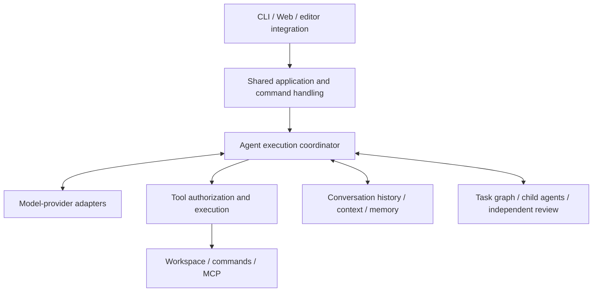

# EASY CODE — Technical Design

English | [简体中文](./TECHNICAL_DESIGN_ZH.md) · [Usage guide](../README.md)

This document describes the current architecture, responsibilities and design trade-offs. It is not a roadmap or a code-level reference. Installation, commands and everyday operation belong in the README; detailed configuration remains in the [configuration example](./config.example.toml).

## 1. Design goals

EASY CODE connects external models to local project work through a controlled execution layer. It aims to:

- Offer terminal and browser workflows over the same application behavior and durable data.
- Let users choose models without tying conversation management to one provider.
- Support long-running work, interruption and recovery without treating uncertain actions as completed.
- Extend capabilities through Skills, MCP and child agents without giving them unrestricted authority.
- Keep model claims, observed execution results and human decisions distinguishable.

The central boundary is **the model proposes; the application authorizes and executes**. Generated plans, tool calls, summaries and review reports are inputs to the application, not permission to bypass its controls.

## 2. Overall architecture

EASY CODE is a modular local application, not a collection of independently deployed services.

| Responsibility | Design choice |
| --- | --- |
| User interaction | CLI and Web translate user actions into shared application operations; presentation remains interface-specific. |
| Task coordination | A common runtime manages model requests, tools, cancellation, budgets and execution lifecycle. |
| Model integration | Provider adapters isolate protocol differences from task, memory and permission policy. |
| Capabilities | A common tool catalogue and execution boundary cover built-in tools and external tools. |
| Durable state | Local history and storage retain conversations, project metadata, preferences, evidence and memory. |
| Collaboration | Task dependencies, delegated work and review have explicit ownership and result handoffs. |

The application uses TypeScript and Node.js. The browser interface uses Vue 3 and Element Plus; shared components handle common UI interactions. Local structured storage uses SQLite, with separate retained histories and artifacts. Local text/semantic retrieval assists recall, and native execution backends enforce platform boundaries. Benchmark execution is a separate deployment path.

## 3. Shared interfaces and command handling

CLI text commands, CLI menu selections and Web control selections converge on common command handling where they represent the same action. This keeps validation, persistence and notifications consistent instead of implementing separate business rules in each interface.

The set of exposed inputs still differs. Web does not accept typed commands for actions replaced by dedicated controls, such as model selection, approval mode, image attachment and conversation navigation. Supported Web command suggestions open task-specific panels; typing a supported command uses its text form. Hiding an action in the UI is not an authorization boundary: the backend validates it too.

The Web server runs locally and authenticates browser access. It maintains separate runtime hosts for open conversations, allowing a user to navigate without stopping work elsewhere. Updates come from backend state rather than a second browser-owned conversation database.

Conversation content, command output and transient notices are separate presentation categories. Tool previews are prepared in the backend so interfaces can reuse their meaning. Interface language is a shared persisted preference; translation covers application UI, not arbitrary model output, project contents or third-party messages.

## 4. Projects, conversations and ownership

A project represents a local working directory. Its display name is metadata, not the folder's filesystem name. A conversation belongs to a workspace and carries its own history, selected model, work state and title.

A user or the main agent can claim an unnamed conversation's title once. Both use the same rule, so a later agent action cannot replace a user-assigned title. The naming capability does not edit project files and is available to the main agent across work modes.

Multiple conversations can run at once, but conversations targeting the same directory still share files. Application coordination reduces conflicting writes; it does not turn those conversations into independent filesystem environments. Child-agent worktree isolation is a separate capability, with controlled result integration.

Deletion respects ownership. Removing a conversation also removes its child conversation tree and associated memory contributions; shared memory can be restored to an earlier state where appropriate. Project removal additionally handles its conversations and project memory. Neither action authorizes deletion of the user's source directory.

## 5. Request lifecycle

A normal request progresses through these stages:

1. Resolve the workspace, current settings and conversation state.
2. Record the user's input and attachments.
3. Determine how to handle the request, including routing in Auto mode.
4. Assemble relevant history and recalled material within the context allowance.
5. Request a model response and validate any proposed tool actions.
6. Obtain required authorization, execute tools and retain results.
7. Repeat as needed, applying user adjustments at safe boundaries.
8. Finish or report a recoverable interruption after reconciling live operations.

Modes describe the intended workflow: Auto routes, Plan investigates and proposes, and Code implements. **Plan is not an enforced read-only boundary.** Permission policy, tool availability and execution isolation remain separate controls.

Stopping a task is also an execution operation, not merely a UI change. Live commands and child work must be accounted for. A completed model response, a successful command and a fulfilled user request are different outcomes.

## 6. Model selection and reasoning

A user-maintained registry describes providers, models and their capabilities. Provider adapters support compatible Chat Completions and Responses services while keeping runtime policy independent of either protocol.

Conversations can change model without starting over. The application records the selection and shares the last-used model/effort preference across new CLI and Web conversations. Resume checks current availability and execution compatibility rather than enforcing an unchanged model-registry file. This flexibility does not promise compatibility with arbitrary old storage formats or changed prompt bundles.

Thinking effort serves two purposes: selecting local execution budgets and requesting provider reasoning behavior where the adapter and model support it. These are not equivalent. A locally saved effort can remain valid even when no reasoning parameter is sent to the provider; interfaces must not imply that the provider necessarily honored it.

Image and tool capabilities are also checked against the selected model. Streamed text is useful for display, but incomplete tool arguments are never executable. Usage is based on reported request accounting where available; local context estimates are not exact provider billing figures.

## 7. Tools, Skills and MCP

All tools cross a shared capability boundary. The application determines which tools a role and mode may use, validates inputs and enforces authorization before execution. External descriptions or model-generated text cannot grant new privileges.

File tools check workspace scope and the version previously observed before applying changes. Concurrent edits must be reported rather than silently overwritten. Command tools have supervised lifecycles, including long-running work, cancellation and cleanup.

Skills are reusable instructions and supporting resources, not executable permission grants or conversation memory. The agent discovers their descriptions, reads relevant instructions and may maintain them through approved operations. Deletion archives managed Skills for recovery.

MCP adds tools from local or remote servers through the same catalogue. Server configuration, connection approval, authentication and individual tool execution are distinct steps. Editing a server configuration does not start it. Local servers use sandboxed execution; remote servers require an approved connection. Server-provided annotations do not override local policy.

## 8. Approval and execution isolation

Approval answers **whether an action is authorized**. Sandboxing answers **where that action may operate**. A saved grant or approval-agent decision does not, by itself, remove execution isolation.

Manual mode asks the user when no applicable grant exists. The independent approval agent evaluates command requests and falls back to user decisions when required. Full access is an explicit choice to run normal host commands without their sandbox or individual approval prompts.

Normal execution uses platform-native isolation, with workspace-scoped writing and separately controlled network access. Failure to initialize the sandbox does not permit automatic host fallback. Git worktrees isolate changes, not operating-system privileges.

The command supervisor distinguishes output, termination and cleanup. When an operation's outcome is uncertain, absence of a running process is not proof that the operation never happened. Recovery must reconcile the available evidence before continuing, rather than replaying a potentially destructive command.

## 9. History, context and memory

These stores serve different purposes:

| Information | Purpose |
| --- | --- |
| Conversation history | Retains user inputs, model responses and control events for inspection and recovery. |
| Active model context | The bounded subset of information included in the next model request. |
| Retained evidence and artifacts | Preserve tool results, attachments and captured command output within storage limits. |
| Long-term memory | Carries useful global preferences and project knowledge across conversations. |
| Retrieval indexes | Help locate retained information; they are derived aids, not a replacement for source data. |

Context pressure is handled progressively: reduce optional material, replace large historical results with recall references, summarize eligible history, and use bounded recovery if necessary. This changes what the next model sees, not the user's files or the existence of stored history.

Global and project memory have separate scopes. Writes are validated, source-backed records can become stale, and memories can expire. Background consolidation operates on saved memories rather than automatically turning every message into a fact; it can consume additional model tokens. Local semantic retrieval can fall back to text search when unavailable.

The main agent, children and reviewer have separate private histories. Shared long-term memory does not give a child unrestricted access to the parent's conversation. Assignments and results define what crosses those boundaries. Summaries, memories and older evidence require revalidation when current workspace facts matter.

## 10. Task graphs, child agents and review

A user-facing plan describes an approach. A task graph records dependencies and work ownership. A child agent performs a delegated assignment. These concepts are related but not interchangeable; approving a plan does not automatically create parallel work.

Orchestration is optional and requires a compatible approval mode. Children receive bounded resources and a thinking effort no higher than their parent's. They cannot recursively create more children or write long-term memory. Results return through an explicit handoff; failure is reported, not automatically converted into success or silently restarted. Worktree results must be checked before integration.

The independent reviewer is distinct from the command-approval agent. It investigates repeated, high-confidence verification failures using a private workspace and limited capabilities. It is not a mandatory review of every answer, and it cannot directly edit the main workspace.

Reviewer findings are attributed advice with evidence and uncertainty, not a correctness certificate or an automatic delivery veto. Local tests, review conclusions and official benchmark results remain distinct. The UI projects active task, child and reviewer state with elapsed time; the Web activity card disappears when no relevant activity remains.

## 11. Persistence and recovery

Conversation events, structured records and retained artifacts are stored locally with clear ownership. Project names, conversation titles and UI preferences reuse the application's existing storage rather than introducing a separate frontend data store.

Checkpoints and indexes accelerate recovery but must remain consistent with authoritative records. Application ownership prevents competing writers from independently controlling the same conversation. Unsupported development data is rejected explicitly rather than guessed into a newer format.

Model transport retries are bounded and differ from retrying an operation. A failed command, cancellation or uncertain dispatch is not automatically replayed. Display text may be shortened, but executable arguments and approval decisions must remain complete and valid.

Uninstall follows the same ownership principle: inspect first, confirm the scope, then remove verified installation-owned resources. Unknown resources, unresolved active operations and shared system infrastructure are not permission to delete user data broadly.

## 12. Privacy, evaluation and limits

Local storage can contain source code, attachments, command output and memory. Treat it as sensitive data, not just disposable cache. Model credentials are kept in the OS credential store and are not passed to ordinary sandboxed command processes. Model requests and authorized MCP activity still cross external service boundaries.

Benchmark execution separates the trusted controller, offline task worker and official verifier. Worker commands stay inside their evaluation environment; they do not gain the controller's credentials or host authority. The [benchmark guide](../benchmarks/swebench_verified/README.md) covers operation.

Verification should cover shared behavior, interface consistency, permission enforcement, cancellation, recovery and isolated integration. Platform support needs validation on the actual target OS; passing one platform's sandbox tests does not certify all platforms. Larger context, more agents and higher effort do not guarantee correctness.

Future extensions should preserve the existing boundaries: add model capabilities through provider adaptation, tools through the shared authorization path, UI actions through common application handling, and durable behavior with recovery tests. This keeps new features from creating parallel permission or state systems.
