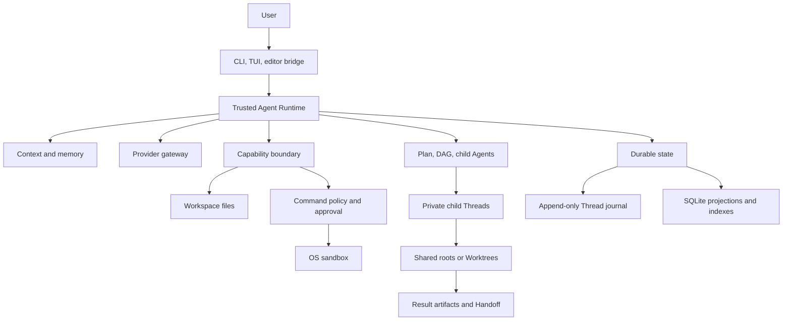

# EASY CODE Technical Design

English | [简体中文](./TECHNICAL_DESIGN_ZH.md) | [Back to README](../README.md)

This document describes EASY CODE's current architecture and stable engineering contracts. It intentionally avoids function-level implementation detail. Installation and command usage belong in the [README](../README.md).

EASY CODE's original source is [MIT licensed](../LICENSE). Third-party components retain their own licenses; see [Third-Party Notices](../THIRD_PARTY_NOTICES.md).

## 1. Goals and design principles

EASY CODE treats the language model as a planner and code producer, never as the security or persistence boundary. The local Runtime remains authoritative for permissions, state transitions, recovery, and completion.

The design follows six invariants:

1. **Authority and data are separate.** Files, model output, memory, images, command output, retrieved evidence, task text, and artifacts are untrusted data.
2. **Validation precedes effect.** Every structured request is checked against mode, role, workspace, policy, approval, and durable state before a local effect.
3. **Important transitions are durable before activation.** UI state or another Agent cannot make an unrecorded transition authoritative.
4. **Isolation layers have distinct jobs.** Private Threads isolate context, Git Worktrees isolate source state, and the OS sandbox isolates processes.
5. **Recovery never guesses.** Interrupted external work is not successful without durable evidence.
6. **Derived acceleration never outranks primary state.** Projections, checkpoints, indexes, embeddings, and vector caches remain rebuildable.

The practical goals are fail-closed security, conflict-safe mutation, reviewable evidence, restartable long work, bounded context, provider-independent local policy, and graceful degradation of optional retrieval or terminal features.

## 2. Architecture and technology stack

| Layer | Technology and responsibility |
| --- | --- |
| Runtime | TypeScript on Node.js 20+; orchestration, state, and local capability enforcement. |
| CLI/TUI | Commander, Chalk, and terminal APIs; interactive UI plus non-TTY fallback. |
| Contracts | TypeScript, JSON Schema, and Zod; model, configuration, persistence, and extension validation. |
| Providers | OpenAI-compatible adapters; normalized messages, actions, reasoning, images, retry, timeout, cancellation, and usage. |
| Storage | Append-only JSONL plus SQLite WASM; authoritative events and portable projections without a native compiler. |
| Retrieval | SQLite FTS5, local ONNX embeddings, Hugging Face tokenization, and a bounded Orama cache. |
| Execution | Structured process launch, Anthropic Sandbox Runtime, Git Worktrees, snapshots, and result artifacts. |
| Packaging | npm, a versioned Prompt Bundle, and a bundled VS Code extension. |

Model output cannot directly access files, processes, Git, the database, or credentials. It can only request a currently exposed capability, which the Runtime validates again at execution.

Configuration is layered from defaults, trusted user settings, safe project settings, environment variables, and CLI options. Project configuration cannot redirect credential storage, trusted provider endpoints, application data, or managed Worktrees. Project guidance such as `EASYCODE.md` is useful but lower-trust than the Runtime contract and current user request.

The versioned Prompt Bundle contains verified system guidance, control text, tool documentation, and the model catalog. Startup repairs missing or modified resources from the installed package and loads an immutable view. Executable schemas and permissions remain code-owned. Bundle activation is atomic, and Threads record a compatible bundle identity for Resume.

## 3. Request lifecycle and modes

A normal turn:

1. Loads trusted configuration, credentials, the Prompt Bundle, and lower-trust project guidance.
2. Acquires the Thread lease and durably appends the user message and image references.
3. Runs restricted Auto routing when selected.
4. Builds layered context from the Working Checkpoint, accepted summary, recent projection, older evidence, instructions, and memory.
5. Sends only the capabilities allowed for that exact model step.
6. Validates structured output before executing tools or changing control state.
7. Persists usage, results, task transitions, child state, and other evidence.
8. Stops only at an accepted final response, Plan review, real blocker, cancellation, or enforced limit.

| Agent mode | Contract |
| --- | --- |
| Plan | Read-only investigation and a persisted proposal; no project mutation, side-effect commands, DAG, or children. |
| Auto | A tool-less structured controller chooses direct response, Plan, or Code; routing is not keyword-based. |
| Code | Direct answers, implementation, and verification under normal capability and security gates. |

Agent mode and command posture are independent. Manual approval prompts for eligible commands; Auto approval removes those prompts but keeps permanent denials and sandboxing; Dangerous full access requires separate confirmation and bypasses command policy and sandboxing only for the current process.

The composer remains active during work. Mid-turn adjustments are journaled in FIFO order and delivered at safe model-step boundaries. Steering can redirect work but cannot silently change mode, security posture, task owner, or child identity. Unstarted calls from a superseded provider response are discarded.

The Runtime, not the model, decides finalization. A running command, mandatory compaction, incomplete DAG, or running/unobserved child blocks ordinary completion.

## 4. Trust, security, and sandbox

Runtime policy and the base security contract outrank user requests; user requests outrank project guidance. Comments, dependencies, command output, memory, images, task text, and artifacts never grant permission.

Capabilities are rebuilt for every model step from Agent mode, role, Plan/DAG state, child state, context pressure, provider/model features, command posture, approvals, and sandbox readiness. An invented or currently hidden tool remains unavailable. Provider-facing schemas favor strict objects, enums, and flat action tags; separate synchronous/start/poll/cancel command contracts avoid depending on inconsistent `oneOf`, `anyOf`, or `allOf` support. The Runtime still enforces cross-field union semantics.

### Files and workspace accounting

Protected paths are workspace-relative and canonicalized; traversal, symlink, and junction escapes are rejected. New files use exclusive creation. Updating or deleting an existing file requires a prior complete read and expected SHA-256, a fresh pre-effect hash check, conflict detection, atomic replacement where applicable, and post-write verification.

Read-before-write hashing applies only to files actually updated or deleted. Creation checks absence, and merely mentioning a file in a plan does not create a read obligation.

File tools update the verified manifest only for the target actually changed. In a valid Git repository, command auditing derives tracked, staged, unstaged, newly committed, untracked, and meaningful ignored candidates, then hashes only those paths; large dependency, cache, environment, and build trees are pruned unless tracked. At a durable Checkpoint or final delivery, a complete relevant Git snapshot reconciles anything missed.

Non-Git workspaces retain complete filesystem snapshots. If Git becomes unavailable, damaged, or detached from the workspace, the Runtime safely falls back to that complete path instead of trusting a partial Git view.

### Commands and sandboxing

Commands are a resolved executable, argument vector, working directory, intent, and timeout; task text is not implicitly evaluated as a shell. Three gates apply: current capability, command policy/approval, then OS sandbox startup. Approval grants bind to canonical executable identity and the Thread; children may consume an existing grant but cannot prompt for or mint one.

Long-running commands return a Thread/Agent-scoped handle and require terminal polling or cancellation evidence before completion. Failures are classified as parameter, policy, approval, sandbox, exit, timeout, or Runtime lifecycle failures. One explicitly retryable Windows sandbox-start failure permits one exact retry; a repeat pauses command starts for the turn without blocking safe file work.

Manual and Auto approval both use Anthropic Sandbox Runtime. Protected execution constrains writes, denies undeclared network access, isolates temporary/home locations where supported, strips provider keys, bounds output, and owns process-tree cleanup. Initialization failure prevents the target from starting and never falls back to direct host execution.

| Platform | Protected boundary |
| --- | --- |
| Windows | Restricted identity, Windows Filtering Platform fence, ACL preflight/stamp/reset, and a machine-wide ACL lease. |
| Linux | Bubblewrap isolation with trusted system dependencies and controlled network mediation. |
| macOS | Platform sandboxing through Sandbox Runtime; reduced-isolation warnings fail closed. |

Windows serializes the shared sandbox identity's ACL lifetime across processes. Effective-access preflight verifies the exact required ACL mutations. The repair workflow is dry-run first, changes only ownership left by the managed identity, preserves DACL/inheritance, and refuses broad, redirected, network, profile-root, or protected-system targets.

Shared Windows and Program Files executables rely on existing ordinary-user read/execute permissions and are not added as broad dynamic read grants. A private executable receives only the narrow grant it needs.

Readiness is established before work. Windows verifies sandbox identity and network fencing, then uses a bounded out-of-process probe to exercise real initialization, wrapping, execution, cleanup, and reset. The probe uses the canonical System32 command shell, no explicit read allowlist, and an isolated scratch ACL transition. On timeout, the parent terminates the process tree and waits for confirmed closure before the ACL lease can be released.

Dangerous full access runs directly as the current OS user and can expose inherited secrets. Structured arguments, timeouts, output bounds/redaction, cleanup, workspace accounting, and audit remain, but they are not isolation or rollback.

Credentials live in the OS credential store or provider-specific environment variables, never workspace configuration. Standard GLM and GLM Coding Plan have separate key identities with no cross-channel fallback. Persisted/model-facing text is secret- and terminal-control-filtered.

## 5. Durable state, Checkpoints, and Resume

Each Thread has an append-only JSONL journal with schema version, unique event ID, strict sequence, timestamp, and turn/step identity. Appends are flushed before activation. Loading validates identity, order, duplicates, and stable file identity; committed-history corruption fails closed, while an incomplete final record can be treated as never committed.

SQLite WASM stores session, memory, usage, Working Checkpoint, and retrieval projections. A failed projection cannot undo a durable journal append; replay repairs stale projections. Thread leases bind process, host, and random token, and ambiguous liveness is never permission to steal ownership.

Thread Checkpoints are bounded deltas against an exact journal sequence. They may append settings, messages, file observations, changes, commands, and a forward-only compaction update. Turn, Plan, DAG, approval, steering, and child transitions remain event-authoritative and cannot be forged or erased by a Checkpoint. Divergent or oversized deltas are rejected; legacy full-state Checkpoints remain readable.

The Working Checkpoint used in model context is different: it is a rebuildable SQLite projection, not the journal checkpoint or source of authority.

Resume replays events in order, applies compatible Checkpoints, validates workspace and Prompt Bundle identities, and repairs projections. It preserves later approvals, FIFO steering and watermarks, compaction, Plan/DAG state, child environments, result references, images, and provider usage. File-read authority is restored only while the file still matches its hash.

Interrupted provider calls and commands are not replayed. A Plan interrupted before durable execution ownership returns to review. Uncertain child claims are reconciled from durable outcomes or released to pending work. Child histories remain private; the parent receives only bounded assignment and result records.

## 6. Context, MicroCompaction, Summary V2, intent ledger, and hybrid RAG

Every request combines three bounded layers:

1. A deterministic **Working Checkpoint**: objective, constraints, execution identity, counters, intent anchors, unresolved failures, recent files/changes/commands, and active Plan/DAG state.
2. The accepted cumulative summary plus a bounded recent message tail after provider-independent projection.
3. A small deduplicated set of relevant evidence older than the exact recent-tail boundary.

The journal remains complete and authoritative. Derived context and retrieval may be rebuilt or skipped. A request-local overflow fallback does not silently advance the durable compaction boundary.

**MicroCompaction** runs before every provider call without mutating durable messages. It removes consumed Thinking except the latest unresolved tool-request reasoning, and replaces consumed reconstructable tool results of at least 2,048 characters with recovery references. The active protocol tail remains intact. References preserve call identity/order, original size and SHA-256, plus tool-specific path/hash, command outcome, search scope, mutation, task, child, or artifact metadata; raw bodies, stdout, and argv are omitted.

| Projected utilization | Behavior |
| --- | --- |
| Below 60% | Normal capabilities. |
| 60%–79% | Suggest compaction. |
| 80%–89% | Require a standalone compaction action. |
| 90%+ | Force a compaction correction before further work. |

All efforts share the same 250,000-character default context/compaction budget. Medium and high do not receive 2× or 4× context thresholds. They retain larger local step budgets: none/low 1×, medium 2×, high 4×. Higher effort also increases provider wait and child concurrency, not context headroom.

Compaction Summary V2 is strict provider-neutral JSON containing the primary request with exact source, active constraints, technical decisions, files/changes, verified results, errors/blockers, pending work, current work, next step, and compact evidence references.

The accompanying durable **intent ledger** records the pinned primary/latest request, constraints, user corrections, and superseded requests as bounded exact quotes plus message indices. A separate coverage check attests current intent, Plan/task state, unresolved failures, current work, and next step; it is validated and discarded rather than persisted in summary prose.

Acceptance is transactional. The Runtime verifies quotes against immutable user history, source indices, evidence references, constraints, Plan/DAG IDs, unresolved failures, and a forward-only boundary, then simulates the next provider request. Voluntary compaction requires 8,192 new projected characters, 8,192 saved characters, and 10% savings. Mandatory pressure may bypass cooldown/minimum savings, but never integrity, positive benefit, or safe post-pressure.

The target waterline is 55%. A candidate below 80% may be accepted with a headroom warning; a candidate still at or above 80% is rejected to prevent a loop. Metadata records source range/hash, before/after size, savings, ratio, utilization, and waterline result. Rejection changes none of summary, ledger, or boundary.

Older Thread artifacts index user text, visible assistant content/tool requests, and useful tool evidence. Hidden reasoning and system messages are excluded; content is secret-filtered and scoped by normalized workspace plus exact Thread. SQLite FTS5 is authoritative, including a CJK-friendly substring fallback. Optional pinned multilingual ONNX embeddings are stored with model/version/content identities, while Orama is a bounded rebuildable cache. Lexical and semantic ranks fuse with importance/recency and deduplicate by content hash. Vector failure degrades to FTS5.

Long-term memory stores short atomic workspace-scoped preferences, conventions, architecture, decisions, and environment notes. Writes are staged until a successful boundary; revision/removal requires an exact ID returned by same-turn search. Secret or tentative facts are rejected, and Plan mode cannot persist unverified project claims. Memory uses the same FTS5/optional-vector authority pattern.

### Evidence-driven progress control

The Runtime derives bounded progress evidence from authoritative tool results before model-facing output is shortened. Versioned reads provide only a weak repetition hint; only repeated, high-confidence verification failures across distinct cycles can open a stagnation incident. The flat command protocol preserves legacy test/build intent and adds an explicit verification intent classified as unit, integration, build, type, lint, format, smoke, benchmark, or custom validation. The category participates in the durable failure identity, so unrelated checks cannot be merged into one incident. Infrastructure, policy, network, cancellation, and sandbox failures remain separate and never become evidence that the code strategy is wrong.

An incident may spend at most one isolated review attempt. The reviewer receives an immutable, redacted packet and exposes only one strict report capability—no workspace mutation, shell, DAG ownership, memory, or child-agent control. A valid report must propose one command-verifiable falsification experiment; the parent must obtain a real terminal result before ordinary mutation resumes. Running the experiment removes the execution gate, but only a matching verified improvement resolves the incident. Observations, request starts/outcomes, usage, review state, and experiment evidence are journal-authoritative and survive Resume; stale or incomplete workspace snapshots fail closed.

## 7. Plan, DAG, child Agents, Worktrees, and Handoff

Plan review is a durable direction gate: proposal, approval, rejection, revision, and return-to-review are explicit transitions. Approval enters Code; it does not itself mutate the project.

A task DAG is optional for genuinely complex, dependent, or parallel work. Each node declares purpose, dependencies, inputs, expected artifacts, completion checks, failure handling, owner, and status. The Runtime enforces unique IDs, acyclicity, dependency readiness, one owner, at most one active main-Agent task, and exactly one evidence item per completion check. An active graph blocks ordinary final delivery.

Only the main Agent controls children. A child is a private Code-mode Thread bound to one DAG or standalone assignment. It inherits provider/model/effort, sees bounded task context rather than the parent history, cannot create children, manage the parent DAG, maintain long-term memory, or expand command authority, and returns one evidence-backed completed/blocked report. Follow-ups arrive at model boundaries and remain data, not permission.

Child concurrency is two at none/low effort, four at medium, and eight at high. All running or unobserved children must be collected before Plan mode, graph replacement, or finalization.

| Execution root | Behavior |
| --- | --- |
| Shared | Works in the parent checkout with serialized, hash-checked mutation. |
| Managed Worktree | Uses a separate validated Git checkout, snapshot chain, and result commit. |

Automatic isolation uses a Worktree for a valid Git repository and preserves shared execution as the non-Git fallback. An explicit Worktree request fails closed. Baselines may be fresh, local `HEAD`, or a point-in-time snapshot of current changes; later parent edits are not live-synchronized.

Dependency artifacts carry bounded lineage. Compatible predecessor commits may be integrated into a new Worktree; conflicting lineage, mixed shared/isolated results, missing commits, or different baselines are surfaced.

Completion creates an immutable private result artifact with task/environment identity, base and result snapshots, changed-file manifest, lineage, and delivery state. The DAG receives only a bounded reference.

Handoff is explicit: local delivery checks and applies the accumulated patch to the current checkout; branch delivery creates or validates a local branch at the result commit. Neither pushes remotely. Conflicts preserve the artifact and Worktree, and repeating an already applied Handoff is safe.

Worktrees isolate source state, not process authority; sandbox and permission rules still apply.

## 8. TUI and multimodal interaction

The interactive UI projects structured state into a stable header, retained transcript, redrawable live region, persistent composer/footer, and modal selectors. Durable content is committed once; temporary provider, command, task, and child activity may be redrawn without duplicating scrollback.

One component owns stdin. A modal borrows it through a lease and restores the exact draft, attachments, cursor, paste state, and terminal modes. Non-TTY environments use append-only text and no cursor addressing.

Thinking keeps a preview and full body. An authenticated editor action or slash command opens a scrollable, reflowing disclosure view anchored to the logical event. Expansion is UI-only and never changes journal, context, or memory. Reasoning, tools, steering, children, and answers render in event order.

Bracketed multiline paste remains one submission object, and clipboard reads are serialized so slow capture cannot reorder input. Images are decoded, size/type/dimension checked, stored privately per Thread, and journaled as metadata plus SHA-256 rather than Base64. Ownership, path, lease, and integrity checks run on load.

Image bytes enter a provider request only when the catalog declares vision support. Switching to a text-only model can omit historical images without rewriting durable history. Images remain untrusted data.

## 9. Provider and model catalog

The gateway normalizes messages, actions, reasoning, images, cancellation, retries, timeouts, and usage. A verified catalog is the sole authority for provider/vendor identity, trusted service root, credential slot and environment names, default model, model capabilities, and benchmark profiles.

| Channel | Default service root | Default and current catalog |
| --- | --- | --- |
| DeepSeek | `https://api.deepseek.com` | Default `deepseek-v4-pro`; Flash/Pro support effort without vision, Vision Experimental supports images without thinking control. |
| Qwen | `https://dashscope.aliyuncs.com/compatible-mode/v1` | Default `qwen3.7-max`; explicit 3.7, 3.6, 3.5, 3 Max, and 3 VL entries with per-model vision/thinking flags. |
| Standard GLM | `https://open.bigmodel.cn/api/paas/v4` | Default `glm-5.3`; 5.3 Flash, 5.3, and 5.2, with channel-specific vision and forced/optional effort. |
| GLM Coding Plan | `https://open.bigmodel.cn/api/coding/paas/v4` | Default `glm-5.3`; text-only 5.3 Flash, 5.3, and 5.2 through a separate entitlement. |

Standard GLM and Coding Plan remain distinct even when model IDs overlap: endpoint, key, configuration, usage, and Thread identity never fall back across channels.

Unknown models are not assumed to support vision or controllable thinking. Adapters map none/low/medium/high only to controls declared for the exact model; some use Token budgets, some effort labels, and forced-thinking models cannot express explicit “off.” Selected effort remains durable even when a model cannot apply it.

The catalog pins SWE-bench to GLM Coding Plan, `glm-5.3-flash`, Code mode, and high effort. Usage is recorded by provider, model, actor, purpose, attempt, and retry; absent provider fields remain unreported rather than estimated.

## 10. SWE-bench evaluation

The reproducible development target is **SWE-bench Verified Mini (HAL, 50)**: 25 Django and 25 Sphinx tasks. It is a community mini set, not an official leaderboard subset, and must not be compared directly with the full 500-task Verified score.

One manifest pins the ordered instance IDs, community and official dataset revisions, digests, evaluator, Harbor, task repository, and EASY CODE profile. Every ID is verified against the official dataset; exact filters and range checks prevent accidental unfiltered or partial runs.

The supported harness uses Windows, Docker Desktop Linux containers, and Harbor's repository-specific grading boundary. The current EASY CODE build is packed as an exact npm archive for each Trial. The Agent runs in the task checkout with safe Auto approval, fixed Coding Plan endpoint/model/effort, and no standard-GLM fallback.

The dedicated key is staged through ACL-protected one-shot files and removed before the tool loop; Harbor receives a path rather than the value. Pinned multilingual ONNX assets are host-verified, copied to a disposable Trial cache, and reverified, so semantic retrieval is part of the measured profile without Trial downloads.

The protocol has one solving attempt. One retry is allowed only for environment-start or Agent-setup timeout before Agent execution and before any model request. Agent timeout or non-zero exit receives no new time, step, or model budget.

After execution begins, cleanup can capture an atomic generation containing EASY CODE data, Git patch, and regular untracked files. Explicit Resume accepts only the same issue, Trial, base commit, package hash, embedding manifest, endpoint, model, mode, and effort. Damage, ambiguity, links, special files, or any binding mismatch fails closed; generations never cross tasks.

Results retain patch/grader outcome, resolved rate, wall time, provider usage, recovery generation, Thread events, context artifacts/vectors, Working Checkpoint and compaction counters, retrieval backend, and warnings. Reported runs keep all pinned hashes/versions and per-instance diagnostics.

## 11. Data lifecycle, failure modes, and trade-offs

| Data | Lifecycle |
| --- | --- |
| Prompt Bundle | Verified per-user installation; repaired and version-bound to Threads. |
| Journals, SQLite, attachments, child artifacts | Durable application data; removable by the data uninstaller. |
| User config and OS credentials | Preserved unless explicitly removed. |
| Embedding assets and vector projections | Cached/rebuildable; lexical data remains authoritative. |
| Workspace config/guidance | User-owned and never removed by uninstall. |
| Worktrees, Handoff branches, benchmark evidence | Preserved while code or reproducibility evidence may be undelivered. |

Cleanup validates owned real directories, refuses redirected roots, never recursively follows links, and stops on active locks or ambiguous custom roots. The uninstaller removes Prompt Bundle and discoverable Thread/memory data but preserves credentials, user config, caches, workspaces, benchmark evidence, and potentially unmerged Git results.

| Failure | Behavior |
| --- | --- |
| Journal corruption | Refuse uncertain history; only an incomplete final record is repairable as uncommitted. |
| SQLite/index/vector failure | Replay the journal or degrade semantic retrieval to FTS5. |
| Invalid/low-benefit compaction | Preserve prior summary, intent ledger, and boundary. |
| Concurrent file edit or Git failure | Preserve user bytes; report conflict or use full-filesystem fallback. |
| Sandbox setup/start failure | Do not start the target and never use host fallback. |
| Running command at finalization | Require terminal poll/cancel evidence. |
| Provider/structured-output failure | Apply bounded classified retry without duplicating accepted effects. |
| Interrupted child or Handoff conflict | Reconcile durable evidence or retain the artifact for explicit resolution. |
| Image mismatch | Refuse the bytes for that request without rewriting history. |
| Benchmark binding mismatch | Refuse recovery across tasks or Trials. |

Key trade-offs are explicit: local-first is not offline; character budgets approximate Tokens; compaction keeps the full journal but not every raw byte in the active prompt; semantic retrieval costs local compute but has lexical fallback; incremental Git auditing needs full Checkpoint/final reconciliation; shared children trade isolation for non-Git compatibility; Worktrees are not security sandboxes; non-streaming provider steps simplify durability but favor elapsed activity over token streaming; and cross-platform sandbox implementations differ beneath one fail-closed contract.

New providers, retrieval backends, child roles, or execution environments are acceptable only when they preserve the same authority, durability, isolation, integrity, and recovery invariants.
