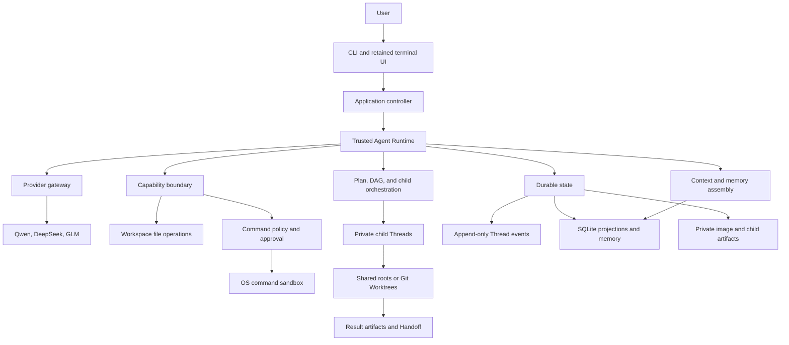

# EASY CODE Technical Design

English | [简体中文](./TECHNICAL_DESIGN_ZH.md) | [Back to README](../README.md)

This document describes the architecture and engineering choices behind EASY CODE. It focuses on stable design boundaries rather than individual functions, private protocols, or implementation line numbers. Installation and command usage belong in the [README](../README.md).

EASY CODE's original source is [MIT licensed](../LICENSE). Third-party components retain their own licenses; see [Third-Party Notices](../THIRD_PARTY_NOTICES.md).

## 1. Design goals

EASY CODE treats the language model as a planner and code-producing component, not as the security boundary. The local Runtime remains authoritative for permissions, state transitions, persistence, and completion.

The design is guided by five invariants:

1. **Authority and data are separate.** Project files, model output, memory, images, command output, and task descriptions are untrusted data. None can grant more authority.
2. **Validate before effect.** Structured intent is checked against the current mode, role, workspace, policy, and state before a local side effect is allowed.
3. **Persist before activation.** Important transitions become durable before the UI or another Agent treats them as committed.
4. **Isolation layers solve different problems.** Private Threads isolate context, Git Worktrees isolate source state, and the operating-system sandbox isolates command processes.
5. **Recovery never guesses.** An interrupted external action is not considered successful unless durable evidence proves it.

Other goals follow from these invariants:

- fail closed when a permission, sandbox, binding, or recovery check is uncertain;
- keep user-visible actions reviewable through diffs, command audit, task evidence, and result artifacts;
- preserve long-running work across process restarts;
- bound model context without discarding authoritative history;
- keep provider-specific behavior away from workspace security;
- degrade optional retrieval or terminal features without corrupting primary state.

## 2. Technology stack

| Area | Technology | Role |
| --- | --- | --- |
| Runtime | TypeScript on Node.js 20+ | Cross-platform orchestration, state management, and tool execution. |
| CLI and terminal UI | Commander, Chalk, Node terminal APIs | Command parsing, interactive selection, retained conversation UI, and non-TTY fallback. |
| Contract validation | TypeScript types, JSON Schema, Zod | Validation of configuration, model tool calls, persisted state, and external data. |
| Provider access | OpenAI-compatible Chat Completions adapters | Shared message, tool, reasoning, image, retry, timeout, and usage model for Qwen, DeepSeek, and GLM. |
| Durable storage | Append-only JSONL and SQLite WASM | Authoritative Thread history, checkpoints, query projections, memory, and audit records. |
| Retrieval | SQLite FTS5, Orama, ONNX Runtime, Hugging Face tokenization | Hybrid lexical and semantic retrieval for long-term memory. |
| Command execution | Structured process execution and Anthropic Sandbox Runtime | Argument-safe process launch, approval enforcement, and operating-system containment. |
| Source isolation | Git, Worktrees, snapshots, and result artifacts | Reproducible child environments, checkpoints, dependency lineage, and Handoff. |
| Editor integration | Bundled VS Code extension | Native clipboard image routing, Thinking interaction, and scroll-safe menu navigation. |
| Packaging | npm and a versioned Prompt Bundle | Cross-platform installation of executable code and verified model-facing resources. |

The Runtime is local, but selected model requests are remote. API credentials remain in the operating-system credential store or user-selected environment variables rather than being copied into project configuration.

## 3. Architecture

| Layer | Responsibility |
| --- | --- |
| Interaction | Accept text, paste, images, menu choices, approvals, and cancellation; render conversation and status. |
| Application controller | Load configuration and credentials, bind a workspace, own a Thread, and coordinate Resume. |
| Agent Runtime | Select effective capabilities, validate model output, drive the tool loop, and enforce completion rules. |
| Provider gateway | Normalize messages, structured actions, reasoning, images, cancellation, errors, and usage. |
| Capability boundary | Enforce file, command, planning, task, context, memory, and child-Agent policies. |
| Orchestration | Manage reviewed plans, dependency-aware tasks, child ownership, execution environments, and result lineage. |
| Durable state | Preserve authoritative events and maintain queryable local projections and artifacts. |

Model output cannot call the filesystem, process APIs, database, or Git directly. It can only request a capability currently exposed by the Runtime, and every request is locally validated.

## 4. Request lifecycle and modes

A normal turn follows this high-level sequence:

1. Load trusted user configuration, credentials, the Prompt Bundle, and lower-trust project guidance.
2. Acquire ownership of the selected Thread and make the new user message and image references durable.
3. In Auto mode, ask a restricted controller to choose direct response, Plan, or Code.
4. Build the model context from current state, applicable instructions, a working summary, active messages, and retrieved memories.
5. Send a provider request with only the capabilities allowed for this step.
6. Validate each structured response before executing tools or changing state.
7. Record tool results, model usage, task transitions, and other durable evidence.
8. Continue until the Runtime accepts a final response, presents a plan, reaches a blocked state, or stops on a limit or interruption.
9. Commit eligible long-term-memory changes only at a successful boundary.

### Mode semantics

| Mode | Purpose | Main restriction |
| --- | --- | --- |
| Plan | Investigate and produce a proposal for user review. | Project mutation and ordinary side-effecting commands are unavailable. |
| Auto | Let the model select the appropriate workflow. | The routing controller itself has no workspace tools. |
| Code | Implement and verify directly. | Mutations and commands remain subject to capability, policy, approval, and sandbox controls. |

Auto routing is structured rather than keyword-based. A direct answer is accepted only when it can be produced without workspace access or side effects. Otherwise, Auto enters Plan or Code.

Plan review is a persisted state, not a conversational guess. Approval, rejection, and revision feedback are explicit transitions. If an approved execution is interrupted before a durable execution graph takes ownership, the plan returns to review instead of being silently treated as complete.

### Mid-turn adjustment

The active composer remains available while the model works. Each adjustment is independently persisted in FIFO order. At a safe boundary, the Runtime snapshots the pending prefix and adds it to the next model request as user input. Later entries remain queued for the following boundary.

An adjustment can redirect work but cannot change the effective mode, command posture, sandbox boundary, task owner, or child identity. Completed tool results remain valid; tool calls from a superseded provider response that have not started are not executed.

## 5. Trust, capability, and permission model

### Instruction trust

Runtime policy and the base security contract have higher authority than user requests. User requests have higher authority than project guidance. Files such as `EASYCODE.md` may describe how to work, but they cannot grant filesystem, process, network, credential, installation, or child-Agent authority.

Source comments, dependency metadata, command output, retrieved memory, task text, images, and generated artifacts are all treated as data. Prompt injection in any of those sources does not bypass the local control plane.

### Capability shaping

The Runtime rebuilds the available capability set for each model step. It considers:

- Plan, Auto, or Code mode;
- main-Agent or child-Agent role;
- active plan and DAG state;
- child assignments and uncollected results;
- context pressure and compaction state;
- provider and model capabilities;
- current command posture and sandbox readiness.

An unavailable tool remains unavailable even if the model invents its name or schema. Batching a state-control action with incompatible work actions is rejected as a whole where atomicity matters.

### Workspace file boundary

Protected file operations are relative to the selected workspace and are checked against the canonical filesystem location. Parent traversal and link-based escapes are rejected.

Mutation follows an inspect-before-change protocol:

- creation does not silently replace an existing file;
- update and deletion require a previously observed complete version;
- the observed content identity is checked again immediately before mutation;
- concurrent edits produce a conflict instead of an overwrite;
- accepted changes become durable audit entries and line-numbered diffs;
- Resume restores a previous read authorization only when the file still matches.

Shared child Agents use serialized workspace mutation plus the same version checks. Worktree children have separate Git state, but user edits and later Handoff can still conflict.

### Commands and approval

Commands are represented as a resolved executable, an argument vector, and a working directory. Ordinary task text is not implicitly interpreted as a shell program.

Protected execution has three independent gates:

1. **Capability gate:** determines whether this Agent, mode, and phase may request command execution.
2. **Policy and approval gate:** classifies the command, applies permanent denials, and obtains any required user decision or Thread grant.
3. **Sandbox gate:** starts an approved process tree inside an operating-system workspace boundary.

An approval can apply once or to the same canonical executable identity for the current Thread. Child Agents can use an existing Thread grant but cannot open an approval prompt or mint a new grant.

Manual and Auto approval use the OS sandbox. Sandbox preparation or launch failure blocks the command and never falls back to a direct host process.

Dangerous full access is a separate, process-local posture selected by the user with a second confirmation. It bypasses command policy, approval prompts, the command sandbox, and workspace-only file restrictions. It still runs with the current OS account's permissions and ends when the user disables it or exits.

### Credentials and sensitive data

Provider keys are stored in the operating-system credential store or supplied through environment variables. They are not accepted in workspace configuration. Terminal output, model-facing errors, memory writes, and persisted summaries pass through secret and control-character filtering.

The command environment uses a constrained allowlist in protected modes. Provider keys are not forwarded to child processes by default.

## 6. Prompt Bundle and configuration

System guidance, runtime control text, and tool descriptions are installed in a fixed per-user Prompt Bundle. The package includes a manifest that binds resource versions and content identities to the compatible Runtime.

At startup, EASY CODE verifies the bundle before model use and loads an immutable in-process view. Missing, modified, or unlisted resources are repaired from the installed package. Tool executable schemas and permission logic remain compiled into the Runtime; editable prose cannot redefine them.

Threads record the compatible Prompt Bundle identity so Resume cannot silently continue with an incompatible tool contract.

Configuration is layered from defaults, trusted user configuration, safe project configuration, environment variables, and explicit CLI options. Project configuration cannot redirect credentials, provider endpoints, application data, or managed Worktree storage.

`EASYCODE.md` is loaded as project guidance from the user and workspace hierarchy. It is intentionally lower-trust than the Runtime contract.

## 7. Terminal and editor integration

The interactive UI is a projection of structured state rather than a set of unrelated print calls. It separates:

- a stable session header;
- an append-only conversation transcript;
- a redrawable live-activity region;
- the persistent composer and status footer;
- modal pickers for model selection, approvals, plan review, and Resume.

Stable content is committed once and remains ordinary terminal scrollback. Only temporary activity is redrawn. This preserves scrolling, selection, copying, and a consistent location for the input box.

One component owns terminal input at a time. Modal menus temporarily suspend the composer and restore its exact draft, attachments, cursor, and terminal state afterward. Background progress and child activity cannot consume menu keystrokes.

Thinking blocks retain a short preview and complete body. The VS Code extension routes an authenticated toggle action back to the originating terminal. A managed transcript view replaces the selected preview with the complete body at the same logical event position while keeping the composer active. The expansion state is UI-only; it does not alter model context or memory.

Reasoning, tool activity, adjustments, and model answers appear in provider/event order rather than in separate fixed sections. Final assistant responses and expanded Thinking are presentation-complete; only source data with an explicit safety limit, such as captured command output, is bounded.

Clipboard handling preserves submission ordering. Multiline text remains one paste object until the user presses Enter, while verified images become stable attachment labels. Non-TTY environments fall back to append-only text without cursor-addressed UI behavior.

## 8. Durable state and Resume

Every Thread has an append-only event history that is the authoritative record of accepted actions and transitions. SQLite maintains query-friendly projections for sessions, memory, usage, and recovery, but a stale projection cannot override newer authoritative events.

Checkpoints reduce replay time. They do not replace the event history. Resume replays newer events, validates persisted identities, and reconstructs the effective state.

Durable state includes:

- user and assistant messages, tool requests, and results;
- working summary and compaction boundary;
- plan review state and task DAG;
- file observations, changes, commands, and Thread grants;
- pending adjustments and their delivery watermark;
- child assignments, lifecycle, execution environments, and result references;
- provider-reported usage accounting.

Thread leases prevent two local processes from owning the same active Thread. Resume verifies the workspace and any managed child environment before restoring authority.

Interrupted provider calls and commands are not blindly replayed. A partially approved plan returns to review, an unfinished DAG remains active or blocked, and child work without a durable completion result is treated as interrupted. Recovery favors an explicit user-visible state over invented success.

## 9. Context and memory

### Short-term context

The authoritative conversation remains in the Thread event history. The model request contains a bounded view composed of:

- the active system contract and current environment;
- the latest cumulative working summary;
- messages after the monotonic compaction boundary;
- current task, plan, child, and adjustment control state;
- a small set of relevant long-term facts.

The model creates the cumulative summary through a dedicated context action. The Runtime limits and redacts it, verifies that the boundary only moves forward, and persists both together. A last-resort request-size fallback may omit old active messages for one request, but it does not rewrite the official summary or compaction boundary.

Context pressure is progressive: normal operation, a suggestion to compact, a mandatory compaction step, and finally a forced compaction request before the configured boundary is exceeded. Character budgets are used for deterministic local enforcement, while Token values shown in the UI are estimates unless reported by the provider.

Thinking effort scales the local step and context budgets. These are execution safeguards, not promises about the provider's own context window.

### Long-term memory

Long-term memory stores short atomic facts scoped to a normalized workspace. Supported fact types include preferences, conventions, architecture, decisions, and environment notes.

The model searches before proposing a write. Additions, revisions, and removals are staged during the turn and committed atomically only when the turn reaches an allowed successful boundary. Superseded and forgotten facts retain enough audit history for consistency without remaining active retrieval candidates.

Retrieval is hybrid:

- SQLite FTS5 supplies lexical matching;
- a local multilingual ONNX embedding model supplies semantic vectors;
- Orama provides in-memory vector ranking;
- results are combined into a small top set for context assembly.

SQLite remains authoritative. The vector index is a rebuildable projection, so semantic retrieval can degrade to lexical search without losing memory. Secret filtering and workspace scoping apply before persistence and retrieval.

## 10. Plan review and task DAG

A reviewed Plan and an execution DAG solve different problems:

- **Plan review** lets the user approve direction before implementation.
- **Task DAG** controls dependency order, ownership, completion evidence, and result lineage during execution.

A task describes its purpose, dependencies, required inputs, expected artifacts, completion checks, failure handling, owner, and status. The Runtime validates that the graph is acyclic and that dependencies exist.

Only dependency-ready work can be claimed. One task has one active owner. Completion requires evidence for its declared checks; a model statement alone does not complete a task. A blocked task records its blocker, while dependent work remains unavailable.

An active DAG prevents the main Agent from giving an ordinary final answer before every reachable task has reached a valid terminal state. DAG state is durable and restored by Resume.

Child-produced result artifacts can be attached to completed nodes. Downstream tasks receive bounded references and lineage rather than large child histories or manifests.

## 11. Child Agents, Worktrees, and Handoff

Only the main Agent can create and control child Agents. A child is a private Code-mode Thread bound to one Runtime-issued assignment. It receives the task, required context, dependency results, and completion checks, but not the parent's complete conversation.

Children have a narrower capability set:

- they can inspect, edit, and verify within their assigned execution root;
- they cannot create nested Agents;
- they cannot manage the parent DAG or long-term memory;
- they cannot interactively expand command authority;
- they must return a structured completed or blocked result tied to their assignment.

The parent can create DAG-bound or standalone children, send follow-up guidance, wait for results, stop work, and collect the final report. Parent, Thread, Agent, task, and environment identities are durably bound so a recovered child cannot be silently reassigned.

### Execution environments

The logical workspace identifies project policy and memory. The physical execution root identifies where a child actually reads and writes.

| Environment | Behavior |
| --- | --- |
| Shared | Child works in the parent workspace; mutations are serialized and version-checked. |
| Managed Worktree | Child works in a separate Git checkout with its own source state and checkpoint chain. |

Automatic isolation prefers a Worktree for a valid Git workspace and uses shared execution outside Git. An explicit Worktree request fails closed if the repository or storage root cannot be validated.

Worktree baselines can represent a fresh remote-oriented base, local `HEAD`, or a point-in-time snapshot of current local changes. A snapshot is not live synchronization: later parent edits do not appear automatically in an existing child.

On completion, the Runtime records an immutable result artifact describing the verified source result and its dependency lineage. The full artifact stays in private storage; the DAG and parent context receive bounded references.

### Handoff

Handoff is an explicit delivery step, not an automatic merge:

- **Local Handoff** applies the accumulated result to the current checkout after conflict checks.
- **Branch Handoff** materializes or updates a validated local branch without pushing it remotely.

Both paths preserve user changes, report conflicts, and are designed to be safely repeatable. Worktree isolation reduces concurrent Git-state conflicts but is not a security sandbox; command containment remains the responsibility of the OS sandbox.

## 12. Provider and multimodal boundary

The provider gateway exposes one internal representation for chat messages, structured actions, reasoning content, images, cancellation, retry, timeout, and usage metadata. Provider-specific request fields are added only for exact catalog entries with known support.

The model catalog is conservative:

- an unknown model is not assumed to support images or controllable thinking;
- a thinking selection is stored even when the current model cannot apply it;
- provider-specific reasoning controls are normalized from the four EASY CODE effort levels;
- switching to a text-only model prevents historical images from being loaded into that request.

Images are decoded and validated locally, copied into private Thread artifact storage, and represented in journals by metadata and a content hash rather than Base64. Bytes are loaded only at the provider boundary after integrity and model-compatibility checks.

Current-turn images are treated more strictly than historical context. A provider or model switch can safely omit incompatible historical images without mutating the durable conversation.

Provider-reported usage is recorded separately by provider, model, actor, purpose, and retry. Missing usage remains explicitly unreported rather than being fabricated from estimates.

## 13. Reliability and observability

EASY CODE uses several complementary reliability techniques:

- strict schema validation at model, configuration, persistence, and extension boundaries;
- append-only evidence before state activation;
- atomic database transactions for related projections and memory updates;
- canonical paths and ownership markers for managed storage;
- timeouts, cancellation, output bounds, and process-tree cleanup for commands;
- content hashes for file observations, image integrity, Prompt Bundle resources, and result provenance;
- bounded retries only for classified transient failures;
- fail-closed handling for unknown sandbox, Worktree, approval, and recovery states;
- durable command, file-change, task, child, and model-usage audit records.

The terminal exposes useful state without making logs authoritative. `/changes`, `/commands`, `/permissions`, `/tasks`, `/agents`, `/context`, `/memory`, and `/usage` are read-only views over Runtime-owned state.

Token efficiency comes from model-controlled compaction, bounded memory retrieval, small DAG/result references, private child contexts, direct Auto answers, and keeping raw child logs and image bytes out of the parent prompt.

## 14. Local data and lifecycle

| Data | Location class | Lifecycle |
| --- | --- | --- |
| Prompt Bundle | Fixed per-user `~/.easy_code` root | Installed, verified, and repaired with the package. |
| Thread journals, SQLite, attachments, and child artifacts | Platform application-data directory | Durable across sessions and removed by the EASY CODE data uninstaller. |
| User configuration | Platform configuration directory | Preserved by the data uninstaller. |
| API keys | Operating-system credential store | Preserved unless explicitly removed with config commands. |
| Embedding/model resources | Platform cache directory | Rebuildable and preserved by default. |
| Project guidance and project configuration | Workspace | User-owned and never removed by EASY CODE uninstall. |
| Managed Worktrees and Handoff branches | Git/application-managed locations | Preserved when they may contain undelivered code. |

Managed data roots carry an ownership identity. Cleanup only removes known EASY CODE data from a verified real directory and does not recursively follow links. An active database lock or ambiguous custom root causes cleanup to stop.

The one-step uninstaller clears Prompt Bundle resources plus discoverable short- and long-term memory before removing the global npm package. It deliberately preserves credentials, configuration, caches, workspaces, and potentially unmerged Git results.

## 15. Trade-offs and extension points

- **Local-first is not offline.** Project state is local, but provider inference requires network access unless a future local provider is added.
- **Character budgets are deterministic but approximate Tokens.** Provider usage is more accurate when reported, while local estimates remain suitable for early pressure control.
- **Hybrid memory improves relevance but adds local resources.** Lexical search remains available when embeddings are missing or rebuilding.
- **Shared children support non-Git projects but need serialized mutation.** Worktrees provide better source isolation at the cost of Git and storage complexity.
- **Worktrees isolate source state, not process authority.** They must remain paired with capability and OS-sandbox controls.
- **Non-streaming provider requests simplify durable step boundaries.** The UI therefore emphasizes elapsed-time activity and mid-turn adjustment rather than token streaming.
- **Cross-platform sandbox behavior differs.** The Runtime exposes one fail-closed contract while platform setup and enforcement remain platform-specific.

The architecture can add more providers, retrieval backends, child roles, or execution environments as long as new components preserve the same authority, persistence, isolation, and recovery invariants.
