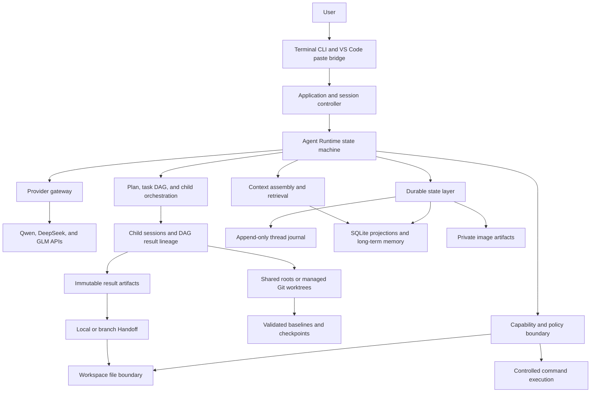
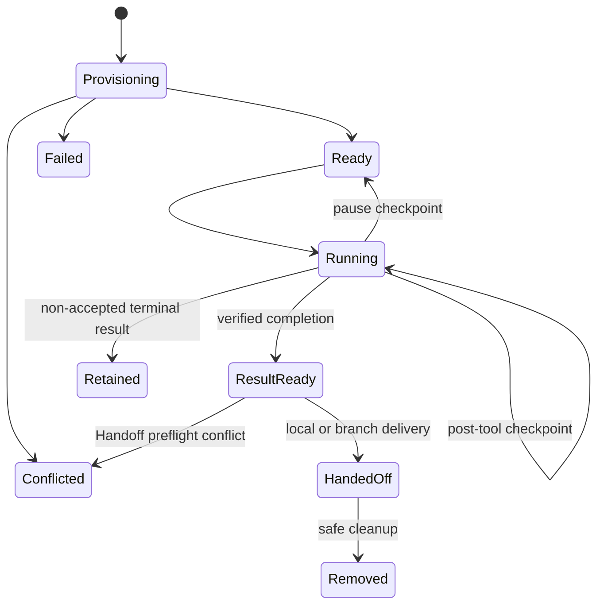

# EASY CODE Technical Design

[简体中文](./TECHNICAL_DESIGN_ZH.md) | [Back to README](../README.md)

This document explains the design of EASY CODE as a controlled local coding agent. It focuses on architectural decisions, terminal interaction, trust boundaries, state management, orchestration, and reliability. User-facing installation and command instructions remain in the main README.

## 1. Design goals and boundaries

EASY CODE is designed around one central rule: **the model proposes actions, while the local Runtime decides what is allowed and owns every state transition**.

The main design goals are:

- **Runtime authority:** prompts guide model behavior, but they never grant permissions.
- **Least capability:** each model request receives only the capabilities required by its current mode, role, and execution phase.
- **Workspace safety:** file access is confined to a selected project, with version checks before destructive changes.
- **Durable execution:** conversations, plans, task progress, child results, and audit data survive process restarts.
- **Evidence over claims:** file and command outcomes are recorded, while task completion must include structured evidence that a user or parent agent can review.
- **Local-first state:** session data, memory, image artifacts, and indexes are stored locally by default.
- **Graceful degradation:** optional features such as semantic retrieval may fall back without making authoritative state unavailable.

EASY CODE is not an operating-system sandbox. An approved project program or shell command still runs as the operating-system account that launched the CLI. The permission model reduces risk through capability restrictions, command classification, and approval; it does not provide container isolation.

## 2. System architecture



| Layer | Responsibility |
| --- | --- |
| Interaction | Terminal input, slash commands, loading feedback, thinking previews, diffs, task status, and image paste integration. |
| Application coordination | Configuration, credentials, workspace binding, model selection, thread lifecycle, resume, and presentation. |
| Agent Runtime | Turn state machine, effective mode, capability selection, model-output validation, tool loop, and completion rules. |
| Provider gateway | A common representation for messages, structured actions, thinking, images, timeouts, retries, and usage metadata. |
| Capability boundary | File, command, planning, task, memory, context, and child-agent operations exposed as validated structured actions. |
| Orchestration | Reviewed plans, dependency-aware task execution, child assignment, resumable execution environments, result lineage, and controlled handoff. |
| State and retrieval | Authoritative thread events, queryable projections, checkpoints, long-term facts, semantic indexes, and binary artifacts. |

This separation keeps provider-specific behavior out of workspace security and keeps model output from directly mutating local state.

### Inline terminal UI and output ownership

The interactive UI is a projection of structured state rather than a collection of independent print calls. Its state separates a stable session header, append-only transcript entries, ephemeral live activity and Thinking panel selection, a modal overlay, and the persistent composer. Reducer-style updates make stale activity stops harmless and keep task, child-Agent, progress, Thinking, image, and picker rows bounded before rendering.

The visible interface has four regions with different ownership rules:

| Region | Lifetime and update rule |
| --- | --- |
| Session header | Rendered from stable Thread/session facts: mode, provider/model, effort, context estimate, workspace, and Thread ID. |
| Terminal scrollback | Owns completed conversation, tool/command output, diffs, and results. New entries are appended and are never cursor-erased by a live refresh. |
| Live region | Above the composer, owns only currently running progress, activity, elapsed time, and at most one temporary Thinking panel. A screen writer may erase and replace only these bottom rows. |
| Composer and footer | Keeps the wrapping input box, then compact task-DAG and child-Agent snapshots, with the mode/model/context/task/Agent status line last. Image attachments are represented by stable `[Image #N]` labels. |

Before a stable transcript entry is committed, the screen writer removes the current live rows, appends the entry at their former start, and redraws the latest live snapshot underneath. Live progress contains running work only: a newer item replaces the prior item of the same kind, and a completed tool is removed before its single durable transcript entry is committed. Ending a request clears all transient progress. Cursor restoration uses visual rows and display-cell columns rather than UTF-16 indexes, so a cursor is never placed in the second cell of a wide grapheme. Resize rendering uses the current terminal width. ANSI control families from external text are removed; only UI-owned SGR styling may survive, and CJK, combining characters, flags, and joined emoji are measured as terminal cells.

A modal picker has precedence over the ordinary live region, including an open Thinking panel. `/model`, command approval, Plan review, and Resume all use the same boxed overlay behavior: the selected row is visually distinct, other rows are subdued, `Up`/`Down` changes selection, Enter confirms, and Esc cancels. The menu temporarily owns stdin in Raw Mode and restores the previous input, cursor, and flow state on every exit path. Approval cancellation maps to rejection, preserving fail-closed behavior. This single-owner rule also prevents a background child or status update from consuming interactive input. While a model request is active, a narrow control-only input owner keeps private Thinking toggles and `Ctrl+C` cancellation responsive; ordinary keystrokes are discarded. It yields stdin to every modal input and resumes only after that owner has restored the prior raw and stream-flow state.

Click-to-toggle Thinking uses the same ordered private terminal channel as image paste. The bundled extension recognizes only an exact paired collapsed marker or expanded-panel control and requires the repeated positive decimal ID to be a safe integer. Links are enabled for a terminal with a tracked EASY CODE shell execution or an explicit user override. To recover a start event missed by an extension-host reload, only terminals already present at activation may enter a marker-proven recovery state; the next observed shell start/end or terminal close revokes it. VS Code activates terminal links with `Ctrl+click` on Windows/Linux or `Cmd+click` on macOS by default. Each activation sends the fixed no-newline sequence `ESC ] 6973 ; easy-code ; toggle-thinking ; <id> BEL` back to the terminal that produced the link; the terminal parser consumes it as protocol rather than composer text. The older `show-thinking;<id>` payload remains accepted for already-installed clients and is normalized to the same toggle action. Neither protocol assigns a meaning to Esc.

The toggle selects at most one bounded gray panel: clicking the active marker or its panel control closes it, while clicking another marker replaces it. A visual-row limit keeps the panel erasable inside the normal terminal buffer; when it is reached, the panel explicitly reports omitted wrapped rows and points to `/thinking N` for all retained content instead of silently presenting a partial body as complete. Selection and panel visibility are ephemeral UI state. They are not written to the Thread journal, model context, short-term context, or long-term memory; only the provider-returned Thinking already associated with the assistant response is durable. `/thinking N` and `Ctrl+T` follow a separate path that commits the retained body to stable scrollback above the active edit buffer, preserving the composer draft.

The composer and the VS Code paste bridge share one ordered input stream. Native image paste is resolved before a following Enter can submit, and the composer receives only a visible attachment label; verified bytes remain in the private image-artifact store. Text paste stays text. `Ctrl+C` remains able to cancel an in-flight clipboard capture.

Non-TTY output does not attempt cursor movement, screen erasure, Raw Mode, or color. It emits append-only plain status messages and uses line-oriented input; workflows that require an interactive picker must instead provide an explicit model, Resume ID, or other command argument. This degradation preserves readable logs for pipes, redirected output, CI, and terminals with incomplete control-sequence support.

## 3. Request lifecycle and working modes

A normal turn follows this control flow:

1. The application loads trusted configuration and credentials, then loads lower-priority project guidance as untrusted data, binds the selected workspace, and obtains exclusive ownership of the thread.
2. The current user message and image references are made durable before agent work begins.
3. In Auto mode, a restricted controller chooses direct response, Plan, or Code using structured output rather than keyword matching.
4. The Runtime derives the effective capabilities from mode, agent role, context pressure, plan state, task state, and outstanding child work.
5. The model context is assembled from the security contract, environment facts, relevant project guidance, active conversation, current control state, and a small set of retrieved memories.
6. Provider output is locally validated before any requested action is accepted.
7. Action requests, results, state transitions, and usage metadata are appended to the thread history.
8. The loop continues until a final response, a plan awaiting review, a blocked task, a configured limit, a failure, or an interruption.
9. Eligible long-term-memory changes are committed only at an allowed successful turn boundary. During Plan, eligibility is limited to durable preferences or conventions explicitly stated by the user.

### Mode semantics

| Mode | Design intent | Effective boundary |
| --- | --- | --- |
| Plan | Investigate and produce a structured proposal for review. | Read-only workspace investigation and safe inspection; no project mutation or side-effecting execution. |
| Auto | Let the model choose the appropriate workflow. | The controller itself has no workspace capability. It may answer a bounded tool-free request or enter Plan/Code. |
| Code | Implement and verify immediately. | Workspace mutations and controlled commands are available, but all normal policy and approval checks remain active. |

Plan approval, rejection, and adjustment are explicit persisted states. They are not inferred from similar-looking user text. If approved execution fails or is interrupted before a durable task DAG takes over, the plan returns to review instead of being silently treated as a new request. Once a DAG is active, its persisted state becomes the recovery control plane.

An unfinished task graph or an uncollected child result keeps Auto in Code so the parent cannot abandon active work. When context pressure requires compaction, Auto compacts first and only then chooses its route.

## 4. Capability, permission, and trust model

### Capability matrix

| Capability category | Plan | Main Agent in Code | Child Agent |
| --- | ---: | ---: | ---: |
| Read workspace text files | Yes | Yes | Yes |
| Read validated images with a compatible model | Yes | Yes | No |
| Create, update, or delete workspace files | No | Yes | Yes |
| Run commands | Safe inspection only | Policy controlled | Policy controlled, without interactive approval |
| Submit a plan for review | Yes | No | No |
| Manage the task graph | No | Yes | No |
| Create or control child agents | No | Yes | No |
| Maintain long-term memory | Strictly limited | Yes | No |
| Submit a bound child-task result | No | No | Yes |

The capability set is rebuilt for every model step. A forged request for an unavailable capability is rejected locally even if the model believes it should be allowed.

### Instruction trust

The Runtime and base system contract have higher priority than the current user request. Project guidance can refine how work should be performed but cannot grant filesystem, command, network, installation, or credential access.

Workspace files, source comments, command output, task descriptions, retrieved memory, images, dependency metadata, and generated artifacts are treated as untrusted data. Instructions embedded in those sources cannot expand authority.

### Workspace mutation boundary

File operations use workspace-relative paths and verify both textual containment and the canonical disk location. This rejects absolute paths, parent traversal, symbolic-link escapes, and Windows junction escapes.

Mutation safety follows an inspect-before-change protocol:

- Creating a file cannot silently replace an existing target.
- Updating or deleting requires a previously observed full-file version.
- The current version is checked again immediately before mutation.
- A user, editor, external process, or another agent changing the file invalidates the operation instead of being overwritten.
- Successful changes produce durable audit records and line-numbered terminal diffs.
- Resume restores a historical read authorization only when the file still matches the observed version.

The user-selected project remains the **logical workspace root** for policy, memory, project instructions, and paths shown to the parent. Each child also has a **physical execution root**. In shared mode those roots coincide; in Worktree mode the physical root is a manager-owned linked checkout outside the project. File capabilities are confined relative to the child's physical root, while commands start there and remain subject to command policy; durable identity stays attached to the logical project.

Shared-mode mutations use one fair queue and version checks to reduce conflicts. Independent Worktrees do not need that global mutation queue because their Git state is separate; they instead meet at an explicit result boundary. Neither mechanism locks out the user's editor or unrelated processes.

### Command policy and approval

Commands are represented as an executable, an argument vector, and a workspace working directory. Ordinary input is not implicitly interpreted by a shell.

| Risk class | Policy direction |
| --- | --- |
| Safe inspection | May run without approval. |
| Project code, tests, builds, or an explicit one-shot shell | Requires exact approval unless the session was explicitly started for non-interactive approval. |
| Constrained local dependency installation | Allowed only as a restricted project-local Registry installation with lifecycle scripts disabled. |
| System configuration, global installation, direct remote/network tools, destructive commands, dynamic download-and-execute, or remote Git writes | Direct structured forms are denied. An explicit shell is a separate high-risk capability that requires exact approval and is not semantically sandboxed. |

The default one-time approval is bound to the exact executable, arguments, working directory, and relevant project material. The interactive terminal also offers a reusable Thread-scoped grant for the exact executable identity resolved by the Runtime. This is equality on the canonical executable path, not textual `startsWith` matching and not a value parsed back from the human-readable command preview. Such a grant deliberately ignores later arguments and working directories: granting Python, Node.js, a shell, or another interpreter therefore authorizes substantially more than one script. It is a path identity rather than a pin to immutable executable bytes, so replacing the file at that path does not automatically revoke the grant.

Reusable grants are created only by an explicit terminal selection, are written to the authoritative Thread history before the command may run, survive Resume, and are absent from a new or unrelated Thread. A bound child Agent may consume its parent Thread's existing grant without taking over terminal input, but cannot prompt for or create a grant. Checkpoints can preserve but cannot invent or erase the event-authoritative set, and malformed identities fail closed. `/permissions` exposes the current set for inspection.

Descriptive model intent does not influence classification. Permanent policy denial happens before approval lookup; disabling prompts turns approval-requiring commands into denials; and neither remembered nor automatic approval changes direct policy denials or Plan restrictions. A user-approved shell or interpreter remains capable of performing everything expressed by later arguments and must be treated as a high-risk unit.

Processes receive a small environment allowlist rather than the full parent environment. Commands have cancellation, time limits, bounded output, process-tree cleanup, secret redaction, and before/after workspace snapshots for audit.

Permanent command classifications apply to the top-level invocation. An approved shell, interpreter, or project program may still access the network, read outside the workspace, or start other programs, and non-interactive approval can approve a shell that would otherwise require a prompt. Workspace snapshots are bounded audit aids rather than complete monitoring or rollback: they omit Git metadata, dependency directories, and private state, and may be truncated by file-count limits. Broad or unfamiliar work should therefore run in an isolated project or container.

### Credentials and private state

API keys are read through hidden input, the operating-system credential store, or explicit environment variables. Workspace configuration cannot set API keys, Provider base URLs, or EASY CODE's private data directories, although it may select normal workflow options such as provider, model, mode, effort, approval policy, and budgets. Configuration views report presence rather than secret values. A compatibility path may still read a legacy user-level plaintext key, so migrating such keys to the operating-system credential store is recommended.

Runtime-generated errors, command data, task and memory channels, and other known control-plane outputs use bounded redaction and control-character filtering. This is defense in depth, not complete data-loss prevention: source content, file diffs, user messages, and final model text do not pass through one universal DLP layer, and a source file read for a task can still be sent to the selected model provider.

Most application-private state is kept outside the selected workspace to reduce accidental commits. Worktree execution deliberately spans two storage boundaries:

| State | Location and effect |
| --- | --- |
| Thread journals, SQLite, images, environment descriptors, and managed checkout directories | EASY CODE data locations outside the logical workspace and, for managed checkouts, outside the entire Git repository. |
| Resumable Worktree baselines, checkpoints, and results | Local Git objects anchored by Runtime-owned namespaced refs in the repository's common Git database. They do not move or commit the user's current branch, but their content can remain in local Git storage after the physical checkout is removed. These refs are locally inspectable and are not confidential storage. |
| Delivered result | Local Handoff changes the user's working tree without committing; Branch Handoff adds a local branch without checking it out or pushing it. |

Trusted user configuration may relocate application data only outside the selected logical workspace. The managed Worktree checkout root has the stricter rule that it must remain outside the entire containing repository. EASY CODE does not encrypt these records at the application layer, so confidentiality depends on the operating-system account and filesystem permissions. Secrets must not be placed into task artifacts or Worktree snapshot inputs.

## 5. Durable state and Resume

EASY CODE uses an event-first session model:

- Each thread has a sequential append-only journal containing conversation messages and important control transitions.
- SQLite provides queryable projections for thread discovery, turns, audit records, and long-term memory. Token usage is aggregated from durable thread events rather than a dedicated usage projection.
- Checkpoints speed recovery but cannot override newer authoritative events.
- Images are stored as private artifacts; the journal stores verified metadata and references rather than encoded image bytes.

The journal records user and assistant messages, structured action requests and results, mode decisions, plan review, context compaction, task transitions, child lifecycle events, file and command audit data, and provider-reported usage. Stable identities and sequence ordering make replay deterministic and make duplicate projection safe.

Resume rebuilds the latest valid state, then reconciles the queryable projection. It preserves completed work and can reattach an active child assignment to its bound child thread and execution environment. An unfinished command or provider request is never assumed successful or blindly replayed; only durably recorded terminal work is treated as complete, while unfinished child execution resumes from the latest validated checkpoint.

Additional recovery rules include:

- A partial final journal record may be discarded, while corruption in established history fails closed.
- A thread lease prevents two local processes from concurrently owning the same session.
- File versions are revalidated against the current workspace.
- An interrupted approved plan returns to review when execution has not already transitioned into a durable task DAG.
- Parent thread, child thread, task, agent, and execution environment are cross-referenced by one immutable binding. The child journal owns detailed conversation and tool progress; the parent journal keeps bounded lifecycle and result references. Observation events must match the full binding before they can close an assignment.
- Persisted execution descriptors are treated as untrusted input during recovery. Repository identity, manager-owned path, logical-to-physical root mapping, and real-path containment are revalidated before a child can run.
- Child restoration is transactional: the complete binding set is prepared and validated before any child is activated. One invalid binding rolls back the batch. Starting a new thread or resuming another thread first pauses and checkpoints current children; if the ownership transition fails, the original thread rebuilds those children from its durable bindings.
- A missing managed checkout directory can be reconstructed only after key descriptor identity, repository, and path metadata validates and the saved snapshot commit remains resolvable. A missing environment record, or one whose identity, repository, or path metadata is inconsistent with an existing modern child, fails closed rather than silently provisioning a different checkout. Supported legacy records receive only deterministic compatibility recovery.
- Persisted result artifacts and handoff dispositions are recovered without projecting isolated changes into the parent workspace a second time.
- An event-confirmed compaction boundary, plan transition, or task transition cannot be rolled back by a stale checkpoint.

## 6. Context and memory architecture

Short-term context and long-term memory solve different problems and have different lifecycles.

### Short-term context

Short-term context belongs to one thread. Its durable state includes the active conversation, thinking returned by providers, bounded tool results, plan and task state, collected child results, image references, and a cumulative working summary.

Full message content remains in the durable event history even after compaction. It remains in the active model context only until an explicit compaction boundary advances. Context pressure is measured against a configurable character budget scaled by thinking effort:

| Pressure | Runtime behavior |
| --- | --- |
| Below 60% | No intervention. |
| 60% or above | Remind the model to consider compaction. |
| 80% or above | Require the next model step to compact context. |
| 90% or above | Inject a mandatory compaction request. |

The model produces a cumulative semantic summary, while the Runtime validates its size, removes likely secrets, and enforces a monotonic boundary. The summary is reintroduced as untrusted historical data so it cannot override newer user input.

A request-level size fallback may temporarily trim older material to keep one provider call safe. It does not rewrite the official working summary or advance the durable compaction boundary. The terminal Token counter is an approximate multilingual estimate; pressure decisions use the configured character budget.

### Long-term memory

Long-term memory is scoped to a normalized workspace and can be reused across threads. It stores short, atomic, independently retrievable facts rather than conversation transcripts.

Appropriate memory includes durable user preferences, project conventions, verified architecture, established decisions, and stable environment facts. Secrets, uncertain claims, proposed-but-unverified designs, and one-off task details are rejected.

The lifecycle is model-managed but Runtime-controlled:

1. Relevant existing facts are searched before a change is proposed.
2. New, revised, or retired facts are tied to the current thread, turn, and evidence.
3. Proposed mutations remain staged during execution.
4. The complete batch commits atomically only at an allowed successful turn boundary; Plan can commit only explicit durable user preferences or project conventions.
5. Revision and retirement preserve an audit trail rather than silently overwriting history.

SQLite is the authoritative memory store. Retrieval combines lexical relevance with local embedding similarity and confidence signals. The semantic index is a rebuildable projection: if local inference or the vector index is unavailable, memory remains accessible through lexical search and can be backfilled later.

Users can inspect short- and long-term memory but cannot directly edit internal memory records. This prevents manual state changes from bypassing evidence and lifecycle rules.

## 7. Planning and task DAG orchestration

A reviewed plan and a task DAG are related but distinct controls:

| Mechanism | Purpose |
| --- | --- |
| Reviewed plan | Agree with the user on direction before implementation. |
| Task DAG | Enforce execution order, ownership, artifacts, and completion checks after work has entered Code. |

The model decides whether a DAG is useful. Short or linear work should remain a normal single-agent loop. A DAG is intended for dependency branches, several independently verifiable phases, multiple artifacts, or explicit quality gates.

Each task node describes a stable identity, title, objective, dependencies, inputs, expected artifacts, completion checks, failure handling, owner, status, and evidence.

The Runtime enforces these graph invariants:

- Task identities are unique, dependencies exist, and the graph is acyclic.
- A node cannot start until every dependency is completed.
- The main agent may own only one in-progress node at a time.
- Work capabilities cannot be used against an active graph unless an eligible node has been started or assigned.
- Completion requires one concrete evidence item for every declared check.
- A normal final response is rejected while the graph is still active.
- Blocking is reserved for a genuine external condition rather than an informal pause.
- Task text is untrusted data and cannot grant additional permissions.

Every accepted transition is durable, so task numbers, ownership, status, blockers, evidence, and result references can be reconstructed after Resume.

Every completed Worktree child, whether standalone or DAG-bound, produces an immutable Runtime-internal result artifact containing its baseline, result checkpoint, and complete changed-file manifest. The DAG and parent-facing status retain only a bounded reference with identities, lineage, commits, and a changed-file count. A DAG-bound reference names the available direct-dependency artifacts in dependency order.

Worktree dependency artifacts seed a downstream Worktree through their result commits. If any direct dependency has a Runtime artifact, every direct dependency must have one; the complete artifact set also cannot mix shared and Worktree environment kinds. When none has an artifact, downstream state comes only from the selected repository baseline. Shared and main-agent results already live in the logical workspace; they enter a later Worktree only when its selected baseline captures them, such as `current-snapshot`. The `head` and `fresh` policies intentionally exclude such uncommitted shared results.

At a join, dependency commits are combined in a newly provisioned managed Worktree seeded from their common logical Handoff baseline. A merge conflict becomes explicit environment state and prevents node completion, leaving the task available for a deliberate retry; it is never silently resolved by model prose. This gives the DAG a bounded, auditable result chain without copying full patches or child logs into the parent's active context.

A DAG must be completed and have exactly one terminal leaf when its final result is handed off, and the selected child must own that terminal task. These guards prevent the parent from choosing one of several incomparable branch results—or an unrelated child artifact—as if it represented the completed graph. Multiple terminal branches must first converge through an explicit join task.

## 8. Child sessions, Worktrees, and Handoff

Child agents are isolated workers controlled by the main agent, not peers sharing one live conversation.

```text
Parent agent
  ├─ sends a bounded assignment and required context
  ├─ observes status or supplies scoped follow-up guidance
  ├─ child works in a private Code-mode conversation
  └─ collects a bounded result and completion evidence
```

The execution environment has an explicit lifecycle rather than being treated as a temporary directory:



A child may claim one dependency-ready DAG task. When no unfinished DAG exists, it may instead receive a standalone assignment with explicit completion checks. It inherits the selected provider, model, and thinking effort, but not the parent's full chat history. Each assignment receives both a durable child-thread identity and a durable execution-environment identity; the pair cannot be silently rebound to another task or path.

Child capability is deliberately narrower:

- It cannot create another child.
- It cannot manage or rewrite the task graph.
- It cannot maintain long-term memory.
- It cannot switch into Plan or change the parent workflow.
- Its lifecycle and final report are bound to one assignment, and it must return structured evidence or a genuine blocker.

The parent can observe, wait, send scoped follow-up guidance, request cancellation, or explicitly hand off a completed result. All child results must be collected before the parent finishes, starts a new graph, or enters Plan.

Isolation is selected per child:

| Choice | Behavior |
| --- | --- |
| `auto` | Use a managed Git Worktree when the logical workspace belongs to a Git repository; otherwise fall back to shared mode. |
| `worktree` | Require a separate linked checkout. Provisioning fails closed if Git or a valid repository is unavailable. |
| `shared` | Intentionally use the logical workspace directly, which is useful for read-heavy work or non-Git projects but retains shared-write conflict risk. |

A managed Worktree is a detached checkout selected from one of three point-in-time base policies:

| Base policy | Snapshot semantics |
| --- | --- |
| `fresh` | Use the already configured `origin/HEAD`, falling back to local `HEAD`. Provisioning never fetches remote state. |
| `head` | Use the current local `HEAD` and exclude uncommitted changes from the containing repository. |
| `current-snapshot` | Start at local `HEAD`, then capture staged, unstaged, and non-ignored untracked state across the containing repository when the child is created. |

The parent checkout is not live-synchronized after provisioning. In a monorepo,
the baseline covers the containing repository while child file capabilities remain
confined to the mapped logical workspace. The containing repository root may opt
specific ignored runtime files into every newly provisioned Worktree through a
`.worktreeinclude` file whose patterns are relative to that repository root;
entries are bounded safe patterns and symbolic links are rejected. Those ignored
files are checkout inputs rather than guaranteed checkpoint content, so they may
need to be supplied again after reconstruction and must never contain credentials
or private keys.

Runtime-owned local commits and namespaced refs anchor the baseline, post-tool and lifecycle checkpoints, and final result in the repository's common object database. These refs are ordinary locally inspectable Git metadata, not a confidentiality boundary. Git hooks and signing are disabled for internal operations; provisioning does not fetch or push, and it does not advance a user branch. Worktree dependency artifacts are incorporated before a DAG child begins. Shared results have no isolated result commit and are represented only when the chosen repository baseline includes their workspace changes. Because snapshot objects may outlive a physical checkout, sensitive material must be excluded before child creation.

The child journal durably records its own messages, tool activity, workspace observations, and checkpoints. The parent journal records the assignment, environment state, bounded progress, immutable result reference, and Handoff outcome. On Resume, the Runtime validates the entire binding batch before activation, restores a missing managed checkout from its saved checkpoint when possible, and continues the same child session. Durably recorded terminal work is not rerun; interrupted provider or command activity is not assumed complete.

Parent-visible status is deliberately bounded: it exposes the child/thread/task identities, isolation and lifecycle state, artifact lineage, and a changed-file count, but not the physical checkout path or complete file manifest. Managed Worktree storage must also remain outside the entire parent repository. Runtime-owned Git operations disable repository hooks so environment provisioning cannot silently execute checkout hooks.

Worktree changes remain outside the user's checkout after result collection. Handoff is a separate, explicit transition:

- **Local Handoff** derives the complete delta from the logical Handoff baseline to the terminal result, preflights it against the current checkout, then applies it without staging or committing. The baseline includes any parent dirty state captured by `current-snapshot`, so only child/DAG changes are delivered. Unrelated current edits remain; overlapping edits mark the artifact and environment conflicted instead of overwriting them. Repeating the same completed delivery is recognized as already applied.
- **Branch Handoff** creates or validates a local branch at the immutable result commit without checking it out or pushing it. Repeating the same branch/result pair is idempotent; an existing branch at another commit is a conflict. The branch tree contains the selected baseline plus the child result.

Handoff request, completion, and failure are durable transitions. Shared children already mutate the logical workspace, so they have no isolated result commit for Branch Handoff.

Only manager-owned paths may be cleaned. Dirty, busy, retained, or unresolved Worktrees remain by default and continue counting toward a configurable managed-environment limit. A successfully handed-off clean checkout is eligible for automatic removal; removing it does not remove the durable result reference or its underlying Git objects. When the limit is reached, new Worktree provisioning fails closed until retained environments are safely delivered or otherwise handled.

Concurrency is effort-aware: none/low permits up to two active children, medium up to four, and high up to eight. Worktrees reduce file-level collisions between children; shared-mode mutations remain serialized and version checked. A Worktree is **not** an operating-system sandbox: commands still run as the launching user and can access resources outside the checkout if command policy permits them.

## 9. Provider and multimodal design

The provider gateway normalizes messages, structured actions, thinking content, image input, retry behavior, timeouts, and usage metadata for Qwen, DeepSeek, and GLM.

Model capabilities come from an explicit catalog. Vision and configurable-thinking support are treated conservatively; unknown or unsupported combinations do not receive speculative provider parameters. Timeout budgets scale with thinking effort, while retries are limited to transient transport or service failures.

Images follow an artifact boundary:

1. Clipboard or workspace input is decoded and validated locally.
2. Static format, dimensions, pixel count, byte size, and integrity are checked.
3. The bytes are copied into a private thread-scoped store outside the selected workspace.
4. Durable state keeps only metadata, hashes, and stable `[Image #N]` references.
5. Image bytes are loaded only at the provider boundary for a compatible vision model.

This keeps large binary payloads out of SQLite and thread journals while preserving ordering, integrity, and resume behavior.

## 10. Reliability, observability, and Token efficiency

EASY CODE exposes enough local evidence for the user and Runtime to distinguish progress from a stalled or fabricated result:

- Model calls have visible activity, cancellation, bounded retries, and explicit timeouts.
- Thinking is durably associated with its assistant response but shown as a short preview by default.
- File changes produce line-numbered diffs.
- Commands record policy, exit status, duration, bounded output, and detected workspace changes.
- Plans, task nodes, and child assignments have explicit states rather than relying on prose.
- Provider-reported usage is accumulated by provider/model, request purpose, and main/child actor.
- Missing provider usage is reported as unknown rather than estimated as exact billing data. A request that fails before a complete provider response has no exact Token record, so cumulative totals may be lower than the provider's billing view.

Token efficiency follows several complementary strategies:

- Auto can answer a bounded tool-free request in its routing call, avoiding a second model request.
- System instructions include only the capabilities exposed for that step.
- Older context is replaced by a cumulative summary at controlled boundaries.
- Long-term retrieval injects a small relevant set instead of the entire memory store.
- Child search logs stay in private contexts; the parent receives only bounded results.
- Images remain references until a compatible visual request actually needs their bytes.
- Usage events and most audit metadata are not fed back into model context.

## 11. Trade-offs and extension points

Current trade-offs are explicit:

- Policy and approval are not an OS sandbox.
- Managed Worktrees isolate Git working state, not processes, credentials, the network, or the rest of the filesystem.
- Shared mode remains necessary for non-Git projects and explicit low-overhead delegation, so concurrent external edits can still invalidate child operations.
- Isolated results require an explicit local or branch Handoff; this extra transition avoids silently overwriting the user's checkout.
- Provider responses are currently handled as complete responses, so the loading indicator communicates liveness but final text is not streamed Token by Token.
- Local semantic memory favors installability, privacy, and rebuildability over very large-scale retrieval.
- Append-only history improves recovery and auditability but may eventually require journal segmentation and archival for very long-lived threads.
- Structured completion evidence improves control and review but is not independent proof that a model's claim is true.
- Redaction reduces common accidental leaks but is not a complete DLP system.

The architecture leaves clear extension points for new providers, capability policies, child roles, richer DAG scheduling, streaming transports, container isolation, and remote/team state backends. New capabilities should preserve the same core rule: model output proposes a transition; trusted local code validates and commits it.
