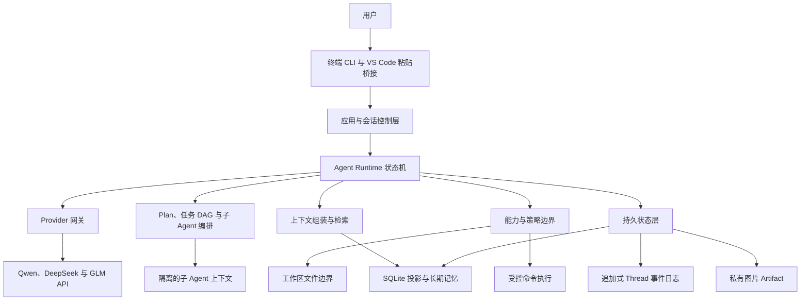

# EASY CODE 技术设计

[English](./TECHNICAL_DESIGN.md) | [返回 README](../README_zh.md)

本文介绍 EASY CODE 作为一个受控本地编程 Agent 的设计，重点说明架构决策、信任边界、状态管理、任务编排和可靠性。安装方式与 CLI 命令仍以主 README 为准。

## 1. 设计目标与边界

EASY CODE 的核心原则是：**模型负责提出操作，可信的本地 Runtime 负责判断操作是否合法，并拥有所有状态迁移的最终控制权。**

主要设计目标包括：

- **Runtime 权威性：**提示词用于指导模型行为，但不能授予权限。
- **最小能力：**每次模型请求只获得当前模式、角色和执行阶段真正需要的能力。
- **工作区安全：**文件访问限制在选定项目中，破坏性变更前必须验证文件版本。
- **持久执行：**对话、Plan、任务进度、子 Agent 结果和审计数据可以跨进程恢复。
- **证据优先：**文件和命令结果会被记录，任务完成必须附带可供用户或父 Agent 审核的结构化证据。
- **本地优先：**会话、记忆、图片和索引默认存储在本地。
- **安全降级：**语义检索等可选能力失效时，不影响权威状态的可用性。

EASY CODE 不是操作系统级 Sandbox。获准执行的项目程序或 Shell 命令仍使用启动 CLI 的操作系统账户运行。当前权限模型通过能力限制、命令分类和审批降低风险，但不等同于容器隔离。

## 2. 系统架构



| 层次 | 职责 |
| --- | --- |
| 交互层 | 终端输入、斜杠命令、加载反馈、Thinking 预览、Diff、任务状态和图片粘贴。 |
| 应用协调层 | 配置、凭据、工作区绑定、模型选择、Thread 生命周期、Resume 和界面展示。 |
| Agent Runtime | Turn 状态机、有效模式、能力选择、模型输出校验、工具循环和完成规则。 |
| Provider 网关 | 统一消息、结构化操作、Thinking、图片、超时、重试和 Token 用量元数据。 |
| 能力边界 | 把文件、命令、Plan、任务、记忆、上下文和子 Agent 操作表示为经过校验的结构化能力。 |
| 编排层 | 可审核 Plan、依赖感知的任务执行、子任务分配、结果收集和完成证据。 |
| 状态与检索层 | 权威 Thread 事件、可查询投影、Checkpoint、长期事实、语义索引和二进制 Artifact。 |

这种分层避免 Provider 差异扩散到工作区安全，也避免模型输出直接修改本地状态。

## 3. 请求生命周期与工作模式

一次普通 Turn 按以下控制流执行：

1. 应用先加载可信配置与凭据，再把低优先级项目规则作为不可信数据加载，绑定工作区并取得 Thread 的独占使用权。
2. 当前用户消息和图片引用先持久化，再开始 Agent 工作。
3. 在 Auto 模式中，受限控制请求通过结构化结果选择直接回答、Plan 或 Code，而不是匹配关键词。
4. Runtime 根据模式、Agent 角色、上下文压力、Plan 状态、任务状态和未收集的子任务计算实际能力集合。
5. 系统安全契约、环境信息、相关项目规则、活动对话、当前控制状态和少量检索记忆共同组成模型上下文。
6. Provider 返回内容先经过本地校验，随后才可能被接受或执行。
7. 操作请求、结果、状态迁移和 Token 用量都会追加到 Thread 历史。
8. 循环持续到最终回答、Plan 等待审核、任务阻塞、达到限制、失败或中断。
9. 符合条件的长期记忆只会在允许的成功 Turn 边界提交；Plan 阶段仅允许用户明确声明的长期偏好或项目约定。

### 模式语义

| 模式 | 设计目标 | 有效边界 |
| --- | --- | --- |
| Plan | 调查项目并提交结构化方案供用户审核。 | 只读工作区调查和安全检查；禁止项目变更和有副作用的执行。 |
| Auto | 让模型选择适合当前请求的工作流。 | 路由控制阶段没有工作区能力，可以直接回答受限的无工具请求，或进入 Plan/Code。 |
| Code | 直接实现并验证需求。 | 可以变更工作区并运行受控命令，但所有策略与审批仍然生效。 |

Plan 的批准、拒绝和调整都是明确的持久状态，不通过相似的用户文字进行猜测。已批准的执行如果在持久 DAG 接管前失败或中断，会返回审核状态，而不会被静默当成新请求；DAG 一旦处于活动状态，其持久状态就成为恢复控制面。

未完成的任务图或尚未收集的子 Agent 结果会让 Auto 保持 Code，防止父 Agent 放弃进行中的工作。上下文压力要求压缩时，Auto 会先完成压缩，再判断路由。

## 4. 能力、权限与信任模型

### 能力矩阵

| 能力类别 | Plan | Code 中的主 Agent | 子 Agent |
| --- | ---: | ---: | ---: |
| 读取工作区文本文件 | 是 | 是 | 是 |
| 使用兼容模型读取已验证图片 | 是 | 是 | 否 |
| 新建、更新或删除工作区文件 | 否 | 是 | 是 |
| 运行命令 | 仅安全检查 | 受策略控制 | 受策略控制，但不能交互审批 |
| 提交 Plan 供审核 | 是 | 否 | 否 |
| 管理任务图 | 否 | 是 | 否 |
| 创建或控制子 Agent | 否 | 是 | 否 |
| 维护长期记忆 | 严格受限 | 是 | 否 |
| 提交绑定的子任务结果 | 否 | 否 | 是 |

每一步模型请求都会重新计算能力集合。即使模型伪造一个未开放的能力请求，本地 Runtime 仍会拒绝。

### 指令信任边界

Runtime 与基础系统契约高于当前用户请求。项目规则可以约束工作方式，但不能授予文件系统、命令、网络、安装或凭据访问权限。

工作区文件、源码注释、命令输出、任务描述、检索记忆、图片、依赖元数据和生成物都被视为不可信数据。其中包含的指令不能扩大 Agent 权限。

### 工作区变更边界

文件操作只接受工作区相对路径，并同时校验路径文本与真实磁盘位置，从而拒绝绝对路径、父目录穿越、符号链接逃逸和 Windows junction 逃逸。

变更遵循“先检查，再修改”的协议：

- 新建文件不能静默覆盖现有目标。
- 更新或删除必须基于之前观察到的完整文件版本。
- 真正修改前会再次比较当前版本。
- 如果用户、编辑器、外部进程或其他 Agent 已经改动文件，本次操作会失败而不是覆盖。
- 成功变更会产生持久审计记录和带行号的终端 Diff。
- Resume 只会恢复仍与当前文件版本一致的历史读取授权。

主 Agent 与子 Agent 共享一个工作区。可能改变工作区的操作通过同一个公平队列串行执行，同时版本检查仍负责发现 EASY CODE 之外的并发修改。这个队列只能协调本应用，不能锁住用户编辑器或其他进程。

### 命令策略与审批

命令被表示为可执行程序、参数数组和工作区内的工作目录，普通输入不会被隐式交给 Shell 解释。

| 风险类别 | 策略方向 |
| --- | --- |
| 安全检查 | 可以无需审批运行。 |
| 项目代码、测试、构建或显式一次性 Shell | 需要精确审批；仅显式启用非交互批准的会话可以自动批准。 |
| 受约束的本地依赖安装 | 只允许受限制的项目本地 Registry 安装，并禁用生命周期脚本。 |
| 系统配置、全局安装、直接远程/网络工具、破坏性命令、动态下载执行或远程 Git 写入 | 结构化直接调用会被拒绝；显式 Shell 属于另一种需要精确审批的高风险能力，Runtime 不会对脚本语义提供 Sandbox。 |

审批会绑定到具体的程序、参数、工作目录和相关项目材料。模型提供的意图说明不会影响风险分类。关闭审批提示后，需要审批的命令会直接失败；自动批准不会改变直接策略拒绝项或 Plan 边界。用户批准的 Shell 脚本仍可以执行脚本中表达的全部操作，因此必须把整个脚本作为一个高风险单元进行审核。

子进程只获得少量允许的环境变量。命令具有取消、超时、进程树清理、输出上限、敏感信息遮蔽以及执行前后工作区快照。

永久命令分类只针对顶层调用。获批的 Shell、解释器或项目程序仍可能访问网络、读取工作区外文件或启动其他程序，非交互批准也可能自动批准原本需要提示的 Shell。工作区快照只是有限审计辅助，不是完整监控或回滚：它会忽略 Git 元数据、依赖目录和私有状态目录，也可能因文件数量上限而截断。因此，执行范围较大的未知任务时仍建议使用隔离项目或容器。

### 凭据与私有状态

API Key 通过隐藏输入、操作系统凭据存储或显式环境变量读取。工作区配置不能设置 API Key、Provider Base URL 或 EASY CODE 私有数据目录，但仍可选择 Provider、模型、模式、思考强度、审批策略和预算等普通工作流选项。查看配置只显示是否已配置，不显示密钥值。兼容路径仍可能读取旧版用户级明文 Key，因此建议迁移到操作系统凭据存储。

Runtime 生成的错误、命令数据、任务与记忆通道以及其他已知控制面输出会进行长度限制、控制字符清理和常见敏感信息遮蔽。这属于纵深防御而不是完整 DLP：源码内容、文件 Diff、用户消息和最终模型文本并不经过统一 DLP，为完成任务而读取的源码仍可能被发送给当前选择的模型 Provider。

私有状态始终保存在所选工作区之外，以降低误提交风险；可信用户配置只能把它迁移到另一个仍位于工作区之外的位置。EASY CODE 当前不会在应用层加密这些数据，其机密性仍依赖操作系统账户和文件权限。

## 5. 持久状态与 Resume

EASY CODE 采用事件优先的会话模型：

- 每个 Thread 都有顺序追加日志，保存对话与重要控制状态迁移。
- SQLite 提供 Thread 查询、Turn、审计和长期记忆等可查询投影；Token 用量从持久 Thread 事件中聚合，而不是依赖专门的用量投影。
- Checkpoint 用于加速恢复，但不能覆盖更晚的权威事件。
- 图片保存在私有 Artifact 区，事件日志只保存经过验证的元数据和引用，不保存 Base64 图片内容。

事件日志覆盖用户与助手消息、结构化操作及结果、模式决策、Plan 审核、上下文压缩、任务迁移、子 Agent 生命周期、文件与命令审计，以及 Provider 返回的用量。稳定身份和顺序号使状态回放具有确定性，也使重复投影保持幂等。

Resume 会重建最新有效状态，再修复可查询投影。已完成的工作会被保留，但未完成的命令、Provider 请求或旧子 Agent 进程不会自动重跑。中断操作会被明确表示，防止模型误认为它已经成功。

恢复还遵循以下规则：

- 可以安全丢弃不完整的最后一条日志记录；已建立历史中的损坏会失败关闭。
- Thread 租约阻止两个本地进程同时拥有同一会话。
- 历史文件版本会与当前工作区重新校验。
- 已批准 Plan 在尚未转化为持久 DAG 时，会在执行中断后返回审核状态。
- 已持久化的子 Agent 结果和 Artifact 可以恢复；没有可信结果的任务占用会被释放。
- 已由事件确认的压缩边界、Plan 或任务迁移不能被过期 Checkpoint 回滚。

## 6. 上下文与记忆架构

短期上下文与长期记忆解决不同问题，生命周期也不同。

### 短期上下文

短期上下文属于单个 Thread。其持久状态包括活动对话、Provider 返回的 Thinking、受限工具结果、Plan 与任务状态、已收集的子 Agent 结果、图片引用和一份累计工作摘要。

完整消息内容即使经过压缩也仍保留在持久事件历史中；它只会在明确的压缩边界前移前继续进入活动模型上下文。上下文压力基于可配置的字符预算，并随思考强度缩放：

| 压力 | Runtime 行为 |
| --- | --- |
| 低于 60% | 不干预。 |
| 达到 60% | 提醒模型考虑压缩。 |
| 达到 80% | 要求下一步必须压缩上下文。 |
| 达到 90% | 插入强制压缩请求。 |

模型负责生成累计语义摘要，Runtime 负责校验长度、清理疑似敏感信息并保证压缩边界只能单调前移。摘要会作为“不可信历史数据”重新注入，因此不能覆盖较新的用户输入。

单次请求过大时可以临时裁剪较旧内容，以保证 Provider 调用安全。这个降级不会改写正式工作摘要，也不会推进持久压缩边界。终端中的 Token 数是跨语言近似值；压力控制实际使用配置的字符预算。

### 长期记忆

长期记忆以规范化工作区为作用域，可以跨 Thread 使用。它保存短小、原子化、可独立检索的事实，而不是对话全文。

适合保存的内容包括长期用户偏好、项目约定、已验证架构、明确决策和稳定环境信息。秘密、不确定结论、尚未验证的方案以及一次性任务细节会被拒绝。

记忆生命周期由模型提出、Runtime 控制：

1. 提出变更前先搜索相关已有事实。
2. 新增、修订或失效操作必须绑定当前 Thread、Turn 和证据。
3. 候选变更在执行过程中保持暂存。
4. 完整批次只会在允许的成功 Turn 边界原子提交；Plan 阶段只能提交用户明确声明的长期偏好或项目约定。
5. 修订与失效保留审计历史，而不是静默覆盖。

SQLite 是长期记忆的权威存储。检索综合词法相关性、本地向量语义相似度和置信度信号。语义索引只是可重建投影：本地推理或向量索引不可用时，记忆仍可通过词法搜索使用，并在之后补全向量。

用户可以查看短期和长期记忆，但不能直接编辑内部记录，从而防止手动操作绕过证据与生命周期规则。

## 7. Plan 与任务 DAG 编排

可审核 Plan 和任务 DAG 是相关但不同的控制机制：

| 机制 | 目的 |
| --- | --- |
| 可审核 Plan | 在实现前与用户确认方向。 |
| 任务 DAG | 进入 Code 后约束执行顺序、所有权、产物和验收条件。 |

是否需要 DAG 由模型根据复杂度判断。短小、线性的任务应继续使用普通单 Agent 循环。存在依赖分支、多个独立阶段、多个产物或明确质量门禁时，才适合建立 DAG。

每个任务节点包含稳定标识、名称、目标、依赖、输入、预期产物、完成检查、失败处理、所有者、状态和证据。

Runtime 强制以下图约束：

- 任务标识唯一，依赖必须存在，并且图中不能有环。
- 所有前置任务完成后，节点才能开始。
- 主 Agent 同时只能拥有一个进行中的节点。
- 活动任务图存在时，必须先启动或分配符合条件的节点，才能使用工作能力。
- 每一项完成检查都必须对应一条具体证据。
- 图仍处于活动状态时，普通最终回答会被拒绝。
- 阻塞只用于真实外部条件，而不是非正式暂停。
- 任务文本是不可信数据，不能授予额外权限。

每个合法迁移都会持久化，因此 Resume 后可以重建任务编号、所有权、状态、阻塞原因和完成证据。

## 8. 隔离子 Agent

子 Agent 是由主 Agent 控制的隔离 Worker，而不是共享同一个实时对话的平级 Agent。

```text
父 Agent
  ├─ 发送有界任务和必要上下文
  ├─ 查看状态或追加范围明确的指导
  ├─ 子 Agent 在私有 Code 对话中工作
  └─ 收集有界结果与逐项完成证据
```

子 Agent 可以认领一个依赖已经满足的 DAG 节点；没有未完成 DAG 时，也可以接受带明确完成检查的独立任务。它继承当前 Provider、模型和思考强度，但不会继承父会话全文。

子 Agent 能力被刻意收窄：

- 不能继续创建子 Agent。
- 不能管理或重写任务图。
- 不能维护长期记忆。
- 不能切换到 Plan 或改变父 Agent 工作流。
- 生命周期和最终报告只绑定一个任务，并且必须返回结构化证据或真实阻塞原因。底层文件能力仍覆盖所选工作区，受普通工作区边界约束，而不是按任务隔离的文件系统 Sandbox。

父 Agent 可以查看、等待、追加指导或请求停止。所有子 Agent 结果必须在父 Agent 结束、建立新任务图或进入 Plan 前被收集。

并发额度随思考强度变化：none/low 最多两个，medium 最多四个，high 最多八个。并行执行可以把搜索和中间日志隔离在子上下文中，共享工作区变更仍然串行执行以减少冲突。这提供的是上下文隔离和受控并行，而不是 Worktree 或进程级文件系统隔离。

子 Agent 的分配、生命周期迁移和最终结果会带身份归属并持久化。结果被收集后，文件与命令审计会携带子 Agent 身份合并进父 Thread；子 Agent 的私有对话、每一步模型调用和完整中间日志不会作为独立可恢复会话保存。Resume 恢复持久控制状态和已完成结果，但不会恢复旧进程中的 Worker。

## 9. Provider 与多模态设计

Provider 网关为 Qwen、DeepSeek 和 GLM 统一消息、结构化操作、Thinking、图片输入、重试、超时和用量元数据。

模型能力来自显式目录。视觉能力和可配置思考能力按保守策略处理；未知或不支持的组合不会收到未经确认的 Provider 参数。超时预算随思考强度扩展，重试只针对有限的临时传输或服务错误。

图片遵循 Artifact 边界：

1. 本地解析并验证剪贴板或工作区图片。
2. 检查静态格式、尺寸、像素量、字节大小和完整性。
3. 把图片复制到所选工作区之外的 Thread 私有存储。
4. 持久状态只保存元数据、哈希和稳定的 `[Image #N]` 引用。
5. 仅在兼容视觉模型真正发起请求时加载图片字节。

这样可以避免大型二进制数据进入 SQLite 和 Thread 事件日志，同时保留顺序、完整性与 Resume 能力。

## 10. 可靠性、可观测性与 Token 效率

EASY CODE 提供足够的本地证据，让用户和 Runtime 能区分真实进度、卡住状态和未经验证的结果：

- 模型调用有可见加载状态、取消、受限重试和明确超时。
- Thinking 与对应助手消息一起持久化，但默认只显示短预览。
- 文件变更提供带行号的 Diff。
- 命令记录策略、退出状态、持续时间、受限输出和检测到的工作区变化。
- Plan、任务节点和子 Agent 分配拥有明确状态，而不依赖自然语言猜测。
- Provider 用量可按 Provider/模型、请求用途和主/子 Agent 累计。
- Provider 未返回用量时会标记为未知，而不会伪造精确账单数据。请求如果在收到完整 Provider 响应前失败，就没有精确 Token 记录，因此累计值可能低于 Provider 账单视图。

Token 效率由多种策略共同实现：

- Auto 可以在路由请求中直接完成受限的无工具回答，避免第二次模型调用。
- 系统指令只包含当前步骤真正开放的能力规则。
- 旧上下文在受控边界被累计摘要替代。
- 长期记忆只检索少量相关事实，不把整个记忆库注入上下文。
- 子 Agent 搜索日志保留在私有上下文，父 Agent 只接收有界结果。
- 图片保持引用形式，直到兼容视觉请求真正需要字节。
- Token 用量事件和大多数审计元数据不会重新进入模型上下文。

## 11. 权衡与扩展方向

当前设计明确接受以下权衡：

- 策略与审批不是 OS Sandbox。
- 子 Agent 共享一个工作区；串行变更降低冲突，但不提供 Worktree 隔离。
- Provider 响应目前按完整结果处理，因此加载动画用于反馈存活状态，最终文本不会逐 Token 流式输出。
- 本地语义记忆优先考虑可安装性、隐私和可重建性，而不是超大规模检索。
- 追加式历史提高恢复和审计能力，但长期 Thread 未来可能需要日志分段和归档。
- 结构化完成证据提升可控性和可审核性，但不构成对模型声明的独立证明。
- 敏感信息遮蔽可以降低常见意外泄漏，但不是完整 DLP 系统。

现有架构为新增 Provider、新能力策略、可配置子 Agent 角色、更通用的 DAG 调度、流式传输、Worktree/容器隔离以及远程或团队状态后端保留了扩展点。新增能力仍应遵循同一原则：模型只提出状态迁移，可信本地代码负责校验并提交。
