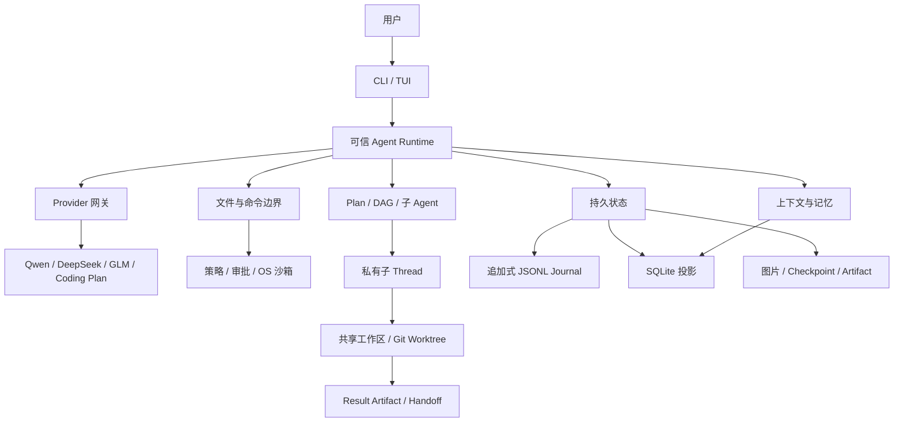

# EASY CODE 技术设计

验证目标标识、测试/配置基线、reviewer 实验绑定、调查停滞窗口和压缩字段局部修复的当前机制见[进展与上下文可靠性](./PROGRESS_RELIABILITY_ZH.md)。这些机制与 Provider 无关，不修改命令授权或 Benchmark 联网策略。

[English](./TECHNICAL_DESIGN.md) | 简体中文 | [返回 README](../README_zh.md)

本文描述 EASY CODE 当前实现的稳定边界，而不是源码函数或行号索引。安装、配置和命令用法见 [README](../README_zh.md)。

当前跨 Agent 记忆、五轮审查和双份独立摘要机制见[统一记忆与有界审查](./UNIFIED_MEMORY_ZH.md)。

## 1. 目标与原则

EASY CODE 把模型视为规划与代码生成组件，而不是权限、状态或完成条件的裁决者。模型只提出结构化意图；是否允许、如何执行、何时持久化以及能否视为完成，都由本地 Runtime 决定。

系统遵守以下原则：

1. **数据不能授予权限。** 文件、模型输出、命令输出、图片、检索结果、记忆、任务文字和 Artifact 都是不可信数据。
2. **先校验，后产生副作用。** 每个动作先经过模式、角色、Schema、工作区、策略和状态校验。
3. **先持久化，后激活。** 关键转换先形成权威记录，UI、父 Agent 或恢复流程才可观察到它。
4. **隔离层职责分开。** 私有 Thread 隔离上下文，Git Worktree 隔离源码状态，操作系统沙箱隔离进程。
5. **派生状态不能覆盖权威状态。** SQLite 投影、Working Checkpoint、向量索引和 TUI 都可重建，Thread Journal 才是恢复依据。
6. **恢复不猜测成功。** 中断、超时或缺少完成证据的操作不会被静默重放或标记完成。

EASY CODE 是本地优先而非完全离线：项目操作和状态保存在本机，推理请求仍发送到用户选择的供应商。权限、身份、沙箱或恢复状态不明确时一律安全失败。

## 2. 架构与技术栈



各层责任按以下方向收敛：

- UI 只提交用户动作并展示状态，不决定权限或完成条件。
- Provider 只完成模型协议转换，不直接获得工作区能力。
- 工具和编排层提交经过校验的结果，不能自行改写 Thread 历史。
- 持久层保存权威事件，派生索引和界面都从这些事件恢复。

| 领域 | 主要技术 | 责任 |
| --- | --- | --- |
| Runtime | TypeScript、Node.js 20+ | 控制流、状态和工具执行。 |
| CLI/TUI | Commander、Chalk、Node 终端 API | 命令、常驻界面和非 TTY 降级。 |
| 契约 | JSON Schema、Zod、TypeScript 类型 | 校验工具、配置和持久数据。 |
| Provider | OpenAI-compatible Chat Completions | 统一消息、工具、Thinking、图片、重试和用量。 |
| 持久化 | JSONL、SQLite WASM | 权威事件、查询投影、记忆与审计。 |
| 检索 | FTS5、ONNX Runtime、Orama | 关键词与语义混合检索。 |
| 执行隔离 | Anthropic Sandbox Runtime、Git Worktree | 进程边界与源码状态隔离。 |
| 分发/集成 | npm、Prompt Bundle、VS Code 扩展 | 可信资源安装和终端增强。 |

模型不能直接访问文件系统、进程、数据库或 Git，只能调用本次请求公开的结构化能力。系统规则、模式说明和工具描述位于版本化 Prompt Bundle 中；Manifest 绑定资源版本与内容，启动时校验并加载为只读视图。Prompt 文本只解释能力，真正的 Schema、权限与状态转换编译在 Runtime 中。

配置按默认值、可信用户配置、安全项目配置、环境变量和显式 CLI 参数合并。项目配置不能重定向凭据、Provider 地址、应用数据根或托管 Worktree 根；`EASYCODE.md` 只能提供低信任项目指导。

## 3. 请求生命周期与工作模式

一次主回合的高层流程是：

1. 校验 Prompt Bundle、配置和凭据，加载项目规则并取得 Thread Lease。
2. 绑定规范化工作区，先持久化用户消息与图片引用。
3. Auto 模式用受限控制请求选择直接回答、Plan 或 Code。
4. 组装 Working Checkpoint、近期消息、检索证据、长期记忆和本步系统 Prompt。
5. 按模式、角色、Plan/DAG、上下文压力和执行权限裁剪工具。
6. 调用 Provider，校验普通文本、Thinking 和结构化动作，再执行允许的副作用。
7. 保存模型请求、工具结果、用量和状态转换，循环至审核、成功、阻塞、限制或中断。
8. 只有到达允许的成功边界，才提交本回合暂存的长期记忆。

| 模式 | 语义 |
| --- | --- |
| `plan` | 以调查和正式可审核方案为主，尽量避免直接文件编辑；命令遵循审批、可以写入，普通文本不能替代方案。 |
| `auto` | 受限控制器选择直接回答、Plan 或 Code；控制器没有工作区工具。 |
| `code` | 直接实现与验证，但文件和命令仍受全部安全边界约束。 |

Auto 使用结构化选择而非关键词匹配。只有无需工作区、工具和副作用的有界请求才能直接回答。Plan 的同意、拒绝和反馈都是持久转换；已批准但尚未被执行 DAG 接管的 Plan 若中断，会回到审核。

执行中调整按 FIFO 独立持久化，在模型前后、工具之间或最终回答前的安全边界封存一个待处理前缀。调整能改变方向，但不能改变权限、沙箱、任务所有权或 Agent 身份；过期响应中尚未启动的工具不会执行。

`none/low/medium/high` 默认分别为 40/40/40/80 步，子 Agent 默认并发上限分别为 2/2/4/8 个，由 `[limits.maxConcurrentSubagents]` 配置，并随父 Agent 当前 thinking 强度切换。运行预算使用 `[limits]` 配置，详见 [完整配置示例](config.example.toml) 和 [轻量 Runtime 说明](LIGHTWEIGHT_RUNTIME.md)。`/orchestration` 控制 DAG/子 Agent 新建，默认关闭，reviewer 独立保持开启。所有强度共用同一个上下文预算和压缩阈值。尚未观察终态的后台命令、活跃 DAG 或未收集子 Agent 会阻止普通最终回答。上下文压力由 Runtime 维护流程处理；必需输入仍放不下时返回可恢复容量限制，不再要求模型反复修复压缩 Schema。

## 4. 信任、安全与沙箱

指令优先级为 Runtime 强制策略与基础契约、当前用户请求、最近的工作区 `EASYCODE.md`、父目录规则、用户级规则。项目内容、依赖元数据、检索证据和命令输出只能作为数据，不能增加能力。

Runtime 每次调用都会依据模式、主/子 Agent 角色、Plan/DAG 阶段、未收集结果、上下文压力、模型能力、审批状态和沙箱可用性重新生成工具集合。未知工具、错误 Schema 或非法转换在执行前被拒绝。

受保护文件工具只接受工作区相对路径，同时校验词法路径和真实路径；绝对路径、父目录穿越、符号链接/Junction 逃逸、Git 控制目录和 Runtime 私有目录均被拒绝。创建不覆盖已有目标，更新和删除需要先读取并在写前比对内容身份；并发变化报告冲突，成功修改产生持久 Diff。共享子 Agent 写入还会串行化。

命令使用已解析可执行程序、参数数组、受限工作目录、环境、超时和输出上限，而不是默认执行任务中的 Shell 字符串。受保护执行依次经过：能力判断、命令策略与审批、OS 沙箱。永久拒绝规则先于用户批准；Thread 可授权同一规范化可执行程序，但授权不跨 Thread。后台子 Agent 不能弹出审批或创建新授权。

短命令同步返回；长命令使用分离的启动、轮询和取消协议，并绑定发起 Thread/Agent。任务结束前必须观察命令终态；超时、取消或退出会回收进程树，输出保留有界头尾摘要。

| 平台 | 沙箱边界 |
| --- | --- |
| Windows | 随包 Anthropic Sandbox Runtime 后端，目前为 alpha，可能需要一次 UAC 初始化。 |
| macOS | 等待内核级后代进程监督实现，严格命令暂时拒绝；文件工具可用。 |
| Linux | bubblewrap，依赖 `bubblewrap`、`socat`、`ripgrep` 和可用的非特权用户命名空间。 |

工作模式、审批主体和环境相互独立。手动模式审批每条新命令；帮我批准由无工具的独立审批 Agent 判断，拒绝/失败转用户；完全访问使用宿主机、不加命令沙箱。带范围的前缀权限支持 Resume 和子 Agent 共享。Plan 尽量避免直接编辑，命令获批可以写入。Benchmark 固定离线容器内完全访问。详见[命令权限](COMMAND_SECURITY_ZH.md)。

本地命令使用统一 Runtime 元数据规范化：缺少验证分类不再阻止执行。路径按工作区真实边界校验、argv 按字面传递，不再以 Shell 写法判断安全性，每条新命令走所选审批主体，不靠静态风险标签自动放行。输出展示裁剪前生成独立 `validation` 证据；管道返回 0 不等于测试通过，无法判断时记未知。ProgressGuard 仅以高置信通过清除停滞，失败签名跨独立验证周期计数，轮询去重。Windows 取消/超时先结束后代，再保留可信 worker 恢复 ACL，最后关闭 Job。详细合约见[命令易用性与验证证据](COMMAND_SECURITY_ZH.md#证据恢复与测试)。

Key 位于操作系统凭据存储或显式环境变量中，项目配置不能保存或重定向它们。标准 GLM 与 GLM Coding Plan 使用不同凭据和端点，绝不互相回退。受保护命令默认不继承供应商 Key；模型错误、日志、Checkpoint、Summary、检索和记忆都会脱敏并过滤终端控制字符。

## 5. 持久状态与 Resume

每个 Thread 有独立的追加式 JSONL Journal，事件具有连续序号、唯一身份、时间、阶段和结构化载荷，并在追加后刷新到磁盘。Thread 执行状态以 Journal 为权威来源；SQLite 保存会话/用量投影、Working Checkpoint、检索材料，以及长期记忆。长期记忆记录、来源和修订表本身是 SQLite 中的主数据，不能当作可随意丢弃的向量缓存。Thread 投影失败不能撤销已追加的事件，过期投影可通过回放修复。图片字节、子 Agent 结果和 Worktree 描述保存在私有文件中，Journal 保存引用与完整性信息。

增量 Checkpoint 减少长 Thread 的重复写入。Delta 绑定精确 Journal 基准，只允许追加消息、更新设置/文件观察、追加变更/命令，以及让压缩状态前移；Plan、DAG、审批和执行中调整仍由事件决定。Schema、大小或基准不匹配会拒绝提交，旧版全量快照仍可恢复。

持久状态包括消息与工具结果、模式/模型/Bundle 身份、工作摘要与意图账本、压缩事务和降级预算、Plan/DAG、文件观察与 Diff、命令与 Thread 授权、待处理调整、子 Agent/环境/Artifact 绑定，以及 Provider 上报用量。模型上下文中的 Working Checkpoint 是确定性、有界、可重建的 SQLite 投影，不是 Thread 恢复 Checkpoint，也不是权威状态来源。

Resume 先取得 Thread Lease 并校验工作区与 Bundle，再从兼容 Checkpoint 开始按 Journal 顺序回放，修复 SQLite 投影，追平检索索引，并重新验证文件、授权和托管环境。中断请求和命令不盲目重放；无完成证据的任务不变成成功；未接管的已批准 Plan 回到审核；缺失 Worktree 只有在身份与快照可验证时重建。

只有末尾不完整的 Journal 记录可在确认后截断；中部损坏、重复 ID、序号断裂或持续并发变化会停止恢复，而不是跳过证据。

## 6. 统一记忆管理与上下文恢复

本节描述当前 provider 无关实现，覆盖短期上下文、thinking、摘要、长期记忆、历史检索和容量降级。历史 Summary V2 读取器和 MicroCompaction 辅助函数不代表当前每轮请求策略。更细的恢复约束见 [Runtime 上下文维护契约](semantic-compaction-v3.md) 和 [上下文可靠性说明](CONTEXT_RELIABILITY.md)。

### 6.1 分层、权威来源与隔离范围

以下是逻辑职责，不是六套独立数据库：

| 层 | 内容与权威来源 | 范围 / 模型可见性 |
| --- | --- | --- |
| 活跃对话 | 持久 `messages` 在 `compactedMessageCount` 之后的投影；当前用户文字、模型正文/thinking、工具调用及结果。 | Thread 私有；发送活跃投影，不发送全部存储历史。 |
| 工作摘要 | `workingSummary`：已接受的语义交接，或确定性的未完成/未验证降级说明。 | Thread 私有；属于历史解释，不是验证证据或权限。 |
| Runtime 连续性状态 | 用户要求、约束、意图账本、Plan/DAG、变更、待处理工作、失败、reviewer/实验状态。 | 从权威状态恢复并独立注入，不依赖摘要是否完整。 |
| 历史证据 / RAG | 脱敏后的消息材料、工具证据、已接受摘要快照、关键词索引和可选向量。 | 精确工作区 + Thread；按需取回有界片段。 |
| 长期记忆 | 原子化偏好、约定、架构、决策、环境事实；SQLite 保存来源与修订。 | 同一逻辑工作区内跨 Thread 共享，不是所有对话的归档。 |
| Journal / 恢复存储 | 追加式 Thread 事件、兼容恢复 Checkpoint、私有证据和附件。 | 用于本地持久化和回放；存储不等于自动注入 Prompt。 |

工作区身份由规范化的绝对工作区根路径生成，Windows 下统一大小写。父子 Thread 的对话与历史检索互相隔离；子 Agent 接收有界任务材料并返回有界报告，不把完整 thinking 交给父 Agent。子 Agent 可以接收所属逻辑工作区的精选记忆，但没有主 Agent 的长期记忆修改能力。

### 6.2 一次普通请求：短期上下文与 thinking

普通请求按以下顺序组装消息：

```text
稳定系统指令                                      （工具 Schema 单独提供）
→ workingSummary（如果存在）
→ compactedMessageCount 之后的活跃消息              （包含保持原样的近期 thinking）
→ RUNTIME_CONTINUITY_STATE                         （必需控制事实）
→ RUNTIME_CONTEXT_DATA                             （工作区补充 + 精选记忆/证据）
```

动态检索材料不放入稳定系统前缀，以利于前缀复用；这不是 Provider 缓存命中的保证。消息构建器不会为了凑容量而悄悄修改持久消息或截断 thinking。当前通用消息/thinking 投影是非破坏性的；大工具正文由后文的独立有界投影处理。

Thinking 以 `reasoning_content` 保存，不逐段改写，也不在下一次模型响应后立即删除。较早的完整交互可以整体退出活跃上下文；紧急最小重建也可整体移出最新一组**已闭合**交互及其 thinking。普通 RAG 不索引 thinking；必要时可通过精确历史消息引用读回序列化消息。UI 折叠或展开 thinking 不改变此策略。

`RUNTIME_CONTINUITY_STATE` 保留已退出活跃消息的普通用户要求原文并脱敏，不只保留意图账本摘录。它还携带目标/约束、Plan/DAG 所有权与要求、最新文件变更、待处理调整、命令与子 Agent 句柄、未解决命令结果、停滞事件、review 预算和未验证 review/实验状态。无关命令成功不能抹去先前失败；摘要不能完成任务、解决失败或重置执行/reviewer 预算。

工作区补充中的 Working Checkpoint 是近期文件/变更/命令和任务状态的确定性、有界恢复地图，不需要调用摘要模型，并避免重复注入已有连续性数据。它既不是 Thread 恢复 Checkpoint，也不能取代权威 Runtime 事实。

### 6.3 长期记忆生命周期

`manage_memory` 按当前能力配置提供 `search`、`recall`、`remember`、`revise` 和 `forget`。历史回读与长期存储是不同动作；摘要和 RAG 命中不会自动成为持久项目事实。

1. 提出五种类别之一的单条原子事实，通常为 8–120 字符。Runtime 拒绝敏感信息、猜测和明显的任务流水账；这些检查不是通用的真假判定器。
2. 对 `remember`/`revise`，应用 Runtime 要求 `sourceRefs`。`user` 必须对应用户明确表达的长期偏好/约定或决策；项目/环境事实目前要求同一工作区、同一 Thread 内成功、未截断且包含文件版本的 `read_file` 证据。证据身份只校验来源，不保证任意自然语言结论都能由它推出。
3. 校验后暂存变更。工具返回“已暂存”不等于已写入数据库。`revise`/`forget` 必须使用本回合搜索返回的记忆 ID；`forget` 不要求新的事实来源证据。
4. 只有允许的 `turn.completed` 结果才提交已验证批次：`success`，或用户有明确持久意图、且仅写入 preference/convention 的 `planned`。失败、中断和触及上限的回合不提交提案。每回合最多八次记忆变更。
5. SQLite 事务提交记忆和修订历史；向量属于派生数据，其失败不撤销有效记忆提交。同类别、规范化内容完全相同的 `remember` 是 no-op，不刷新时间戳或置信度。
6. 自动检索重新校验来源文件路径和哈希。来源变化、缺失、路径不安全，以及缺少依据的旧版项目事实，会变为 `needs_verification` 并停止自动注入。显式审计/搜索仍可查看不能自动使用的记录。

同一工作区的新 Thread 保留长期记忆及修订。长期记忆仍只是有来源的陈述，不能授权跳过当前文件读取、版本校验或任务验证。

### 6.4 历史 RAG 与统一回忆预算

Thread 索引增量处理新持久化的用户文字、模型公开正文/工具名、有用工具结果及已接受的语义摘要快照；不索引系统指令和 thinking。缺少语义快照元数据的紧急降级说明不会自动成为语义摘要索引条目；先前摘要文本仍可通过 Journal 引用恢复。

单个索引来源最多保留 96,000 字符，并明确记录头尾保留与中间省略。分块保存来源偏移、哈希，以及可用的文件路径/版本/行号元数据。固定本地 `paraphrase-multilingual-MiniLM-L12-v2` 模型产生 384 维向量，每个分词窗口最多 128 Token，包含特殊 Token；分词器不可用时退回 1,400 字符窗口、160 字符重叠。较长 Embedding 输入聚合多个窗口，不默默丢掉尾部。Embedding 的 Token 单位与聊天上下文估算不是同一回事。

SQLite 提供关键词搜索及适合中日韩文本的回退；可选本地向量和可丢弃的 Orama 缓存提供语义候选。Thread 关键词/向量排名融合后去重。后台补齐向量期间仍可使用关键词检索，向量失败退回词法搜索；查询 Embedding 本身仍有本地计算成本。检索使用本地数据与推理，不调用外部网页搜索或聊天模型 API；准备缺失模型资源时可能另行下载。

每次普通请求前，记忆控制器：

1. 根据当前任务/用户要求、命令结果和相关路径生成最多三个有界查询；查询/状态签名变化时更新缓存候选。
2. 搜索工作区长期记忆与私有 Thread 历史。普通自动历史检索仅覆盖 `compactedMessageCount` 之前；显式历史搜索可查看当前 Thread 中超出这一自动边界的已有消息。
3. 排除非活跃/临时记忆、不相关命中、完全重复、已经可见/覆盖的证据，以及已知过期文件版本。相似度不代表相关性或时效性。
4. 两种来源共用**一份预算**：通常 2,000 个估算 Token；压缩边界/DAG 节点变化，或最新命令尚不是已观察到的零退出结果时，上限可扩展到 6,000，总计最多六项。后一条件也包含运行中的命令。额度还受 `floor(maxContextChars / 24)` 和启用时 `maxContextTokens` 的 8% 限制。
5. 请求有压力时先移除可选回忆，再考虑移出活跃历史。检索是补充信息；Runtime 不会为了塞入更多 RAG 命中而牺牲必需任务状态。

### 6.5 工具输出、证据捕获与精确回读

Runtime 在面向模型的裁剪之前，将脱敏后的结构化工具数据捕获到不可变、工作区/Thread 隔离的证据存储，最多 1,000,000 字符。捕获对象是工具实际返回的数据：命令和文件读取可能已经有界。证据库与 Journal 都不承诺保存无限原始 stdout。截断状态、已捕获内容哈希和分页信息保持明确。

普通输出投影返回相关诊断与有界头尾文本。命令调查/成功/失败默认分别为 12,000/2,000/8,000 字符，最多八条诊断；重复轮询返回增量或变化后的终态，避免反复发送相同正文。文件定位默认 100 行，单次允许最多 1,000 行，同时受 12,000 个估算 Token 的读取结果上限约束。

每组多工具交互的正文合计预算为 16,000 个估算 Token，即使没有高压力也会控制。压力下，至少 4,096 字符的较早正文可替换为引用；批次合计超额时也可能引用更小的单条正文。调用/结果身份与协议顺序保留，投影不覆盖规范持久消息。

当前能力配置开放 `manage_memory` 时，`recall` 支持按精确 ID 分页：

| 引用 | 无需重新执行即可读取的内容 |
| --- | --- |
| `evidence_…` | 捕获的结构化工具证据。 |
| `context_…` | 一个已索引历史分块，不是无限原始进程输出。 |
| `ev_…` | 当前 Thread Journal 中匹配的工具消息或命令审计。 |
| `journal_message_<index>` | 精确存储的消息，存在 reasoning 时一并包含。 |
| `journal_summary_<sha256>` | 已归档的恢复摘要版本。 |

回读默认每页 8,000 字符，最多 16,000 字符。引用受范围和脱敏校验约束，不授予跨 Thread 权限。历史代码/结果可能过期，引用不证明当前 Checkout 通过验证。

### 6.6 容量计量与配置

运行配置位于 `[limits]`，当前值以 [Runtime 默认配置](../src/config/runtime-defaults.json) 和 [配置示例](config.example.toml) 为准。上下文策略对所有 thinking 强度和 Provider 相同。none/low/medium/high 默认分别 40/40/40/80 步，子 Agent 并发上限为 2/2/4/8 个；上下文容量不随强度倍增。降低强度不会取消已有子 Agent，但达到新上限时拒绝新建。共享 Token、请求预算和每轮子 Agent 创建总数上限保持不变。

`maxContextTokens = 0` 表示未启用模型 Token 窗口。默认 `maxContextChars = maxActiveContextChars = 250000` 指**字符，不是 250,000 个模型 Token**。字符模式可用输入容量为 `min(maxContextChars, maxActiveContextChars) × (1 - toolReserveRatio - safetyReserveRatio)`，默认 212,500。控制器 80% 维护触发点约为 170,000 个请求字符，包含指令、Schema 和 Runtime 状态，不只是屏幕上的对话正文。

当 `maxContextTokens` 非零时，该窗口成为主要运行容量。provider 无关估算统计文字、thinking、工具参数/Schema、消息开销和图片估算，并按端点/模型/模态，利用近期实际输入用量保守校准。校准保存比例，不再保存一份对话。它不是模型原生精确分词器，也不会自动发现 Provider 的真实窗口。

配置 Token 窗口为 `W` 时，默认可用输入容量为：

```text
W - min(maxResponseTokens, floor(W × 0.20))  [输出预留；maxResponseTokens = 16384]
  - min(8192, floor(W × 0.10))              [后续工具预留]
  - max(512, ceil(W × 0.05))                [安全余量]
```

| 配置 | 默认值 | 含义 |
| --- | --- | --- |
| `contextCompactionTriggerRatio` | `0.8` | 相对于可用输入容量的维护触发点。 |
| `contextCompactionTargetRatio` | `0.55` | 期望余量，不是强制验收阈值。 |
| `contextCompactionMinGrowthRatio` | `0.1` | 增长冷却，避免微小变化后反复付费摘要。 |
| `compactionRetainRecentExchanges` | `5` | 优先保留的近期完整交互数量；恢复时可减少。 |
| `modelContentRetries` | `2` | 所有 Agent 和辅助模型协议统一纠正两次（共三次）；仅长度超限仍直接本地裁剪。 |
| `contextSummaryMaxTokens` | `2048` | 含 JSON 包装的摘要存储估算上限，不是服务端生成上限；同时保留 12,000 字符存储限制。 |
| `providerResponseMaxBytes` | `16777216` | 独立 HTTP 安全上限（16 MiB），不再由工具展示长度推导。 |
| `contextToolBatchTokens` / `contextToolReferenceMinChars` | `16000` / `4096` | 工具正文合计预算 / 较早正文引用阈值。 |
| `contextMaxRebasesPerRequest` | `1` | 每个持久用户请求范围的紧急重建额度；`0` 禁用。 |
| `contextMaxCapacityRetries` | `1` | 已分类 Provider 容量拒绝后的较小普通请求重试次数，当前运行内有界。 |
| `memoryAutoTokens` / `memoryRecallTokens` | `2000` / `6000` | 可选回忆共享上限，不是每种来源各有一份。 |
| `memoryMaxItems` / `memoryMaxQueries` | `6` / `3` | 共享入选条目数 / 生成查询数。 |
| `maxDurableMemoryTokens` | `400` | 原子事实字符限制之外，单条提案的估算检查。 |

部分存储/协议保护仍是代码常量，例如原子事实长度和证据捕获上限，并非每个限制都可配置。通用 60/80/90% 上下文诊断不等于旧的强制模型纠错状态机。真正发送与恢复都检查下一次完整普通请求，包括普通工具 Schema。

### 6.7 逐级降级：保留工作，缩小活跃历史

```text
测量下一次普通请求
→ 移除可选回忆 / 引用过大工具正文
→ 至多一次短语义交接
→ 本地整体移出旧交互和旧摘要，留下 Journal 引用
→ 每个用户请求至多一次最小重建
→ 继续同一任务，或返回可恢复容量暂停
```

1. 先做低成本回收。选择由完整模型/工具交互组成的历史前缀，优先保留最近两组，必要时缩小尾部。模型发出的每个工具调用必须有对应结果，未闭合交互不能拆开。普通模型交互和已完成读/写/命令交互均可进入前缀；**不要求**语义阶段结束或测试通过：调查未完成也能归档，但必须明确仍未完成、未验证。
2. 在共享预算内，摘要使用统一内容纠正额度：首次失败后最多纠正两次（共三次）；主模型主动提交计为第一次。字段/条目超长立即保留前 1200 字符并注明有损，不请求模型纠正。含包装的摘要最多保留估算 2048 Token，不向服务端发送生成 Token 上限。完整 `compact_context` 参数或唯一完整最外层 `<summary>` 可提供交接；缺少标签时按配置纠正，耗尽后以最后非空的非思考正文作为未验证摘要，仅有 thinking 时使用本地降级。事实和证据目录由 Runtime 独立提供。
3. 尽可能提取有效语义片段，未知/无绑定证据的陈述降为未验证假设。仅在来源/事实快照未变、边界单向前移、实际缩小且**下一次普通请求**放得下时接受。安全结果可以高于 55%，甚至高于 80% 触发点；目标与增长冷却用于避免不必要的重复付费维护，不保证未来永不再有容量压力。
4. 格式错误、缺字段、摘要能力不可用、辅助 Provider 失败或本地裁剪后仍收益不足，进入确定性本地恢复，不进入 Schema 纠错循环。较早完整交互和过大的旧摘要可以退出活跃上下文，保留精确引用及明确的未完成/未验证状态。这可以在没有语义摘要提交的情况下推进持久退出边界；原始消息仍保存在本地。
5. 必要时整体归档最新一组**已闭合**交互，进行最小重建，保留可继续操作的固定状态。这是有损上下文退出，不是新任务、进程重启、工作区回滚，也不授权重启待处理命令/子 Agent。只有实际缩小且放得下才提交。重建消耗按持久用户请求范围写入 Journal：Resume 不重置额度，新明确用户请求才建立新范围。
6. 如果必需指令、Schema、Runtime 事实或未完成协议数据仍放不下，返回 `reason=limit_reached`、`failure.code=context_capacity_exhausted`、`recoverable=true`。保留文件、历史、待处理工作和预算，不完成 DAG，也不声明外部阻塞；这不是所有任务都能无限继续的承诺。
7. 服务端明确拒绝上下文长度时，清除活跃历史投影并恢复用户需求，再重发一次；不删除 Journal、权限或执行事实，不再调用摘要模型，也不重置共享请求预算。认证错误、429 和普通超时不是容量错误。用户取消、存储/Journal 损坏仍是真正停止条件，不能伪装成降级成功。

### 6.8 回放、用户指令与验证边界

`context.compaction.*` 与 `context.compacted` 记录摘要尝试/提交；`context.history.evicted` 记录工具引用、整体历史退出或最小重建，包含来源/事实身份和精确恢复引用；`context.maintenance.checked` 记录已评估历史、请求身份、大小及容量暂停。事件回放恢复边界和已消耗的摘要/重建预算；过期 Checkpoint 不能推进边界或重置额度。恢复后待处理命令/子 Agent ID 与 reviewer 实验仍可继续操作。

`/memory short [limit]` 查看短期状态；`/memory long [id]` 查看工作区记忆及审计状态，两者均只读。`/clear` 清除终端显示，不清模型上下文或持久记忆。`/new` 创建新 Thread，但保留工作区长期记忆；`/resume` 恢复已有 Thread，不是从空对话开始。也不能假定清理独立的 benchmark Job 目录会同时删除其他 EASY CODE 数据根或恢复存储。

本地测试覆盖请求容量、坏摘要、交互边界、退出消息的无损存储、有界有损重建、待处理工作、记忆选择和回放；不证明 benchmark 准确率或 Token 节省已经改善。保留 thinking、本地 Embedding、精确回读和较大的固定事实都有成本，有损退出可能导致重新阅读。应在受控长任务上比较总输入/缓存 Token、每个成功任务 Token、重复验证、耗时、容量暂停比例与 Resume 行为。

主要代码入口：

| 职责 | 源码 |
| --- | --- |
| 请求投影与必需状态 | [manager.ts](../src/context/manager.ts)、[context-request.ts](../src/context/context-request.ts)、[runtime-state.ts](../src/context/runtime-state.ts) |
| 选择、历史索引、精确捕获 | [memory-controller.ts](../src/context/memory-controller.ts)、[artifact-index.ts](../src/context/artifact-index.ts)、[evidence-store.ts](../src/context/evidence-store.ts) |
| 持久事实与工具接口 | [memory-manager.ts](../src/memory/memory-manager.ts)、[manage-memory.ts](../src/tools/manage-memory.ts) |
| 容量与校准 | [capacity.ts](../src/context/capacity.ts)、[token-budget.ts](../src/context/token-budget.ts)、[token-calibration.ts](../src/context/token-calibration.ts) |
| 摘要与本地降级 | [compaction-transaction.ts](../src/context/compaction-transaction.ts)、[pressure-projection.ts](../src/context/pressure-projection.ts)、[pressure-recovery.ts](../src/context/pressure-recovery.ts)、[exchange-boundary.ts](../src/context/exchange-boundary.ts) |
| Runtime 接入与回放 | [agent.ts](../src/runtime/agent.ts)、[thread-store.ts](../src/threads/thread-store.ts) |

### 6.9 证据驱动的进展控制

Runtime 在工具输出被裁剪前，从权威结果中提取有界进展证据。版本相同的重复读取只产生弱提醒；只有跨不同验证周期、重复出现的高置信验证失败才会建立停滞事件。扁平命令协议保留原有测试与构建意图，并新增显式验证意图，可区分单元、集成、构建、类型、Lint、格式、冒烟、Benchmark 和自定义验证；验证类别进入持久化失败身份，避免把无关检查合并成同一事件。网络、权限、取消、沙箱和其他基础设施失败单独分类，不能成为“代码策略错误”的证据。

每个任务最多自动启动一次隔离审查。Reviewer 只接收不可变、已脱敏的材料包，仅能提交一种严格结构化报告，不能修改工作区、执行 Shell、拥有 DAG、写记忆或控制子 Agent。有效报告必须提出一个能以终态命令结果验证的反证实验；父 Agent 得到真实实验结果前暂停普通修改。执行实验只解除门禁，只有匹配目标的已验证改善才会关闭停滞事件。Observation、请求开始/终态、用量、审查状态和实验证据均由 Journal 决定并可随 Resume 恢复；快照不完整或版本过期时失败关闭。

## 7. Plan、任务 DAG、子 Agent、Worktree 与 Handoff

Plan 用于实现前审核方向，DAG 用于执行中约束依赖、所有权、完成证据和结果链。任务包含目的、依赖、输入、预期产物、检查、失败处理、所有者和状态；Runtime 校验图无环且依赖有效。只有依赖完成的节点可开始，一个节点只有一个活跃所有者，完成必须为每条检查提供证据。活跃 DAG 会阻止过早最终回答并随 Resume 恢复。

只有主 Agent 能创建和控制子 Agent。每个子 Agent 绑定单个任务、私有 Code-mode Thread 和执行环境，只接收有界任务、检查、必要上下文和依赖引用；它不能再创建子 Agent、管理父 DAG、写长期记忆或扩大命令权限，必须提交结构化完成或阻塞结果。父 Agent 可追加指导、等待、停止和收集结果；身份与结果先持久化再影响 DAG。

| 环境 | 设计 |
| --- | --- |
| 共享工作区 | 与父 Agent 使用同一目录，写入串行并做版本校验。 |
| 托管 Worktree | 独立 Git Checkout，保存基线、执行快照和结果提交。 |

`auto` 在有效 Git 项目优先 Worktree，非 Git 项目使用共享工作区；显式要求 Worktree 但校验失败时不会回退。基线可来自干净起点、本地 `HEAD` 或当前本地改动快照，创建后不与父目录实时同步。托管根必须与仓库不重叠，恢复和清理均验证 Worktree 仍属于预期仓库。

完成结果形成不可变 Result Artifact，记录 Agent/Task/环境、基线、结果、变更文件和依赖链；完整 Manifest 留在私有存储，父上下文只接收有界引用。后继任务只消费状态和血缘均有效的 Artifact，依赖集成冲突会保留环境并标记 `conflicted`。

Handoff 是显式交付：本地 Handoff 在冲突检查后应用累计结果；分支 Handoff 创建或验证本地分支，不推送远端。已包含同一结果时可安全重试，分叉、分支占用或补丁冲突时保留 Artifact，不覆盖用户 Checkout。共享结果不能伪造为独立分支提交。

## 8. TUI 与多模态

TUI 是结构化状态投影：一次性会话标题、追加式对话、可重绘实时区、常驻输入框/状态栏，以及模型、审批、Plan 和 Resume 菜单。已完成内容只写入 Scrollback 一次；任一时刻只有一个组件拥有输入，菜单结束后恢复草稿、附件、光标和终端模式。非 TTY 环境降级为只追加文本。

Thinking 与可见回答分开保存并按真实事件顺序展示。默认只显示短预览；VS Code 扩展通过经过认证的本地桥接在原位置展开完整内容。展开状态只属于 UI，不进入模型上下文、检索或记忆。

图片先在本地解码为 PNG/JPEG/WebP/GIF 并校验，再复制到私有 Thread 存储。Journal 只保存稳定标签、媒体元数据、存储键和 SHA-256，不保存 Base64。Provider 边界再次检查哈希、数量、总字节/像素和模型视觉能力；当前图片无效会失败，不兼容历史图片可在切换模型后从请求投影省略。VS Code 扩展区分图片和多行文本；GLM Coding Plan 当前不发送直接图片 Payload。

## 9. Provider 与模型目录

`resources/prompt-bundle/models/catalog.json` 是 Provider、模型和能力的单一声明源，定义供应商/适配器、可信默认端点、默认模型、凭据环境变量、视觉、Thinking Profile 和 Benchmark Profile。构建时校验并绑定 Prompt Bundle 哈希；安装副本是 Runtime 托管资源，直接修改会被检测和修复。CLI、配置、Provider、图片、Thinking 和评测都消费同一目录。

| 通道 | 默认端点 / 默认模型 | 当前模型（`*` 支持图片） |
| --- | --- | --- |
| DeepSeek | `https://api.deepseek.com` / `deepseek-v4-pro` | `deepseek-v4-flash`、`deepseek-v4-pro`、`deepseek-v4-flash-vision-exp*` |
| Alibaba Qwen | `https://dashscope.aliyuncs.com/compatible-mode/v1` / `qwen3.7-max` | `qwen3.7-max`、`qwen3.7-plus*`、`qwen3.6-max`、`qwen3.6-plus*`、`qwen3.5-plus*`、`qwen3.5-flash*`、`qwen3-max`、`qwen3-vl-plus*`、`qwen3-vl-flash*` |
| 智谱 GLM | `https://open.bigmodel.cn/api/paas/v4` / `glm-5.3` | `glm-5.3-flash*`、`glm-5.3`、`glm-5.2` |
| GLM Coding Plan | `https://open.bigmodel.cn/api/coding/paas/v4` / `glm-5.3` | `glm-5.3-flash`、`glm-5.3`、`glm-5.2` |

标准 GLM 与 Coding Plan 即使模型 ID 相同也保持端点、Key、配置、Thread 身份、用量和评测隔离。用户级配置或受支持环境变量可明确覆盖普通通道，项目配置不能；Benchmark Profile 固定 Coding Plan 端点与专用 Key，不回退。

未知模型不会被推定支持图片或可控 Thinking。Qwen 非 `none` 映射显式预算；DeepSeek `medium` 按兼容行为映射为 `high`；GLM-5.3 的强制 Profile 不用 `none` 发送未支持的关闭字段；GLM-5.2 可显式开关。Provider 网关统一取消、超时和有限重试。用量只采用供应商实际上报值，并按通道、模型、主/子角色、用途和重试区分。

## 10. SWE-bench Verified Mini 评测

Harbor 适配器评测公开 HAL/MariusHobbhahn 50 题集合（Django 25、Sphinx 25），不是官方完整 500 题轨道。`subset-50.json` 固定有序 Instance ID、社区修订 `b316c349…`、官方 Verified 修订 `78f471bf…`、Harbor 摘要 `sha256:b934b0…`、任务提交 `3d07b464…`，以及 `harbor==0.16.1`、`swebench==5.0.2`；完整哈希由 Manifest 保存并在运行前验证。

固定 Profile 为 `glm-coding-plan / glm-5.3-flash / code / high`，端点为 `https://open.bigmodel.cn/api/coding/paas/v4`，命令固定在离线容器内完全访问、免审批。它只读取 Coding Plan 专用 Key，不读取标准 GLM Key。当前构建先打包为 npm Archive，每题在独立 Linux Trial 的 `/testbed` 中运行并评分；控制端持有模型凭据，离线执行容器不持有这些凭据，原始容器负责干净评测。

Harbor 容器是可信的一次性外层隔离；专用标志不再跳过内层命令沙箱。安装阶段须通过严格沙箱预检；命令租约或清理状态不确定时不会恢复评测器公共网络。普通主机运行不得设置该标志。Key 在主机和 Trial 中依次通过随机 owner-only 临时文件传递、消费并删除，不进入模型命令环境。固定多语言 ONNX 资产从 Benchmark 根复制到每个 Trial 并二次校验，使被测配置实际运行混合 RAG，且无需容器联网下载。

评测保持 `n-attempts=1`；仅 `agent.run` 前的环境启动或安装超时可自动重试，Agent 超时和非零退出不获得新预算。Agent 启动后会在清理路径捕获数据目录、Git Patch 和普通未跟踪文件为原子 Generation。恢复只允许同一 Job/Trial，绑定题目、基础提交、Archive/Embedding 哈希、端点、模型、模式和强度；任一不匹配、父 Thread 歧义、链接/特殊文件或 Manifest 损坏都拒绝，Generation 不能跨题复用，最多保留三个。

每题输出上下文指标，覆盖 Trial/Checkpoint 身份、是否恢复、Journal 事件、上下文 Chunk/Embedding、Working Checkpoint、检索后端、模型请求和 Provider Token。完整 50 题需显式费用确认；`offset + limit` 必须形成合法不重叠切片并使用不同 Run ID。运行方法和完整固定值见 [评测指南](../benchmarks/swebench_verified/README.md)。

## 11. 数据生命周期、失败模式与权衡

| 数据 | 位置与生命周期 |
| --- | --- |
| Prompt Bundle | 固定用户级 `~/.easy_code`；安装、校验、修复，数据卸载可删除。 |
| Journal、SQLite、附件、Artifact | 平台应用数据目录；跨会话持久，验证归属后可清理。 |
| 用户配置 / API Key | 平台配置目录 / OS 凭据存储；卸载默认保留。 |
| Embedding 资源 | 平台缓存目录；可重建，卸载默认保留。 |
| 项目配置、Worktree、Handoff 分支 | 用户工作区或托管 Git 位置；可能含代码，卸载默认保留。 |
| SWE-bench 数据 | 用户选择的 Benchmark 根；不随普通 CLI 卸载删除。 |

数据根带产品归属标记；清理只处理规范化且验证归属的真实目录，不跟随链接。数据库占用、根归属不明或可能存在未交付代码时安全停止或保留。

主要失败策略是：模型工具或 Schema 无效则拒绝；文件版本变化则冲突；策略、审批或沙箱失败则不执行；Provider 仅对明确暂时错误有限重试；Journal 只修复损坏尾部；可重建 Thread 投影按主数据恢复，不把长期记忆/证据主数据当缓存丢弃；无效/低收益摘要不提交语义候选，改走 Journal 引用支持的本地退出/重建；必需上下文仍过大则返回可恢复的 `limit_reached` / `context_capacity_exhausted`，保留待处理工作和已花预算；Embedding/Orama 失败退回 FTS5；子 Agent 无证据不完成；Worktree/Handoff 冲突保留 Artifact；高级 TUI 不可用则降级普通 CLI。终端日志只是视图，`/changes`、`/commands`、`/permissions`、`/tasks`、`/agents`、`/context`、`/memory` 和 `/usage` 都读取 Runtime 状态。

主要权衡包括：本地优先仍依赖远程推理；配置容量使用保守估算而非原生精确分词；保留近期 thinking 占用空间，整体历史退出和最小重建可能丢失活跃细节；工具证据存储有界，恢复引用可能需要显式回读；混合 RAG 增加本地计算与资产但保留 FTS5 回退；共享子 Agent 兼容非 Git 项目但写入串行；Worktree 改善源码隔离却不能替代 OS 沙箱；非流式主请求简化持久步骤边界，但 TUI 更依赖耗时状态和执行中调整。

只要继续保持权限、身份、持久化和恢复不变量，系统可以扩展新的 Provider、模型、检索后端、子 Agent 角色或执行环境。源码采用 [MIT License](../LICENSE)，第三方组件见[第三方开源声明](../THIRD_PARTY_NOTICES.md)。


### 统一重试策略

[limits] 是所有角色唯一的重试次数来源，主 Agent、子 Agent、审批、Reviewer、Auto 和压缩共用：

| 分类 | 配置 | 默认重试次数（不含首次） |
| --- | --- | --- |
| 可重试 API/网络/429/5xx | `maxProviderRetries` | 5（共 6 次） |
| 模型内容/格式/参数 | `modelContentRetries` | 2（共 3 次），耗尽后按能力降级 |
| 服务端上下文长度拒绝 | `contextMaxCapacityRetries` | 1，先清空历史投影、保留需求 |
| 明确未启动的临时沙箱故障 | `sandboxInitializationRetries` | 1，仅允许模型重发，不自动执行 |
| 命令非零、超时、取消、执行未知 | `commandExecutionRetries` | 0 |
| 子 Agent 失败 | `subagentFailureRetries` | 0，仅通知父 Agent |
| 收尾条件未满足 | `prematureFinishRetries` | 0，直接失败并说明原因 |

三个非重放配置只接受 0。认证/非法 API 配置等永久错误、用户取消不重试。API 每次物理请求单独扣共享预算，Provider 适配器内部重试固定为 0，避免层叠放大；旧 Provider 的 maxRetries 不控制 Agent 重试。次数是上限，剩余预算和既有超时仍可提前停止。

内容重试不执行半截命令，不自动重做已执行工具。摘要存储溢出直接裁剪至既有上限；纠正耗尽后使用原正文或确定性恢复。审批耗尽交给用户，Reviewer 耗尽关闭讨论并保留双方未验证摘要；普通工具参数持续无效则失败，不伪造完成。既有本地历史淘汰/rebase 次数、Benchmark 环境/安装重试策略保持不变。

### 持久化摘要与最终容量断路器

- 摘要提示词匹配实际能力：无工具的开场/收尾摘要使用可选 `<analysis>` 和唯一完整外层 `<summary>`；压缩请求也可接受合法 `compact_context`。不拼接原生 thinking。提取成功后先删除草稿再持久化候选；两次内容纠正仍失败，则保留最后一份非空正文，明确为未验证交接材料。2048 估算 Token 和字段长度超限在本地裁剪，不重试、不放宽可执行参数校验。
- 压缩事务和独立审查摘要均记录尝试次数、最后非空正文、提取错误及降级状态。后续空响应不能抹掉之前正文；临时 API 重试耗尽可保留该正文。取消、认证、预算、持久化错误不是内容纠正机会。Resume 可以处理已保存候选，不能重发只有请求记录、没有响应记录的调用。
- 引用化、摘要、淘汰、rebase 仍无法满足容量时，追加一次“仅保留需求”的最终重置。服务端明确拒绝容量则直接重置，不再请求摘要。本地和远端共用按需求绑定的持久化额度，Resume 不补充次数；已是相同或没有缩小的请求不再重发。
- 需求索引来自真实用户、steering 和明确绑定的任务委派事件，不根据任意 user 角色文本或 RAG 猜测。保留原始需求、后续修正和附件，保留系统规则与工具定义；这些必要信息仍超限时，明确暂停，不通过删需求制造容量合格。
- 清空的只是模型历史投影。日志、文件、执行句柄、权限、共享预算、DAG/子 Agent、验证失败和交付义务仍在 Runtime 中保留。核对阶段抑制自动历史检索注入；允许读源码及查询原命令/子任务/DAG，未完成状态核对前拦截编辑、新命令及交付。仍可显式有界召回历史证据。
- Benchmark bridge v2 将执行结果、清理结果及工作容器恢复分开。输出超过 32 MiB 是执行失败，即使外层退出码为 0 也不能判通过。仅在子进程清理与离线容器恢复均确认后允许下一条命令；清理失败或不确定则隔离。未改变 Benchmark 安装重试或容器禁网边界。
