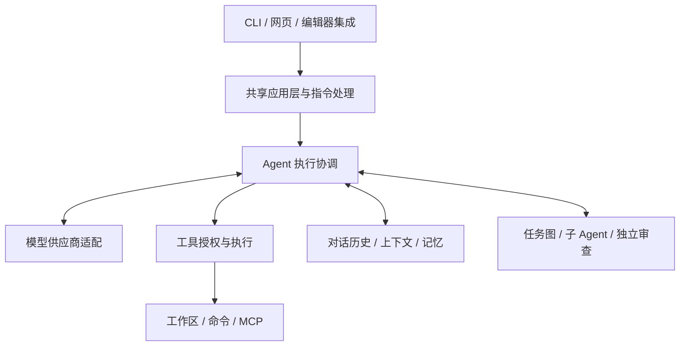

# EASY CODE 技术设计

[English](./TECHNICAL_DESIGN.md) | 简体中文 · [使用指南](../README_zh.md)

本文介绍当前架构、职责划分和设计取舍，不是未来路线图，也不展开代码级实现。安装、指令和日常操作放在 README；具体配置另见[配置示例](./config.example.toml)。

## 1. 设计目标

EASY CODE 通过受控执行层，将外部模型与本地项目工作连接起来，目标包括：

- 终端和浏览器使用相同的应用行为与持久数据。
- 用户可以选择模型，对话管理不绑定单一供应商。
- 支持长任务、中断和恢复，不把结果不明的操作当作已经完成。
- 通过 Skill、MCP 和子 Agent 扩展能力，但不因此赋予无限权限。
- 区分模型陈述、实际执行证据和用户决策。

核心边界是：**模型提出行动，应用负责授权和执行。** 模型生成的计划、工具调用、摘要和审查报告都是应用的输入，不是绕过控制的许可。

## 2. 总体架构

EASY CODE 是模块化的本地应用，不是一组需要分别部署的服务。

| 职责 | 设计选择 |
| --- | --- |
| 用户交互 | CLI 与网页将用户行为交给共享应用处理，各自保留适合界面的展示方式。 |
| 任务协调 | 统一运行时管理模型请求、工具、取消、预算与执行生命周期。 |
| 模型接入 | 供应商适配隔离协议差异，不让任务、记忆和权限策略依附于某种协议。 |
| 能力管理 | 内置和外部工具经过统一目录与执行边界。 |
| 持久状态 | 本地历史与存储保存对话、项目元数据、偏好、证据和记忆。 |
| 协作 | 任务依赖、委派工作和审查具有明确的归属与结果交接。 |

应用使用 TypeScript 和 Node.js；网页采用 Vue 3 与 Element Plus，以通用组件承载常见交互。本地结构化数据使用 SQLite，历史与制品独立保留；本地文本／语义检索辅助召回，原生执行后端负责平台边界。Benchmark 使用独立的部署路径。

## 3. 共享交互与指令处理

CLI 输入的指令、CLI 菜单选择和网页控件选择，在表达同一动作时汇入共同的指令处理流程。这样校验、保存和通知遵循同一套规则，不在不同界面重复实现业务逻辑。

不同界面暴露的入口仍有区别。网页不接受已经被专用控件替代的文字指令，例如模型选择、批准模式、图片附件和对话导航。受支持的网页指令提示打开专用面板，直接输入则走文字指令形式。隐藏 UI 入口不等于权限控制，后端仍会校验动作。

网页服务在本机运行，并验证浏览器访问。打开的对话具有各自的运行实例，因此导航到其他对话不会停止原任务。页面从后端状态接收更新，不另建一套浏览器对话数据库。

对话正文、指令输出和临时通知是不同的展示类别。工具预览由后端整理，便于不同界面复用其含义。界面语言是共享且持久化的用户偏好；翻译覆盖应用 UI，不自动翻译模型输出、项目内容和第三方消息。

## 4. 项目、对话与数据归属

项目代表一个本地工作目录。项目显示名称只是元数据，不是文件夹名称。对话属于工作区，拥有自己的历史、所选模型、工作状态和标题。

用户或主 Agent 可以为尚未命名的对话命名一次，两者遵循同一规则，避免 Agent 随后覆盖用户名称。命名能力不修改项目文件，因此主 Agent 在各种工作模式下都可使用。

多个对话可以同时运行，但指向同一目录的对话仍共享文件。应用协调可以减少冲突写入，却不会把这些对话变成独立文件环境。子 Agent 的 Worktree 隔离属于另一项能力，结果需要受控整合。

删除按照数据归属处理。删除对话会连同子对话树和相关记忆贡献一起清理；适用时，共享记忆可恢复到更早状态。移除项目还会处理其对话与项目记忆。这些操作都不授权删除用户的源码目录。

## 5. 请求生命周期

一次普通请求依次经历以下阶段：

1. 确定工作区、当前设置和对话状态。
2. 保存用户输入与附件。
3. 决定处理方式，包括 Auto 模式的任务路由。
4. 在上下文容量内组织相关历史和召回材料。
5. 请求模型响应，校验其提出的工具动作。
6. 获取必要授权，执行工具并保留结果。
7. 按需继续循环，在安全边界应用用户调整。
8. 核对仍在运行的操作后结束，或报告可恢复的中断。

工作模式描述任务意图：Auto 负责路由，Plan 侧重调查与提案，Code 侧重实现。**Plan 不是强制只读边界。** 权限策略、工具可用性和执行隔离是另外的控制维度。

停止任务也属于执行操作，不只是改变 UI。后台命令与子 Agent 工作仍需核对。模型回答结束、命令成功退出和用户需求得到满足，是三种不同结果。

## 6. 模型选择与思考强度

用户维护的注册表描述供应商、模型及其能力。供应商适配层支持兼容的 Chat Completions 和 Responses 服务，同时让运行策略独立于具体协议。

对话可以直接更换模型，无需重新创建。应用记录选择，并将上次使用的模型／强度偏好共享给新的 CLI 与网页对话。恢复时检查当前模型可用性和执行兼容性，而不是要求模型注册表文件完全未变。这不代表任意旧存储格式或已变更的提示词包都能兼容。

思考强度有两个用途：选择本地执行预算，以及在适配器和模型支持时请求供应商推理行为。两者不能等同。本地设置有效，不意味着一定向供应商发送了推理参数；界面也不应暗示供应商必然采用该强度。

图片和工具能力同样根据所选模型校验。流式文字可以用于展示，但未完成的工具参数不能执行。有供应商报告时，用量统计依据实际请求记录；本地上下文估算不是精确账单。

## 7. 工具、Skill 与 MCP

所有工具都经过共同的能力边界。应用决定角色与模式能使用哪些工具，校验输入，并在执行前落实授权。外部描述或模型生成的文字不能自行授予权限。

文件工具在应用修改前检查工作区范围和先前观察到的版本。并发变更应报告冲突，不能静默覆盖。命令工具具有受监督的生命周期，包括长任务、取消与清理。

Skill 是可复用的说明和配套资源，不是执行权限，也不是对话记忆。Agent 先发现描述，再按需读取说明，并通过获批操作维护内容。受管理的 Skill 删除采用归档，便于恢复。

MCP 将本地或远程服务器的工具接入同一工具目录。配置服务器、批准连接、身份认证和单次工具执行是不同步骤，编辑配置不会启动服务器。本地服务器使用沙箱执行，远程服务器需要批准连接；服务器声明不能覆盖本地策略。

## 8. 批准与执行隔离

批准决定**动作是否获准**，沙箱决定**动作可以在哪些范围内运行**。已保存授权或审批 Agent 的结论，本身不会解除执行隔离。

手动模式在没有适用授权时询问用户。独立审批 Agent 评估命令，必要时转回用户决策。完全访问则是显式选择：让普通宿主命令不经过沙箱和逐条批准。

普通执行使用操作系统原生隔离，限制写入范围并单独管理网络访问。沙箱无法初始化时，不会自动切换到宿主直接执行。Git Worktree 隔离的是代码变更，不是操作系统权限。

命令管理区分输出、结束和清理。操作结果不明时，进程已经不存在并不能证明操作从未发生。恢复必须先核对已有证据，不能直接重放可能具有破坏性的命令。

## 9. 历史、上下文与记忆

不同信息承担不同职责：

| 信息 | 用途 |
| --- | --- |
| 对话历史 | 保留用户输入、模型回答和控制事件，用于查看与恢复。 |
| 活跃模型上下文 | 下一次模型请求实际携带的、容量受限的信息。 |
| 保留证据与制品 | 在存储限制内保存工具结果、附件和命令输出。 |
| 长期记忆 | 在对话间复用全局偏好与项目知识。 |
| 检索索引 | 帮助查找保留材料，是派生辅助信息，不能替代源数据。 |

上下文压力采用逐步处理：减少可选材料，将较大的历史结果替换为召回引用，对合适的历史做摘要，必要时进入有界恢复。改变的是下一次模型看到的内容，不是用户文件，也不是删除已保存历史。

全局和项目记忆相互区分。写入需要校验，依赖来源的记忆可能失效，记忆也可以过期。后台整理面向已经保存的记忆，不会自动把每条消息都变成事实；整理可能额外消耗模型 Token。语义检索不可用时，可退回文本检索。

主 Agent、子 Agent 和 Reviewer 各有私有历史。共享长期记忆不代表子 Agent 可以无限读取主对话；任务分配和结果交接定义信息如何跨越边界。涉及当前工作区事实时，摘要、记忆和旧证据都需要重新核实。

## 10. 任务图、子 Agent 与审查

面向用户的计划描述做法，任务图记录依赖和工作归属，子 Agent 执行委派任务。这些概念有关联但不能互换；批准计划不意味着自动启动并行工作。

编排是可选能力，需要兼容的批准模式。子 Agent 使用受限资源，思考强度不高于主 Agent，不能递归创建更多子 Agent，也不能写入长期记忆。结果通过明确的交接返回；失败会报告，不会自动视为成功或静默重启。Worktree 的结果需检查后才能整合。

独立 Reviewer 与命令审批 Agent 不同。它在反复出现高置信度验证失败时，用私有工作区和受限能力进行调查；不是每次回答都必须经过的审查，也不能直接编辑主工作区。

审查结果是带来源、证据和不确定性的建议，不是正确性认证，也不会自动否决交付。本地测试、审查结论和官方评测结果需要分别呈现。界面根据活动任务、子 Agent 和 Reviewer 的状态显示耗时；网页没有相关活动时，右上角卡片自动消失。

## 11. 持久化与恢复

对话事件、结构化记录和制品在本地保存，并有明确归属。项目名、对话标题和 UI 偏好复用应用已有存储，不引入独立前端数据库。

检查点和索引用于加快恢复，但必须与权威记录保持一致。应用通过运行归属避免多个写入者独立控制同一对话。不支持的开发期数据会被明确拒绝，不会猜测转换成新格式。

模型传输重试有界，且不同于重新执行操作。命令失败、取消或发送结果不明时，不会自动重放。显示文字可以缩短，但可执行参数和批准决策必须完整有效。

卸载同样遵循归属原则：先检查、再确认范围，最后移除经过核实的安装自有资源。未知资源、未解决的活动操作和共享系统设施，都不是扩大删除用户数据范围的理由。

## 12. 隐私、评测与边界

本地存储可能包含源码、附件、命令输出和记忆，应作为敏感数据保护，而不是只当作可丢弃缓存。模型凭据保存在系统凭据库，不传入普通沙箱命令进程。模型请求和已授权 MCP 活动仍会跨越外部服务边界。

Benchmark 将可信控制器、离线任务执行环境和官方验证器分开。执行器命令保留在评测环境中，不获得控制器凭据或宿主权限。运行方式见[评测指南](../benchmarks/swebench_verified/README.md)。

验证应覆盖共享行为、界面一致性、权限执行、取消、恢复和隔离集成。平台支持需要在实际目标操作系统上验证；一个平台通过沙箱测试，不能证明所有平台都已通过认证。更大的上下文、更多 Agent 或更高思考强度都不保证正确性。

后续扩展应保持既有边界：模型能力通过适配层增加，工具通过共同授权路径接入，UI 动作进入共享应用处理，持久行为配套恢复测试，避免新功能另建一套权限或状态系统。
