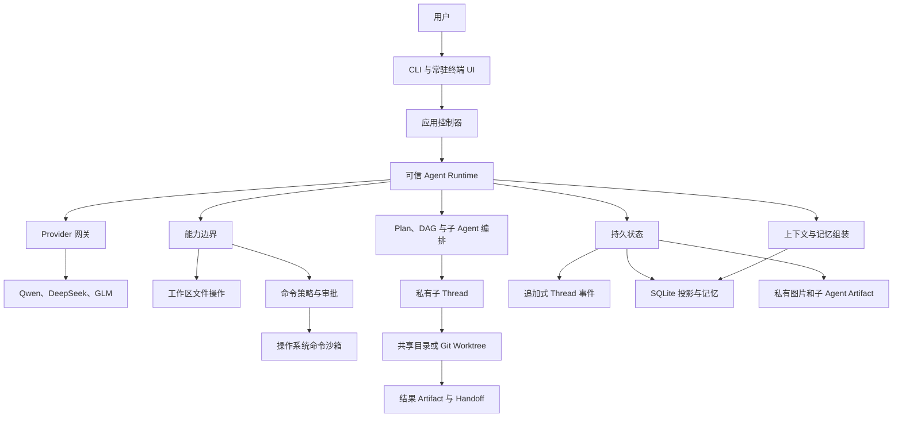

# EASY CODE 技术设计

[English](./TECHNICAL_DESIGN.md) | 简体中文 | [返回 README](../README_zh.md)

本文介绍 EASY CODE 的整体架构与工程设计，重点是稳定的技术边界，而不是具体函数、私有协议或源码行号。安装和命令使用方法见 [README](../README_zh.md)。

EASY CODE 原始源码采用 [MIT License](../LICENSE)。第三方组件保留各自许可证，详见[第三方开源声明](../THIRD_PARTY_NOTICES.md)。

## 1. 设计目标

EASY CODE 把大语言模型视为规划与代码生成组件，而不是安全边界。权限、状态转换、持久化和完成条件始终由本地 Runtime 决定。

整个设计遵守五条不变量：

1. **权限与数据分离。** 项目文件、模型输出、记忆、图片、命令输出和任务描述都是不可信数据，不能自行扩大权限。
2. **先校验，再产生副作用。** 结构化意图必须先通过当前模式、角色、工作区、策略和状态校验。
3. **先持久化，再激活。** 重要转换必须先成为可靠记录，UI 或其他 Agent 才能把它视为已提交。
4. **不同隔离层解决不同问题。** 私有 Thread 隔离上下文，Git Worktree 隔离源码状态，操作系统沙箱隔离命令进程。
5. **恢复不猜测。** 除非持久证据能够证明，否则中断的外部操作不会被当作成功。

由此派生出其他目标：

- 权限、沙箱、身份绑定或恢复状态不明确时安全失败；
- 通过 Diff、命令审计、任务证据和结果 Artifact 让操作可检查；
- 长时间任务能够跨进程重启继续；
- 控制模型上下文大小，同时保留完整权威历史；
- 将供应商差异与工作区安全解耦；
- 可选检索或终端功能降级时不破坏主状态。

## 2. 技术栈

| 领域 | 技术 | 作用 |
| --- | --- | --- |
| Runtime | TypeScript、Node.js 20+ | 跨平台编排、状态管理和工具执行。 |
| CLI 与终端 UI | Commander、Chalk、Node 终端 API | 命令解析、交互选择、常驻对话 UI 和非 TTY 降级。 |
| 契约校验 | TypeScript 类型、JSON Schema、Zod | 校验配置、模型工具调用、持久状态和外部数据。 |
| 模型供应商接入 | OpenAI-compatible Chat Completions 适配层 | 统一 Qwen、DeepSeek 和 GLM 的消息、工具、Thinking、图片、重试、超时与用量。 |
| 持久存储 | 追加式 JSONL、SQLite WASM | 保存权威 Thread 历史、Checkpoint、查询投影、记忆和审计记录。 |
| 检索 | SQLite FTS5、Orama、ONNX Runtime、Hugging Face Tokenizer | 为长期记忆提供关键词与语义混合检索。 |
| 命令执行 | 结构化进程执行、Anthropic Sandbox Runtime | 安全传参、审批执行与操作系统级进程约束。 |
| 源码隔离 | Git、Worktree、快照、结果 Artifact | 构建可恢复的子 Agent 环境、Checkpoint、依赖链与 Handoff。 |
| 编辑器集成 | 随包 VS Code 扩展 | 原生剪贴板图片、Thinking 交互和不扰动滚动位置的菜单导航。 |
| 打包 | npm、版本化 Prompt Bundle | 跨平台安装可执行代码和经过校验的模型侧资源。 |

Runtime 在本地执行，但模型推理会请求所选供应商。API 凭据保存在操作系统凭据存储或用户设置的环境变量中，不会复制到项目配置。

## 3. 系统架构

| 层级 | 责任 |
| --- | --- |
| 交互层 | 接收文字、粘贴、图片、菜单选择、审批与取消，并渲染对话和状态。 |
| 应用控制器 | 加载配置和凭据、绑定工作区、持有 Thread，并协调 Resume。 |
| Agent Runtime | 选择有效能力、校验模型输出、驱动工具循环并执行完成规则。 |
| Provider 网关 | 统一消息、结构化动作、Thinking、图片、取消、错误和用量。 |
| 能力边界 | 执行文件、命令、Plan、任务、上下文、记忆与子 Agent 策略。 |
| 编排层 | 管理审核方案、依赖任务、子 Agent 所有权、执行环境与结果链。 |
| 持久状态层 | 保存权威事件，并维护可查询的本地投影和 Artifact。 |

模型输出不能直接调用文件系统、进程 API、数据库或 Git。它只能请求 Runtime 当前公开的能力，而且每个请求都要在本地校验。

## 4. 请求生命周期与工作模式

一次普通回合遵循以下高层流程：

1. 加载可信用户配置、凭据和 Prompt Bundle，并加载低信任级别的项目规则。
2. 获取所选 Thread 的所有权，并先持久化新用户消息和图片引用。
3. 在 Auto 模式下，让受限制的控制模型选择直接回答、Plan 或 Code。
4. 从当前状态、适用规则、工作摘要、活跃消息和检索记忆构建模型上下文。
5. 只向模型提供本步骤允许使用的能力。
6. 在执行工具或改变状态前校验所有结构化响应。
7. 保存工具结果、模型用量、任务转换和其他持久证据。
8. 持续执行，直到 Runtime 接受最终回答、展示方案、进入阻塞状态，或因限制/中断停止。
9. 只在成功边界提交符合条件的长期记忆修改。

### 模式语义

| 模式 | 目的 | 主要限制 |
| --- | --- | --- |
| Plan | 调查并生成供用户审核的方案。 | 不提供项目修改和普通副作用命令。 |
| Auto | 由模型选择合适工作流。 | 路由控制器本身没有工作区工具。 |
| Code | 直接实现与验证。 | 修改和命令仍受能力、策略、审批与沙箱控制。 |

Auto 通过结构化选择路由，而不是关键词判断。只有不需要工作区访问和副作用时才接受直接回答，否则进入 Plan 或 Code。

Plan 审核是持久状态，不依赖对用户文字的模糊猜测。同意、拒绝和调整意见都是明确转换。如果已批准的执行在持久 DAG 接管前中断，方案会回到审核，而不是被默认为完成。

### 执行中调整

模型工作时输入框仍保持可用。每条调整都会按 FIFO 独立持久化。到达安全边界时，Runtime 会截取当前待处理前缀，并作为用户输入加入下一次模型请求；之后到达的消息留到下一边界。

调整可以改变工作方向，但不能改变有效模式、命令状态、沙箱边界、任务所有者或子 Agent 身份。已经完成的工具结果继续有效；来自过期模型响应、尚未启动的工具调用不会执行。

## 5. 信任、能力与权限模型

### 指令信任

Runtime 策略和基础安全契约的优先级高于用户请求；用户请求的优先级高于项目规则。`EASYCODE.md` 可以说明如何工作，但不能授予文件系统、进程、网络、凭据、安装或子 Agent 权限。

源码注释、依赖元数据、命令输出、检索记忆、任务文字、图片和生成 Artifact 都按数据处理。其中的提示注入无法绕过本地控制面。

### 动态能力裁剪

Runtime 会为每次模型调用重新构建能力集合，考虑：

- Plan、Auto 或 Code 模式；
- 主 Agent 或子 Agent 角色；
- 当前 Plan 和 DAG 状态；
- 子 Agent 分配与尚未收集的结果；
- 上下文压力和压缩状态；
- 供应商与模型能力；
- 当前命令状态和沙箱可用性。

即使模型编造了工具名称或 Schema，不可用能力仍不可用。对原子性有要求时，把状态控制动作与不兼容工作动作放在同一批次会整体拒绝。

### 工作区文件边界

受保护文件操作使用相对所选工作区的路径，并校验规范化后的真实磁盘位置。父目录穿越以及符号链接或 Junction 逃逸会被拒绝。

修改采用“先检查、后变更”协议：

- 创建文件不会静默覆盖已有目标；
- 更新和删除需要之前读取到的完整版本；
- 修改前再次校验内容身份；
- 并发编辑会产生冲突，而不是覆盖；
- 成功修改形成持久审计记录和带行号 Diff；
- Resume 只在文件仍匹配时恢复历史读取授权。

共享工作区子 Agent 使用串行修改和相同的版本校验。Worktree 子 Agent 拥有独立 Git 状态，但用户后续编辑和 Handoff 仍可能产生冲突。

### 命令与审批

命令以已解析可执行程序、参数数组和工作目录表示。普通任务文本不会被默认当作 Shell 程序解释。

受保护执行包含三个独立关卡：

1. **能力关卡：** 判断当前 Agent、模式和阶段是否可以请求执行命令。
2. **策略与审批关卡：** 对命令分类，应用永久禁止规则，并获取必要的用户决定或 Thread 授权。
3. **沙箱关卡：** 在操作系统工作区边界内启动已批准的进程树。

审批可以仅生效一次，也可以绑定到当前 Thread 中同一个规范化可执行程序身份。子 Agent 可以使用已有 Thread 授权，但不能弹出审批菜单或创建新授权。

手动和自动审批都使用操作系统沙箱。沙箱准备或启动失败会阻止命令，绝不会自动退回宿主机直接执行。

危险完全访问是用户二次确认后开启的独立进程级状态。它绕过命令策略、审批、命令沙箱和仅工作区文件限制，但仍受当前 OS 账号权限控制；用户关闭或退出进程后结束。

### 凭据与敏感数据

供应商 Key 保存到操作系统凭据存储，或由环境变量提供。工作区配置不能保存这些 Key。终端输出、面向模型的错误、记忆写入和持久摘要都会过滤密钥和终端控制字符。

受保护模式下，命令环境使用受限白名单，默认不会把供应商 Key 转发给子进程。

## 6. Prompt Bundle 与配置

系统规则、Runtime 控制文本和工具说明安装在固定的用户级 Prompt Bundle 中。安装包提供 Manifest，把资源版本和内容身份绑定到兼容 Runtime。

启动时，EASY CODE 会在模型使用前校验 Bundle，并加载为进程内不可变视图。缺失、被修改或额外出现的资源会从已安装包修复。工具可执行 Schema 和权限逻辑仍编译在 Runtime 中，可编辑文本无法重新定义它们。

Thread 会记录兼容的 Prompt Bundle 身份，避免 Resume 在工具契约不兼容时静默继续。

配置按默认值、可信用户配置、安全的项目配置、环境变量和显式 CLI 参数分层加载。项目配置不能重定向凭据、供应商地址、应用数据或托管 Worktree 根目录。

`EASYCODE.md` 从用户级和工作区目录层级加载为项目指导，其信任级别始终低于 Runtime 契约。

## 7. 终端与编辑器集成

交互式 UI 是结构化状态的投影，而不是互不协调的打印调用。它区分：

- 稳定的会话标题；
- 追加式对话记录；
- 可重绘的实时活动区；
- 常驻输入框和状态栏；
- 模型选择、审批、Plan 审核与 Resume 的模态菜单。

稳定内容只提交一次，并保留为普通终端 Scrollback；只有临时活动会被重绘。因此滚动、选择、复制和输入框位置可以保持稳定。

任意时刻只有一个组件拥有终端输入。模态菜单会暂时挂起输入框，并在结束后精确恢复草稿、附件、光标和终端状态。后台进度或子 Agent 活动不能消费菜单按键。

Thinking 会同时保留短预览和完整内容。VS Code 扩展通过经过认证的本地通道把切换动作送回原终端。托管对话视图会在相同事件位置用完整正文替换选中预览，同时保持输入框可用。展开状态只属于 UI，不会写入模型上下文或记忆。

Thinking、工具活动、调整和模型回答按 Provider/事件真实顺序展示，而不是堆在固定区域。最终回答和展开后的 Thinking 不做展示层截断；只有明确存在安全上限的源数据（例如命令捕获输出）才会受限。

剪贴板处理保证提交顺序。多行文本在用户按 Enter 前保持为一个粘贴对象；校验通过的图片转换成稳定附件标记。非 TTY 环境降级为只追加文本，不使用依赖光标定位的 UI。

## 8. 持久状态与 Resume

每个 Thread 都有追加式事件历史，它是已接受动作与状态转换的权威记录。SQLite 为会话、记忆、用量和恢复提供便于查询的投影，但过期投影不能覆盖更新的权威事件。

Checkpoint 用于减少回放成本，不会替代事件历史。Resume 会回放 Checkpoint 之后的事件、校验持久身份，并重建有效状态。

持久状态包括：

- 用户/模型消息、工具请求和结果；
- 工作摘要与压缩边界；
- Plan 审核状态和任务 DAG；
- 文件观察、变更、命令与 Thread 授权；
- 待处理调整及其交付进度；
- 子 Agent 分配、生命周期、执行环境与结果引用；
- 供应商上报的用量统计。

Thread Lease 防止两个本地进程同时持有同一个活跃 Thread。Resume 会在恢复权限前重新校验工作区和托管子 Agent 环境。

中断的 Provider 请求和命令不会被盲目重放。未完成的已批准 Plan 会回到审核，未完成 DAG 保持活跃或阻塞，没有持久完成结果的子任务会被视为中断。恢复优先给出明确可见状态，而不是虚构成功。

## 9. 上下文与记忆

### 短期上下文

完整对话保留在 Thread 权威事件历史中。实际模型请求使用一个受限视图，包括：

- 当前系统契约和环境；
- 最新累计工作摘要；
- 单调压缩边界之后的消息；
- 当前任务、Plan、子 Agent 和调整控制状态；
- 少量相关长期事实。

模型通过专用上下文动作生成累计摘要。Runtime 会限制长度、脱敏，并验证压缩边界只能向前，然后把两者一起持久化。单次请求过大时可以临时省略较旧活跃消息，但不会重写正式摘要或压缩边界。

上下文压力逐级处理：正常运行、提示考虑压缩、强制下一步压缩，以及在超过配置边界前自动插入压缩请求。本地控制使用字符预算保证确定性；UI 中 Token 是估算值，除非该数据由供应商实际返回。

思考强度会扩大本地步骤和上下文预算。这些限制是 Runtime 执行保护，不代表供应商模型本身的上下文窗口。

### 长期记忆

长期记忆保存作用域绑定到规范化工作区的短原子事实，包括偏好、约定、架构、决策和环境信息。

模型在写入前先搜索。新增、修订和删除在回合内暂存，只有回合到达允许的成功边界时才原子提交。被替代和遗忘的事实保留足够审计历史，但不再参与活跃检索。

检索采用混合方案：

- SQLite FTS5 提供关键词匹配；
- 本地多语言 ONNX Embedding 模型生成语义向量；
- Orama 提供内存向量排序；
- 最终组合为少量 Top 结果加入上下文。

SQLite 是权威存储，向量索引属于可重建投影。因此 Embedding 缺失或重建时，可以退回关键词检索而不丢失记忆。持久化和检索前都执行敏感信息过滤与工作区隔离。

## 10. Plan 审核与任务 DAG

用户审核 Plan 和执行 DAG 解决不同问题：

- **Plan 审核**在实现前让用户确认方向。
- **任务 DAG**在执行中控制依赖顺序、所有权、完成证据和结果链。

任务描述目的、依赖、所需输入、预期产物、完成检查、失败处理、所有者和状态。Runtime 会验证图无环且所有依赖有效。

只有依赖就绪的任务可以认领，一个任务只能有一个活跃所有者。完成必须为声明的检查提供证据，模型的一句“已完成”不足以结束任务。阻塞任务会记录原因，其后继任务保持不可执行。

活跃 DAG 会阻止主 Agent 在可执行任务尚未到达有效终态时给出普通最终回答。DAG 状态持久化并随 Resume 恢复。

子 Agent 生成的结果 Artifact 可以绑定到完成节点。后续任务只接收有限引用和依赖链，不接收庞大的子会话历史或完整 Manifest。

## 11. 子 Agent、Worktree 与 Handoff

只有主 Agent 可以创建和控制子 Agent。子 Agent 是绑定到单个 Runtime 分配的私有 Code-mode Thread，只接收任务、必要上下文、依赖结果和完成检查，不继承父 Agent 的完整对话。

子 Agent 能力更窄：

- 可以在分配的执行根中检查、修改和验证；
- 不能继续创建子 Agent；
- 不能管理父 DAG 或长期记忆；
- 不能通过交互扩大命令权限；
- 必须提交绑定到当前分配的结构化完成或阻塞结果。

父 Agent 可以创建 DAG 绑定或独立子任务、发送追加指导、等待结果、停止工作，并收集最终报告。父 Thread、子 Thread、Agent、任务和环境身份被持久绑定，恢复后不能静默换绑。

### 执行环境

逻辑工作区决定项目策略和记忆归属，物理执行根决定子 Agent 实际读写位置。

| 环境 | 行为 |
| --- | --- |
| 共享工作区 | 子 Agent 直接操作父工作区；修改经过串行化和版本校验。 |
| 托管 Worktree | 子 Agent 在独立 Git Checkout 中工作，拥有独立源码状态和 Checkpoint 链。 |

自动隔离在有效 Git 工作区中优先使用 Worktree，非 Git 项目使用共享执行。显式要求 Worktree 时，如果仓库或存储根无法校验，会安全失败。

Worktree 基线可以来自远端导向的干净起点、本地 `HEAD`，或当前本地改动的时间点快照。快照不是实时同步：父工作区后续修改不会自动进入已存在的子环境。

完成后，Runtime 会记录不可变结果 Artifact，描述已经验证的源码结果和依赖链。完整 Artifact 保存在私有存储中，DAG 和父上下文只接收有限引用。

### Handoff

Handoff 是显式交付步骤，不是自动合并：

- **本地 Handoff**在冲突检查后把累计结果应用到当前 Checkout。
- **分支 Handoff**创建或更新经过校验的本地分支，不自动推送远端。

两种方式都保护用户现有改动、明确报告冲突，并设计为可安全重试。Worktree 能降低 Git 状态冲突，但不是安全沙箱；进程约束仍由操作系统沙箱负责。

## 12. Provider 与多模态边界

Provider 网关使用统一内部表示处理消息、结构化动作、Thinking、图片、取消、重试、超时和用量。只有模型目录中明确支持的组合才会加入供应商特定参数。

模型目录采取保守策略：

- 不假设未知模型支持图片或可控 Thinking；
- 即使当前模型无法应用，也会保存用户选择的思考强度；
- 四档 EASY CODE 思考强度会映射到供应商实际支持的推理控制；
- 切换到纯文本模型后，不会把历史图片字节载入本次请求。

图片先在本地解码和校验，再复制到私有 Thread Artifact 存储。Journal 只保存元数据和内容哈希，不保存 Base64；真正图片字节只在供应商边界通过完整性与模型兼容性检查后加载。

当前回合图片采用更严格校验。切换供应商或模型时，可以安全省略不兼容的历史图片，而不修改持久对话。

供应商上报的 Token 用量按供应商、模型、Agent 角色、用途和重试分别记录。没有上报的数据保持“未上报”，不会用估算值伪造。

## 13. 可靠性与可观测性

EASY CODE 组合多种可靠性措施：

- 在模型、配置、持久化和扩展边界执行严格 Schema 校验；
- 先追加证据，再激活状态；
- 使用原子数据库事务更新相关投影和记忆；
- 使用规范路径和归属标记管理应用存储；
- 对命令实施超时、取消、输出上限和进程树回收；
- 对文件观察、图片、Prompt Bundle 和结果来源使用内容哈希；
- 只对分类明确的暂时性错误进行有限重试；
- 对未知沙箱、Worktree、审批和恢复状态安全失败；
- 持久保存命令、文件修改、任务、子 Agent 和模型用量审计。

终端提供可观察视图，但日志不会反过来成为权威状态。`/changes`、`/commands`、`/permissions`、`/tasks`、`/agents`、`/context`、`/memory` 和 `/usage` 都是 Runtime 状态的只读投影。

Token 效率来自模型控制的上下文压缩、有限长期记忆检索、小型 DAG/Artifact 引用、私有子 Agent 上下文、Auto 直接回答，以及不把完整子 Agent 日志和图片字节塞入父上下文。

## 14. 本地数据与生命周期

| 数据 | 位置类别 | 生命周期 |
| --- | --- | --- |
| Prompt Bundle | 固定用户级 `~/.easy_code` 根目录 | 随包安装、校验和修复。 |
| Thread Journal、SQLite、附件和子 Agent Artifact | 平台应用数据目录 | 跨会话持久化，可由 EASY CODE 数据卸载器清除。 |
| 用户配置 | 平台配置目录 | 数据卸载默认保留。 |
| API Key | 操作系统凭据存储 | 默认保留，只有显式配置命令会删除。 |
| Embedding/模型资源 | 平台缓存目录 | 可重建，默认保留。 |
| 项目规则与项目配置 | 工作区 | 用户所有，EASY CODE 卸载不会删除。 |
| 托管 Worktree 与 Handoff 分支 | Git/应用托管位置 | 可能含未交付代码，因此保留。 |

托管数据根带有归属身份。清理只会删除经过验证的真实目录中的已知 EASY CODE 数据，不会递归跟随链接。数据库仍被占用或自定义根归属不明确时会停止清理。

一键卸载会先清除 Prompt Bundle 与可发现的长短期记忆，再删除全局 npm 包；凭据、配置、缓存、工作区和可能未合并的 Git 结果会保留。

## 15. 权衡与扩展方向

- **本地优先不等于离线。** 项目状态保存在本地，但模型推理仍需要网络，除非未来增加本地 Provider。
- **字符预算确定，但 Token 只是近似。** 供应商上报用量更准确，本地估算适合提前控制压力。
- **混合记忆提高相关性，但增加本地资源。** Embedding 缺失或重建时仍可使用关键词检索。
- **共享子 Agent 支持非 Git 项目，但修改必须串行。** Worktree 提供更好的源码隔离，同时增加 Git 和存储复杂度。
- **Worktree 隔离源码状态，不隔离进程权限。** 它必须继续与能力控制和 OS 沙箱配合。
- **非流式模型请求让持久步骤边界更简单。** 因此 UI 重点展示耗时状态和执行中调整，而不是 Token 流式输出。
- **跨平台沙箱行为不同。** Runtime 提供统一的安全失败契约，平台安装和底层执行仍各自实现。

只要继续遵守权限、持久化、隔离和恢复不变量，架构可以扩展更多供应商、检索后端、子 Agent 角色或执行环境。
