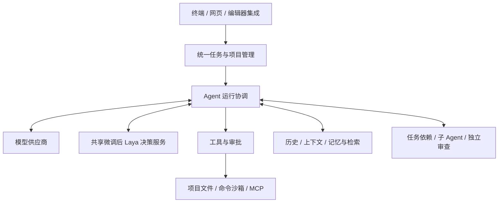

# EASY CODE：架构与详细使用手册

[English](./TECHNICAL_DESIGN.md) | 简体中文 · [快速开始](../README_zh.md)

本文面向使用者和希望了解系统设计的读者，说明各部分如何协作、怎样完成常见任务，以及出现问题时如何处理。不介绍源码目录、类与函数，也不包含应用实现代码。文中的命令是实际使用入口；示例路径和任务编号需要替换为你的值。

## 1. 系统定位与整体架构

EASY CODE 由本地 Agent Runtime、云端编程模型和实验性的本地决策模型组成。云端模型负责分析任务、提出行动；微调后 Laya 负责工作模式和交付选择的分类；Runtime 负责组织上下文、检查权限、执行工具、保存证据并恢复任务。



| 部分 | 负责什么 | 使用的技术或机制 |
| --- | --- | --- |
| 本地应用 | 统一协调模型、工具、任务和取消操作 | Node.js、TypeScript |
| 交互界面 | 终端交互、网页项目管理、实时进度与审批 | CLI；Vue 3、Element Plus；VS Code 终端集成 |
| 模型接入 | 供应商选择、能力识别、流式接收和用量统计 | 可配置模型目录；兼容的 Chat Completions／Responses 协议 |
| 本地决策 | Auto 路由与交付前的一次检查 | 多语言编码器与选项评分头；联合 SFT；Python／PyTorch；共享本地 IPC 服务 |
| 执行控制 | 权限判断、命令生命周期、取消和清理 | 结构化工具、独立审批 Agent、原生系统沙箱 |
| 数据保存 | 保存对话、项目、执行事件、记忆和恢复快照 | SQLite、JSONL 事件日志、Checkpoint、附件与证据文件 |
| 检索 | 从历史与记忆中找回相关材料 | SQLite FTS5 文本检索、本地向量检索、ONNX 向量模型、Orama |
| 协作与扩展 | 任务分工、独立审查、可复用流程和外部工具 | DAG、Git worktree、Skill、MCP |

CLI 和 Web 共用任务、权限和存储规则，但不提供完全相同的交互入口。例如终端用 `/model`，网页使用模型选择控件。浏览器不是另一套独立的 Agent 或数据仓库。

## 2. 安装、启动与首次检查

### 2.1 安装准备

按 [README 安装步骤](../README_zh.md#安装) 准备 Node.js 20.11+、Python 3.10–3.14、npm 和源码安装所需的 Git。用于子 Agent 隔离的 worktree 也依赖 Git。

安装会准备 Prompt Bundle、本地检索资源、SQLite 运行资源、私有的 MarkItDown 和 Laya Python 环境、可用的 VS Code 集成及匹配版本的原生沙箱，并使用随包提供的微调权重实际验证一次决策。每次安装或重装会更新到最新稳定版 MarkItDown。首次依赖下载量可能较大；Windows 沙箱初始化可能请求管理员授权。安装并不保证能自动解决所有系统依赖、权限或组织安全策略问题。

确认安装情况：

```sh
easy-code install doctor
easy-code sandbox doctor
```

如果检查明确要求初始化沙箱：

```sh
easy-code sandbox setup
```

正常启动和执行命令不应反复发起 Windows UAC 初始化。沙箱不可用时，受限命令保持阻止状态，不会自动绕过沙箱。日常使用不依赖 Docker、Podman 或 WSL 容器环境；Benchmark 是另一条安装路径。

### 2.2 配置模型账号

```sh
easy-code config set glm-coding-plan.api-key
```

命令会隐藏输入，并保存到系统凭据库。普通 GLM API 与 GLM Coding Plan 是两个供应商入口，应配置与所选入口一致的密钥。更换同一供应商的密钥时，再运行对应的 `config set` 命令。

供应商、模型 ID、端点、图片能力和流式能力由 `~/.easy_code/models.toml` 描述。首次生成后不会在每次启动时覆盖用户修改；编辑后需重启。登记一个模型不等于自动获得该服务的访问权限或全部协议兼容性。

### 2.3 选择启动方式

| 方式 | 命令 | 适用场景 |
| --- | --- | --- |
| 交互式终端 | `easy-code --workspace "/path/to/project"` | 围绕本地项目持续对话 |
| 网页 | `easy-code --web` | 管理多个项目、查看历史和运行进度 |
| 恢复任务 | `easy-code --resume <thread-id>` | 继续同一任务的历史和工作状态 |
| 单次任务 | `easy-code --workspace "/path/to/project" --mode code -y run "检查并修复测试失败"` | 从终端发起一个明确任务 |

省略 `--workspace` 时，CLI 使用当前目录。网页启动后会打开带访问凭据的本机地址，端口自动选择；不要把该地址当作公网服务分享。关闭启动终端会影响服务，关闭浏览器标签页则不等于停止任务。

单次 `run` 可以追加 `--max-model-requests 40`，限制包含主 Agent、子 Agent、审批、reviewer 和压缩请求在内的总模型请求次数。交互式 CLI／Web 没有固定的请求次数上限，但仍受上下文容量、并发、超时和故障恢复规则约束。

## 3. 项目、文件夹与对话

### 3.1 三者的关系

**项目**是逻辑容器，拥有文件夹、对话、项目记忆和项目 Skill。**文件夹**是磁盘上的真实目录。**对话**保存一次持续任务的历史和运行状态。

网页首次启动没有默认项目：

1. 在 Projects 区创建项目。
2. 编辑项目，关联一个或多个已有本地文件夹。
3. 选择主文件夹。
4. 点击项目旁的 **＋** 创建对话。
5. 选择模型并发送任务。

没有关联文件夹的项目可以存在，但不能开始执行任务。更改项目显示名称不会重命名磁盘目录。一个项目内不能重复关联同一目录，也不能同时关联父目录和它的子目录。

CLI 可用以下命令管理当前项目：

```text
/workspace list
/workspace add <absolute-path>
/workspace primary <folder-id>
/workspace remove <folder-id>
/workspace refresh
```

先用 `list` 查看文件夹编号，再设置主文件夹或移除关联。`/workspace` 是 CLI 命令，网页应使用项目编辑界面。项目仍有活动任务或子任务时，文件夹变更会被阻止。

### 3.2 多文件夹示例

假设前端和后端分别位于两个目录，可以把它们关联到同一项目，再提出：

> 检查前后端的登录接口是否一致，先列出差异，确认后再修复。不要更改数据库结构。

Agent 使用带文件夹标识的路径区分来源，例如 `api/...` 和 `web/...`；命令中的 `.` 指主文件夹。项目记忆属于整个逻辑项目，不为每个关联目录单独建立一套记忆。

多个对话可以同时运行，但仍共享项目文件夹。应用协调写入不代表每个对话都有独立副本；避免让两个对话同时改同一批文件。

### 3.3 删除与命名

- 对话标题可由用户或主 Agent 首次设置；当前版本不支持设置后反复重命名。
- 删除对话会删除它的历史、关联子对话和相关记忆贡献；共享记忆可能恢复到较早版本。
- 删除项目还会删除项目记忆、项目 Skill 和项目所属运行数据。
- **删除项目、删除对话或解除文件夹关联，不会撤销已经写入的项目修改，也不会删除真实项目目录。**

删除前先停止活动任务；需要保留的历史请提前备份。

## 4. 一次任务如何执行

典型流程是：接收需求 → 选择工作方式 → 读取必要信息 → 请求模型 → 审批并执行工具 → 保留结果 → 继续验证 → 给出结果或说明未完成事项。

工作模式只决定任务倾向：

| 模式 | 用途 | 示例请求 |
| --- | --- | --- |
| Auto | 自动判断回答、规划或实施 | “这个项目怎么启动？” |
| Plan | 侧重调查、方案和待确认事项 | “先分析登录流程，给出修复方案，暂不实施。” |
| Code | 直接修改和验证 | “按已确认方案修复，并运行相关测试。” |

Auto 由微调后 Laya 选择 `DIRECT`、`PLAN` 或 `CODE`。直接回答仍由云端模型生成，并保持 Auto；Plan 或 Code 则立即生效，直到用户切回 Auto。图片请求或本地推理失败时使用云端路由。

Code 交付前，Runtime 检查后台命令、子 Agent 和 DAG 状态，再让微调后 Laya 对比用户需求与主 Agent 准备提交的最终回答。`CHALLENGE`，或分数低于默认 0.9 阈值的 `RELEASE`，会要求复查一次；该机会在 Resume 后不会重置。下一次交付不再调用 Laya，但仍须通过原有完成条件和 reviewer。本地推理失败时明确提示并跳过这次提醒。模型、输入限制、配置和结果见[本地决策与训练](#61-实验性本地决策模型)。

CLI 使用 `/mode plan`、`/mode code` 或 `/mode auto`。**Plan 不是系统强制只读**；如果确实不能修改，应在需求里明确说明，并对命令保持合适的审批设置。

一个完整的先规划后实施流程：

1. 选择 Plan，发送：“调查导出功能为什么丢失中文文件名。给出原因、修复方案和验证方式，先不要修改。”
2. 审阅调查结果，补充：“必须兼容现有文件名规则，不能引入新的在线服务。”
3. 切换 Code，发送：“按上述方案实施，报告修改和测试结果。”
4. 检查最终说明中哪些已经验证，哪些仍只是推断。

工具执行成功、测试通过和完整满足需求是三件事。尤其在模型修改过测试时，不应只凭修改后的测试通过就认定需求已经满足。

### 运行中调整、停止与恢复

网页中，空输入时使用停止按钮；输入文字后可发送补充要求，应用在安全执行边界应用调整。切换到别的对话不会自动停止当前任务。

恢复已有对话：

```text
/sessions
/resume <thread-id>
```

或者重新启动 `easy-code --resume <thread-id>`。如果提示该任务正被另一进程持有，应先确认原进程状态，不要并行接管同一个任务。

`/clear` 只清理终端显示，不删除任务历史；`/new` 创建新对话，不是恢复原任务。停止也不会自动回滚已完成的文件修改。

## 5. 审批、沙箱与命令

### 5.1 审批模式

审批回答“是否允许这次行动”，沙箱回答“行动可以影响哪里”。二者不能互相替代。

| 模式 | 命令审批 | 执行边界 |
| --- | --- | --- |
| 手动审批 `manual` | 无匹配授权时由用户决定 | 保持正常沙箱边界 |
| 帮我审批 `auto_approve` | 独立审批 Agent 判断；必要时转人工 | 保持正常沙箱边界 |
| 完全访问 `unrestricted` | 普通命令不逐条询问 | 普通宿主机命令不使用正常沙箱，以当前账号权限执行 |

CLI 输入 `/approval` 使用选择器，或 `/approval auto_approve` 明确选择；网页使用输入框下方控件。`-y` 对应帮我审批，不代表任意操作都已经获准。

启动参数 `--approval safe|ask|never` 控制的是人工提示是否可用，**不是**这三个执行模式的同义写法。特别是 `--approval never` 不等于完全访问。

选择“允许相同前缀”后，匹配授权可在当前任务及其子 Agent 范围复用。匹配会考虑结构化命令和执行上下文，不是只比较程序名。不要把某次允许 Python 或 Shell 理解为允许任意脚本。

```text
/permissions
/permissions revoke <index>
```

先查看授权编号，再撤销不再需要的授权。

### 5.2 原生沙箱

| 平台 | 隔离方式 |
| --- | --- |
| Windows | elevated 原生沙箱，受限执行身份、文件权限和网络策略 |
| macOS | Seatbelt 系统策略 |
| Linux | bubblewrap／seccomp |

正常沙箱按当前项目的关联目录授予工作区写入范围，并单独控制网络访问。获准执行命令不表示可以越过该范围；网络请求也应经过相应授权路径。Linux 支持受监督的同一任务服务会话，使本地服务及后续命令能够共享 localhost。

Full access 只应在理解风险时主动选择，不能作为诊断不明故障的默认办法。Git worktree 是文件版本隔离，不是安全沙箱。Benchmark 的“完全访问”仅发生在任务容器内，不等于开放宿主机。

### 5.3 长命令、失败与恢复

命令有启动、执行、退出和清理状态；长时间命令可通过后台执行及轮询观察。工具显示参数生成中，只代表模型正在准备请求，并不表示命令已经启动。

非零退出、超时、取消或执行结果未知，不会触发 Runtime 自动重放命令。模型分析后主动发起新的验证，是另一条执行请求。

如果清理无法确认，系统可能限制后续修改并保留任务。先检查：

```sh
easy-code sandbox recover --workspace "/path/to/project"
```

该命令默认只检查。确认检查结果允许安全恢复后，可执行：

```sh
easy-code sandbox recover --workspace "/path/to/project" --apply
```

`--apply` 只处理能够验证的恢复事项，不会把所有未知状态强行标成安全。不要删除隔离记录来绕过尚未清理的进程。

## 6. 模型、流式输出与等待时间

CLI 用 `/model` 选择模型和思考强度，也支持 `/model <provider-id> <model-id> high`；网页用对应控件。同一对话可以更换模型，新对话通常沿用最后选择。

思考强度 `none／low／medium／high` 同时影响本地预算与供应商支持的推理参数。界面显示“Saved, not applied”时，表示本地选择已保存，但当前模型没有应用对应的供应商参数，不能据此判断模型一定停止思考。

流式输出分别展示正文、thinking 和工具准备进度。**完整接收并校验工具参数后才执行**，不会执行半段文件内容或半条命令。预览上限只限制界面展示，不代表请求已经结束。附加图片前也应确认所选模型支持图片。

当前默认的请求计时规则：

| 请求方式 | 默认超时 | 如何理解 |
| --- | --- | --- |
| 流式 | 所有思考强度均为 60 秒无有效进展 | 有新的有效正文、thinking 或工具参数时继续计时；心跳不代表有效进展 |
| 非流式 | none／low 5 分钟；medium 7.5 分钟；high 10 分钟 | 等待完整响应的总时限 |

所有云端模型角色使用同一套计时规则，但实际请求是否流式仍取决于模型能力和调用方式。可重试 API 故障默认最多重试 5 次；模型内容错误默认纠正 2 次。用户取消、不可重试错误和命令执行失败不属于同一种重试。本地 Laya 服务使用独立的启动和推理时限，见下文。

使用 `/usage` 查看供应商返回的用量，`/context` 查看本地容量估计。两者不是同一指标；辅助审批、审查、压缩和后台记忆整理也可能消耗 Token。

### 6.1 实验性本地决策模型

随包提供的**微调后 Laya（joint-v2）** 从 **convaiinnovations/laya-multilingual** 微调而来。上游已经是基于 **mmBERT-base** 的决策模型，并非从零训练的语言模型。共享的多语言编码器和选项评分头为候选项打分，经 softmax 得到分数分布，再选择最高分选项；不生成解释文本或代码。

| 决策 | 输入 | 选项 | Runtime 行为 |
| --- | --- | --- | --- |
| Auto 路由 | 当前请求与有限的对话前文 | `DIRECT`、`PLAN`、`CODE` | 交给云端模型直接回答、提出方案，或使用工具调查／实施 |
| Code 交付 | 用户需求与主 Agent 准备提交的最终回答，后者作为完成摘要 | `RELEASE`、`CHALLENGE` | 正常交付，或要求主 Agent 复查一次 |

判断标准使用英文，请求可以是中文或英文，输出标签为固定英文标识。例如，“解释给出的报错”可以直接回答；“检查项目中的失败测试并修复”需要 Code。若用户要求执行测试，而完成摘要明确仍未测试，就应选择 `CHALLENGE`。

当前路由直接选择最高分，**不会因为置信度低就转交云端判断**。交付则要求最高分选项为 `RELEASE`，且达到配置阈值，否则发出一次通用复查请求。分数并不保证判断正确，分类器也不能给出具体 bug 原因。命令审批继续使用原有审批系统，不由 Laya 接管。

### 6.2 教师数据与联合监督微调

全部样例来源于 **GPT-6 Luna 教师模型**，再整理为模拟 EASY CODE 实际使用的用户请求与完成摘要。训练方法为 **SFT（监督微调）**，不是“SFR”：使用正确选项的交叉熵损失，同时训练编码器和选项评分头。当前保留的模型不使用 LoRA 或 DPO，也没有刻意向 Code 或 Release 倾斜的偏好训练。

| 数据集合 | 路由 | 交付 | 合计 |
| --- | ---: | ---: | ---: |
| 开发集：拟合与验证，随后用于最终重训 | 420 | 685 | 1,105 |
| 留出测试集 | 105 | 171 | 276 |
| 总计 | 525 | 856 | 1,381 |

关联请求按组划分，开发集与测试集约为 **4:1**。内部选型使用 995 条拟合数据和 110 条验证数据，留出测试集不参与检查点选择。

训练流程如下：

1. 从已记录版本的上游多语言权重开始，校验数据集哈希。
2. 联合训练路由和交付，让两个任务对损失的总体贡献相等，避免样例数量多的任务占主导。
3. 每个 epoch 同时打乱**样例顺序与候选答案顺序**，让模型学习选项含义，而不是位置。
4. 使用验证集的多种答案排列选择训练轮数，优先考虑所有排列均判断正确的比例。本次选择了 **5 个 epoch**。
5. 重新从原始检查点开始，在全部 1,105 条开发数据上训练 5 个 epoch，最后评测冻结的测试集。

| 训练参数 | 本次取值 |
| --- | --- |
| 编码器／选项评分头学习率 | `2e-6`／`1e-5` |
| 优化器／权重衰减 | AdamW／`0.01` |
| 有效批量／微批量 | 16／4 |
| 精度与显存管理 | BF16；梯度检查点 |
| 选型最多轮数／早停耐心值 | 8／3 |
| 随机种子 | `20260925` |

项目不分发原始权重。[微调说明](../finetuning/laya-joint-v2/README.md)提供上游 GitHub／Hugging Face 地址、固定下载版本和训练／评测命令。最终权重保存在 `model-weights/laya-multilingual/joint-v2/model/`，旁边保留结果报告与训练元数据。普通用户只需要安装好的最终模型，无需准备训练环境或原始检查点。

### 6.3 输入预算、共享服务与埋点

模型的 **1024 Token 窗口包含完整的序列化决策输入**，包括判断标准和选项。Runtime 先清理可识别的敏感信息，为固定指令预留空间，再对超长输入采取**截掉中间、保留两侧**的方式，并插入省略标记，最后重新核对 Token 数。这与云端模型的大上下文窗口是两套独立预算。

安装程序在 `Data/runtimes/laya-decision` 创建独立 Python 环境，固定使用 `laya==0.3.20` 和 PyTorch 2.8.0（Python 3.14 使用 2.9.0）。推理进程校验权重哈希，有可用 CUDA 时使用 GPU，否则使用 CPU。完整卸载会删除该托管环境；开发时可用 `EASY_CODE_LAYA_PYTHON` 指定自备环境。

同一用户、运行环境和 worker 版本的多个 EASY CODE 进程，通过 Windows 命名管道或私有 Unix socket 共用服务。只加载一份模型，串行处理请求；一个客户端退出或取消，不会终止其他客户端的工作。空闲超时或最后一个客户端退出后卸载模型，需要时重新启动。

运行配置 TOML 的 `[limits]` 中提供以下参数：

| 参数 | 默认值 | 用途 |
| --- | ---: | --- |
| `laya_startup_timeout_ms` | `60000` | 启动和加载服务的时限 |
| `laya_decision_timeout_ms` | `30000` | 单次决策请求时限 |
| `laya_idle_timeout_ms` | `120000` | 服务空闲存活时间 |
| `laya_delivery_release_threshold` | `0.9` | 交付 `RELEASE` 的最低分数，不是路由阈值 |

项目内 `.easycode/decision-traces/<thread-id>.jsonl` 保留实际使用的脱敏／裁剪后输入、选项顺序与分数、原始选择与实际选择、模型身份，以及回退／挑战状态。单文件达到 8 MiB 后轮转，最多保留四份旧文件，并加入本地 Git 排除规则。记录失败会提示，但不使编程任务失败。任务 Journal 只保存决策引用和挑战状态，不重复写入完整输入。

每个任务最多一次的交付挑战在暂停／恢复后仍然有效。挑战后的下一次交付跳过 Laya，但保留原有完成检查。推理故障时，路由回退云端；交付则提示并跳过本地提醒，不会转交 GLM 替代判断。

### 6.4 实测结果


| 留出测试 | EASY CODE 微调前 Laya | 微调后 Laya（联合 SFT） |
| --- | ---: | ---: |
| 路由准确率 | 50.2% | **95.1%** |
| 交付准确率 | 57.3% | **69.3%** |

这里对微调前基线和微调后 Laya 均按最高分选项统计，**没有应用运行时的 0.9 交付阈值**：105 条路由样例遍历六种选项顺序，171 条交付样例遍历两种顺序。因此矩阵分别包含 630 和 342 次排列评测，并非那么多条独立样例。微调后 Laya 在所有排列均正确的样例数分别为路由 95/105、交付 110/171。

另一个独立的 [200 条微调后 Laya + GLM 实验](<../laya-bench mark/README.md>)，对两个任务都在微调后 Laya 最高分低于 0.9 时交给 GLM。整体准确率为 **88.5%**，GLM 单独判断为 **91.5%**；云端 Token 减少 **84.6%**，由 76,006 降至 11,716。该实验复用了对应样例已记录的 GLM 答案和用量。它是实验性的级联策略，**不等于当前产品的路由／交付策略**，不能把该 Token 降幅当作生产环境实测收益。

## 7. 历史、上下文与长期记忆

### 7.1 各类数据分别解决什么问题

| 数据 | 作用 | 是否每次全部发给模型 |
| --- | --- | --- |
| 对话历史 | 保留用户需求、响应和执行过程 | 否 |
| 活跃上下文／短期工作记忆 | 下一次请求所需的近期信息、摘要和相关证据 | 只发送当前组装的部分 |
| 工具证据与附件 | 保存读取结果、命令输出等可回查材料 | 通常按需召回 |
| 项目长期记忆 | 跨对话保留本项目约定、环境与决策 | 按相关性选择 |
| 全局长期记忆 | 跨项目保留通用偏好 | 按相关性选择 |
| 检索索引 | 帮助定位上述信息 | 不等同于完整事实来源 |

JSONL 是按事件追加的任务日志；SQLite 管理项目、会话、记忆及检索所需结构化记录；Checkpoint 是恢复运行状态的快照。它们是同一任务的不同存储视角，不能把某一个文件当成全部历史或随意单独删除。

网页上传的文档、工作区内受支持的文档与抓取的网页都是单个对话拥有的不可变资源。上传文档与工作区文档共用同一个本地转换和存储服务；源文件内容未变化时复用已有的对话快照。模型只收到稳定的 `thread-resource://…/content.md` 路径，再按需要读取相关行。文件工具不能修改资源，其他对话不能打开，子 Agent 也不会自动获得访问权。删除对话、删除项目或完整卸载时会随之清理。源文件大小默认上限为 50 MiB，可通过 `limits.thread_resource_max_bytes` 统一配置，网页上传、工作区转换和资源存储使用同一个值。网页搜索只返回有限的标题、链接和摘要预览；选中网页后再抓取，并以同一种资源保存。CLI 保留现有文字与图片粘贴，不新增文档粘贴，但 Agent 仍可读取工作区内已有的受支持文档。

检索结合关键词与本地语义向量；向量能力不可用时可退化到文本检索。较早的大工具结果可以变成带描述的引用，Agent 再通过召回工具按需、分页读回原始证据。引用不是原文，也不保证召回的旧文件内容仍与当前磁盘一致。

### 7.2 上下文容量如何管理

默认 Token 窗口配置为 1,000,000，实际可用输入空间还要考虑模型能力、输出预留、工具结果和安全余量。不能理解为每次都能发送完整一百万 Token 历史。下面的压力比例按当前有效容量判断，不宜直接换算成模型宣传窗口的固定 Token 数。

| 默认压力位置 | 行为 |
| --- | --- |
| 80% | 优先撤掉可选记忆／检索注入，将较早的大工具结果替换为可召回引用，目标降到 60% |
| 90% | 在符合条件时启动摘要压缩，受近期交互保护、冷却和预算影响 |
| 95% | 标记高压力，推进同一套容量恢复流程 |
| 100% | 必须恢复容量；继续降级，仍无法满足时保留现场并暂停 |

通常保留最近 5 轮完整交互，较早材料整理成需求、约束、证据、已验证结论、未验证假设和下一步。摘要生成可使用临时草稿，正常提取后只保留正式摘要；格式失败会有限纠正，之后使用标明未验证的降级材料或确定性恢复。

摘要默认本地预算为 8,192 Token。展示和存储超长内容可裁剪；**执行参数和审批决定不能截断后执行**。这些本地预算不是发给供应商的输出 `max_tokens` 上限。

恢复链为：减少可选注入 → 结果引用化 → 摘要 → 确定性淘汰旧历史 → 只保留真实用户需求重建上下文。最终重建不会删除项目文件，也不会清除命令状态、权限、已消费预算或未完成任务。压缩并非无损，关键验收条件应明确写在需求中。

### 7.3 怎样使用长期记忆

查看记忆：

```text
/memory short 10
/memory long project
/memory long global
/memory long project <memory-id>
```

这些是查看命令，不是直接编辑入口。需要新增或调整时，向主 Agent 明确提出：

> 记住这个项目的约定：接口错误信息要提供可读中文说明。保存为项目记忆，不要影响其他项目。

> 我在所有项目里都希望先给简短结论，再列验证结果。把它保存为全局偏好。

> 刚才那条部署环境记忆已经过时，请更新，不要继续沿用旧地址。

记忆写入先暂存，在当前轮成功结束后提交。只有主 Agent 能提出长期记忆修改；子 Agent 和 reviewer 可以读取允许范围内的长期记忆，但拥有独立短期历史，不能随意读取主 Agent 的完整私人上下文。

记忆应是短小、稳定、可复用的事实或偏好，不是整个日志或密钥备份。超长内容可能只存成标明有损的历史材料，而不会成为长期事实。后台整理只处理已保存的记忆，可能消耗额外模型 Token；项目／全局记忆默认分别有 90／180 天的新鲜度与过期管理，不能当成永久权威。

## 8. DAG、子 Agent 与独立审查

三个角色不要混淆：

| 机制 | 回答的问题 | 不代表什么 |
| --- | --- | --- |
| 审批 Agent | 这次命令是否应获准执行？ | 不保证代码正确 |
| 子 Agent | 一个可独立划分的子任务怎样完成？ | 不自动扩大权限或预算 |
| Reviewer | 当前重复失败的判断或方向是否值得重新验证？ | 不是每次交付必经的强制审批 |

DAG 是依赖关系和任务归属，普通计划则是给人看的实施方案。默认关闭 DAG／子 Agent；使用 `/orchestration on` 或网页控件开启。开启时至少需要帮我审批。手动审批会在允许切换时关闭编排；存在活动 DAG／子 Agent 等工作时不能直接切回手动。

默认并发子 Agent 上限：none／low 为 2，medium 为 4，high 为 8。实际还受可用任务和共享预算影响，不会因为开启编排就必然创建子 Agent。子 Agent 不能继续递归创建子 Agent，思考强度也不能高于父 Agent。

适合的请求示例：

> 将前端交互和后端接口检查拆为独立任务，并行调查；不要让两个子任务修改同一文件。主任务最后统一检查接口与验证结果。

单文件夹 Git 项目可以使用 worktree 分离子任务修改；多文件夹项目采用共享工作区。合并冲突和未整合修改需要明确处理，不能以“子任务完成”代替整合成功。

当前 reviewer 会针对重复的高置信度验证失败等风险介入，使用独立材料和受限能力调查，不直接修改主工作区。报告包含建议、证据和不确定性，由主 Agent 判断后续行动。**当前不是作者与 reviewer 必须达成一致的多轮辩论，也不是每次回答都自动审查。**

## 9. Skill：把重复流程变成可复用能力

Skill 保存做事方法和配套材料，长期记忆保存偏好与事实。一个“发布前检查 Skill”可以规定检查顺序，但它不会自动获得运行命令或联网的权限。

使用流程：

1. 输入 `/skills` 查看已有 Skill、作用域和位置。
2. 向 Agent 说明希望遵循哪个流程，或请求创建一个新 Skill。
3. 审阅并批准需要的维护操作。
4. 在后续任务中明确引用该流程。

示例：

> 创建一个项目级“发布前检查” Skill：检查测试、配置差异和发布说明；遇到失败就报告，不自动发布。

> 按发布前检查 Skill 检查这次修改，先不要部署。

Skill 使用带名称、描述和说明的 `SKILL.md`，可以附带参考材料。全局 Skill 适用于多个项目；项目 Skill 仅随所属逻辑项目使用，保存在应用管理的目录中，不会默认写入源码目录。普通删除会归档受管理 Skill；删除项目则会删除其项目 Skill。

## 10. MCP：接入外部工具

MCP 用于连接本地工具服务或远程系统。配置文件是 `~/.easy_code/mcp.toml`。本地服务使用 stdio；远程服务支持 HTTP／SSE，按配置使用 Bearer 或 OAuth。远程地址要求 HTTPS，本机回环 HTTP 是例外。

配置、认证、连接和调用工具是不同步骤：

1. 准备你信任的 MCP 服务地址或启动信息。
2. 请求 Agent 添加配置，并审阅修改；写入配置不会直接启动服务。
3. 用 `/mcp` 查看服务器和可用操作。
4. 完成必要认证和连接审批。
5. 连接后用 `/tools` 查看可用工具，再提出具体任务。

假设你把服务器命名为 `docs`：

```text
/mcp docs details
/mcp docs authenticate
/mcp docs connect
/tools
```

仅在服务需要且菜单提供认证操作时执行 `authenticate`。随后可提出：“使用刚连接的文档服务检索部署要求，先总结，不修改项目。”结束后可使用 `/mcp docs disconnect`；禁用或移除配置则使用菜单对应操作。

本地 MCP 服务受执行边界约束；远程服务可能接收你发送的数据。连接成功不等于服务器的每个工具都被永久批准，服务自己的说明也不能授予额外权限。不要把供应商 API Key 复制进 MCP 配置；按服务支持的安全认证方式配置。

## 11. 命令速查与网页操作

### CLI 与 Web 均可输入

| 命令 | 用途 |
| --- | --- |
| `/mode plan\|auto\|code` | 切换工作模式 |
| `/status` | 查看当前任务与运行状态 |
| `/tools` | 查看可用工具 |
| `/skills` | 查看全局与项目 Skill |
| `/mcp [server-id action]` | 管理 MCP 连接和认证 |
| `/permissions [revoke <index>]` | 查看权限或撤销授权 |
| `/context`、`/usage` | 查看容量与 Token 用量 |
| `/memory short [limit]` | 查看近期历史预览 |
| `/memory long [global\|project] [id]` | 查看长期记忆 |
| `/help` | 查看命令帮助 |
| `/language [en_us\|zh_cn]` | 查看或切换界面语言；网页也有语言选择器 |

### CLI 专用输入与网页对应入口

| CLI 命令 | 网页对应操作 |
| --- | --- |
| `/model`、`/provider <provider-id>` | 输入框下方模型选择 |
| `/approval`、`/orchestration` | 审批与 DAG／agents 控件 |
| `/workspace` | 项目编辑界面 |
| `/image <path\|clipboard\|clear>` | 粘贴、上传或移除图片 |
| `/sessions`、`/resume [id]`、`/new` | 项目和对话侧栏 |
| `/clear` | 无直接对应；只清理终端显示 |
| `/exit` | 从启动终端停止 Web 服务，而非在网页输入此命令 |

命令没有别名。未知的斜杠文本可能按普通任务发送；不要把未列出的名称当成已有功能。网页会拒绝上述已识别的 CLI 专用命令。

网页中 Enter 发送、Shift+Enter 换行；中文输入法正在选字时不会直接提交。图片可先预览和移除；长粘贴文本会显示预览卡片，但提交时仍保留内容。Thinking 和工具条目可展开查看，预览变短不意味着后台原始请求被截断。

## 12. 配置与项目约定

| 位置／入口 | 用途 |
| --- | --- |
| `~/.easy_code/models.toml` | 供应商、模型、端点和能力目录 |
| `~/.easy_code/mcp.toml` | MCP 服务配置 |
| EASY CODE 用户配置目录中的 `config.toml` | 用户级运行参数；与模型目录 `~/.easy_code` 分开 |
| 主文件夹 `.easycode/config.toml` | 允许的项目级运行参数 |
| 主文件夹 `EASYCODE.md` | 项目约定、测试方式、限制和交付要求 |
| `easy-code config defaults` | 输出当前默认运行配置 |
| `easy-code config set <provider>.api-key` | 安全设置供应商密钥 |

默认用户配置文件在 Windows 为 `%APPDATA%/easy-code/Config/config.toml`，macOS 为 `~/Library/Preferences/easy-code/config.toml`，Linux 为 `~/.config/easy-code/config.toml`（设置了 `XDG_CONFIG_HOME` 时跟随该目录）。如有自定义位置，以应用报告为准。完整字段见 [配置参考](./config.example.toml)，只修改你理解的选项，修改后重启并用 `/context`、`/status` 等检查实际状态。

`EASYCODE.md` 适合写：“使用项目现有测试入口；没有真实凭据时只做离线验证；不要自动发布。”它提供项目指导，不会覆盖用户审批或沙箱边界。

减少消耗可以从明确任务范围、选择适当思考强度、限制一次性运行请求数、减少不必要子任务着手。增大上下文或并发并不保证更准确，也不一定更省 Token。

## 13. 故障排查、隐私与卸载

| 现象 | 先做什么 |
| --- | --- |
| 找不到 `easy-code` | 确认全局安装成功、npm 全局可执行目录在 PATH，重开终端；build 本身不安装全局命令 |
| 安装失败后又出现依赖缺失 | 停在第一个失败步骤处理，不要继续 build／安装；Windows 原生依赖可能被活动进程占用 |
| API 长时间等待 | 看是否仍有有效流式进展，区分 thinking、工具参数生成和实际执行，再检查供应商与本地超时提示 |
| 模型不可选或鉴权失败 | 检查模型目录、所选供应商、对应密钥及服务权限 |
| 沙箱不可用或反复要求初始化 | 运行 `sandbox doctor`，按结果处理，再显式 `sandbox setup`；不要直接选择完全访问掩盖原因 |
| 命令环境隔离 | 用 `sandbox recover` 检查执行和清理证据，确认后再考虑 `--apply` |
| 恢复提示另一进程占用 | 确认原任务是否仍活动，不要同时控制同一对话 |
| 压缩后遗忘细节 | 提醒 Agent 召回历史证据或重新读取当前文件，重申关键验收条件 |
| 本地测试通过但评测失败 | 对照验收标准和未修改测试；本地验证、reviewer 建议和官方评分不是同一种证据 |

本地数据包含源码片段、附件、命令输出和记忆，应按敏感资料管理。模型请求会把选中的上下文发给供应商；MCP 也可能接收数据。密钥存入凭据库，不表示任意附件或任务内容都会自动脱敏。

备份前停止活动任务，连同配置、应用数据和必要凭据迁移方案一起考虑；只复制一个 Checkpoint 不等于完整备份。开发期版本不承诺恢复任意旧内部数据格式。

卸载前预览：

```sh
easy-code uninstall --dry-run
easy-code uninstall
```

一次确认后删除已确认属于 EASY CODE 的资源，包括历史、记忆、配置、凭据、缓存、受管理 worktree 和集成组件；未备份则无法撤销。用户源码目录和共享系统软件保留。活动或无法确认安全的资源可能阻止卸载，需先解决提示；`--yes` 只是跳过确认，不跳过安全检查。

## 14. Benchmark 使用入口

SWE-bench 使用独立的 Docker／Harbor 环境，不复用日常 CLI 的原生沙箱。控制器负责模型访问，任务 worker 在离线任务环境工作，评测器最终判分；任务内可自由执行命令不代表允许访问宿主机或外网。

评测凭据独立设置：

```sh
easy-code benchmark credential set glm-coding-plan
easy-code benchmark swe-bench setup
easy-code benchmark swe-bench doctor
```

环境准备完成、已有打好的包后，先运行一个用例：

```sh
easy-code benchmark swe-bench run --offset 0 --limit 1 --concurrency 1 --run-id smoke-1 --package "/path/to/easy-code-agent-0.1.0.tgz"
```

`offset` 从 0 开始，`limit` 是用例数量；新实验使用新的 `run-id`。实际模型由模型目录中的评测 profile 决定。环境要求、数据位置和结果检查见 [Benchmark 手册](../benchmarks/swebench_verified/README.md)。当前 50 题集合为 SWE-bench Verified Mini（HAL 社区子集），不能把其分数直接称为完整 Verified 榜单成绩。
