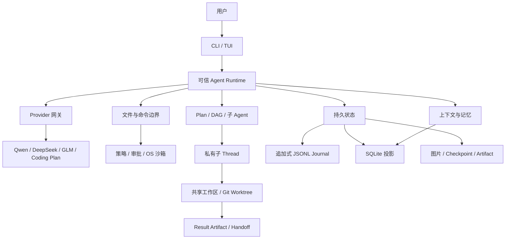

# EASY CODE 技术设计

[English](./TECHNICAL_DESIGN.md) | 简体中文 | [返回 README](../README_zh.md)

本文描述 EASY CODE 当前实现的稳定边界，而不是源码函数或行号索引。安装、配置和命令用法见 [README](../README_zh.md)。

## 1. 目标与原则

EASY CODE 把模型视为规划与代码生成组件，而不是权限、状态或完成条件的裁决者。模型只提出结构化意图；是否允许、如何执行、何时持久化以及能否视为完成，都由本地 Runtime 决定。

系统遵守以下原则：

1. **数据不能授予权限。** 文件、模型输出、命令输出、图片、检索结果、记忆、任务文字和 Artifact 都是不可信数据。
2. **先校验，后产生副作用。** 每个动作先经过模式、角色、Schema、工作区、策略和状态校验。
3. **先持久化，后激活。** 关键转换先形成权威记录，UI、父 Agent 或恢复流程才可观察到它。
4. **隔离层职责分开。** 私有 Thread 隔离上下文，Git Worktree 隔离源码状态，操作系统沙箱隔离进程。
5. **派生状态不能覆盖权威状态。** SQLite 投影、Working Checkpoint、向量索引和 TUI 都可重建，Thread Journal 才是恢复依据。
6. **恢复不猜测成功。** 中断、超时或缺少完成证据的操作不会被静默重放或标记完成。

EASY CODE 是本地优先而非完全离线：项目操作和状态保存在本机，推理请求仍发送到用户选择的供应商。权限、身份、沙箱或恢复状态不明确时一律安全失败。

## 2. 架构与技术栈

各层责任按以下方向收敛：

- UI 只提交用户动作并展示状态，不决定权限或完成条件。
- Provider 只完成模型协议转换，不直接获得工作区能力。
- 工具和编排层提交经过校验的结果，不能自行改写 Thread 历史。
- 持久层保存权威事件，派生索引和界面都从这些事件恢复。

| 领域 | 主要技术 | 责任 |
| --- | --- | --- |
| Runtime | TypeScript、Node.js 20+ | 控制流、状态和工具执行。 |
| CLI/TUI | Commander、Chalk、Node 终端 API | 命令、常驻界面和非 TTY 降级。 |
| 契约 | JSON Schema、Zod、TypeScript 类型 | 校验工具、配置和持久数据。 |
| Provider | OpenAI-compatible Chat Completions | 统一消息、工具、Thinking、图片、重试和用量。 |
| 持久化 | JSONL、SQLite WASM | 权威事件、查询投影、记忆与审计。 |
| 检索 | FTS5、ONNX Runtime、Orama | 关键词与语义混合检索。 |
| 执行隔离 | Anthropic Sandbox Runtime、Git Worktree | 进程边界与源码状态隔离。 |
| 分发/集成 | npm、Prompt Bundle、VS Code 扩展 | 可信资源安装和终端增强。 |

模型不能直接访问文件系统、进程、数据库或 Git，只能调用本次请求公开的结构化能力。系统规则、模式说明和工具描述位于版本化 Prompt Bundle 中；Manifest 绑定资源版本与内容，启动时校验并加载为只读视图。Prompt 文本只解释能力，真正的 Schema、权限与状态转换编译在 Runtime 中。

配置按默认值、可信用户配置、安全项目配置、环境变量和显式 CLI 参数合并。项目配置不能重定向凭据、Provider 地址、应用数据根或托管 Worktree 根；`EASYCODE.md` 只能提供低信任项目指导。

## 3. 请求生命周期与工作模式

一次主回合的高层流程是：

1. 校验 Prompt Bundle、配置和凭据，加载项目规则并取得 Thread Lease。
2. 绑定规范化工作区，先持久化用户消息与图片引用。
3. Auto 模式用受限控制请求选择直接回答、Plan 或 Code。
4. 组装 Working Checkpoint、近期消息、检索证据、长期记忆和本步系统 Prompt。
5. 按模式、角色、Plan/DAG、上下文压力和执行权限裁剪工具。
6. 调用 Provider，校验普通文本、Thinking 和结构化动作，再执行允许的副作用。
7. 保存模型请求、工具结果、用量和状态转换，循环至审核、成功、阻塞、限制或中断。
8. 只有到达允许的成功边界，才提交本回合暂存的长期记忆。

| 模式 | 语义 |
| --- | --- |
| `plan` | 只读调查并提交正式可审核 Plan；普通文本不能替代方案。 |
| `auto` | 受限控制器选择直接回答、Plan 或 Code；控制器没有工作区工具。 |
| `code` | 直接实现与验证，但文件和命令仍受全部安全边界约束。 |

Auto 使用结构化选择而非关键词匹配。只有无需工作区、工具和副作用的有界请求才能直接回答。Plan 的同意、拒绝和反馈都是持久转换；已批准但尚未被执行 DAG 接管的 Plan 若中断，会回到审核。

执行中调整按 FIFO 独立持久化，在模型前后、工具之间或最终回答前的安全边界封存一个待处理前缀。调整能改变方向，但不能改变权限、沙箱、任务所有权或 Agent 身份；过期响应中尚未启动的工具不会执行。

`none/low/medium/high` 分别提供 1×/1×/2×/4× 本地步骤预算和 2/2/4/8 个最大活跃子 Agent；Provider 超时也随强度调整。所有强度共用同一个上下文预算和压缩阈值。尚未观察终态的后台命令、强制压缩、活跃 DAG 或未收集子 Agent 会阻止普通最终回答。

## 4. 信任、安全与沙箱

指令优先级为 Runtime 强制策略与基础契约、当前用户请求、最近的工作区 `EASYCODE.md`、父目录规则、用户级规则。项目内容、依赖元数据、检索证据和命令输出只能作为数据，不能增加能力。

Runtime 每次调用都会依据模式、主/子 Agent 角色、Plan/DAG 阶段、未收集结果、上下文压力、模型能力、审批状态和沙箱可用性重新生成工具集合。未知工具、错误 Schema 或非法转换在执行前被拒绝。

受保护文件工具只接受工作区相对路径，同时校验词法路径和真实路径；绝对路径、父目录穿越、符号链接/Junction 逃逸、Git 控制目录和 Runtime 私有目录均被拒绝。创建不覆盖已有目标，更新和删除需要先读取并在写前比对内容身份；并发变化报告冲突，成功修改产生持久 Diff。共享子 Agent 写入还会串行化。

命令使用已解析可执行程序、参数数组、受限工作目录、环境、超时和输出上限，而不是默认执行任务中的 Shell 字符串。受保护执行依次经过：能力判断、命令策略与审批、OS 沙箱。永久拒绝规则先于用户批准；Thread 可授权同一规范化可执行程序，但授权不跨 Thread。后台子 Agent 不能弹出审批或创建新授权。

短命令同步返回；长命令使用分离的启动、轮询和取消协议，并绑定发起 Thread/Agent。任务结束前必须观察命令终态；超时、取消或退出会回收进程树，输出保留有界头尾摘要。

| 平台 | 沙箱边界 |
| --- | --- |
| Windows | 随包 Anthropic Sandbox Runtime 后端，目前为 alpha，可能需要一次 UAC 初始化。 |
| macOS | 系统 Seatbelt。 |
| Linux | bubblewrap，依赖 `bubblewrap`、`socat`、`ripgrep` 和可用的非特权用户命名空间。 |

手动和自动审批都使用沙箱；初始化或启动失败会关闭受保护命令，不会退回宿主机执行。“危险的完全访问”只有用户二次确认后才在当前进程启用，它绕过命令策略、审批、沙箱和工作区文件边界，并以当前 OS 用户权限运行。Git Worktree 只隔离源码状态，不是安全沙箱。

Key 位于操作系统凭据存储或显式环境变量中，项目配置不能保存或重定向它们。标准 GLM 与 GLM Coding Plan 使用不同凭据和端点，绝不互相回退。受保护命令默认不继承供应商 Key；模型错误、日志、Checkpoint、Summary、检索和记忆都会脱敏并过滤终端控制字符。

## 5. 持久状态与 Resume

每个 Thread 有独立的追加式 JSONL Journal，事件具有连续序号、唯一身份、时间、阶段和结构化载荷，并在追加后刷新到磁盘。Journal 是权威来源；SQLite 中的会话、记忆、用量和上下文索引只是可重建查询投影。图片字节、子 Agent 结果和 Worktree 描述保存在私有文件中，Journal 保存引用与完整性信息。

增量 Checkpoint 减少长 Thread 的重复写入。Delta 绑定精确 Journal 基准，只允许追加消息、更新设置/文件观察、追加变更/命令，以及让压缩状态前移；Plan、DAG、审批和执行中调整仍由事件决定。Schema、大小或基准不匹配会拒绝提交，旧版全量快照仍可恢复。

持久状态包括消息与工具结果、模式/模型/Bundle 身份、Summary V2 与意图账本、Plan/DAG、文件观察与 Diff、命令与 Thread 授权、待处理调整、子 Agent/环境/Artifact 绑定，以及 Provider 上报用量。

Resume 先取得 Thread Lease 并校验工作区与 Bundle，再从兼容 Checkpoint 开始按 Journal 顺序回放，修复 SQLite 投影，追平检索索引，并重新验证文件、授权和托管环境。中断请求和命令不盲目重放；无完成证据的任务不变成成功；未接管的已批准 Plan 回到审核；缺失 Worktree 只有在身份与快照可验证时重建。

只有末尾不完整的 Journal 记录可在确认后截断；中部损坏、重复 ID、序号断裂或持续并发变化会停止恢复，而不是跳过证据。

## 6. 上下文、MicroCompaction、Summary V2 与混合 RAG

完整 Transcript 保留在 Journal，每次 Provider 请求只接收三层有界投影：

1. **Working Checkpoint：** Runtime 对目标、约束、执行身份、文件/命令、Plan/DAG 和子 Agent 状态的确定性恢复地图。
2. **近期工作集：** 累计 Summary 与压缩边界后的有界消息尾部，发送前统一执行 MicroCompaction。
3. **相关历史：** 只从近期边界之前的 Thread 私有证据中检索少量去重片段。

系统契约、当前环境、项目规则和长期记忆一起组装。请求仍超限时可临时省略或有界概括较旧活跃消息，但不会推进持久压缩边界。

**MicroCompaction** 是幂等、供应商无关且不修改 Journal 的请求前投影。已有后续模型消息、长度至少 2,048 字符的文件、命令、搜索、修改、任务或子 Agent 工具结果，会被替换为恢复引用；当前未闭合的工具尾部保持完整。引用保留角色、顺序、工具/调用 ID、长度、SHA-256 和路径、行范围、退出状态、Task/Agent/Artifact ID 等必要摘要，原始正文仍在 Journal。已消费 Thinking 被移除，只有最新未闭合工具请求所需的 Thinking 暂时保留。压力估算和实际请求使用同一投影。

**Compaction Summary V2** 是严格、供应商无关、最多 12,000 字符的 JSON，固定保存主请求、活跃约束、技术决策、文件与改动、已验证结果、错误/阻塞、待办、当前工作、下一步和短证据引用；不允许自由 analysis、XML 或 Schema 变体。Runtime 提供带持久消息序号和用户原文的来源清单。

独立**意图账本**持久保存当前主请求、活跃约束、用户纠正和已取代请求，关键项使用可回查的精确原文。一次性 `coverage check` 确认最新请求、Plan/Task、失败、当前工作和下一步均已覆盖；它不进入 `workingSummary` 或独立意图状态，审计事件仍在 Journal。

接收 Summary 前，Runtime 会脱敏并校验格式、原文/序号、既有意图、活跃 Plan/DAG、最近失败、证据引用、单向边界和来源哈希，再模拟下一次请求验证净收益。失败不改变 Summary、账本或边界；成功后保存来源范围/哈希、压缩前后大小、节省比例和压缩后利用率。

压力按 MicroCompaction、检索和工具裁剪后实际发送的消息加工具 Schema 计算。默认和硬性近期上限均为 250,000 字符，配置更小时取较小值：`60%` 建议压缩、`80%` 强制只做压缩、`90%` 由 Runtime 插入强制请求。自愿压缩要求至少约 8,192 个新投影字符，并至少节省 8,192 字符和 10%；强制压力可绕过冷却与自愿门槛，但不能绕过完整性、正收益和压缩后 `<80%`。`55%` 是诊断安全水位。

Thread RAG 将较早用户消息、可见模型文本、显式工具请求和工具证据脱敏、分块并增量索引；系统 Prompt 与隐藏 Thinking 不进入索引。候选同时绑定规范化工作区和精确 Thread，并限制在近期边界之前，因此父子 Thread 不能互查私有证据。

SQLite FTS5 是权威关键词索引，本地多语言 ONNX 模型生成 Embedding，SQLite 保存带版本和内容哈希的向量，Orama 提供可丢弃、带代际校验的内存排序。关键词与语义候选按排名融合，再结合重要性和时间接近度去重。Embedding 缺失、损坏或不兼容时自动退回 FTS5；检索结果始终标记为不可信且可能过期。

长期记忆按规范化工作区保存短原子偏好、约定、架构、决策和环境事实，并沿用“SQLite 权威、向量可重建”的混合检索。模型变更先暂存，只有成功边界才事务提交；相同新增是 no-op，修订/遗忘需精确记忆 ID。Plan 回合仅在用户明确表达持久偏好或约定时可保存这两类内容。

### 证据驱动的进展控制

Runtime 在工具输出被裁剪前，从权威结果中提取有界进展证据。版本相同的重复读取只产生弱提醒；只有跨不同验证周期、重复出现的高置信验证失败才会建立停滞事件。扁平命令协议保留原有测试与构建意图，并新增显式验证意图，可区分单元、集成、构建、类型、Lint、格式、冒烟、Benchmark 和自定义验证；验证类别进入持久化失败身份，避免把无关检查合并成同一事件。网络、权限、取消、沙箱和其他基础设施失败单独分类，不能成为“代码策略错误”的证据。

每个任务最多自动启动一次隔离审查。Reviewer 只接收不可变、已脱敏的材料包，仅能提交一种严格结构化报告，不能修改工作区、执行 Shell、拥有 DAG、写记忆或控制子 Agent。有效报告必须提出一个能以终态命令结果验证的反证实验；父 Agent 得到真实实验结果前暂停普通修改。执行实验只解除门禁，只有匹配目标的已验证改善才会关闭停滞事件。Observation、请求开始/终态、用量、审查状态和实验证据均由 Journal 决定并可随 Resume 恢复；快照不完整或版本过期时失败关闭。

## 7. Plan、任务 DAG、子 Agent、Worktree 与 Handoff

Plan 用于实现前审核方向，DAG 用于执行中约束依赖、所有权、完成证据和结果链。任务包含目的、依赖、输入、预期产物、检查、失败处理、所有者和状态；Runtime 校验图无环且依赖有效。只有依赖完成的节点可开始，一个节点只有一个活跃所有者，完成必须为每条检查提供证据。活跃 DAG 会阻止过早最终回答并随 Resume 恢复。

只有主 Agent 能创建和控制子 Agent。每个子 Agent 绑定单个任务、私有 Code-mode Thread 和执行环境，只接收有界任务、检查、必要上下文和依赖引用；它不能再创建子 Agent、管理父 DAG、写长期记忆或扩大命令权限，必须提交结构化完成或阻塞结果。父 Agent 可追加指导、等待、停止和收集结果；身份与结果先持久化再影响 DAG。

| 环境 | 设计 |
| --- | --- |
| 共享工作区 | 与父 Agent 使用同一目录，写入串行并做版本校验。 |
| 托管 Worktree | 独立 Git Checkout，保存基线、执行快照和结果提交。 |

`auto` 在有效 Git 项目优先 Worktree，非 Git 项目使用共享工作区；显式要求 Worktree 但校验失败时不会回退。基线可来自干净起点、本地 `HEAD` 或当前本地改动快照，创建后不与父目录实时同步。托管根必须与仓库不重叠，恢复和清理均验证 Worktree 仍属于预期仓库。

完成结果形成不可变 Result Artifact，记录 Agent/Task/环境、基线、结果、变更文件和依赖链；完整 Manifest 留在私有存储，父上下文只接收有界引用。后继任务只消费状态和血缘均有效的 Artifact，依赖集成冲突会保留环境并标记 `conflicted`。

Handoff 是显式交付：本地 Handoff 在冲突检查后应用累计结果；分支 Handoff 创建或验证本地分支，不推送远端。已包含同一结果时可安全重试，分叉、分支占用或补丁冲突时保留 Artifact，不覆盖用户 Checkout。共享结果不能伪造为独立分支提交。

## 8. TUI 与多模态

TUI 是结构化状态投影：一次性会话标题、追加式对话、可重绘实时区、常驻输入框/状态栏，以及模型、审批、Plan 和 Resume 菜单。已完成内容只写入 Scrollback 一次；任一时刻只有一个组件拥有输入，菜单结束后恢复草稿、附件、光标和终端模式。非 TTY 环境降级为只追加文本。

Thinking 与可见回答分开保存并按真实事件顺序展示。默认只显示短预览；VS Code 扩展通过经过认证的本地桥接在原位置展开完整内容。展开状态只属于 UI，不进入模型上下文、检索或记忆。

图片先在本地解码为 PNG/JPEG/WebP/GIF 并校验，再复制到私有 Thread 存储。Journal 只保存稳定标签、媒体元数据、存储键和 SHA-256，不保存 Base64。Provider 边界再次检查哈希、数量、总字节/像素和模型视觉能力；当前图片无效会失败，不兼容历史图片可在切换模型后从请求投影省略。VS Code 扩展区分图片和多行文本；GLM Coding Plan 当前不发送直接图片 Payload。

## 9. Provider 与模型目录

`resources/prompt-bundle/models/catalog.json` 是 Provider、模型和能力的单一声明源，定义供应商/适配器、可信默认端点、默认模型、凭据环境变量、视觉、Thinking Profile 和 Benchmark Profile。构建时校验并绑定 Prompt Bundle 哈希；安装副本是 Runtime 托管资源，直接修改会被检测和修复。CLI、配置、Provider、图片、Thinking 和评测都消费同一目录。

| 通道 | 默认端点 / 默认模型 | 当前模型（`*` 支持图片） |
| --- | --- | --- |
| DeepSeek | `https://api.deepseek.com` / `deepseek-v4-pro` | `deepseek-v4-flash`、`deepseek-v4-pro`、`deepseek-v4-flash-vision-exp*` |
| Alibaba Qwen | `https://dashscope.aliyuncs.com/compatible-mode/v1` / `qwen3.7-max` | `qwen3.7-max`、`qwen3.7-plus*`、`qwen3.6-max`、`qwen3.6-plus*`、`qwen3.5-plus*`、`qwen3.5-flash*`、`qwen3-max`、`qwen3-vl-plus*`、`qwen3-vl-flash*` |
| 智谱 GLM | `https://open.bigmodel.cn/api/paas/v4` / `glm-5.3` | `glm-5.3-flash*`、`glm-5.3`、`glm-5.2` |
| GLM Coding Plan | `https://open.bigmodel.cn/api/coding/paas/v4` / `glm-5.3` | `glm-5.3-flash`、`glm-5.3`、`glm-5.2` |

标准 GLM 与 Coding Plan 即使模型 ID 相同也保持端点、Key、配置、Thread 身份、用量和评测隔离。用户级配置或受支持环境变量可明确覆盖普通通道，项目配置不能；Benchmark Profile 固定 Coding Plan 端点与专用 Key，不回退。

未知模型不会被推定支持图片或可控 Thinking。Qwen 非 `none` 映射显式预算；DeepSeek `medium` 按兼容行为映射为 `high`；GLM-5.3 的强制 Profile 不用 `none` 发送未支持的关闭字段；GLM-5.2 可显式开关。Provider 网关统一取消、超时和有限重试。用量只采用供应商实际上报值，并按通道、模型、主/子角色、用途和重试区分。

## 10. SWE-bench Verified Mini 评测

Harbor 适配器评测公开 HAL/MariusHobbhahn 50 题集合（Django 25、Sphinx 25），不是官方完整 500 题轨道。`subset-50.json` 固定有序 Instance ID、社区修订 `b316c349…`、官方 Verified 修订 `78f471bf…`、Harbor 摘要 `sha256:b934b0…`、任务提交 `3d07b464…`，以及 `harbor==0.16.1`、`swebench==5.0.2`；完整哈希由 Manifest 保存并在运行前验证。

固定 Profile 为 `glm-coding-plan / glm-5.3-flash / code / high`，端点为 `https://open.bigmodel.cn/api/coding/paas/v4`，审批为 safe auto-approved。它只读取 Coding Plan 专用 Key，不读取标准 GLM Key。当前构建先打包为 npm Archive，每题在独立 Linux Trial 的 `/testbed` 中运行并评分。

Harbor 容器是可信的一次性外层隔离；专用标志只允许适配器跳过嵌套主机沙箱，普通主机运行不得设置。Key 在主机和 Trial 中依次通过随机 owner-only 临时文件传递、消费并删除，不进入模型命令环境。固定多语言 ONNX 资产从 Benchmark 根复制到每个 Trial 并二次校验，使被测配置实际运行混合 RAG，且无需容器联网下载。

评测保持 `n-attempts=1`；仅 `agent.run` 前的环境启动或安装超时可自动重试，Agent 超时和非零退出不获得新预算。Agent 启动后会在清理路径捕获数据目录、Git Patch 和普通未跟踪文件为原子 Generation。恢复只允许同一 Job/Trial，绑定题目、基础提交、Archive/Embedding 哈希、端点、模型、模式和强度；任一不匹配、父 Thread 歧义、链接/特殊文件或 Manifest 损坏都拒绝，Generation 不能跨题复用，最多保留三个。

每题输出上下文指标，覆盖 Trial/Checkpoint 身份、是否恢复、Journal 事件、上下文 Chunk/Embedding、Working Checkpoint、检索后端、模型请求和 Provider Token。完整 50 题需显式费用确认；`offset + limit` 必须形成合法不重叠切片并使用不同 Run ID。运行方法和完整固定值见 [评测指南](../benchmarks/swebench_verified/README.md)。

## 11. 数据生命周期、失败模式与权衡

| 数据 | 位置与生命周期 |
| --- | --- |
| Prompt Bundle | 固定用户级 `~/.easy_code`；安装、校验、修复，数据卸载可删除。 |
| Journal、SQLite、附件、Artifact | 平台应用数据目录；跨会话持久，验证归属后可清理。 |
| 用户配置 / API Key | 平台配置目录 / OS 凭据存储；卸载默认保留。 |
| Embedding 资源 | 平台缓存目录；可重建，卸载默认保留。 |
| 项目配置、Worktree、Handoff 分支 | 用户工作区或托管 Git 位置；可能含代码，卸载默认保留。 |
| SWE-bench 数据 | 用户选择的 Benchmark 根；不随普通 CLI 卸载删除。 |

数据根带产品归属标记；清理只处理规范化且验证归属的真实目录，不跟随链接。数据库占用、根归属不明或可能存在未交付代码时安全停止或保留。

主要失败策略是：模型工具或 Schema 无效则拒绝；文件版本变化则冲突；策略、审批或沙箱失败则不执行；Provider 仅对明确暂时错误有限重试；Journal 只修复损坏尾部；SQLite 投影按 Journal 重建；Summary 校验失败不提交；Embedding/Orama 失败退回 FTS5；子 Agent 无证据不完成；Worktree/Handoff 冲突保留 Artifact；高级 TUI 不可用则降级普通 CLI。终端日志只是视图，`/changes`、`/commands`、`/permissions`、`/tasks`、`/agents`、`/context`、`/memory` 和 `/usage` 都读取 Runtime 状态。

主要权衡包括：本地优先仍依赖远程推理；确定性字符预算不同于精确 Token；MicroCompaction 的引用需要在必要时重新取回正文；Summary V2 与意图校验以复杂度换取长任务连续性；混合 RAG 增加本地资产但保留 FTS5 回退；共享子 Agent 兼容非 Git 项目但写入串行；Worktree 改善源码隔离却不能替代 OS 沙箱；非流式主请求简化持久步骤边界，但 TUI 更依赖耗时状态和执行中调整。

只要继续保持权限、身份、持久化和恢复不变量，系统可以扩展新的 Provider、模型、检索后端、子 Agent 角色或执行环境。源码采用 [MIT License](../LICENSE)，第三方组件见[第三方开源声明](../THIRD_PARTY_NOTICES.md)。
