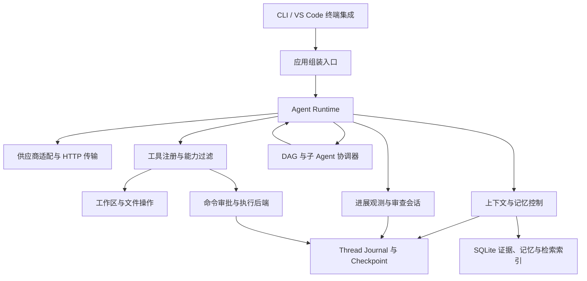

# EASY CODE 技术设计

[English](TECHNICAL_DESIGN.md) · [快速开始](../README_zh.md) · [配置示例](config.example.toml)

本文描述当前仓库中的实现，不是待实施的路线图。默认数值来自 [runtime-defaults.json](../src/config/runtime-defaults.json)，由 [runtime-limits.ts](../src/config/runtime-limits.ts) 校验，并可通过配置覆盖。各节的源码链接用于定位实际实现。

## 1. 总体架构与职责边界

EASY CODE 是使用 TypeScript / Node.js 实现的本地 CLI 编程 Agent。它请求模型供应商 API，在用户电脑或指定执行环境内运行工具，并持久化会话和控制状态，以支持中断恢复。

核心边界是：**模型提出建议，Runtime 掌握执行权威。** 模型生成工具调用、摘要、计划和审查结论；Runtime 校验参数、实施权限、管理进程和预算、保存证据，并判断任务是否具备结束条件。



| 层次 | 主要源码 | 职责 |
| --- | --- | --- |
| 入口与组装 | [index.ts](../src/index.ts)、[app.ts](../src/app.ts) | CLI 解析；创建服务；连接 UI、状态、权限和审查回调 |
| Agent 执行 | [runtime/](../src/runtime) | 模型—工具循环、模式路由、预算、错误分类和交付门槛 |
| 工具与工作区 | [tools/](../src/tools)、[workspace/](../src/workspace) | 能力校验、文件版本、Git 变更与工作区隔离 |
| 命令控制 | [command/](../src/command)、[sandbox/](../src/sandbox)、[downloads/](../src/downloads) | 审批、进程监督、网络代理、执行后端与制品下载 |
| 持久化 | [threads/](../src/threads)、[storage/](../src/storage) | 追加式事件、恢复、SQLite 仓储与检查点 |
| 记忆与容量 | [context/](../src/context)、[memory/](../src/memory) | 活跃上下文、证据引用、摘要、项目记忆和混合检索 |
| 协作 | [plans/](../src/plans)、[tasks/](../src/tasks)、[subagents/](../src/subagents) | 用户计划、任务 DAG、子线程和结果交接 |
| 可靠性与审查 | [progress/](../src/progress)、[review/](../src/review) | 基于证据的进展检测、隔离讨论与交付检查 |
| 展示 | [cli/](../src/cli)、[ui/](../src/ui)、[images/](../src/images) | 终端交互、渲染、图片处理和编辑器桥接 |
| 评测 | [src/benchmarks/](../src/benchmarks)、[Benchmark 适配器](../benchmarks/swebench_verified) | SWE-bench / Harbor 编排与隔离 Worker 执行 |

`app.ts` 是应用的依赖组装入口，`runtime/agent.ts` 是执行协调中心。这两个模块仍然较大；项目是模块化单体应用，不是独立部署的微服务集合。

## 2. 技术栈及用途

| 技术 | 在项目中的用途 |
| --- | --- |
| TypeScript、Node.js ≥ 20.11、ESM | 严格类型、NodeNext 模块解析；编译到 `dist/` 的 CLI |
| Commander、TOML、Zod | 命令行解析、配置读取、运行时 Schema 与工具参数校验 |
| Node HTTP / HTTPS | 模型传输、取消、时间和大小限制、受控代理连接 |
| execa、Podman CLI | 宿主进程控制和 rootless Linux 任务容器；项目管理审批、网络代理与生命周期 |
| node-sqlite3-wasm、SQLite FTS5 | 持久化仓储、全文检索和数据库迁移，避免 Node SQLite ABI 编译依赖 |
| ONNX Runtime、Hugging Face tokenizers | 本地文本向量生成 |
| Orama | 派生的向量检索缓存，不是长期记忆的权威存储 |
| env-paths、系统 Keyring | 跨平台配置目录、数据目录和供应商凭据存储 |
| Node TTY / readline、chalk、diff | 自研终端 UI、文本样式与文件差异展示 |
| VS Code Extension API | 终端菜单、图片附件与 Thinking 链接集成 |
| Python、Harbor、Docker | Benchmark 适配、控制器/执行器分离和官方验证 |

精确版本和构建命令见 [package.json](../package.json)。Agent 循环没有依赖 LangChain 或 LangGraph；终端 UI 不是 React / Ink。SQLite 使用 WebAssembly 绑定，但 ONNX Runtime、Keyring 等仍有平台组件，不能将整个项目描述成“纯 JS、没有原生依赖”。

## 3. 一次请求的执行流程与工作模式

一次普通任务按以下顺序推进：

1. 加载配置、解析凭据和模型元数据，创建或恢复 Thread。
2. 持久化用户输入、附件及相关状态变更。
3. Auto 模式通过受限路由请求，选择直接回答、Plan 或 Code。
4. 按稳定系统前缀、活跃历史、新增 Runtime 信息及检索材料组装请求。
5. 检查共享预算和上下文容量，再调用供应商。
6. 校验返回内容和完整工具参数，仅执行该角色、模式拥有的能力。
7. 保存结果与原始证据，更新工作区和进展状态，继续模型—工具循环。
8. 结束前检查后台命令、DAG / 子 Agent、提交合约，以及适用的交付审查。

源码：[agent.ts](../src/runtime/agent.ts)、[auto-router.ts](../src/runtime/auto-router.ts)、[公共类型](../src/core/types.ts)。

工作模式、批准模式和执行环境是三个独立维度：

- **Auto** 是受限的模型路由阶段，不是单纯关键词匹配。
- **Plan** 以分析和结构化 `propose_plan` 提案为主。当前代码仍开放文件编辑和命令工具，因此“尽量避免直接编辑”属于提示层约束，**不是强制只读安全边界**。命令遵循当前审批规则；本模式不开放 DAG / 子 Agent 创建。
- **Code** 执行修改和验证，只有启用编排后才开放相关协作工具。
- 子 Agent 使用独立的受限工具集合，通过结构化结果提交完成；不能递归创建子 Agent，也不能管理项目长期记忆。

HTTP 成功、命令退出码为零、用户任务完成是三种不同结果。只有 thinking、`finishReason = length` 表示输出不完整、工具参数非法等情况，都不能直接视为成功交付。

## 4. 配置、提示词与凭据

[loader.ts](../src/config/loader.ts) 合并默认值、用户配置、安全的项目配置、凭据/环境变量及 CLI 覆盖。用户配置位于平台对应的 EASY CODE 配置目录；项目覆盖使用 `.easycode/config.toml`。环境变量和 CLI 可覆盖保存的设置。

项目配置有单独的安全限制，不能悄悄提供凭据、重定向 Runtime 私有存储或覆盖其他受保护设置。运行预算统一放在 `[limits]` 下，包括按 thinking effort 区分的步数、并发和超时子表。未知或过时的限制字段会报错，不会静默忽略。

部分运行默认值如下，其余模块预算在对应章节说明：

| 配置键 | 默认值 | 含义 |
| --- | --- | --- |
| `steps` | none/low/medium：40；high：80 | Agent 逻辑步数预算 |
| `maxModelRequests` | 120 | 共享模型请求次数上限 |
| `maxTaskTokens` | 0 | 不单独限制累计 Token；其他预算仍生效 |
| `providerTimeoutMs` | 300,000 / 300,000 / 450,000 / 600,000 | none/low/medium/high 请求超时，毫秒 |
| `providerResponseMaxBytes` | 16 MiB | 本地 HTTP 响应大小保护 |
| `commandTimeoutMs` | 120,000 | 默认命令超时，毫秒 |
| `maxManagedWorktrees` | 15 | 受管理 Worktree 数量上限 |

运行 `easy-code config defaults` 可查看完整 TOML。字符、Token、字节、时间和次数是不同单位，不能相互替代。

[凭据模块](../src/config/credentials.ts) 通常通过系统 Keyring 和隐藏输入保存 API Key。密钥不应进入项目 TOML、提示词、会话日志或 Benchmark 任务卷。

[Prompt Bundle](../resources/prompt-bundle) 将系统规则、模式提示和工具描述与可执行代码分离。构建生成版本化资源；安装通过 Manifest、哈希及兼容性检查后激活。提示词或工具说明 JSON 本身不能授予 Runtime 未开放的权限。模型/供应商配置与 Prompt Bundle 分离，见下一节。

[instructions.ts](../src/prompts/instructions.ts) 加载项目 `EASYCODE.md` 指导。它用于表达项目约定，不是覆盖 Runtime 安全策略的授权渠道。

## 5. 模型适配、请求与用量统计

### 5.1 用户维护的模型注册表

Runtime 的权威模型注册表是固定路径 `~/.easy_code/models.toml`。[models.default.toml](../resources/models.default.toml) 只用作安装种子：postinstall 仅在文件不存在时原子创建，绝不覆盖用户已有内容。CLI 在解析命令行选项和凭据前以严格 Schema 加载它；模型工具层不能读取或修改这个受保护文件。

| TOML 字段 | 用途 |
| --- | --- |
| `default_model` | 启动时默认模型的别名。 |
| `providers.<id>.base_url` / `wire_api` | HTTPS 基础端点，以及 `chat_completions` 或 `responses` 协议。 |
| `providers.<id>.env_key` | 可能保存该供应商密钥的环境变量名；文件中不保存密钥本身。 |
| `providers.<id>.supports_streaming` | 是否把该端点作为 SSE 流请求和解析；缺失时安全地默认为 `false`。 |
| `providers.<id>.supports_stream_usage` | Chat Completions 流式请求是否发送 `stream_options.include_usage`；默认 `false`，内置 Qwen 和 DeepSeek 开启。Responses 直接读取终态用量。 |
| `supports_temperature` / `supports_strict_tools` | 通用协议驱动使用的 Wire 能力。 |
| `models.<alias>.provider` / `model` | 供应商引用，以及实际发送给 API 的模型 ID。 |
| `context_window`、`input_modalities` | 官方容量及文本/图片能力。 |
| `tool_calling`、`reasoning` | 声明的模型能力。 |
| `profiles.swe_bench_verified_50` | Benchmark 使用的模型别名、模式和 effort。 |

供应商和模型 ID 都是数据，不再是 TypeScript 枚举。只要新供应商实现两种受支持协议之一，就能直接修改 TOML 接入，不需要增加 Provider 子类或 Factory 分支。未知字段、未知供应商引用、同一供应商重复 Wire Model ID、非 HTTPS 注册表端点都会失败关闭。旧用户配置/环境变量的端点覆盖仍作为兼容层保留，但项目配置不能重定向模型流量或注入凭据。

新 Thread 会绑定当前注册表哈希。Resume 遇到不同绑定会拒绝继续，避免把旧会话静默发送到已变化的端点或协议；旧 Thread 在首次恢复时写入一次性绑定 Checkpoint。SWE-bench Launcher 读取选定 Profile，把同一份注册表送入隔离 Controller，并根据目标供应商端点生成网络 Allowlist。

### 5.2 协议驱动与 reasoning

[providers/](../src/providers) 只保留两个通用协议驱动。Chat Completions Driver 请求 `/chat/completions`；Responses Driver 请求 `/responses`，并把 Responses Input、函数调用、reasoning summary 和用量统一转换为 Runtime 公共结构。两者从注册表读取能力标志，不按供应商名称分支。

系统不再维护 Qwen / DeepSeek / Kimi / GLM 专属 thinking 映射。Chat Completions 的不同方言没有统一 reasoning 参数，因此 EASY CODE 不猜测字段，由服务端使用自身默认行为。若注册表模型声明 `reasoning = true`，Responses Driver 可以发送标准化的 `reasoning.effort`。无论 Wire 是否支持，effort 仍独立控制 Runtime 本地预算与超时。

当 `supports_streaming = true` 时，对应协议驱动请求 SSE，每次实际请求使用唯一 ID 和有序的瞬态事件。增量解码支持 UTF-8、LF/CRLF/CR 和 SSE 记录。Chat Completions 接受空用量字段及纯用量块，要求选定 choice 的结束原因和 `[DONE]` 均已到达；Responses 必须收到并校验 completed/incomplete 终态事件。HTTP EOF 不代表模型完成，流内错误不能忽略。只有完整响应被接受、原始参数通过校验后才执行工具。若成功端点返回 JSON，仍在同一次请求内完整解析，不另发请求。

网络故障和缺失终态沿用统一 API 重试额度（默认重试五次），每次尝试重新分配 ID 和缓冲区；部分响应不进入模型历史，也不执行。取消、认证失败和损坏的协议数据不会获得额外自动重试。长度截断及 incomplete 输出进入现有内容纠正流程。真实用量仅结算一次，缺失时沿用既有估算。独立适配器调用保留显式重试上限；Runtime 调用将其设为零，由 Runtime 统一拥有重试预算。

CLI 按 `limits.streamFlushIntervalMs`（默认 50ms）合并增量刷新，复用未变化节点的布局缓存。`limits.streamPreviewMaxChars`（默认 16,000 字符）只限制生成过程中的预览；末尾未完成词片段暂不展示以便完整过滤，接受后的正文和 thinking 仍完整保留。完成/中断立即刷新，重试时旧预览标记为中断。清屏、切换 Thread 和关闭会取消待执行刷新，重复或迟到的增量不能更新新尝试。已有用户 `models.toml` 不会被覆盖；支持用量选项的端点需要在其中开启 `supports_stream_usage = true`。

终端以稳定 ID 原位替换虚拟文档中的 Thinking/回答节点，保持 reasoning、正文和工具调用的真实先后顺序。只有最终组装后的 Assistant Message 写入 Journal，逐片段事件不持久化；完成结果与已有节点对齐，不会重复打印答案。非交互终端及无法启用固定视窗的小终端继续使用完整原子输出。本地输出/上下文预留**绝不会**序列化成 `max_tokens`、`max_completion_tokens` 或 `max_output_tokens`；HTTP 响应字节上限只保护本地进程，不改变生成语义。

[model-retry.ts](../src/runtime/model-retry.ts) 集中控制模型重试，适配器不再叠加另一层重试循环。[task-budget.ts](../src/runtime/task-budget.ts) 对主 Agent、子 Agent、审查和辅助请求统一预留、结算请求数及 Token 预算；Resume 不会补回已消耗额度。

[usage/](../src/usage) 按请求用途、角色、供应商/模型记录耗时和可获得的 Token / 缓存指标。供应商没有返回用量不等于消耗为零；缓存输入和 reasoning 子项不能再次叠加到总 Token 中。

## 6. 文件工具、工作区状态与 Git

### 6.1 感知来源的工具边界

工具层现在把过去与内置工具名称耦合的四项职责拆开：

1. `ToolSource` 负责发现和生命周期；`ToolCatalog` 按确定顺序合并来源，并为一次 Runtime 运行发布不可变快照。
2. Runtime 自己维护工具元数据，把每个工具绑定到带来源的稳定身份、效果、允许的角色/模式、编排或视觉要求、幂等性及结果类别。远端声明不能自行授予权限。
3. 统一执行网关解析快照绑定、校验参数、在必要时经过授权边界、调用实现，再规范化有界且与供应商无关的结果内容。
4. 执行前先用 `tool.catalog.bound` 事件记录准确的暴露哈希和有界绑定清单；`tool.result` Journal 事件还会记录实际选中的工具/来源身份、Schema 与能力元数据哈希、目录版本和目录哈希，因此恢复与审计不依赖之后恰好处于活动状态的目录。

`BuiltinToolSource` 现在是可信进程内工具唯一的装配入口。应用为每个主 Thread 保留一个目录；子 Agent 运行和隔离 reviewer 各自持有独立目录。`/tools`、普通回合和子 Agent 因而查看同一种来源模型，不再分别重建工具数组。`AgentRuntime` 只接收目录快照，不再同时接受裸 `tools`，并在捕获的快照上统一执行角色、模式、编排和视觉能力过滤。

内置工具的可用范围集中在一张声明式策略表中。未知旧工具使用保守的主 Agent 兼容配置。动态外部工具必须携带由宿主维护的元数据，且不能声明 Agent 控制、上下文控制或记忆写入等控制面权限；外部写入、进程、网络写入和破坏性效果在没有显式 Runtime 授权桥时失败关闭。模型可见名称或稳定身份冲突会在构建请求前被拒绝。每个目录只启动来源一次，由应用或子 Agent 生命周期负责关闭；目录加载中途失败时，会先关闭已经创建的来源再返回错误。

这只是**扩展接缝，不是 MCP 接入**。仓库当前没有 MCP SDK、MCP 传输、服务发现、MCP 配置、凭据交换或 Resource/Prompt 适配器。应用已经提供带角色、Thread 和工作区上下文的内部来源工厂接缝。未来 MCP Client 可以实现 `ToolSource` 与授权桥，而无需在 Agent 循环里增加供应商专属分支；连接监管、服务器信任、命名和凭据配置仍由应用层负责。

### 6.2 内置文件安全

[内置工具来源](../src/tools/builtin-source.ts) 负责装配可信工具，[工具目录](../src/tools/catalog.ts) 发布不可变的请求视图；不存在另一套注册表去创建平行的内置工具集合。工具同时包含模型可见的 JSON Schema、本地 Zod 校验和结构化结果/错误协议。富结果使用有界的中立内容联合类型，覆盖文本、结构化值、附件引用、资源引用和持久制品；可执行参数及权威证据仍与展示内容分离。

文件操作使用规范化路径、受保护路径规则及源码哈希。搜索结果只证明文件位置，不代表模型已读过文件，更不授权直接覆盖它。

- `read_file` 默认读取 100 行，单次最多 1,000 行，同时受到 24,000 Token 结果预算限制。
- `search_files` 限制遍历、字节和匹配数量，并按规则避开依赖、缓存等目录；它搜索本地文件，不执行联网搜索。
- `update_file` 要求此前读取过对应版本，并校验预期 SHA-256。旧文本/新文本按字面量替换，区分歧义匹配和显式全部替换。
- 创建、更新、删除操作在修改前检查前置条件；版本冲突必须返回错误，不能覆盖并发变更。
- 展示裁剪不能把不完整的文件修改参数变成可执行操作。

源码：[tools/](../src/tools)、[workspace/](../src/workspace)。

Git 感知的变更追踪处理相关已跟踪、暂存、未暂存及未跟踪文件；非 Git 工作区使用快照退化方案。受管理的子 Agent Worktree 可以从包含本地变更的当前快照启动，交接结果前检查基线及冲突。新 Worktree 使用哈希化短目录，完整环境身份仍保存在持久化记录中，旧版完整 ID 路径继续支持恢复。Windows 上的 Runtime Git 调用显式开启长路径，并在检出前预检已跟踪文件、当前快照与配置包含文件；创建失败只清理经过验证的受管路径并保留清理证据，不会静默降低隔离级别。

Worktree 提供变更隔离，**不是操作系统沙箱**。默认文件访问围绕工作区边界；显式宿主机/完全访问能力是另一种权限，不能与普通工作区权限混为一谈。

## 7. 命令系统：审批、执行和网络边界

### 7.1 审批决策

[command/approval.ts](../src/command/approval.ts) 与应用回调区分用户审批和独立命令审批 Agent。

| 批准模式 | 行为 |
| --- | --- |
| 请求批准 | 每个新命令需要用户批准；已有适用的 Thread 前缀授权可以复用 |
| 帮我批准 | 独立、无工具的模型请求给出“此次允许 / 允许此前缀 / 拒绝”；拒绝或失败时，在允许交互的环境里转交用户 |
| 完全访问 | 不要求命令审批，不启用宿主机 OS 沙箱；以当前系统用户权限运行 |

`-y` 选择自动审批，不等于完全访问。CLI 的 `--approval safe|ask|never` 还控制交互提示行为，不能简单等同于这三种权限模式。

前缀授权经过校验，限定于当前 Thread 及其后代，并绑定命令身份和执行范围。Shell / 解释器参数不能仅按可执行文件名粗略匹配。前缀授权不是全局永久允许所有“看起来相似”的命令。

空闲时切换到手动审批会关闭 DAG / 子 Agent 编排；还有未完成的 DAG / 子 Agent 时禁止切换。审查会话使用独立审批流程，不继承主 Agent 的完全访问权限。

### 7.2 生命周期与结果返回

命令流程为：规范化 → 可执行文件/Shell 解析 → 策略与审批 → 受监督启动 → 终态结果和清理。结构化 `program`、`args`、`cwd` 支持相对或工作区内绝对目录，以及合法的多行解释器参数。不完整参数返回错误，不猜测、不截断执行。

`run_command` 对 Agent 表现为同步调用。`start_command`、`poll_command`、`cancel_command` 通过命令 ID 管理长时间任务。超时、取消、进程树清理、执行状态不明由 Runtime 处理；完全访问也不取消这些正确性约束。

命令输出分成多层表示：

- 有界验证收集器独立观察执行输出，不依赖模型最终看到的短摘录。
- 首尾收集器限制内存中的实时输出。
- 磁盘归档在单命令、单 Thread 配额内保存已捕获输出。
- 模型接收精简投影，包括诊断摘录和可用的召回引用。

默认每个流捕获 256,000 字符，单命令归档 32 MiB，单 Thread 归档 256 MiB；成功/失败命令的模型摘录通常为 2,000 / 16,000 字符。这些是不同预算，不是同一个截断阈值。归档耗尽或捕获不完整需要明确标记。

管道最外层返回零**不能证明测试通过**。[verification.ts](../src/command/verification.ts) 和进展观测单独解释能可靠识别的测试终态。输出超限与清理失败也分开处理；只有清理/安全状态确实无法确认时才应隔离执行环境。

### 7.3 Podman 执行后端与网络边界

普通 CLI 的工作区命令统一使用 [PodmanSandboxBackend](../src/sandbox/podman-backend.ts)。Linux 使用 rootless Podman，Windows 使用 WSL 支撑的 rootless Podman machine，macOS 使用 Linux 虚拟机。这明确是 Linux 执行环境，不是原生 Windows/macOS 模拟器。模型 API、密钥、审批、Journal、记忆以及容器控制面留在宿主机。

每个工作区/thread 对应一个带所有权标签的持久容器；容器内命令串行执行。停止、重启保留根文件系统和已安装依赖，但不保留临时目录与进程。服务和访问它的客户端应放在同一条受监督命令内。不同任务及可写子 Agent Worktree 使用不同容器。必须使用 rootless 引擎，不使用 privileged、宿主网络、宿主 PID 命名空间或容器管理接口挂载。容器内 root 可安装依赖，但不等于宿主机管理员。

工作区绑定到 `/workspace`，文件工具与命令直接操作同一份代码，不通过回写覆盖宿主文件。Windows 路径映射到 WSL 的 `/mnt/<盘符>`，每次派发都通过宿主创建的随机文件校验 VM 侧挂载是否一致；共享失败明确报错，不会改用空的远端目录。拒绝挂载参数注入和与 Runtime 数据重叠的根目录；隐藏工作区内受保护目录，以空只读挂载遮蔽受保护文件。宿主 `.git` 只读，另建私有 Git 元数据副本用于容器内 Git 操作，兼容 Windows/Worktree 的指针路径。容器内提交不直接改变宿主 Git refs，Worktree 的最终交付仍由宿主 Runtime 管理。

审批与隔离分离。保留手动审批、独立审批 Agent 和 thread/子 Agent 授权继承。Podman 前缀使用独立命名空间，绑定镜像配置及容器 cwd，绝不能授权宿主命令；它表示命令配方权限，不伪造“容器内可执行文件字节已被可信验证”，界面会提示脚本和程序内容可能变化。完全访问仍明确使用无沙箱宿主执行；`executionScope=host` 需要独立适用的批准。引擎、镜像、能力缺失都不能静默回退到宿主机。

任务容器始终使用 `--network=none`，保留 Linux 本地 IPC：回环、socketpair、共享内存。普通 HTTP(S) 依赖下载经过容器内代理，通过 Podman exec 的标准输入输出转送到唯一的宿主[网络审批网关](../src/command/network-gate.ts)。只有宿主网关在审批后解析、连接目标，并拒绝私有/保留地址。来自容器的帧不可信，限制单帧、连接、缓冲及累计传输量，不能指定宿主控制面地址。完成或取消即关闭网关，后续命令不会继承临时联网能力。直接 socket、SSH、UDP 外联不开放。HTTPS CONNECT 不解密，批准的是调用权限，不保证任意加密请求在业务上只读。

[Podman worker](../src/sandbox/podman-worker.ts) 将 stdout/stderr 与私有 fd 3 上的宿主生命周期事件分离。保留准备、初始化、命令执行、清理的独立计时。超时/取消停止容器，不只终止本地 Podman 客户端。即使 worker 被杀或响应丢失，后端也必须执行清理并独立查询引擎状态。确认容器停止只能恢复清理确定性，不能伪造命令退出结果。命令非零、超时、取消和派发不确定均不自动重放。

持久租约保存容器名、所有者、命令和 thread ID。运行中、所有权不符、配置不符的容器或未完成租约不能静默复用；清理无法确认则保留租约及 Runtime 隔离状态。引擎断线不等于“容器不存在”。升级不会删除旧命令租约或 SRT 清理记录。

Reviewer 在主容器停止后取得不包含挂载内容的依赖镜像快照。两个讨论参与者分别使用该依赖镜像和各自的审查代码副本、Git 元数据，不共享主 Agent 的可写代码。镜像 ID 与命令历史参与审查环境缓存失效。审查预检使用 Linux 解释器及可重定位的 Linux 虚拟环境，而不是宿主 Windows 的 python.exe。

交互启动检查遇到可安装的 `dependencies_missing` / `setup_required` 时，自动调用同一套 setup 一次，显示安装进度；就绪则继续，失败才显示恢复菜单。重新检查不会自动重试安装，用户可明确选择再次 setup。`probe_failed` / `unsupported` 不触发自动安装，成功状态还必须同时满足 readiness 为 `ready`。宿主控制面环境变量采用白名单，保留 Windows OpenSSH 生成机器密钥必需的 `ProgramData`，不继承完整宿主环境或供应商密钥；该环境不传给模型命令。

`npm postinstall` 通过 [podman-install.ts](../src/sandbox/podman-install.ts) 自动准备沙箱：复用 Podman，缺失时通过 Windows WinGet、macOS Homebrew / 校验哈希与 Red Hat 签名的官方安装包、Linux 固定包管理配方安装。Windows 按需准备 WSL；Windows/macOS 创建或启动配置中的 rootless `easy-code` 专用虚拟机，不切换已有默认连接，不调整其他虚拟机或停止其任务。系统自己处理授权，不收集密码，不强制重启。不支持的安装器、拒绝授权、需要重启均明确报告安装未完成。Linux 必要时使用非交互 sudo 安装系统包，rootless 准备必须以普通用户执行。尚未编译的源码依赖安装会延后初始化；`--ignore-scripts` 明确跳过 postinstall，Benchmark 也采用该方式。

`easy-code sandbox setup` 继续同一安装流程，构建缺失的随包 [Containerfile](../resources/podman/Containerfile) 镜像，或拉取用户配置的外部镜像；已有镜像复用。只有 `sandbox doctor` 的临时 asyncio/socketpair/信号量/临时目录/禁外网探针通过才报告就绪，不代表全部语言兼容性已验证。桌面端控制器与 worker 均显式选择专用连接；每次派发验证 VM 能看见工作区，不可共享路径直接报错，不回退宿主机。虚拟机名称/创建时内存/CPU/磁盘及单容器内存/CPU/PID/共享内存/临时空间/代理/控制预算见 [config.example.toml](config.example.toml)。修改创建参数不会重设已有 VM。镜像与任务容器保留，不全局 prune。引擎侧寿命上限约束 CLI 崩溃后遗留的进程，不确定的 lease 保留供诊断。Reviewer 使用已停止的主任务依赖快照，只读根文件系统加独立可写工作区。

Benchmark 有意保留原有可信的离线 Harbor/Docker 控制器—执行器分离，不安装嵌套 Podman。资源限制仍从 [sandbox-resources.json](../benchmarks/swebench_verified/sandbox-resources.json) 加载；模型命令不能获得普通 CLI 的联网中继。供应商 API 访问仍只属于控制器。

Podman 是普通 CLI 唯一的沙箱。原生旧沙箱实现、依赖（含开发依赖）、ACL 修复工具、专用探针及已废弃的 Harbor 内层隔离器均已删除。完全访问的原生宿主执行保留 Windows Job/POSIX 进程组监督，但不是沙箱。Benchmark 只保留独立的 Docker 控制器/执行器桥接。容器验收入口为 [smoke-podman.mjs](../scripts/smoke-podman.mjs)。升级后需重新构建/安装并重启 CLI；清理源码不会删除历史日志或未完成命令记录。

安装、引擎调用、Worker 和卸载共用 `podmanEnvironment()` 解析的绝对 `PODMAN_CONNECTIONS_CONF`；默认沿用 Podman 的平台路径（Windows `%APPDATA%/containers/podman-connections.json`，其他平台 `$XDG_CONFIG_HOME/containers` 或 `$HOME/.config/containers`），保留用户显式指定的连接文件，拒绝相对路径。Windows 缺失 APPDATA 时由用户目录补齐。这个变量只属于宿主控制面，不给模型命令。

初始化不能把“VM 正在运行”等同于“可以派发命令”。安装器核验 VM 的 rootless、SSH 用户/端口/身份文件，通过该 VM 的 `id -u` 获取 UID，再验证同名连接的 URI 与身份。缺少连接时仅用 Podman 的 `system connection add` 补回；已有同名连接指向其他目标则拒绝覆盖。之后仅对服务尚未就绪的连接错误，在 `podmanControlTimeoutMs` 内重复只读 info 探测，不重复安装或用户命令。

`podman-setup.lock` 将 npm、交互启动和显式 setup 串行化，等待上限使用 `podmanControlTimeoutMs`。获得锁后重新检查就绪状态，避免第二个调用重建已准备好的环境；卸载等待正在运行的安装进程。错误保留失败阶段及同一运行环境下的连接文件、机器/连接清单，不再仅显示过时的初始“依赖缺失”。测试可设置 `EASY_CODE_TEST_REAL_PODMAN=1` 运行真实引擎的隔离连接文件恢复测试；该测试禁止安装/启停/删除真实机器，并校验真实连接文件未变化。

### 7.4 容器迁移后的验证、审查与资源维护

测试框架识别通过后端声明的工作区映射读取 `package.json`，不会把容器 `/workspace` 当作宿主路径。只有工作区内、通过路径保护且不超过 1 MiB 的清单可以参与识别。无法识别的 npm/yarn/pnpm 脚本返回未知验证结果，不能仅凭外层退出码 0 记为通过。

Reviewer 的宿主副本仅保存源码与原始测试基线。Linux `.venv`、`node_modules`、`venv`、`dist`、`build` 由离线容器中的 [review-dependencies.py](../resources/podman/review-dependencies.py) 读取、限额哈希并复制，保留 Linux 链接与执行权限，不使用宿主机 junction 或解析宿主 Python。依赖放入 Runtime 所有的命名卷，两位参与者只读挂载到各自的 `/workspace` 对应目录；源码副本仍可用于独立实验。容器根文件系统同样只读。Python 虚拟环境预检也在容器内执行。

[podman-review.ts](../src/sandbox/podman-review.ts) 按持久化命令环境版本和依赖内容摘要缓存不可变镜像、卷和审查版本。恢复会话、检查新鲜度不会无条件重复 commit；新命令或依赖变化使旧版本失效。快照事务和命令使用同一个独占租约；快照错误但辅助容器已清理，不会隔离主任务，只有辅助容器清理不明才保留租约。辅助进程有时限，文件数、字节和遍历时间复用 `reviewDependencyMaxFiles`、`reviewDependencyMaxBytes`、`reviewPreparationTimeoutMs` 配置。

`easy-code sandbox resources` 列出引擎中 EASY CODE 所有的容器、审查卷和镜像。`easy-code sandbox remove <container|volume|image> <完整名称> --yes` 才执行单项永久删除。删除前检查名称、引擎标签、控制目录和租约；运行中、状态未知、仍被容器引用或存在未完成租约的资源不能强制删除。无全局 prune，无自动删除 Podman/WSL 虚拟机、基础镜像、项目文件或历史日志。完整卸载使用下述独立的确认流程，不借此命令做全局清理；普通停止仍保留任务依赖供恢复。

Podman 验收统一在 [smoke-podman.mjs](../scripts/smoke-podman.mjs)：涵盖 Plan 命令审批、管道失败、npm 元数据映射、生命周期以及独立审查依赖。旧的原生平台验收脚本已经移除。Linux 依赖复制器可单独在 WSL 执行 `python3 tests/podman-review-dependencies.test.py`，此测试不替代完整容器验收。

### 7.5 当前用户完整卸载

[uninstall/](../src/uninstall) 独立生成只读操作清单。卸载分支在用户模型注册表校验之前执行，配置损坏不会阻止维护，--dry-run 也不会重新创建配置。旧 --data-only 由含义明确的 --keep-cli 替代。

卸载预检不依赖 `--connection <名称>`，也不调用安装器修复连接文件。Windows/macOS 从已核验的 VM 元数据及该 VM 的 rootless UID 构造明确的本地 SSH 地址与身份，通过 `--url` / `--identity` 直接盘点资源；即使连接记录不存在，仍可生成只读清单。安装与卸载复用 [podman-connection.ts](../src/sandbox/podman-connection.ts) 的端点校验。真正的外来同名连接仍阻止删除，但已核验的旧转发端口不等于外来身份；执行前再次验证 VM 身份、端口、用户、rootless 状态、连接归属及资源清单。SSH 身份不可用或引擎确实不可达时保留数据并报告错误，不能跳过资源核验强制清理。

生命周期明确区分稳定的 VM 身份（名称、创建时间、配置目录、SSH 密钥）与可变化的连接索引。机器仍存在时，如果连接的密钥、回环主机、SSH 用户和 socket 路径均一致，仅端口过期，且可写的 CLI 条目与所选连接文件匹配、旧端口不属于另一台 Podman 机器，就可按当前 VM 修复。安装只更新已核验的旧连接、补齐缺失的 root/rootless 连接，保留默认连接、VM、镜像和密钥。卸载更简单：预览只分类不写入，使用当前 VM 端点盘点资源，确认删除时保留实际连接快照以便精确处理部分清理；不为删除而先重建或改写连接。机器重建后使用最新身份记录，而不是第一条历史记录；Windows 身份路径比较共用长短路径规范化。

[sandbox/podman-machine-state.ts](../src/sandbox/podman-machine-state.ts) 由安装和卸载共同使用。机器存在时检查并复用，从已核验端点补回缺失的 rootless/root 连接；机器不存在时（Windows 还确认 WSL 发行版已不存在），先清理核验通过的残留连接，再允许安装创建机器。卸载使用同一套归属判断，但不会创建机器。外来密钥或端点、仍存活的发行版、不可确认的可写性以及元数据不一致均会在破坏性操作前阻止执行。Podman 也可能已移除 VM/配置、最后清理连接才报连接不存在：仅对这个明确的部分成功错误核验后恢复，其他错误仍停止。每次删除前重新检查状态，不盲目重放修改，不使用全局 remove/prune/reset。设置 `EASY_CODE_TEST_REAL_PODMAN_CONNECTIONS=1` 可用真实 CLI 测试临时连接文件清理，并验证用户实际连接文件未被更改。

孤立连接的身份路径比较会解析仍存在的祖先目录，即使密钥文件已删除，也能统一 Windows 长短路径别名。拒绝时明确指出可写性、身份路径、端点/角色、归属记录或配对端口中的具体失败项。CLI 清单与连接文件不一致时单独报告清单来源错误，附所选文件及端点比较；诊断不读取私钥内容。

`IsMachine` 只描述 Podman 的连接创建方式，不作为归属契约：普通 `system connection add` 不会设置它。安装核验两个连接后记录 `machine-connection`，绑定准确连接文件、机器名称、URI 和密钥路径。恢复优先使用这份宿主写入记录；无记录的旧安装必须同时符合标准 Podman 机器密钥路径、匹配的可写连接文件条目、准确名称、本地回环 SSH 和对应 root/rootless socket。缺少或为 false 的 `IsMachine` 不会推翻这些独立证据，非法字段类型仍拒绝。连接文件缺失、不可读、重定向或内容不一致仍阻止删除。安装、Runtime 和卸载固定本次控制环境，避免事务跨连接文件漂移；测试执行器必须提供自己的连接文件，不能借用宿主证据。生命周期测试覆盖首次安装、普通连接修复、部分卸载、重装、来源不一致和外来资源保护。

[install/ownership.ts](../src/install/ownership.ts) 在私有 install-resources.jsonl 中记录实际目录、创建的机器身份、基础镜像 ID、软件安装来源和凭据槽名称，不记录密钥内容。旧安装从固定目录、用户配置及 Runtime 元数据发现；项目配置不能指定删除目标。自定义数据根目录必须有归属标记。未知文件明确列为保留；拒绝祖先路径中的符号链接/junction，叶子链接仅删除链接，不遍历其目标。

用户确认后取得维护锁，阻止新 CLI 会话，通知现有任务协作退出并等待线程、命令和快照所有者结束，再依次清理沙箱、已注册的 detached Worktree、插件、凭据、数据/缓存/配置，最后移除 npm 包。退出超时或所有者不明时停止清理，不凭记录里的 PID 随意杀进程。Podman 核验 rootless 和资源归属；已停止的专用机器只在确认后启动以检查内容，发现外来资源则拒绝删除。Linux 共享引擎仅删除确认所属的资源，不做 reset/global prune。由安装记录证明为 EASY CODE 安装的 Windows WinGet/macOS Homebrew Podman，在没有其他机器和连接时才可一并卸载；预装软件、WSL、Node、Git 和不支持安全自动卸载的安装方式明确保留。

CLI 简要展示范围，只询问一次 `y`；`--yes` 无交互确认同一份完整清单，`--dry-run` 则列出每个准确目标且不执行修改。该确认涵盖已核验的旧机器、旧原生沙箱临时状态、无法验证旧租约的损坏数据库（需先关闭所有会话）、以及含未交付修改的托管 Worktree。CLI 将整份预览所需的内部授权标记传给执行器，不再逐项确认，也不再提供 `--confirm-resource`。归属核验、活跃所有者检查、清单变化检查仍保留。执行进度按类别简报，保留项和错误仍明确显示。Worktree 使用 Git 的 NUL 分隔清单和 Runtime 路径布局校验，通过 Git 移除，仅删除对应 Runtime 命名空间引用，不删除用户分支或主工作区。审查临时副本必须有匹配的 review ID、快照哈希及 `binding.json` 中本目录内的 author/reviewer 根路径；用真实路径统一 Windows 长短路径别名，链接重定向或根路径不符仍保留，不遍历外部目标。

执行过程把阶段结果和资源发现信息保存到用户目录下的 .easy-code-uninstall-state.json，避免随配置提前被删。失败后停止后续步骤、返回非零并保留恢复信息，下次可继续。进程崩溃遗留且所有权不明确的维护锁必须检查，不自动擦除。npm 卸载锁定已核验的全局 prefix，并禁用生命周期脚本；源码 junction 由 npm 删除链接，不递归删除源码目标。自动化测试不执行真实工作站卸载。

## 8. 持久化、恢复与事实来源

[threads/](../src/threads) 以追加式 JSONL 保存事件序号、身份和控制记录，并执行持久化追加。事件折叠恢复会话/控制状态；租约与回合所有权防止竞争写入。恢复会保守处理损坏尾记录，而不是随意忽略日志中间的损坏。

[storage/database.ts](../src/storage/database.ts) 使用 SQLite、外键、版本迁移、忙等待和应用级锁。当前 Journal 模式是 **DELETE，不是 WAL**。仓储包括线程索引/检查点、项目记忆、来源记录、证据、摘要快照和检索状态。

不同存储的数据地位不同：

| 数据 | 定位 |
| --- | --- |
| Thread 事件 Journal | 会话与控制状态重放的权威事件历史 |
| 项目记忆、原始工具证据 | SQLite 中的持久化主数据，并非都能从较短的会话 Journal 重建 |
| Checkpoint、事件查询索引 | 恢复和查询加速结构，必须与权威事件一致 |
| FTS、Embedding、Orama 索引 | 可以从保留的源数据重建的派生检索结构 |
| 工作区文件、图片制品、命令归档 | 独立持久化制品，各自有生命周期和配额 |

清空活跃上下文不会删除这些数据。`/clear` 只清理终端展示；`/new` 开始新的私有会话历史，仍能访问项目长期记忆；`/resume` 恢复线程状态。删除 Benchmark Job 目录并不等于清空 EASY CODE 的全部数据。

## 9. 统一记忆与检索

### 9.1 短期上下文与角色隔离

[ContextManager](../src/context/manager.ts) 和 [memory-controller.ts](../src/context/memory-controller.ts) 区分模型的活跃上下文、原始事件及留存证据。主 Agent、子 Agent、审查参与者复用上下文/检索机制，但各自拥有私有历史。

| 角色 | 私有短期历史 | 项目长期记忆 |
| --- | --- | --- |
| 主 Agent | 自己的 Thread | 读取；经暂存、校验后写入 |
| 子 Agent | 自己的任务、工具交互和结果 | 只读 |
| 审查 Author / Reviewer | 自己的审查 Thread 和显式共享材料 | 只读 |
| 命令审批 Agent | 有界的一次性审批材料包 | 不开放普通记忆管理工具 |

子 Agent 不能隐式搜索父 Agent 的私有会话。任务说明、结果提交和审查材料包是显式交接边界。

请求按稳定系统前缀、活跃历史、新增材料组织，不将可选检索结果反复插入未变化的历史前方。这有利于前缀复用，但不保证供应商缓存命中或总成本降低。

近期原生 reasoning 在需要时随完整交互保留；较早交互可以整体退出活跃上下文，正常策略不反复改写单个 thinking 片段。检索索引排除私有 thinking，但获得权限的历史召回仍可读取保留的原始记录。

### 9.2 证据引用与召回

[EvidenceStore](../src/context/evidence-store.ts) 在生成模型投影之前捕获工具证据。压力升高时，较早的大结果可以替换为描述和稳定证据引用。引用指向历史内容，不等于确认当前文件未变或当前测试仍然通过。

`search_context` 查找相关留存记录；`recall_context` 读取证据、索引制品、Journal 消息/摘要、审查材料或命令归档分页。引用需要校验身份、范围，并支持有界分页。缺失、截断、过期材料必须如实标记，不能补写成事实。

近期召回证据会暂时受到保护，避免刚展开又被折叠。Journal、证据库和命令归档各有边界，“保留”不代表无限容量，也不保证任何结果都完整保存了全部字节。

### 9.3 项目长期记忆与 RAG

[memory/](../src/memory) 保存项目级的小型事实，分为偏好、约定、架构、决策和环境。主 Agent 的写入先暂存，再校验来源；明确用户要求或版本化源码证据用于支持持久化更新。源文件变化后，相关记忆可以被标为待验证并停止自动注入。工作摘要和 Reviewer 猜测不会自动升级为已验证长期事实。

本地检索流程：

1. 对符合条件的消息、工具材料和已接受摘要建立带来源 ID、偏移和哈希的索引。
2. 分批切块保留覆盖范围，不只索引大材料的开头与结尾。
3. 使用 SQLite FTS5 词法检索及多语言/CJK 处理。
4. 可选地使用 Hugging Face tokenizers 和 ONNX Runtime，在本地生成 384 维 MiniLM 向量，执行池化与归一化。
5. 融合词法/语义排序、去重、检查相关性，再按共享记忆预算注入。

固定版本的 `Xenova/paraphrase-multilingual-MiniLM-L12-v2` 有较短的单窗口输入限制，长文本通过窗口/切块处理，而不是整段会话一次嵌入。Orama 加速派生向量查询；向量缺失或生成失败退化为词法检索，不直接中止任务。

默认自动注入 2,000 Token，扩展召回 12,000 Token，最多选择六项；单条持久化事实受 1,200 字符和 400 估算 Token 限制。RAG 提供背景，不是统计“同一失败出现几次”的权威来源。

## 10. 上下文容量、压缩与降级

### 10.1 容量模型

默认配置窗口为 1,000,000 Token，并受模型元数据上限约束。有效输入额度还要扣除回答、工具结果和安全预留。按当前默认预留，1M 窗口约有 **851,696 输入 Token**，并非能直接放入一百万 Token 的历史。

Token 计数使用保守本地估算、图片计量和供应商用量校准，不是所有模型的精确分词器。旧的 250,000 字符配置用于字符模式退化路径；启用 Token 模式时，它不是额外的 25 万字符硬上限。

压力比例相对于有效容量计算：

| 压力 | 行为 |
| --- | --- |
| 80% | 撤掉可选记忆/RAG 注入，将符合条件的旧大工具结果引用化，目标降至 60% |
| 90% | 引用化后视冷却、预算等条件进入语义压缩 |
| 95% | 标记强压力，跳过适用的冷却/增长检查，不跳过证据完整性和总预算检查 |
| 100% | 普通请求前必须恢复容量；有界降级仍放不下必要内容才可恢复地暂停 |

源码：[token-budget.ts](../src/context/token-budget.ts)、[compaction-policy.ts](../src/context/compaction-policy.ts)、[pressure-recovery.ts](../src/context/pressure-recovery.ts)。

### 10.2 草稿纸与摘要事务

压缩请求使用可选的临时 `<analysis>` 块和最外层 `<summary>` 块。提取成功后丢弃草稿，只把正式摘要放回活跃上下文。供应商独立返回的原生 reasoning 不会拼进摘要正文。

提取器检查完整、无歧义的摘要边界。格式/内容错误默认最多纠正两次；仍失败时，可使用非空正文作为明确标注“未经验证”的降级材料。降级正文可能保留 XML 草稿文字，不能等同于干净的正式摘要。合法的结构化 `compact_context` 提交仍被支持。

只有长度超限时直接本地裁剪，不再请求模型重写。当前默认摘要预算为 8,192 Token，另有 64,000 字符保护和语义字段 4,000 字符限制。这是存储/投影预算；可执行工具参数仍严格校验。

压缩事务绑定来源快照与完整工具调用/结果边界，保护最近五个有效交互，不把中性轮询当成五轮新推理。准备/应用事件支持幂等恢复，不能通过 Resume 重新获得纠正额度。

### 10.3 最终降级

恢复依次使用引用化、有界摘要、确定性历史淘汰/重建，以及只保留需求的重置。服务端容量拒绝后，必须实际减小请求，不能只凭本地估算再次判定“恢复成功”。

最终重置删除的是模型历史上下文，保留真实用户需求以及系统、工具、权限基础。它**不会删除**文件、事件历史、命令句柄、子 Agent / DAG 状态、已消耗预算和交付要求。继续修改前需核对现场；必要内容仍放不下时返回可恢复失败，而不是无限循环或伪造完成。

## 11. Plan、DAG、子 Agent 与审查

[plans/](../src/plans) 管理面向用户的提案及修订；[tasks/](../src/tasks) 管理独立的无环依赖图，检查节点所有权、就绪/领取条件和完成状态。Plan 不会天然变成正在运行的 DAG。

[subagents/coordinator.ts](../src/subagents/coordinator.ts) 创建独立子线程，通过结构化任务说明和结果协作。none / low / medium / high 默认并发为 2 / 2 / 4 / 8，每回合最多创建八个子 Agent，DAG 最多 16 个节点。编排默认关闭，启用需至少“帮我批准”。子 Agent 失败只通知父 Agent，不自动重跑，也不标记完成。

### 11.1 进展证据

[observation.ts](../src/progress/observation.ts) 从原始工具结果生成有界观测，先记录事件，再更新 [guard.ts](../src/progress/guard.ts)。它不从压缩摘要或 RAG 推断失败次数。

不同验证周期中的相同高置信度失败可以触发介入。目标/结果签名区分验证意图、失败用例和易变输出。新增证据与已验证改善不同；无法解释的命令成功不能当作测试通过。

调查检测还观察窗口内的重复读取/搜索；只有“很久没修改文件”不足以证明停滞。测试基线变化单独记录：Agent 修改过的测试可以补充证据，但不能单独证明同一 Agent 的补丁正确。

### 11.2 隔离审查讨论

正常应用将 [runWorkspaceReview](../src/review/application.ts) 接入 Runtime，用于停滞和交付审查。Progress 模块还保留在未提供此回调时使用的有界结构化审查路径；二者都不是命令审批 Agent。

准备稳定快照和审查期间暂停主线程修改。独立的 Author / Reviewer 获取显式简报、证据、各自私有历史和独立工作副本。双方可以读取、搜索、运行经批准的命令，但不开放普通编辑工具、DAG、子 Agent 管理或长期记忆写入。命令可能改变一次性审查副本，不代表允许修改主 Agent 的实时工作区。

提案及投票绑定需求版本和工作区指纹。双方同意不自动成为事实：Runtime 还要检查证据、未解决事项、独立实验和交付条件。快照变化会使旧结论失效。

默认最多讨论五轮，另受 32 次模型请求、20 次工具调用和十分钟上限约束。未达成有效共识时，双方分别输出摘要，由有界交接材料将分歧和不确定性返回主 Agent。完整讨论保留供召回，不整段注入主上下文。

简报、单方摘要、交接材料默认分别为 6,144 / 4,096 / 12,288 Token。收尾请求占用预留的共享预算，不拥有无限额外预算。审查通过 discussing、closing、decided、applied 等状态持久化，避免 Resume 时重新讨论或重复应用。

## 12. 重试与截断规则

| 错误类型 | 默认自动处理 |
| --- | --- |
| 可重试的模型 API / 网络 / 限流错误 | 重试五次，总共六次尝试，有界退避 |
| 模型内容缺失或不合法 | 纠正两次，总共三次尝试，再按协议降级或失败 |
| 明确的上下文容量拒绝 | 恢复后以更小上下文重试一次 |
| 命令非零退出、超时、取消、是否执行不明 | 不自动重放命令 |
| 临时沙箱初始化故障 | 给模型一次重发机会；第二次失败明确报告环境不可用 |
| 子 Agent 失败 | 通知父 Agent，不自动重启 |
| 不满足条件的提前结束 | 返回原因，不自动重试结束操作 |
| 展示/存储内容超长 | 按对应预算本地裁剪，不因长度单独触发格式纠正 |

认证失败、取消不属于通用临时 API 错误。内容纠正也是一次实际模型请求，计入共享预算。模型请求重试、内容纠正、模型主动选择新的诊断命令是不同计数，不能混在一起。

展示摘要和留存文本允许裁剪；命令、文件修改、审批、任务完成合约等可执行或权威结构必须完整校验，绝不能执行半截命令。

## 13. 终端、图片与编辑器集成

[ui/](../src/ui) 实现消息状态、布局、视口虚拟化和差量终端写入。不可变消息节点与布局缓存减少重复渲染；宽字符、ANSI 序列、非交互输出分别处理。Thinking 展开/折叠属于展示状态，不是删除模型历史。

[cli/](../src/cli) 处理输入、菜单、审批和排队的用户补充指令。应用协调安全中断点，区分正在等待的模型请求和已启动的受监督命令。

[images/](../src/images) 检查图片字节、尺寸和请求边界，保存按内容寻址的制品并记录附件来源。只有兼容模型才能收到图片；图片标签或路径本身不是任意文件读取授权。

[VS Code 扩展](../vscode-extension) 通过经过认证、消息大小受限的本地回环桥接，与绑定的终端交换菜单、附件和 Thinking 链接操作。它是编辑器/UI 通道，不是另一套不受约束的命令执行接口。

## 14. Benchmark 隔离

[SWE-bench 指南](../benchmarks/swebench_verified/README.md) 提供准备和运行方式。TypeScript CLI 选择用例并启动 Python Harbor 适配器。

当前分离式环境包含：

- **Controller：** 访问模型 API，持有 Runtime 状态，通过宿主机拥有的桥接程序编排。
- **Worker：** 执行模型命令；完全访问只限任务容器内部，使用离线网络、私有 IPC 和有界共享内存。
- **官方 Verifier：** Agent 交接后由 Harbor 评测，独立于本地测试和模型结论。

Worker 不获得供应商密钥、Docker Socket 或宿主机桥接程序。共享任务文件与控制器受保护的 Git 元数据分离；审查使用隔离副本/离线 Worker。依赖准备、安装发生在模型离线命令阶段之外。

[split_environment.py](../benchmarks/swebench_verified/split_environment.py) 管理 Docker 监督和恢复，[benchmark-worker.ts](../src/sandbox/benchmark-worker.ts) 将命令事件转换为 Runtime 结果。执行失败、输出超限、清理失败分别记录，不需要开启特权 Docker 来强行支持嵌套 OS 沙箱。

离线执行减少外部查找渠道，但不证明补丁正确，也不能消除模型已有知识。本地测试通过、Reviewer 同意和官方分数必须分别报告。

## 15. 构建、验证与扩展方式

```bash
npm ci --ignore-scripts
npm run build
npm run typecheck
npm test
npm pack
```

仓库依赖安装会先跳过生命周期初始化，等源码构建完成后再执行，避免被忽略但仍残留的旧 `dist` 用过期哈希校验新版 Prompt Bundle。正式制品和全局安装不享受这一例外：它们继续对 Manifest 与兼容性执行失败关闭校验，并可能准备/下载固定版本的向量模型和编辑器集成。npm 是否允许运行安装脚本只能由调用者授权，包本身不能绕过；`easy-code install doctor` 通过只读 PATH 检查发现多套 npm 或冲突的全局启动文件。`build` 校验并构建 Prompt Bundle，再编译 TypeScript。测试使用仓库测试框架与 VS Code 扩展测试；真实供应商调用和 Benchmark 属于单独的集成评估。`prepack` 构建并校验捆绑的 VSIX 后生成 npm 制品。

扩展项目时：

- 新工具需要同时补齐实现、Schema、提示元数据、注册、角色能力过滤和校验/安全测试。
- 新模型/供应商写入 `~/.easy_code/models.toml`；只有新增 Wire 协议才扩展代码，并保持共享记忆/重试策略独立于协议驱动。
- 新持久化状态应同时提供事件校验、状态折叠、检查点/重放及中断测试。
- 新运行预算应同步默认值、Schema、配置示例和测试；不能悄悄把安全不变量变成软预算。
- 重点测试命令失败不重放、文本裁剪与可执行参数的区别、过期审查快照、预算恢复和只保留需求的重置。

上下文更大不保证准确率更高、成本更低或缓存必然命中。应联合比较官方通过率、实际/缓存输入 Token、耗时、干预质量和错误暂停率。本地证据与项目记忆也会占用磁盘并可能包含敏感源码；它们是持久化数据，不能统称为可随意删除的缓存。
