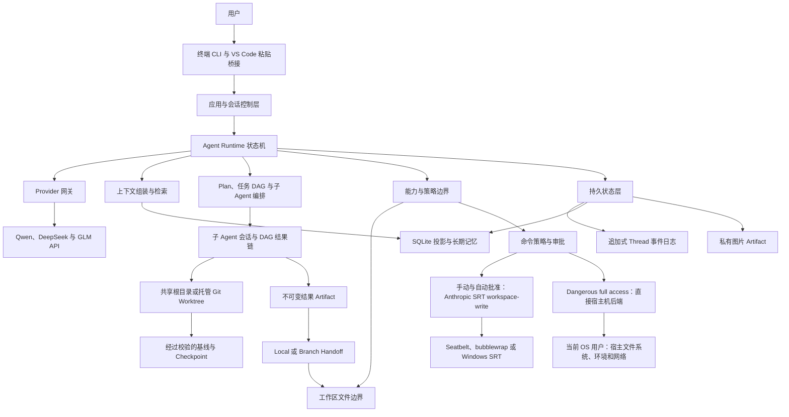
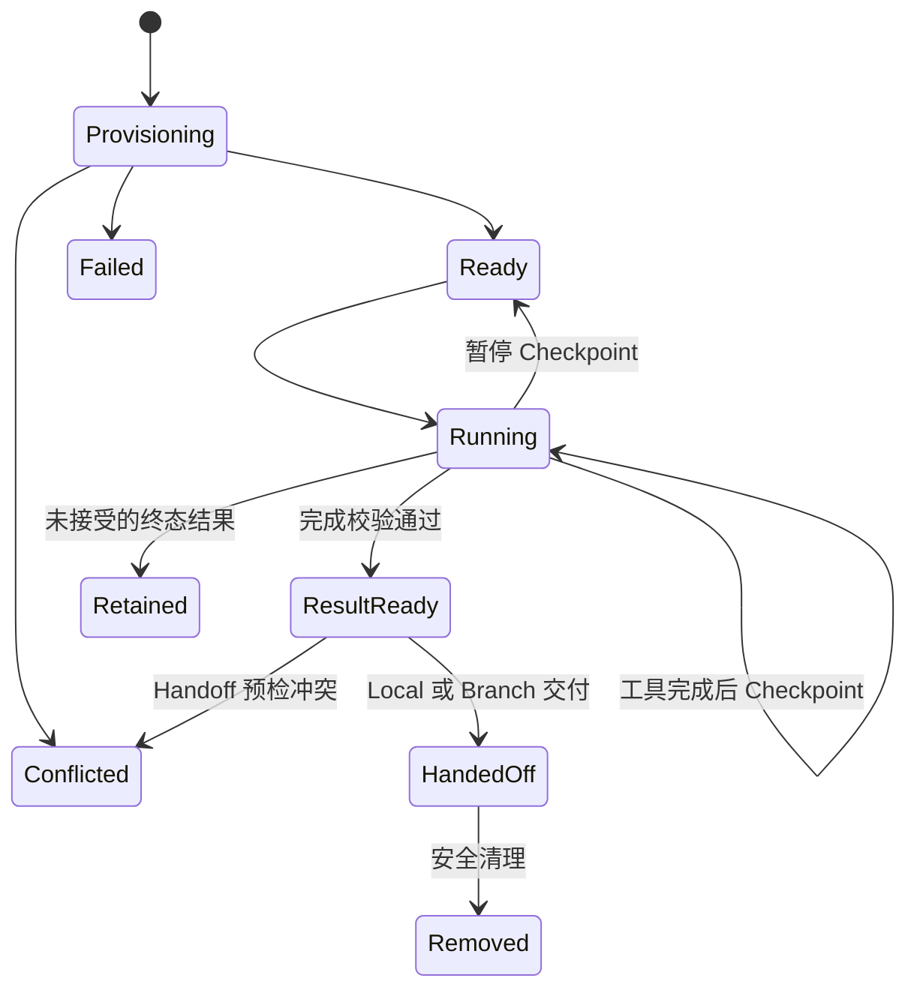

# EASY CODE 技术设计

[English](./TECHNICAL_DESIGN.md) | [返回 README](../README_zh.md)

本文介绍 EASY CODE 作为一个受控本地编程 Agent 的设计，重点说明架构决策、终端交互、信任边界、状态管理、任务编排和可靠性。安装方式与 CLI 命令仍以主 README 为准。

许可证边界独立于上述信任边界：EASY CODE 原创源码适用 [MIT License](../LICENSE)，内嵌或安装的第三方组件仍适用各自条款。详见[第三方声明](../THIRD_PARTY_NOTICES.md)，其中包含固定版本 Anthropic Sandbox Runtime 的 Apache-2.0 声明。

## 1. 设计目标与边界

EASY CODE 的核心原则是：**模型负责提出操作，可信的本地 Runtime 负责判断操作是否合法，并拥有所有状态迁移的最终控制权。**

主要设计目标包括：

- **Runtime 权威性：**提示词用于指导模型行为，但不能授予权限。
- **最小能力：**每次模型请求只获得当前模式、角色和执行阶段真正需要的能力。
- **工作区安全：**手动批准和自动批准把文件访问限制在选定项目中，破坏性变更前必须验证文件版本；只有用户明确选择 Dangerous full access（危险完全访问）才会移除位置边界。
- **进程约束：**手动批准和自动批准模式下，获准命令的整个进程树在操作系统强制的 `workspace-write` 边界内运行，而不是继承不受限的宿主机访问权限。
- **持久执行：**对话、Plan、任务进度、子 Agent 结果和审计数据可以跨进程恢复。
- **证据优先：**文件和命令结果会被记录，任务完成必须附带可供用户或父 Agent 审核的结构化证据。
- **本地优先：**会话、记忆、图片和索引默认存储在本地。
- **安全降级：**语义检索等可选能力失效时，不影响权威状态的可用性。

EASY CODE 固定并复用 `@anthropic-ai/sandbox-runtime` `0.0.74` 作为手动批准和自动批准模式的命令进程沙箱，因此最低运行环境提高到 Node.js `>=20.11.0`。在这两种受保护状态下，命令策略与审批决定操作能否启动，操作系统沙箱则独立限制获准进程树可以访问的资源。沙箱准备采用失败关闭：不支持或未初始化的后端、缺失依赖以及包装失败都会阻止执行，绝不会回退到宿主机直接启动。Dangerous full access 是需要单独明确确认的独立状态，会有意选择直接宿主机后端；沙箱故障绝不能自动进入该状态。

## 2. 系统架构



| 层次 | 职责 |
| --- | --- |
| 交互层 | 终端输入、斜杠命令、加载反馈、Thinking 预览、Diff、任务状态和图片粘贴。 |
| 应用协调层 | 配置、凭据、工作区绑定、模型选择、Thread 生命周期、Resume 和界面展示。 |
| Agent Runtime | Turn 状态机、有效模式、能力选择、模型输出校验、工具循环和完成规则。 |
| Provider 网关 | 统一消息、结构化操作、Thinking、图片、超时、重试和 Token 用量元数据。 |
| 能力边界 | 把文件、命令、Plan、任务、记忆、上下文和子 Agent 操作表示为经过校验的结构化能力；手动批准和自动批准把命令审批与操作系统沙箱保留为两层独立边界，Dangerous full access 则明确移除两者。 |
| 编排层 | 可审核 Plan、依赖感知的任务执行、子任务分配、可恢复执行环境、结果链与受控 Handoff。 |
| 状态与检索层 | 权威 Thread 事件、可查询投影、Checkpoint、长期事实、语义索引和二进制 Artifact。 |

这种分层避免 Provider 差异扩散到工作区安全，也避免模型输出直接修改本地状态。

### 行内终端 UI 与输出所有权

交互界面是结构化状态的投影，不是一组彼此独立的打印调用。UI 状态分别保存稳定会话头部、追加式 transcript、临时动态活动与 Thinking 面板选择、模态 overlay 和持久 composer。Reducer 式更新可以忽略过期的活动停止事件，并在渲染前限制任务、子 Agent、进度、Thinking、图片和选择器行数。

可见界面分为四个区域，每个区域采用不同的所有权规则：

| 区域 | 生命周期与更新规则 |
| --- | --- |
| 会话头部 | 根据稳定的 Thread/会话信息渲染：模式、Provider/模型、思考强度、上下文估算、工作区和 Thread ID。 |
| 终端 scrollback | 保存已经完成的对话、工具/命令输出、Diff 和结果。新内容只会追加，动态刷新不能通过光标控制擦除这些内容。 |
| 动态状态区 | 在输入框上方只保存仍在运行的进度、活动、已用时间和最多一个临时 Thinking 面板。Screen writer 只能清除并替换终端底部的这些行。 |
| 输入框与状态栏 | 普通工作期间，依次显示自动换行的盒式输入区、紧凑任务 DAG 与子 Agent 快照，并把模式/模型/上下文/任务/Agent 状态栏固定为最后一行。图片附件使用稳定的 `[Image #N]` 标签。 |

提交稳定 transcript 条目前，screen writer 会先移除当前动态行，在原起点追加稳定内容，再在其下重绘最新动态快照。Live progress 只保留仍在运行的工作：同类型的新状态替换旧状态，工具完成后先从 live 区移除，再仅提交一条稳定 transcript；请求结束时清空全部临时 progress。光标恢复使用可视行和显示单元格列，而不是 UTF-16 索引，避免把光标放入宽字符的第二个单元格。窗口尺寸变化后使用当前终端宽度重新布局。外部文本中的 ANSI 控制序列会被移除，只有 UI 自己产生的 SGR 样式可以保留；中文等 CJK 字符、组合字符、旗帜和连接 Emoji 都按终端单元格计宽。

模态选择器的优先级高于普通动态状态，包括已经打开的 Thinking 面板；Dangerous full access 的持续警告属于安全界面元素，会保留在选择器上方或旁边。`/model`、命令审批、Plan 审核和 Resume 共用盒式 overlay 行为：选中行高亮，其他行弱化，按上/下方向键移动，按 Enter 确认，按 Esc 取消。菜单临时以 Raw Mode 独占 stdin，并在所有退出路径恢复此前的输入模式、光标和流状态。取消审批会映射为拒绝，以保持失败关闭。单一输入所有者也能防止后台子 Agent 或状态更新消费交互输入。模型请求进行期间，一条窄化的控制输入通道会持续接收私有 Thinking toggle 与 `Ctrl+C` 取消信号，并丢弃普通按键；任何模态输入开始前它都会交出 stdin，只在对方恢复此前 Raw Mode 与流状态后重新接管。

点击切换 Thinking 与图片粘贴共用同一条有序私有终端通道。随附扩展只识别严格配对的折叠标记或展开面板控制行，并要求重复出现的正十进制 ID 是安全整数。检测到正在运行的 EASY CODE shell execution 或用户明确启用后，扩展会提供链接。为了恢复扩展宿主重载时错过的 start 事件，只有激活前已经存在的终端才能通过严格标记进入恢复状态；下一次观测到 shell start/end 或终端关闭时，该状态会立即撤销。VS Code 默认在 Windows/Linux 上通过 `Ctrl+点击`、在 macOS 上通过 `Cmd+点击` 激活终端链接。每次激活都会向产生该链接的终端发送不带换行的固定序列 `ESC ] 6973 ; easy-code ; toggle-thinking ; <id> BEL`；终端解析器会把它作为协议消费，不会让它进入 composer 文本。为了兼容已经安装的旧客户端，`show-thinking;<id>` payload 仍会被接受并归一化为相同的 toggle 操作。两种协议都不赋予 Esc 任何含义。

Toggle 最多选择一个有界灰色面板：点击活动标记或面板控制行会关闭，点击其他标记会替换内容。可视行数上限确保面板能在普通终端 buffer 中安全擦除；达到上限时，面板会明确报告省略的换行后行数，并指向 `/thinking N` 以查看全部已保留内容，不会把局部内容伪装成完整结果。选择与面板可见性属于临时 UI 状态，不会写入 Thread 日志、模型上下文、短期上下文或长期记忆；只有已经与助手响应关联的 Provider Thinking 内容本身是持久的。`/thinking N` 与 `Ctrl+T` 采用另一条路径，把保留内容提交到活动输入缓冲区上方的稳定 scrollback，同时保留 composer 草稿。

Composer 与 VS Code 粘贴桥接共用一条有序输入流。原生图片粘贴必须在后续 Enter 可以提交之前完成解析；composer 只接收可见附件标签，经过验证的图片字节仍保存在私有图片 Artifact 区。普通文字粘贴保持为文字。即使剪贴板捕获仍在进行，`Ctrl+C` 也必须可以取消它。

非 TTY 输出不会尝试移动光标、清屏、进入 Raw Mode 或使用颜色，而是追加纯文本状态消息并使用行式输入。需要交互式选择器的流程必须改为提供明确的模型、Resume ID 或其他命令参数。这种降级让管道、重定向输出、CI 和控制序列支持不完整的终端仍能获得可读日志。

## 3. 请求生命周期与工作模式

一次普通 Turn 按以下控制流执行：

1. 应用先加载可信配置与凭据，再把低优先级项目规则作为不可信数据加载，绑定工作区并取得 Thread 的独占使用权。
2. 当前用户消息和图片引用先持久化，再开始 Agent 工作。
3. 在 Auto 模式中，受限控制请求通过结构化结果选择直接回答、Plan 或 Code，而不是匹配关键词。
4. Runtime 根据模式、Agent 角色、上下文压力、Plan 状态、任务状态和未收集的子任务计算实际能力集合。
5. 系统安全契约、环境信息、相关项目规则、活动对话、当前控制状态和少量检索记忆共同组成模型上下文。
6. Provider 返回内容先经过本地校验，随后才可能被接受或执行。
7. 操作请求、结果、状态迁移和 Token 用量都会追加到 Thread 历史。
8. 循环持续到最终回答、Plan 等待审核、任务阻塞、达到限制、失败或中断。
9. 符合条件的长期记忆只会在允许的成功 Turn 边界提交；Plan 阶段仅允许用户明确声明的长期偏好或项目约定。

### 模式语义

| 模式 | 设计目标 | 有效边界 |
| --- | --- | --- |
| Plan | 调查项目并提交结构化方案供用户审核。 | 只读工作区调查和安全检查；禁止项目变更和有副作用的执行。 |
| Auto | 让模型选择适合当前请求的工作流。 | 路由控制阶段没有工作区能力，可以直接回答受限的无工具请求，或进入 Plan/Code。 |
| Code | 直接实现并验证需求。 | 可以变更工作区并运行受控命令，但所有策略与审批仍然生效。 |

Plan 的批准、拒绝和调整都是明确的持久状态，不通过相似的用户文字进行猜测。已批准的执行如果在持久 DAG 接管前失败或中断，会返回审核状态，而不会被静默当成新请求；DAG 一旦处于活动状态，其持久状态就成为恢复控制面。

未完成的任务图或尚未收集的子 Agent 结果会让 Auto 保持 Code，防止父 Agent 放弃进行中的工作。上下文压力要求压缩时，Auto 会先完成压缩，再判断路由。

## 4. 能力、权限与信任模型

### 能力矩阵

| 能力类别 | Plan | Code 中的主 Agent | 子 Agent |
| --- | ---: | ---: | ---: |
| 读取工作区文本文件 | 是 | 是 | 是 |
| 使用兼容模型读取已验证图片 | 是 | 是 | 否 |
| 新建、更新或删除工作区文件 | 否 | 是 | 是 |
| 运行命令 | 仅安全检查 | 受策略控制 | 受策略控制，但不能交互审批 |
| 提交 Plan 供审核 | 是 | 否 | 否 |
| 管理任务图 | 否 | 是 | 否 |
| 创建或控制子 Agent | 否 | 是 | 否 |
| 维护长期记忆 | 严格受限 | 是 | 否 |
| 提交绑定的子任务结果 | 否 | 否 | 是 |

每一步模型请求都会重新计算能力集合。即使模型伪造一个未开放的能力请求，本地 Runtime 仍会拒绝。

该矩阵描述手动批准和自动批准下的普通角色边界。Dangerous full access 开启期间，Runtime 会有意覆盖主 Agent 与每个子 Agent 受保护的命令和文件系统位置限制。这项权限只能来自用户在本机界面中的状态选择，模型输出、项目文本、记忆或子 Agent 都不能自行授予。

### 指令信任边界

Runtime 与基础系统契约高于当前用户请求。项目规则可以约束工作方式，但不能授予文件系统、命令、网络、安装或凭据访问权限。

工作区文件、源码注释、命令输出、任务描述、检索记忆、图片、依赖元数据和生成物都被视为不可信数据。其中包含的指令不能扩大 Agent 权限。

### 工作区变更边界

在手动批准和自动批准下，文件操作只接受工作区相对路径，并同时校验路径文本与真实磁盘位置，从而拒绝绝对路径、父目录穿越、符号链接逃逸和 Windows junction 逃逸。Dangerous full access 开启后，带校验的文件操作也接受显式绝对宿主路径，可以新建、更新或删除当前 OS 用户有权访问的任何内容；相对路径仍按工作区解释。规范路径解析和“先检查，再修改”的版本校验继续保留，但不再构成位置约束边界。

变更遵循“先检查，再修改”的协议：

- 新建文件不能静默覆盖现有目标。
- 更新或删除必须基于之前观察到的完整文件版本。
- 真正修改前会再次比较当前版本。
- 如果用户、编辑器、外部进程或其他 Agent 已经改动文件，本次操作会失败而不是覆盖。
- 成功变更会产生持久审计记录和带行号的终端 Diff。
- Resume 只会恢复仍与当前文件版本一致的历史读取授权。

用户选择的项目始终是策略、记忆、项目规则和父 Agent 路径展示所使用的**逻辑工作区根目录**。每个子 Agent 还拥有一个**物理执行根目录**：共享模式下两者相同；Worktree 模式下，物理根目录是位于项目外、由 Runtime 管理的 linked checkout。在手动批准和自动批准下，文件能力以子 Agent 的物理根目录为边界，命令从该目录启动并继续受命令策略约束；持久身份仍归属于原始逻辑项目。Dangerous full access 会为主 Agent 和子 Agent 移除这项位置边界。所选工作区之外的修改不会进入工作区快照、`/changes`、Worktree 结果 Artifact 或 Handoff。

共享模式的变更通过一个公平队列和版本校验降低冲突。相互独立的 Worktree 拥有各自的 Git 状态，不需要经过同一个全局变更队列，而是在显式结果边界汇合。两种机制都无法锁住用户编辑器或无关进程。

### 命令策略与审批

命令被表示为可执行程序、参数数组和工作目录，普通输入不会被隐式交给 Shell 解释。以下分类与审批表适用于手动批准和自动批准；Dangerous full access 在明确确认后绕过这些规则。

| 风险类别 | 策略方向 |
| --- | --- |
| 安全检查 | 可以无需审批运行。 |
| 项目代码、测试、构建或显式一次性 Shell | 需要精确审批；仅显式启用非交互批准的会话可以自动批准。 |
| 受约束的本地依赖安装 | 只允许受限制的项目本地 Registry 安装，并禁用生命周期脚本。 |
| 系统配置、全局安装、直接远程/网络工具、破坏性命令、动态下载执行或远程 Git 写入 | 结构化直接调用会被拒绝；显式 Shell 属于另一种需要精确审批的高风险能力。Runtime 不推断脚本语义，但 Shell 进程树仍会进入操作系统沙箱。 |

默认的一次性审批会绑定到具体的程序、参数、工作目录和相关项目材料。交互终端还允许为当前 Thread 保存 Runtime 解析出的精确可执行文件身份。匹配依据是规范化可执行文件路径的相等判断，而不是字符串 `startsWith`，也不会从供用户阅读的命令预览中反向解析。该授权会有意忽略后续参数和工作目录，因此授权 Python、Node.js、Shell 或其他解释器的范围明显大于批准一个脚本。它标识的是路径，而不是不可变的程序字节，因此替换该路径上的文件不会自动撤销授权。

可复用授权只能由用户在终端中明确选择，并且必须先写入权威 Thread 历史，命令才可以运行。它在 Resume 后仍然存在，但不会进入新的或无关的 Thread。绑定的子 Agent 可以在不占用终端输入的情况下消费父 Thread 已有授权，但不能弹出审批或自行创建授权。Checkpoint 可以保留授权，但不能伪造授权或擦除更晚的权威事件；畸形身份会失败关闭。用户可以通过 `/permissions` 查看当前授权集合。

在 Dangerous full access 之外，模型提供的意图说明不会影响风险分类。永久策略拒绝发生在授权查询之前；关闭审批提示后，需要审批的命令会直接失败；记忆授权和自动批准都不能改变直接策略拒绝项或 Plan 边界。获准的 Shell 或解释器仍可以执行后续参数表达的全部操作，因此必须把它视为高风险授权。

交互式命令状态只在当前进程中生效，共有三种。手动批准保留普通决策路径；自动批准只去掉策略本来允许审批的命令提示；`Dangerous full access` 是需要两次明确确认的紧急状态，**没有 EASY CODE 沙箱，也没有审批边界**。开启前，确认界面会明确警告：主 Agent 与所有子 Agent 将获得当前 OS 用户对完整宿主文件系统、继承的宿主环境和互联网的访问权。开启后，动态界面会持续显示红色 `! EASY CODE DANGER: FULL ACCESS` 标识，包括覆盖选择器打开期间。

Dangerous full access 会关闭命令分类、永久命令拒绝、Plan mode 命令限制、审批提示和 SRT 包装。独立的生产宿主机后端可以启动绝对路径程序，在当前用户有权访问的任意工作目录中运行，继承宿主环境，并直接使用宿主网络。带校验的文件工具既接受显式绝对宿主路径，也接受工作区相对路径。无论采用共享根目录还是 Worktree，所有子 Agent 都会继承这项权限。EASY CODE 不会绕过 OS ACL、UAC、`sudo` 或其他账户权限。

从 Dangerous full access 切换到手动批准或自动批准时，主 Agent 与所有子 Agent 的这项权限会立即被撤销。已排队或等待中的宿主操作会被拒绝，正在运行的宿主命令进程树会被取消并清理，后续操作按新选择的受保护状态重新判断。撤权前已经完成的副作用不会回滚。

Dangerous full access 仍保留结构化可执行程序/argv 校验、非交互 Shell 形态、取消、超时、输出上限与敏感信息遮蔽、进程树清理和命令审计。它们只是运行控制，**不是沙箱、权限边界、完整监控或回滚机制**。宿主进程会继承环境变量，因此可能暴露凭据。工作区快照和 `/changes` 仍只是有界的工作区审计辅助：它们不会记录任意宿主机修改，会忽略 Git 元数据、依赖目录和私有状态，也可能因文件数量上限而截断。

在手动批准和自动批准下，子进程只获得少量允许的环境变量。永久命令分类只针对顶层调用；获准的 Shell、解释器或项目程序仍可启动后代进程，但 SRT 会把文件系统与网络边界应用到整个包装后的进程树。

### 操作系统命令沙箱与 Dangerous full access 宿主机后端

生产环境中的手动批准和自动批准命令通过固定版本的 Anthropic Sandbox Runtime。模型提出的操作仍是结构化可执行程序与参数数组；可信 Worker 把已经解析的调用转换成 SRT 平台包装器，使用不透明命令 ID 归属违规记录，并且不会把模型文本重新解释为 Worker 自己的参数。父进程、Provider 请求、记忆数据库、凭据存储、终端 UI 与任务编排都位于命令沙箱之外。只有单独确认的 Dangerous full access 才会选择独立的生产宿主机后端并绕过 SRT 启动。

手动批准和自动批准的有效文件系统配置固定为 `workspace-write`：

- 当前物理工作区和一次调用私有的临时目录可写。
- 命令读取会拒绝 EASY CODE 私有配置、数据、缓存、常见凭据位置和用户 Home Tree，只对当前工作区、可信 Runtime 桥接代码、Node 可执行文件及已解析目标程序设置窄化的重新允许规则。
- `.easycode`、`.git` 以及“正在被自身编辑”的 Runtime checkout 都禁止命令写入。
- 除父进程构造受控环境外，沙箱还会显式拒绝 Provider API Key 环境变量。
- Unix Socket、本地端口监听、Apple Events、弱化嵌套隔离和弱化网络隔离保持关闭。

在手动批准和自动批准下，网络权限来自命令能力分类，而不只取决于审批 UI。普通命令使用空的严格 Allowlist；受约束的精确版本 npm Registry 安装只获得 `registry.npmjs.org`；显式获批的 Shell 获得其分类对应的 SRT 网络能力。允许域名不等于允许特定操作：Shell 仍可能发送其沙箱进程树能够读取的数据。Dangerous full access 会完全绕过 SRT 网络 Allowlist，直接使用宿主机的不受限网络访问。

手动批准和自动批准的沙箱初始化与执行采用失败关闭。`prepare` 或 Worker 初始化失败会形成明确的 `sandbox_unavailable` 命令结果，任何错误路径都不会通过宿主机后端重试解析后的目标程序。生产宿主机后端只能由单独确认的 Dangerous full access 状态选择，绝不会因自动降级而进入。安装阶段只进行无提权的前置条件检查；首次交互启动会在模型选择之前、同一个 Retained UI 内运行实时就绪探测，再提供由 Runtime 拥有的固定设置配方。显式维护命令复用同一套就绪服务，避免安装、启动与诊断形成三套逐渐偏离的策略。

自动设置的能力刻意窄于 Agent 的普通命令执行。Windows 把固定的一次性账户与 WFP 操作交给 SRT 的 UAC 流程；Linux 只能针对 Runtime 明确报告缺失的前置包调用内置包管理器配方，使用可信绝对可执行路径和结构化参数。Linux Worker 同样只从固定系统位置解析 bubblewrap、socat 与 ripgrep，并把绝对路径交给 SRT，而不信任可能被工作区影响的 `PATH`。设置不会刷新包索引、启用软件源、收集密码、修改 User Namespace/AppArmor/内核设置，也不会接受模型或项目提供的包名。完成后必须通过真实沙箱进程探测；任何隔离降级警告都会被视为不可用，而不是静默接受。

| 平台 | SRT 后端与前置条件 |
| --- | --- |
| macOS | 基于操作系统 Seatbelt 的 SRT；当前固定版本没有额外的强制系统包依赖。 |
| Linux | 基于 bubblewrap 的 SRT；需要 `bubblewrap`、`socat`、`ripgrep` 以及可用的 User Namespace。 |
| Windows | 随依赖提供的 SRT Windows 后端，目前为 Alpha。`easy-code sandbox setup` 显式完成一次提权的隔离账户与 WFP 初始化；`easy-code sandbox doctor` 验证文件系统身份和网络 Fence。 |

Windows 后端使用一个机器级沙箱身份和 Session 级 ACL 授权，因此 EASY CODE 会在同一进程内串行执行 Windows 沙箱命令，避免并发子 Agent Worktree 得到重叠授权。SRT 仍是 Beta Research Preview，安装在用户目录的工具链或依赖更广 Profile 访问的程序可能不兼容。在手动批准和自动批准下，后端依赖消失、UAC 初始化被取消、Linux User Namespace 探测失败或 Worker 清理异常都会被报告，不能被解释为允许宿主机直跑；用户必须另行选择并确认 Dangerous full access。

### 凭据与私有状态

API Key 通过隐藏输入、操作系统凭据存储或显式环境变量读取。工作区配置不能设置 API Key、Provider Base URL 或 EASY CODE 私有数据目录，但仍可选择 Provider、模型、模式、思考强度、审批策略和预算等普通工作流选项。查看配置只显示是否已配置，不显示密钥值。兼容路径仍可能读取旧版用户级明文 Key，因此建议迁移到操作系统凭据存储。Dangerous full access 进程会继承宿主环境，并可读取当前 OS 用户能够访问的凭据文件；输出遮蔽不能阻止进程使用或发送这些秘密。

Runtime 生成的错误、命令数据、任务与记忆通道以及其他已知控制面输出会进行长度限制、控制字符清理和常见敏感信息遮蔽。这属于纵深防御而不是完整 DLP：源码内容、文件 Diff、用户消息和最终模型文本并不经过统一 DLP，为完成任务而读取的源码仍可能被发送给当前选择的模型 Provider。

大部分应用私有状态保存在所选工作区之外，以降低误提交风险。Worktree 执行有意跨越两个存储边界：

| 状态 | 位置与影响 |
| --- | --- |
| Thread 日志、SQLite、图片、环境描述记录与托管 checkout 目录 | 位于逻辑工作区之外的 EASY CODE 数据目录；托管 checkout 还必须位于整个 Git 仓库之外。 |
| 可恢复的 Worktree 基线、Checkpoint 与结果 | 作为本地 Git Object 保存，并由 Runtime 管理的命名空间 Ref 锚定在仓库公共 Git 数据库中。它们不会移动或提交用户当前分支，但物理 checkout 删除后，其内容仍可能保留在本地 Git 存储中。这些 Ref 可由本地仓库访问者查看，并不是机密存储。 |
| 已交付结果 | Local Handoff 修改用户 Working Tree，但不 Commit；Branch Handoff 新增本地分支，但不切换也不 Push。 |

可信用户配置只能把应用数据迁移到所选逻辑工作区之外；托管 Worktree checkout 根目录采用更严格的规则，必须位于整个所属仓库之外。EASY CODE 当前不会在应用层加密这些记录，其机密性依赖操作系统账户和文件权限。秘密不应进入任务 Artifact 或 Worktree 快照输入。

## 5. 持久状态与 Resume

EASY CODE 采用事件优先的会话模型：

- 每个 Thread 都有顺序追加日志，保存对话与重要控制状态迁移。
- SQLite 提供 Thread 查询、Turn、审计和长期记忆等可查询投影；Token 用量从持久 Thread 事件中聚合，而不是依赖专门的用量投影。
- Checkpoint 用于加速恢复，但不能覆盖更晚的权威事件。
- 图片保存在私有 Artifact 区，事件日志只保存经过验证的元数据和引用，不保存 Base64 图片内容。

事件日志覆盖用户与助手消息、结构化操作及结果、模式决策、Plan 审核、上下文压缩、任务迁移、子 Agent 生命周期、文件与命令审计，以及 Provider 返回的用量。稳定身份和顺序号使状态回放具有确定性，也使重复投影保持幂等。

Resume 会重建最新有效状态，再修复可查询投影。已完成工作会被保留，活动中的子任务也可以重新连接到绑定的子 Thread 与执行环境。未完成的命令或 Provider 请求不会被当成成功，也不会被盲目重放；只有已经持久记录的终态工作才被视为完成，未结束的子任务会从最近一个通过校验的 Checkpoint 继续。

恢复还遵循以下规则：

- 可以安全丢弃不完整的最后一条日志记录；已建立历史中的损坏会失败关闭。
- Thread 租约阻止两个本地进程同时拥有同一会话。
- 历史文件版本会与当前工作区重新校验。
- 已批准 Plan 在尚未转化为持久 DAG 时，会在执行中断后返回审核状态。
- 父 Thread、子 Thread、任务、Agent 与执行环境通过一个不可变绑定相互引用。子日志保存详细对话和工具进度，父日志只保存有界的生命周期与结果引用；Observation 事件必须匹配完整绑定才能关闭任务分配。
- 恢复时会把持久执行环境描述视为不可信输入，重新校验仓库身份、Runtime 托管路径、逻辑/物理根目录映射和 Realpath 包含关系，然后才允许子 Agent 运行。
- 子 Agent 恢复采用事务式批处理：先准备并校验完整绑定集合，全部通过后才统一激活；任意绑定无效都会回滚整批恢复。新建 Thread 或 Resume 到其他 Thread 前，会先暂停当前子 Agent 并创建 Checkpoint；所有权切换失败时，原 Thread 会根据持久绑定重新恢复这些子 Agent。
- 关键环境身份、仓库和路径元数据校验通过，并且已保存的快照 Commit 仍可解析时，缺失的托管 Worktree 目录才能重建。已有现代子 Agent 的环境记录缺失，或其中的身份、仓库、路径元数据与绑定不一致时会失败关闭，不会静默创建另一个 checkout；旧记录只接受确定性的兼容恢复。
- 已持久化的结果 Artifact 与 Handoff 状态可以恢复，同时不会把隔离变更再次投射到父工作区。
- 已由事件确认的压缩边界、Plan 或任务迁移不能被过期 Checkpoint 回滚。

## 6. 上下文与记忆架构

短期上下文与长期记忆解决不同问题，生命周期也不同。

### 短期上下文

短期上下文属于单个 Thread。其持久状态包括活动对话、Provider 返回的 Thinking、受限工具结果、Plan 与任务状态、已收集的子 Agent 结果、图片引用和一份累计工作摘要。

完整消息内容即使经过压缩也仍保留在持久事件历史中；它只会在明确的压缩边界前移前继续进入活动模型上下文。上下文压力基于可配置的字符预算，并随思考强度缩放：

| 压力 | Runtime 行为 |
| --- | --- |
| 低于 60% | 不干预。 |
| 达到 60% | 提醒模型考虑压缩。 |
| 达到 80% | 要求下一步必须压缩上下文。 |
| 达到 90% | 插入强制压缩请求。 |

模型负责生成累计语义摘要，Runtime 负责校验长度、清理疑似敏感信息并保证压缩边界只能单调前移。摘要会作为“不可信历史数据”重新注入，因此不能覆盖较新的用户输入。

单次请求过大时可以临时裁剪较旧内容，以保证 Provider 调用安全。这个降级不会改写正式工作摘要，也不会推进持久压缩边界。终端中的 Token 数是跨语言近似值；压力控制实际使用配置的字符预算。

### 长期记忆

长期记忆以规范化工作区为作用域，可以跨 Thread 使用。它保存短小、原子化、可独立检索的事实，而不是对话全文。

适合保存的内容包括长期用户偏好、项目约定、已验证架构、明确决策和稳定环境信息。秘密、不确定结论、尚未验证的方案以及一次性任务细节会被拒绝。

记忆生命周期由模型提出、Runtime 控制：

1. 提出变更前先搜索相关已有事实。
2. 新增、修订或失效操作必须绑定当前 Thread、Turn 和证据。
3. 候选变更在执行过程中保持暂存。
4. 完整批次只会在允许的成功 Turn 边界原子提交；Plan 阶段只能提交用户明确声明的长期偏好或项目约定。
5. 修订与失效保留审计历史，而不是静默覆盖。

SQLite 是长期记忆的权威存储。检索综合词法相关性、本地向量语义相似度和置信度信号。语义索引只是可重建投影：本地推理或向量索引不可用时，记忆仍可通过词法搜索使用，并在之后补全向量。

用户可以查看短期和长期记忆，但不能直接编辑内部记录，从而防止手动操作绕过证据与生命周期规则。

## 7. Plan 与任务 DAG 编排

可审核 Plan 和任务 DAG 是相关但不同的控制机制：

| 机制 | 目的 |
| --- | --- |
| 可审核 Plan | 在实现前与用户确认方向。 |
| 任务 DAG | 进入 Code 后约束执行顺序、所有权、产物和验收条件。 |

是否需要 DAG 由模型根据复杂度判断。短小、线性的任务应继续使用普通单 Agent 循环。存在依赖分支、多个独立阶段、多个产物或明确质量门禁时，才适合建立 DAG。

每个任务节点包含稳定标识、名称、目标、依赖、输入、预期产物、完成检查、失败处理、所有者、状态和证据。

Runtime 强制以下图约束：

- 任务标识唯一，依赖必须存在，并且图中不能有环。
- 所有前置任务完成后，节点才能开始。
- 主 Agent 同时只能拥有一个进行中的节点。
- 活动任务图存在时，必须先启动或分配符合条件的节点，才能使用工作能力。
- 每一项完成检查都必须对应一条具体证据。
- 图仍处于活动状态时，普通最终回答会被拒绝。
- 阻塞只用于真实外部条件，而不是非正式暂停。
- 任务文本是不可信数据，不能授予额外权限。

每个合法迁移都会持久化，因此 Resume 后可以重建任务编号、所有权、状态、阻塞原因、完成证据和结果引用。

每个完成的 Worktree 子 Agent，无论是独立任务还是 DAG 任务，都会产生不可变的 Runtime 内部结果 Artifact，其中包含基线、结果 Checkpoint 和完整变更文件清单。DAG 与父 Agent 状态只保存有界引用，其中包含身份、血缘、Commit 和变更文件数量；DAG 引用还会按照依赖顺序记录当前可用的直接依赖 Artifact。

Worktree 依赖 Artifact 通过结果 Commit 为下游 Worktree 提供输入。只要任意直接依赖具有 Runtime Artifact，所有直接依赖都必须具有 Artifact，并且完整集合不能混用 shared 与 Worktree 环境类型；如果所有依赖都没有 Artifact，下游状态只来自所选仓库基线。Shared 与主 Agent 结果已经落在逻辑工作区；之后创建的 Worktree 只有在基线策略会捕获这些修改时才包含它们，例如 `current-snapshot`。`head` 与 `fresh` 会有意排除这类未提交的共享结果。

遇到 Join 节点时，依赖 Commit 会在一个根据共同逻辑 Handoff 基线新建的托管 Worktree 中合并。合并冲突会成为明确的执行环境状态并阻止节点完成，使任务可以被审慎重试，不会通过模型文字静默解决。这样既形成有界、可审计的 DAG 结果链，也不需要把完整 Patch 或子日志复制进父 Agent 活动上下文。

DAG 必须已经完成并且只有一个终点叶节点，才能 Handoff 最终结果；目标子 Agent 还必须拥有这个终点任务。这些约束防止父 Agent 把多个不可比较分支中的任意一个，或无关子 Agent 的 Artifact，误当成完整图结果。多个终点分支必须先通过显式 Join 任务汇合。

## 8. 子 Agent 会话、Worktree 与 Handoff

子 Agent 是由主 Agent 控制的隔离 Worker，而不是共享同一个实时对话的平级 Agent。

```text
父 Agent
  ├─ 发送有界任务和必要上下文
  ├─ 查看状态或追加范围明确的指导
  ├─ 子 Agent 在私有 Code 对话中工作
  └─ 收集有界结果与逐项完成证据
```

执行环境具有明确的生命周期，而不是被当作一次性临时目录：



子 Agent 可以认领一个依赖已经满足的 DAG 节点；没有未完成 DAG 时，也可以接受带明确完成检查的独立任务。它继承当前 Provider、模型和思考强度，但不会继承父会话全文。每次分配同时获得持久子 Thread 身份和持久执行环境身份，两者不能被静默改绑到其他任务或路径。

子 Agent 能力被刻意收窄：

- 不能继续创建子 Agent。
- 不能管理或重写任务图。
- 不能维护长期记忆。
- 不能切换到 Plan 或改变父 Agent 工作流。
- 生命周期和最终报告只绑定一个任务，并且必须返回结构化证据或真实阻塞原因。

父 Agent 可以查看、等待、追加指导、请求停止，或显式 Handoff 已完成结果。所有子 Agent 结果必须在父 Agent 结束、建立新任务图或进入 Plan 前被收集。

隔离方式按子 Agent 选择：

| 选择 | 行为 |
| --- | --- |
| `auto` | 逻辑工作区属于 Git 仓库时使用托管 Worktree，否则回退到共享模式。 |
| `worktree` | 强制使用独立 linked checkout；Git 或有效仓库不可用时失败关闭。 |
| `shared` | 有意直接使用逻辑工作区，适合只读为主的工作或非 Git 项目，但仍有共享写入冲突风险。 |

托管 Worktree 是 detached checkout，使用以下三种一次性基线策略之一：

| 基线策略 | 快照语义 |
| --- | --- |
| `fresh` | 使用当前已经配置的 `origin/HEAD`，不存在时回退本地 `HEAD`；创建过程不会 Fetch 远程状态。 |
| `head` | 使用本地 `HEAD`，不包含所属仓库尚未提交的修改。 |
| `current-snapshot` | 从本地 `HEAD` 开始，再捕获创建子 Agent 时整个所属仓库中的 staged、unstaged 和未忽略 untracked 状态。 |

创建完成后，父 checkout 不会与子 Agent 实时同步。在 Monorepo 中，基线覆盖整个
所属仓库，但手动批准和自动批准下的子 Agent 文件能力仍限制在映射后的逻辑工作区中；
Dangerous full access 会移除这项边界。所属 Git 仓库根目录
可以通过 `.worktreeinclude` 把特定被忽略运行文件复制到每个新建 Worktree，其中模式
相对于该仓库根目录；只接受有界的安全模式，并拒绝符号链接。这些被忽略文件属于本次
checkout 输入，不保证进入可恢复 Checkpoint，因此重建后可能需要重新提供，也绝不能
包含凭据或私钥。

Runtime 使用本地内部 Commit 和命名空间 Ref 锚定基线、工具完成后及生命周期
Checkpoint 与最终结果，它们位于仓库公共 Object Database 中。这些 Ref 是本地可查看
的普通 Git 元数据，不构成机密边界。内部 Git 操作会禁用 Hook 与签名；创建过程不会
Fetch 或 Push，也不会推进用户分支。Worktree 依赖 Artifact 会在 DAG 子任务启动前
合入；Shared 结果没有隔离结果 Commit，只有所选仓库基线包含其工作区修改时才会进入
新 Worktree。由于快照 Object 可能比物理 checkout 存在更久，创建子 Agent 前必须
排除敏感材料。

子日志持久保存自己的消息、工具活动、工作区观察和 Checkpoint；父日志保存任务分配、环境状态、有界进度、不可变结果引用与 Handoff 结果。Resume 时，Runtime 会先校验完整绑定批次，再统一激活；在可能时从已存 Checkpoint 恢复缺失的托管 checkout，并继续同一个子会话。已经持久记录的终态工作不会重跑，中断的 Provider 或命令操作也不会被假定为完成。

父 Agent 可见的状态有明确上限：只公开子 Agent、Thread 与任务身份、隔离和生命周期状态、Artifact 血缘及变更文件数量，不公开物理 checkout 路径或完整文件清单。托管 Worktree 存储也必须位于整个父仓库之外；Runtime 自己执行的 Git 操作会禁用仓库 Hook，避免环境创建过程静默执行 checkout Hook。

收集结果后，Worktree 变更仍留在用户 checkout 之外。Handoff 是独立的显式状态迁移：

- **Local Handoff** 从逻辑 Handoff 基线到终点结果计算完整增量，先在当前 checkout 预检，再应用到 Working Tree，但不 Stage、也不 Commit。`current-snapshot` 捕获的父工作区脏状态属于基线，因此只交付子 Agent/DAG 新增的变化。无关当前修改会保留；重叠修改会把 Artifact 与环境标记为 conflicted，而不是被覆盖。重复交付同一结果时可以识别已经应用的状态。
- **Branch Handoff** 创建或校验指向不可变结果 Commit 的本地分支，不切换 checkout，也不 Push。同一分支/结果重复执行是幂等的；已有分支指向其他 Commit 时进入冲突。该分支的 Tree 包含所选基线与子 Agent 结果。

Handoff 请求、完成与失败都是持久状态迁移。Shared 子 Agent 已经直接修改逻辑工作区，因此没有可用于 Branch Handoff 的隔离结果 Commit。

清理只允许作用于 Runtime 管理的路径。dirty、busy、retained 或未解决冲突的 Worktree 默认保留，并继续计入可配置的托管环境上限。成功 Handoff 后的干净 checkout 可以自动移除；删除物理 checkout 不会删除持久结果引用或底层 Git Object。达到上限后，新 Worktree 会失败关闭，直到保留环境被安全交付或另行处理。

并发额度随思考强度变化：none/low 最多两个，medium 最多四个，high 最多八个。Worktree 降低子 Agent 之间的文件冲突；共享模式变更仍会串行并进行版本校验。Worktree 本身不是安全边界。在手动批准和自动批准下，主 Agent 与子 Agent 的每条命令都会另外包装进 SRT `workspace-write` 沙箱，并以该 Agent 当前物理工作区作为根目录；在 Dangerous full access 下，主 Agent 与每个子 Agent 都继承相同的直接宿主权限，可以越过所有 Worktree。Windows Alpha 后端使用同一个机器级沙箱身份，因此受保护命令会被串行化；这与更高的模型工作并发额度相互独立。

## 9. Provider 与多模态设计

Provider 网关为 Qwen、DeepSeek 和 GLM 统一消息、结构化操作、Thinking、图片输入、重试、超时和用量元数据。

模型能力来自显式目录。视觉能力和可配置思考能力按保守策略处理；未知或不支持的组合不会收到未经确认的 Provider 参数。超时预算随思考强度扩展，重试只针对有限的临时传输或服务错误。

图片遵循 Artifact 边界：

1. 本地解析并验证剪贴板或工作区图片。
2. 检查静态格式、尺寸、像素量、字节大小和完整性。
3. 把图片复制到所选工作区之外的 Thread 私有存储。
4. 持久状态只保存元数据、哈希和稳定的 `[Image #N]` 引用。
5. 仅在兼容视觉模型真正发起请求时加载图片字节。

这样可以避免大型二进制数据进入 SQLite 和 Thread 事件日志，同时保留顺序、完整性与 Resume 能力。

## 10. 可靠性、可观测性与 Token 效率

EASY CODE 提供足够的本地证据，让用户和 Runtime 能区分真实进度、卡住状态和未经验证的结果：

- 模型调用有可见加载状态、取消、受限重试和明确超时。
- Thinking 与对应助手消息一起持久化，但默认只显示短预览。
- 文件变更提供带行号的 Diff。
- 命令记录策略、退出状态、持续时间、受限输出和检测到的工作区变化。
- Plan、任务节点和子 Agent 分配拥有明确状态，而不依赖自然语言猜测。
- Provider 用量可按 Provider/模型、请求用途和主/子 Agent 累计。
- Provider 未返回用量时会标记为未知，而不会伪造精确账单数据。请求如果在收到完整 Provider 响应前失败，就没有精确 Token 记录，因此累计值可能低于 Provider 账单视图。

Token 效率由多种策略共同实现：

- Auto 可以在路由请求中直接完成受限的无工具回答，避免第二次模型调用。
- 系统指令只包含当前步骤真正开放的能力规则。
- 旧上下文在受控边界被累计摘要替代。
- 长期记忆只检索少量相关事实，不把整个记忆库注入上下文。
- 子 Agent 搜索日志保留在私有上下文，父 Agent 只接收有界结果。
- 图片保持引用形式，直到兼容视觉请求真正需要字节。
- Token 用量事件和大多数审计元数据不会重新进入模型上下文。

## 11. 权衡与扩展方向

当前设计明确接受以下权衡：

- 在手动批准和自动批准下，策略与审批决定命令能否启动，批准后由 SRT 提供另一层操作系统边界；两层不能互相替代。Dangerous full access 会有意移除这两层边界。
- 托管 Worktree 隔离 Git 工作状态，不自行提供安全边界。SRT 会另外把受保护命令进程树限制在当前物理工作区；Dangerous full access 可以越过所有 Worktree。
- 固定版本的 `@anthropic-ai/sandbox-runtime` 仍是 Beta Research Preview，Windows 后端为 Alpha；平台前置条件及部分用户目录工具链可能影响兼容性。
- 受保护模式的网络隔离按域名而不是请求内容执行；获准 Shell 可以发送沙箱内可读数据。Dangerous full access 不受 SRT 域名边界限制，可以发送它能够读取的任何宿主数据。
- Windows 的手动批准和自动批准沙箱命令会在同一 EASY CODE 进程内串行，以避免通过 SRT 共享机器身份产生重叠 ACL 授权。
- 非 Git 项目和显式低开销委派仍需要共享模式，因此外部并发编辑仍可能让子 Agent 操作失效。
- 隔离结果必须经过显式 Local 或 Branch Handoff；这个额外步骤用于避免静默覆盖用户 checkout。
- Provider 响应目前按完整结果处理，因此加载动画用于反馈存活状态，最终文本不会逐 Token 流式输出。
- 本地语义记忆优先考虑可安装性、隐私和可重建性，而不是超大规模检索。
- 追加式历史提高恢复和审计能力，但长期 Thread 未来可能需要日志分段和归档。
- 结构化完成证据提升可控性和可审核性，但不构成对模型声明的独立证明。
- 敏感信息遮蔽可以降低常见意外泄漏，但不是完整 DLP 系统。

现有架构为新增 Provider、新能力策略、可配置子 Agent 角色、更通用的 DAG 调度、流式传输、容器隔离以及远程或团队状态后端保留了扩展点。新增能力仍应遵循同一原则：模型只提出状态迁移，可信本地代码负责校验并提交。
