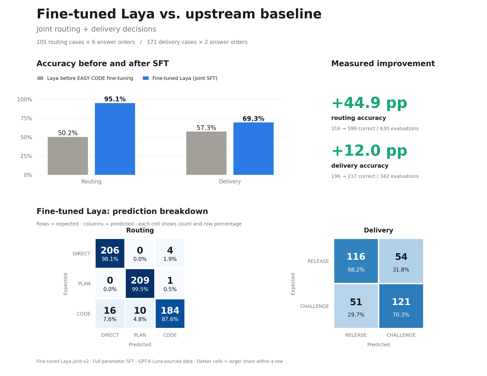

# Fine-tuned Laya: joint routing and delivery SFT

Fine-tuned Laya (joint-v2) is one multilingual choice model for `DIRECT / PLAN / CODE` routing and `RELEASE / CHALLENGE` delivery decisions.



Compared with Laya before EASY CODE fine-tuning, **fine-tuned Laya** improves routing accuracy from **50.2% to 95.1%** and delivery accuracy from **57.3% to 69.3%**.
The held-out test covers 105 routing cases in all six answer orders and 171 delivery cases in both orders.
Chart counts are **answer-order evaluations**.

## Training

Data originates from the **GPT-6 Luna teacher model**, then is curated into EASY CODE-style requests and completion summaries.
The 4:1 split contains **1,105 development cases** and **276 held-out test cases**.

Training uses **full-parameter supervised fine-tuning (SFT)** with choice cross-entropy and equal total weight for routing and delivery.
Examples and answer options are shuffled each epoch. Internal validation selects **5 epochs**; the final model is refitted on all development cases.

| Parameter | Value |
| --- | --- |
| Encoder / choice-head learning rate | `2e-6` / `1e-5` |
| Effective / micro batch size | 16 / 4 |
| Precision | BF16, with gradient checkpointing |

[Fine-tuned weights](../../model-weights/laya-multilingual/joint-v2/model/) · [Full results](../../model-weights/laya-multilingual/joint-v2/report.json) · [Dataset manifest](data/manifest.json)

## Run

Use Python 3.11, CUDA-enabled PyTorch (training run: `2.8.0+cu128`), and these dependencies:

```text
pip install laya==0.3.20 safetensors huggingface_hub matplotlib
```

The baseline weights (before EASY CODE fine-tuning) are downloaded separately. [Upstream Laya source](https://github.com/NandhaKishorM/laya) · [Upstream multilingual checkpoint](https://huggingface.co/convaiinnovations/laya-multilingual)

From the repository root, download the revision recorded in [source.json](source.json):

```text
hf download convaiinnovations/laya-multilingual --revision 82d57fc4f2d1be3d2caac494045f2ec51d0842f3 --local-dir model-weights/laya-multilingual/upstream-base
```

From `finetuning/laya-joint-v2/`:

```text
# Train into a new output folder
python train.py --output ../../model-weights/laya-multilingual/new-run

# Evaluate the bundled fine-tuned model; original weights are not needed
python evaluate.py

# Regenerate these figures from the saved report; no GPU needed
python render_results.py
```
