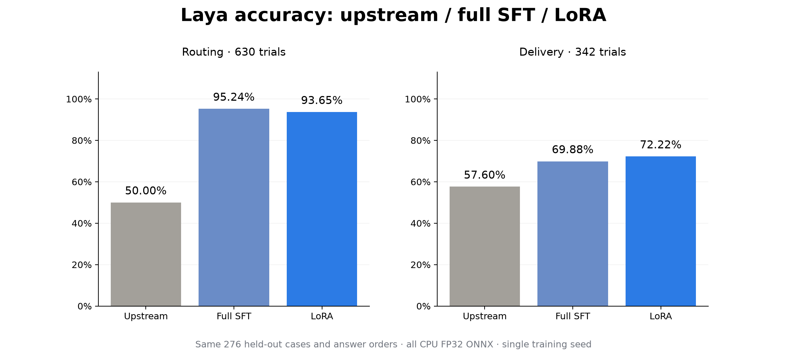

# Fine-tuned Laya: joint routing and delivery SFT

Fine-tuned Laya (joint-v2) is one multilingual choice model for `DIRECT / PLAN / CODE` routing and `RELEASE / CHALLENGE` delivery decisions.



The published **FP32 ONNX** model scores **95.24% routing** and **69.88% delivery** on the rerun.
The archived pre-fine-tuning baseline scored **50.2% / 57.3%**; the archived CUDA/BF16 fine-tuned evaluation scored **95.1% / 69.3%**.
The CPU FP32 PyTorch-to-ONNX check preserves all **972** decisions. Differences from the archived BF16 results are not evidence of improvement from changing file format.
The held-out test covers 105 routing cases in all six answer orders and 171 delivery cases in both orders.
Chart counts are **answer-order evaluations**.

[Migration validation](onnx-validation.json): Windows and WSL Ubuntu both pass
the eight real-model checks and all 972 held-out decisions agree between platforms.
The existing checkpoint was exported; this migration did not rerun full training.
The updated exporter checks both output heads, long inputs and padded batches
against PyTorch before writing a release manifest.

## Training

Data originates from the **GPT-6 Luna teacher model**, then is curated into EASY CODE-style requests and completion summaries.
The 4:1 split contains **1,105 development cases** and **276 held-out test cases**.

Training uses **full-parameter supervised fine-tuning (SFT)** with choice cross-entropy and equal total weight for routing and delivery.
The trainer exports the final encoder and decision heads to `model/model.onnx`, writes checksums and tokenizer/config assets, then evaluates that ONNX artifact on CPU. No fine-tuned PyTorch checkpoint is published.
Examples and answer options are shuffled each epoch. Internal validation selects **5 epochs**; the final model is refitted on all development cases.

| Parameter | Value |
| --- | --- |
| Encoder / choice-head learning rate | `2e-6` / `1e-5` |
| Effective / micro batch size | 16 / 4 |
| Precision | BF16, with gradient checkpointing |

[Fine-tuned weights](../../model-weights/laya-multilingual/joint-v2/model/) · [Full results](../../model-weights/laya-multilingual/joint-v2/report.json) · [Dataset manifest](data/manifest.json)

## Run

Use Python 3.11, CUDA-enabled PyTorch (training run: `2.8.0+cu128`), and these dependencies:

```text
pip install laya==0.3.20 safetensors huggingface_hub matplotlib onnx==1.20.1 onnxruntime==1.24.3 tokenizers==0.23.2
```

The baseline weights (before EASY CODE fine-tuning) are downloaded separately. [Upstream Laya source](https://github.com/NandhaKishorM/laya) · [Upstream multilingual checkpoint](https://huggingface.co/convaiinnovations/laya-multilingual)

From the repository root, download the revision recorded in [source.json](source.json):

```text
hf download convaiinnovations/laya-multilingual --revision 82d57fc4f2d1be3d2caac494045f2ec51d0842f3 --local-dir model-weights/laya-multilingual/upstream-base
```

From `finetuning/laya-joint-v2/`:

```text
# Train into a new output folder
python train.py --output ../../model-weights/laya-multilingual/new-run

# Evaluate the bundled fine-tuned model
python evaluate.py --output ../../model-weights/laya-multilingual/joint-v2/onnx-evaluation.json

# Real-model runtime checks (no torch/transformers/laya dependency)
python test_onnx.py

# Regenerate these figures from the saved report on CPU
python render_results.py
```

Compare saved evaluations (the reference may be a saved PyTorch report or
another ONNX evaluation):

```text
python compare_backends.py --reference reference.json --candidate candidate.json
```

Evaluation alone needs `onnxruntime==1.24.3` and `tokenizers==0.23.2`, with no CUDA,
PyTorch, Transformers or Laya package. Python 3.10 / Intel macOS use ONNX Runtime
1.23.2 for wheel availability (Intel macOS Python 3.14 is not supported).
[Current ONNX test results](../../model-weights/laya-multilingual/joint-v2/onnx-evaluation.json)
are stored separately from the archived training report.
