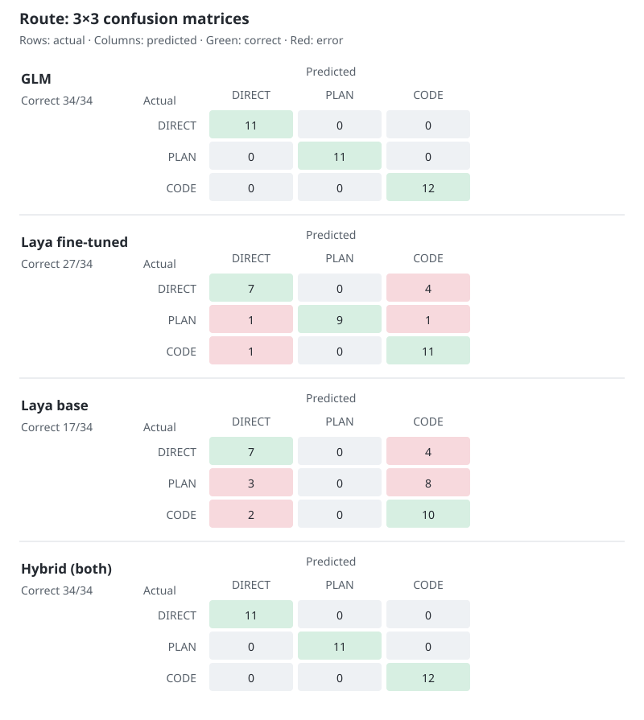
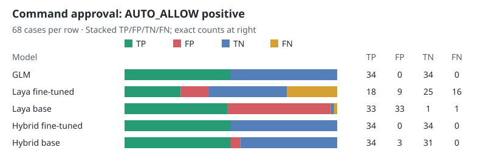
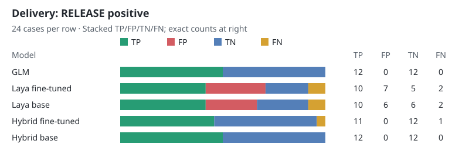

# Live Laya → GLM fallback benchmark

## Setup

- Frozen V10 test set: **126 cases** (route 34, command approval 68, delivery 24).
- Both models are stored once in the shared `../model-weights/laya-multilingual/` directory (`base/` and `finetuned/`); the frozen, SHA-256-checked test set is `data/test.jsonl` (126 cases).
- Rule: route uses GLM. For approval and delivery, use Laya only if **all option orders agree** and the **minimum probability of that answer is ≥0.90**; otherwise call `glm-5.3-flash` through GLM Coding Plan. GLM uses `temperature=0`, no tools, and receives no answer labels.
- This was a **live conditional run**, not a replay of the earlier GLM responses. The fine-tuned arm ran first; the base arm reused 118 identical GLM fallback answers and requested four additional cases. Each arm needs 122 GLM answers; the combined run made 126 distinct GLM requests (127 including one invalid-format retry). The API key was not saved.

## Results

| Task | GLM | Fine-tuned Laya | Original Laya | Fine-tuned hybrid | Original hybrid |
|---|---:|---:|---:|---:|---:|
| Route (34) | **34/34** | 27/34 | 17/34 | **34/34** | **34/34** |
| Command approval (68) | **68/68** | 43/68 | 34/68 | **68/68** | **65/68** |
| Delivery (24) | **24/24** | 15/24 | 16/24 | **23/24** | **24/24** |
| **Total (126)** | **126/126** | **85/126** | **67/126** | **125/126** | **123/126** |

Route 3×3 confusion matrices (rows = actual, columns = predicted). Both hybrid arms use GLM for route:



For the binary charts, `AUTO_ALLOW` and `RELEASE` are the positive classes. Each row shows TP, FP, TN, and FN, including GLM and both hybrid arms.





**Safety finding:** the original Laya model confidently auto-allows **3 commands that require review**; the 0.90 gate does not catch them. The fine-tuned hybrid has no such approval error, but incorrectly challenges one completed delivery. Saving four GLM calls per arm is not enough to justify either gate as a production safety decision. Perfect GLM accuracy here applies only to this curated offline test set.

## Reproduce

Install Python 3.10+ with a CUDA-enabled PyTorch and `laya==0.3.10`. The two model weights and tokenizers live in the sibling `model-weights` directory; clone the repository with Git LFS to obtain them. The original model is [convaiinnovations/laya-multilingual](https://huggingface.co/convaiinnovations/laya-multilingual), released under Apache-2.0. The fine-tuned model is derived from it.

```powershell
python run_hybrid_live.py --local-only
python analyze_live_hybrid.py
```

Run these commands from this directory. `--local-only` reevaluates both bundled models without an API key. Without that flag, `run_hybrid_live.py` performs the Laya-first/API-fallback run and resumes recorded GLM results; it prompts for the API key only if cases are missing. The per-case local and GLM outputs are in `hybrid_laya_finetuned.json`, `hybrid_laya_base.json`, and `hybrid_glm_results.jsonl`.
