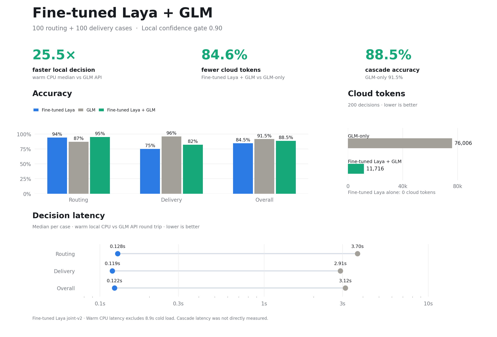

# Fine-tuned Laya + GLM

100 routing + 100 delivery cases. Fine-tuned Laya (joint-v2) decides first; confidence below **0.90** sends the case to GLM.

Fine-tuned Laya's warm CPU decision median was **0.122s**, versus **3.12s** for a GLM API decision (**25.5×**). The cascade used **11,716** rather than **76,006** cloud tokens (**84.6% fewer**), with **88.5%** overall accuracy versus **91.5%** for GLM-only.

Speed is median wall time on the same 200 inputs, measured separately from accuracy. Local inference used a loaded CPU model (cold load 8.9s); GLM API timings include network latency with 4 concurrent calls. Cascade latency was not directly measured. [Decision results](results.jsonl) · [Per-case timings](speed-results.jsonl) · [Speed summary](speed-summary.json).
