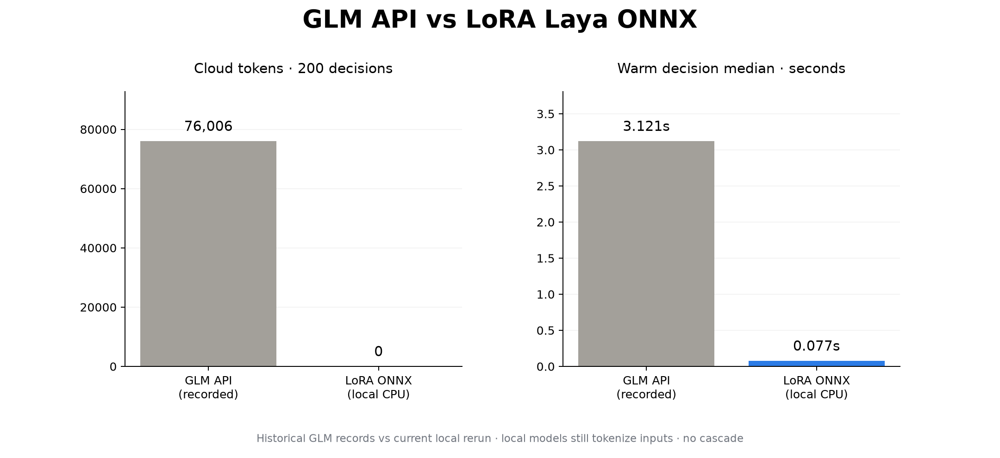
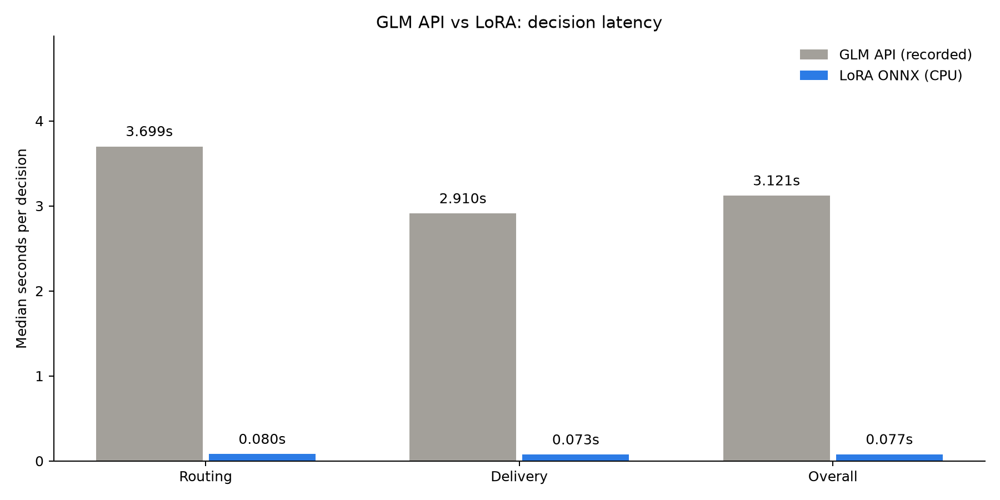

# GLM API vs LoRA Laya ONNX

Upstream / full SFT / LoRA accuracy is in the [training comparison](../finetuning/laya-joint-v2/README.md). This report compares only tokens and speed, not a cascade.

| Metric | GLM API (historical) | LoRA ONNX (current local rerun) |
| --- | ---: | ---: |
| Cloud input tokens, 200 cases | 43,932 | 0 |
| Cloud output tokens, 200 cases | 32,074 | 0 |
| Total cloud tokens | 76,006 | 0 |
| Warm median | 3.121s | 0.077s |
| P95 | 9.015s | 0.098s |

Local cold startup: 3.683s, excluded from warm median. Local input-text tokens: 7,242, excluding fixed criteria/options. Zero cloud tokens does not mean zero local computation. Different tokenizers and prompt templates make token counts non-interchangeable.

The same 100 routing + 100 delivery inputs are used. Local latency includes tokenization and IPC; GLM latency includes network round trips with four concurrent requests. GLM token and timing records came from separate historical runs; no new API requests were made. This is not a same-time controlled comparison. The local model classifies choices, rather than generating answers like GLM.

[Decisions](results.jsonl) · [Timings](speed-results.jsonl) · [Summary](comparison-summary.json)

Reproduce: `python benchmark.py --refresh-local --python <onnx-python>`, `python speed.py --refresh-local --python <onnx-python>`, then `python benchmark.py --report`. Plotting needs matplotlib; inference needs ONNX Runtime and tokenizers.
